# 第一天笔记

```
课程主题
	单例设计模式&Spring家族介绍
	
课程目标
	1.掌握双重检查锁方式的单例模式
	2.了解并发编程中的原子性、有序性、可见性
	3.了解并发编程中的指令重排序
	4.了解Spring全家桶成员，重点是要分清楚每个成员的定位
	5.掌握Spring核心概念，比如IoC、DI、AoP、BoP
	6.了解Spring Framework（也就是我们常说的Spring）各个组件的作用
	7.了解Spring最高级接口BeanFactory的继承体系
	8.掌握Spring IoC模块是如何产生并管理Bean的
	
课程回顾
	1.简单工厂
		
	2.工厂方法
	
	3.抽象工厂
	
	4.原型模式
	
	5.构建者模式
	
	6.单例模式的静态内部类写法
	
课程内容
	1.单例模式的双重检查锁写法
		疑问？既然饿汉式已经是线程安全的了，为什么还要学习懒汉式呢？
		
		首先，是应付面试，可以通过懒汉式的写法去问一些并发编程的问题。
		其次，如果有很多对象，都需要使用单例模式去管理，那么不一定这些对象都会被使用到的，如果不使用，你就帮着创建好了
			那么会造成资源浪费。
			
		线程的执行是通过获取CPU时间片去执行的，等到CPU时间片使用完之后，线程会挂起。
		
		JVM中的对象创建过程是什么流程？
		
			Student student = new Student();// 高级语言
			
			a）new关键字会触发Student类的类加载（如果已加载，则此步骤作废）
			b）根据Class对象中的信息，去开辟相应大小的内存空间。
			c）初始化Student对象，就是完成成员变量的初始化操作（到这一步，我们才能说该对象是可用的）
			d）将开辟出来的内存空间地址，赋值给栈空间的变量student
		
			以上步骤，其实都是通过字节码指令去完成的。
			
			物理机器直接操作的都是CPU指令（原子性其实是相对我们CPU指令来说的）
			
			指令重排序（JIT即时编译器优化）
				有序性
					int x = 10;
					boolean flag = false;
					
					x ++;
					flag = true;
					
					如果两行代码的执行顺序交换之后，不会影响最终的程序执行结果，那么JIT即时编译器会根据情况去进行指令重排序。
				
					总结：如果程序之间没有依赖性，则可以进行指令重排序。
				
					happend-before先行发生原则（六大原则）
					
			分析创建对象的步骤中，c和d这两个步骤，有没有依赖性呢？
				答案是它们两者之间没有依赖性，那么就有可能发生指令重排序。也就是说有可能先执行d再执行c
				
			

			volatile关键字的作用：
				一个是禁止指令重排序。
				另一个作用是禁止使用CPU缓存。
				
				
			可见性
				在CPU单核时代，线程1和线程2使用的是同一个CPU缓存，所以线程之间的数据是可见的。
				在CPU多核时代，线程1在A核，线程2在B核，每个核都有自己的CPU缓存空间，
					如果线程1产生的数据缓存没有同步到线程2对应的CPU缓存，则会出现可见性问题。
					
				
				
	2.spring
		Spring全家桶
			Spring Framework
			Spring boot
			
			Spring Cloud	微服务架构
			Spring Data
			Spring Security
				
				
		核心概念
			IoC
				控制反转，创建对象的权利，由程序员反转给了Spring容器。
				
				IoC的实现，必须依赖DI，因为IoC只是负责对象的创建，而对象创建过程中需要将对象与对象的依赖进行实现。
				此时使用到的就是DI
			DI
				依赖注入
				它必须依赖于IoC
				
			AOP
				面向切面编程，主要解决的就是系统功能和业务功能之间的解耦。
				
				Spring容器可以去创建Bean实例，并且对Bean进行管理。被Spring容器管理的bean，还可以使用AOP进行功能增强。
				AOP是OOP的延续。它们都是编程思想。
				
				
			BOP
				Spring是面向Bean进行编程的，在Spring中，一切对象都是Bean。
		
		手写Spring IoC模块
			最终Spring IoC要实现的就是Bean的创建与管理。然后被Spring管理的Bean有很多，我们交给专业的Bean工厂来创建Bean。
		
			class BeanFactory{
				private Map<String,BeanDefinition> maps = xxx;
				
				
				public Object getBean(String beanName){
					//读取缓存
					//当从缓存中没有找到想要的bean对象，再去执行创建流程
					
						
					//创建流程（根据BeanDefinition对象去创建）	---	Bean实例对象
						//bean的实例化（调用构造方法new对象）
						//bean的属性填充（调用set方法设置属性）
						//bean的初始化（调用初始化方法，完成一些操作）
				}
				
				//BeanFactory初始化的时候，就应该去完成解析操作
				public void init(){
					//解析流程（xml配置文件或者注解）------BeanDefinition对象（封装了bean的定义信息，包括类路径、属性信息等）
				}
			
			}
```

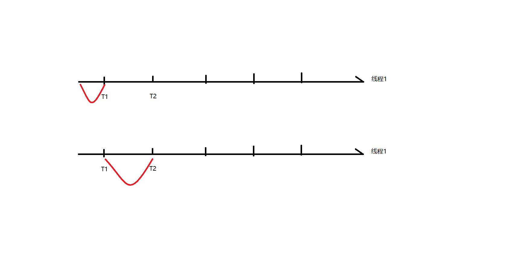

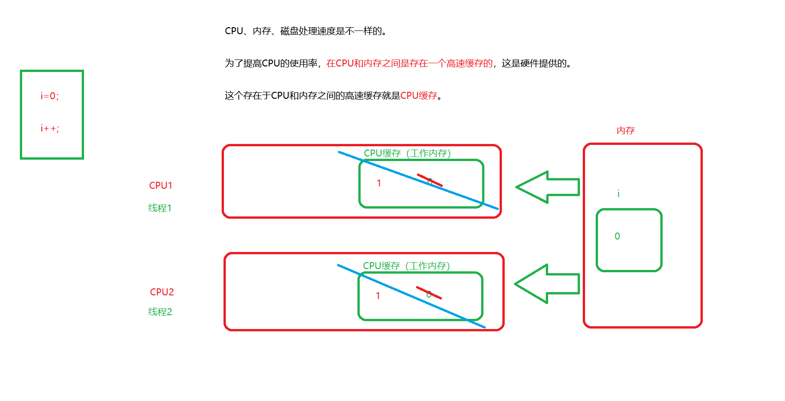

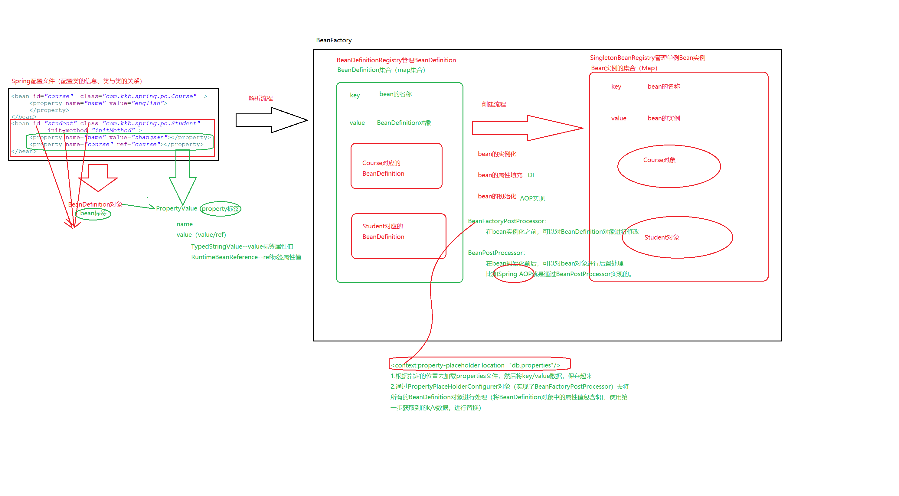

# 第二天笔记

```
课程主题
	手写spring ioc模块
	
课程目标
	1.搞清楚BeanDefinition、PropertyValue、TypedStringValue、RuntimeBeanReference类的作用
	2.搞清楚BeanFactory继承体系中各个接口和类的作用？
	3.搞清楚IOC模块中BeanDefinition注册流程和Bean实例的创建流程
	
课程回顾
	1.单例模式-双重检查锁
		初始JVM的并发编程
			JMM：Java内存模型
			原子性、有序性、可见性
			volatile关键字
			内存屏障
			六大先行发生原则（happend before）
			锁
	2.spring ioc流程
		BeanDefinition的注册流程（XML、注解）
		Bean的创建流程
		BeanFactoryPostProcessor：<context:property-placeholder location=""/>
		BeanPostProcessor：aop产生代理对象（和原对象已经不是一个对象）
		
课程内容
	1.BeanFactory的继承体系
		 spring容器，也叫ioc容器，这个容器分为基础容器和高级容器。
		 基础容器就是BeanFactory
		 高级容器就是ApplicationContext，底层其实也是通过BeanFactory实现的Bean的管理。
		 
		BeanFactory和ApplicationContext区别是什么？
		a)BeanFactory和ApplicationContext都是Spring的顶级接口
		b)ApplicationContext是继承了BeanFactory接口的
		c)BeanFactory它产生对象是通过懒汉式产生的，
		  但是ApplicationContext产生对象是在应用启动的时候，一次性将【懒加载的单例bean】创建出来。
		
		 
		 
		
		
	2.手写spring ioc模块思想分析
		UserService{
			UserDao dao ;
			
			save(){
				dao.save();
			}
		}
		
		UserDao{
			
			save(){
				sqlSession.insert...
			}
		
		}
		
		
		Test{
		
			main(){
			
				UserService service = new UserServiceImpl();
				UserDao dao = new UserDaoImpl();
				service.setDao(dao); //使用简单工厂模式和DI去实现Bean的创建与代码的解耦
			
				BeanFactory bf = new BeanFactory();
				bf.getBean("userService");
			
			}
		}
		
		BeanFactory{
			//完成BeanDefinition的注册
			BeanFactory(){
				//完成资源的定位（XML）
				//加载资源
				//解析并完成BeanDefinition的注册（BeanDefinitionRegistry）
			}
			Object getBean(String beanName){
				//先读Bean的缓存（Map）(SingletonBeanRegistry)
				//如果找到，则返回
				//如果没有，先去根据beanName获取BeanDefinition
				//根据BeanDefinition完成Bean创建的三部曲（实例化、属性填充、初始化）
				//将创建好的Bean放入缓存
			}
		}
	
		<beans>
			<bean id="" class="" scope="" init-method="">
				<property value>
				<property ref>
			</bean>
		</beans>
		
		BeanDefinition
			List<PropertyValue>
				String name
				Object value
					TypedStringValue
						value值
						type类型
					RuntimeBeanReference
						beanName
```

# 第三天笔记

```
课程主题
	手写spring ioc模块&阅读ioc源码

课程目标
	1.重点要掌握bean的创建过程
	2.重点理解bean的属性填充是如何完成的
	3.开始阅读spring源码
	
课程回顾
	1.BeanDefinition的注册流程的分析及实现
		BeanDefinition	----bean标签
			PropertyValue集合	----property标签
				value	TypedStringValue
				ref		RuntimeBeanReference
				
课程内容
	1.如何创建对象
		a)要的时候再创建（懒加载方式）						--BeanFactory
		b)应用启动的时候，创建所有的懒加载方式的单例bean	--ApplicationContext
	
	2.阅读高级容器的源码ApplicationContext
		主线：
			理解IoC模块的工作流程
	
		入口：
			ApplicationContext ctx  = new ClasspathXmlApplicationContext("");
			
			
		阅读Spring源码注意实现：
			a）注意try catch代码块
			b）主要以do开头的方法，都是真正干活的方法
		
		ClasspathXmlApplicationContext#构造方法
			AbstractApplicationContext#refresh方法
				#obtainFreshBeanFactory
					AbstractRefreshableApplicationContext#refreshBeanFactory
						AbstractXmlApplicationContext#loadBeanDefinitions
							
							AbstractBeanDefinitionReader#loadBeanDefinitions
								XmlBeanDefinitionReader#loadBeanDefinitions
									
							
```

# 第四天笔记

```
课程主题
	spring ioc 模块源码阅读&aop原理分析&动态代理模式
	
课程目标
	1.搞清楚spring ioc模块中是如何完成bean的创建的
	2.搞清楚循环依赖
	3.搞清楚aop核心概念
	4.搞清楚AspectJ和Spring aop的关系
	5.搞清楚动态代理原理（JDK、CGLib）
	6.搞清楚AOP工作原理
	
课程回顾
	1.spring ioc BeanDefinition的注册流程
	
课程内容
	1.源码阅读（多读几遍）
		主线：搞清楚bean的创建流程
		入口：AbstractApplicationContext#finishBeanFactoryInitialization()
			DefaultListableBeanFactory#preInstantiateSingletons
				AbstractBeanFactory#getBean
				
				
	2.循环依赖问题

		构造循环依赖：死循环只能该代码，无法解决
			对象还没new出来
		
		set方法循环依赖
			对象已经new出来，只是属性填充时遇到了循环依赖
			
		场景模拟
			前提	A--->B		B---->A
			
			1.创建A对象
				正在创建中的对象Set集合(beanName)
			
				A对象实例化（new）
					【将A对象的引用，提前暴露到三级缓存中，并且将A对象封装到一个ObjectFactory】
						ObjectFactory不只是可以获取A对象，还有可能，
							对A对象产生代理，也就是返回的可能是元对象，也可能是代理对象
							
					三级缓存产生完对象之后，就会将产生出来的A对象（不一定是原对象了）放入二级缓存
				A对象依赖注入（set方法）
					setB(b对象实例)----创建B对象
						B对象实例化（new）
						B对象依赖注入（set方法）
							setA(a对象实例)----创建A对象(需要解决循环依赖)
								正在创建中的对象Set集合(beanName)	？
								【去二、三级缓存中找A对象】
						B对象初始化
						
						【将B对象放入一级缓存	】		
				A对象初始化
				
				【将A对象放入一级缓存】
				------到此A对象才是完整的-----
		
		
				A---->B				B----->C			C----A
				A---->C
				
				C被依赖了两次，所以第一次被依赖时，由三级缓存产生C的实例，然后放入二级缓存
								除了第一次，不会再走三级缓存，后面如果想C对象的解决循环依赖问题，都需要去二级缓存去获取
	
	面试问题
		FactoryBean和BeanFactory区别
			BeanFactory是spring顶级接口，是spring基础容器，它负责管理bean实例。
			
			FactoryBean只是spring容器中被管理的一个bean对象，只是说这个bean它的能力就是产生另外的对象。
			
			BeanFactory是一个包容万物的大工厂
			FactoryBean是一个只能生产指定对象的小工厂，而且这个小工厂还被大工厂给管理。
			
			FactoryBean和普通的Bean实例，被Spring管理时，也是区别对待的。通过&前缀来区分FactoryBean和普通的Bean实例
			
		如果原型模式（多例）的Bean发生循环引用怎么处理
			无法处理，抛异常，因为spring是通过缓存去解决的循环依赖，而原型bean是不存缓存的
			
			
	3.aop核心概念梳理
		aop	和oop一样都是思想
		aop的实现主要有几种：AspectJ 、Spring AOP	、	Spring整合AspectJ
		AOP面向切面编程，其实就是无侵入的进行功能增强，使用AOP可以实现业务代码和系统代码分离。
			
		AOP的核心思想，就是通过织入去增强代码，织入又分为静态织入和动态织入

		静态织入，指的就是不修改源代码，只对class文件进行修改，实现功能增强。AspectJ使用的就是这种
		动态织入，指的就是运行时，通过动态代理技术，产生代理对象，完成功能增强。Spring AOP 、Spring整合AspectJ
		
		AOP核心概念
			目标对象
			连接点
			切入点
			代理对象
			织入
			通知
			切面
			通知器
			引介
		
		动态代理
			其实代理技术分为静态代理和动态代理
				静态代理其实就是在写源码的时候，为目标类去编写一个对应的代理类（java文件）
				
				动态代理技术其实就是在运行时，通过不同的技术实现，去创建新的对象。
					
			动态代理技术常用的有两种：JDK动态代理技术、CGLib动态代理技术
				JDK动态代理技术：目标类必须有接口才能使用这种方式。
					代理类和目标类其实都是目标类接口的一个实现类，使用的是接口实现。
				CGLib动态代理技术：目标类只要不是final修饰的就可以，不需要有接口
					代理类是目标类的子类，使用的是继承。
					
				Spring默认使用的JDK、可以人为指定使用CGLib
				
				其他区别如下：
				jdk1.7之前，CGLib运行比JDK要快，之后效率差不多，但是JDK产生代理对象的效率要高
				Cglib底层是通过ASM字节码工具包去实现的字节码重写。而JDK只是相当于帮程序员在后台写了java文件，并编译、加载
				
			JDK和cglib产生代理对象的方式是怎么样的？
				怎么用
				jdk是如何产生代理对象的原理

			JDK和cglib产生的代理对象的处理步骤是什么样的
				怎么用
				原理：代理对象执行时，会调用InvocationHandler或者MethodInterceptor去完成增强功能
		
```

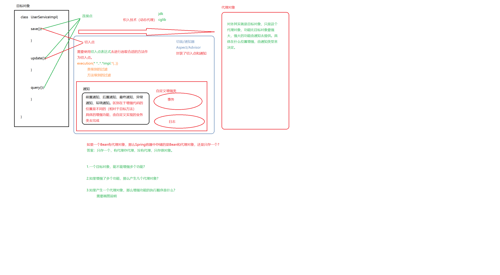


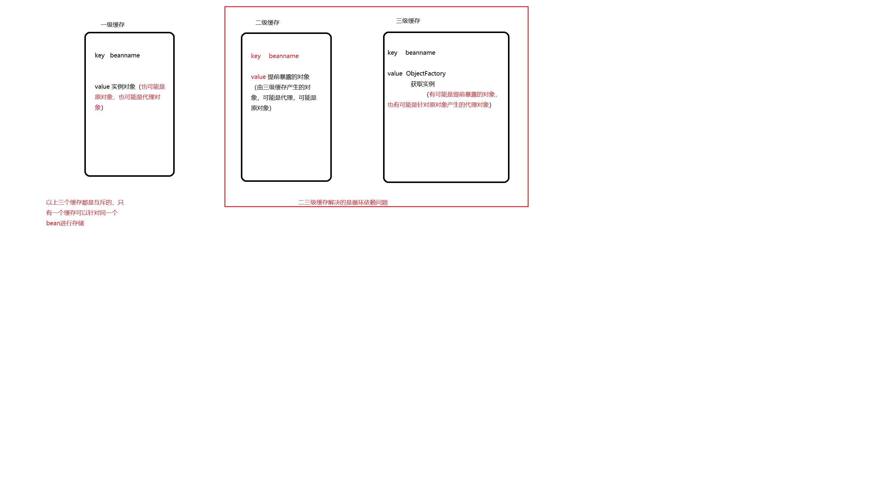

# 第五天笔记

```
课程主题
	spring aop源码阅读和原理分析
	
课程目标
	1.会使用JDK/CGLib动态代理中的InvocationHandler和MethodInterceptor
	2.搞清楚自定义标签是如何被解析为BeanDefinition的
	3.搞清楚Spring AOP中产生代理对象的流程
	4.搞清楚Spring AOP中代理对象执行流程
	
课程回顾
	1.循环依赖
		二级缓存和三级缓存的作用？
		构造循环依赖和setter方法循环依赖，如何解决这些循环依赖？
		
	2.aop核心概念
		切入点
		通知（增强功能）
		目标对象
		代理对象
		切面/通知器
		
		
	3.动态代理
		JDK：针对有接口的类产生动态代理对象
		CGLib：针对可以被继承的类产生动态代理对象（ASM字节码工具）
		
		产生代理对象
			JDK
				Proxy.newProxyInstance(classloader,interfaces,【InvocationHandler实现类】)
			
			CGLib
				Enhance enhance = new...
				//设置超类
				//设置回调----代理对象的方法被调用时
				
				enhancer.create

课程内容				
	1.代理对象执行
		JDK
			InvocationHandler{
				target
				invoke(proxy,method,args){
					
					//调用目标对象(反射的API)
					method.invoke(target，args)
				}
			}
			
		CGLib
			MethodInterceptor{
			
				intercept(proxy,method,args,proxyMethod){
				
					//调用目标对象（代理对象的API）
					//代理对象又会调用目标对象
					proxyMethod.invokeSuper(proxy,args)
					//method.invoke(target,args)
				}
			}
		
		
		问题：
			什么时候会调用以上的方法？
			
			当代理对象被创建的时候，是不会调用以上的方法的
			当代理对象被访问其中方法的时候，才会调用以上两种（互斥）方法
	
	编写AOP代码流程
		a)编写目标业务类/接口
		b)编写增强功能（系统功能）---不是一个类表示一个增强功能，而且一个类的方法表示一个增强功能
			如何去调用一个类的方法？
				对象
				方法对象
		
		c)通过xml或者注解去实现AOP
			XML
				aop标签
			
	2.aop标签解析源码阅读
		如何去查找对应的自定义标签的BeanDefinitionParser
		
		
		
		认识十个BeanDefinition所描述的类的作用
		
	3.spring aop原理分析
		画图
		
	4.aop 代理对象产生流程源码阅读
	
	5.代理对象执行流程源码阅读
	
```

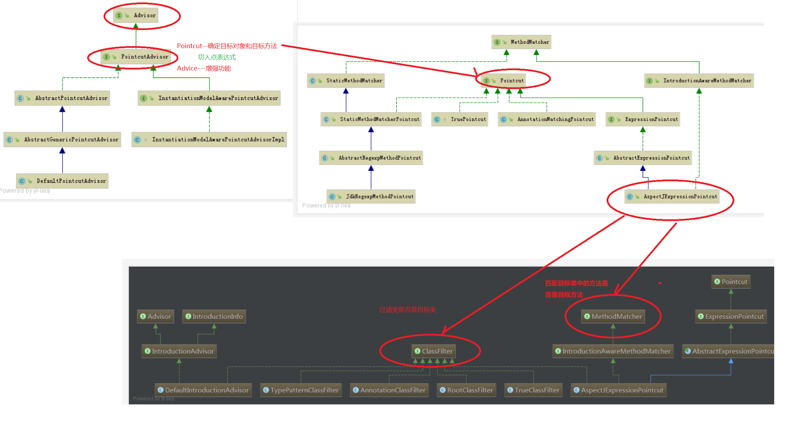


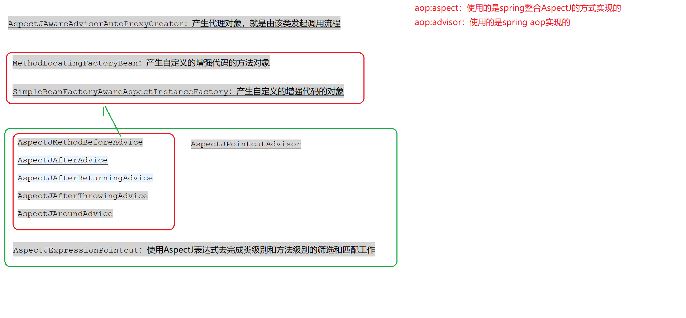

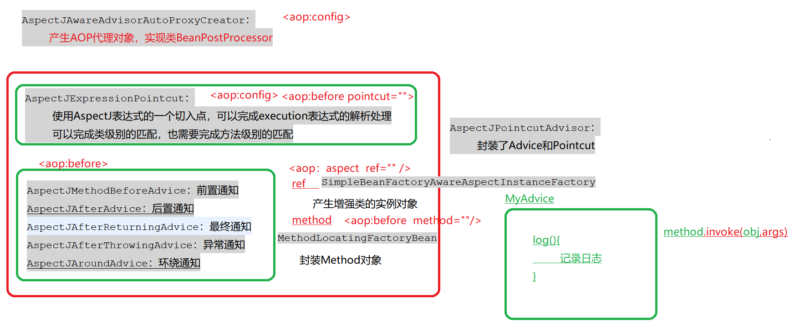

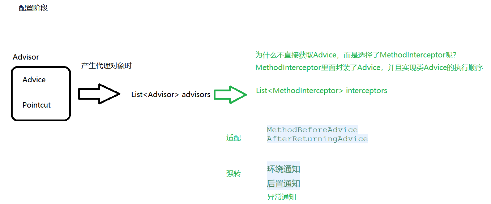

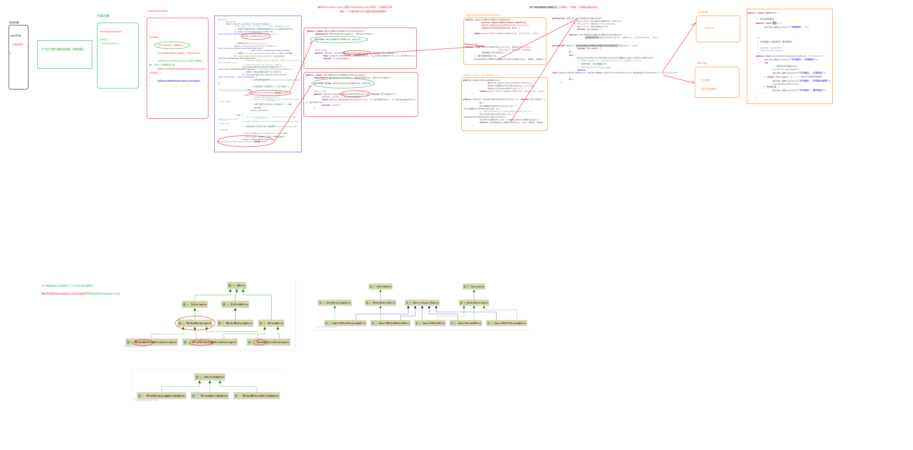


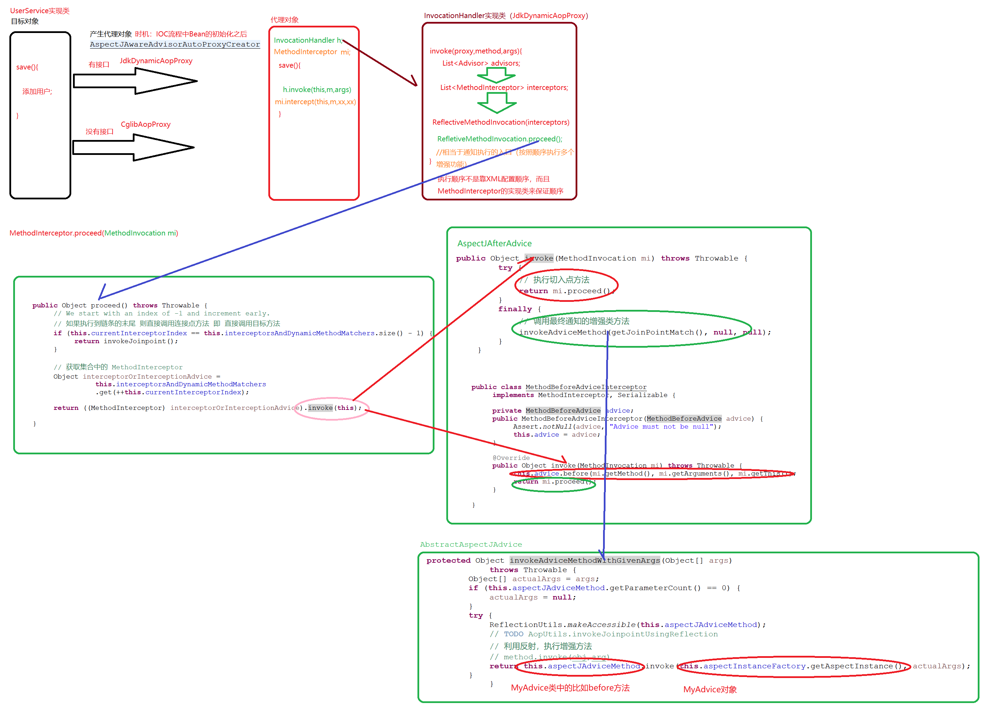

