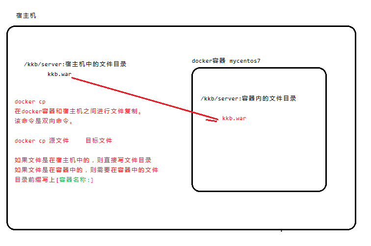
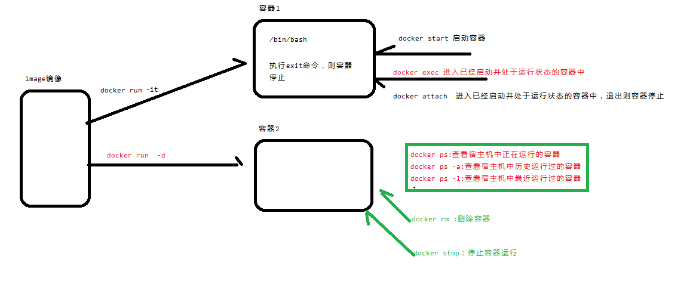
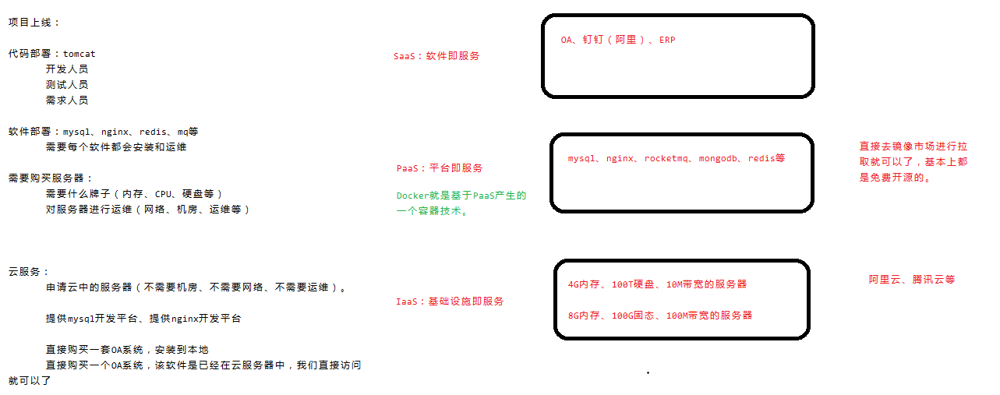

# 1 Docker 介绍

# 笔记

## docker的文件复制图解



## docker容器命令图解



## docker与云服务的关系



#### Docker 产生背景

Docker 是云时代的产物，它的诞生是一种必然。

对于云计算\云服务的相关概念，本课程不会去阐述。不过如果想了解 Docker， 那么必须对云服务的一些运营模式有所了解。

#### 云服务的运营模式：

- IaaS（基础设施即服务）：经营的是基础设施，比如阿里云服务器（只安装操作系统）
- PaaS（平台即服务）：经营的是平台，比如 MySQL 开发平台（安装在 linux

里面现成的平台）、redis 开发平台。

- SaaS（软件即服务）：经营的是软件，比如公司的 OA 系统（部署到远程服务器中的 OA 软件）

Docker 就是伴随着 PaaS 产生的。

#### Docker 是什么

Docker 就是一种虚拟化容器技术。

通过 Docker 这种虚拟化容器技术，我们可以对物理机的资源进行更加合理有效的利用，可以将一台物理机器虚拟化出很多个拥有完整操作系统，并且相互独立的“虚拟计算机”。

*不过，对于虚拟化技术的理解，我们要更加深入一些！*

#### 那么，什么是虚拟化呢？

在计算机中，虚拟化（英语：Virtualization）是一种资源管理技术，是将计算机的各种实体资源，如服务器、网络、内存及存储等，予以抽象、转换后呈现出来， **打破实体结构间的不可切割的障碍，使用户可以比原本的组态更好的方式来应 用这些资源**。这些资源的新虚拟部份是不受现有资源的架设方式，地域或物理组态所限制。一般所指的虚拟化资源包括计算能力和资料存储。

在实际的生产环境中，**虚拟化技术主要用来解决高性能的物理硬件产能过剩和老\****的旧的硬件产能过低的重组重用**，透明化底层物理硬件，从而最大化的利用物理硬件。

虚拟化技术种类很多，例如：软件虚拟化、硬件虚拟化、内存虚拟化、网络虚拟化、桌面虚拟化、服务虚拟化、虚拟机等等。

### *最常用的虚拟化技术有：全虚拟化和操作系统（OS）虚拟化。*

*比如，__VMware workstation* *就是全虚拟化的实现。*

### *比如，我们要讲的 Docker，就是基于操作系统虚拟化技术的一种实现。*

基于操作系统创建出一些相互独立的、功能虚拟化技术有多种实现方式，有基于硬件进行虚拟化的技术，而 Docker 只是针对操作系统进行虚拟化，对于硬件资源的使用率更低。

#### 相对于 VMware 这种虚拟化技术，Docker 拥有着显著的优势：

1. **启动速度快**，Docker 容器启动操作系统在秒级就可以完成，而 VMware 却是

达到分钟级。

1. **系统资源消耗低**，一台 Linux 服务器可以运行成千上百个 Docker 容器，而

VMware 大概只能同时运行 10 个左右。

1. **更轻松的迁移和扩展**，由于 Docker 容器比 VMware 占用更少的硬盘空间， 在需要搭建几套软件环境的情况下，对安装好的 Docker 容器进行迁移会更快捷，更方便。而且 Docker 容器几乎可以在任意的平台上运行，包括虚拟机、物理机、公有云，私有云，个人电脑等，这种兼容性，可以让用户将一个应用程序从一个平台直接迁移到另一个平台。

#### Docker 能做什么

我们之所以要学习 Docker，那是因为 Docker 是一门神奇的技术！

#### （1） 上手快

用户只需要几分钟，就可以把自己的程序“Docker 化”。Docker 依赖于“写时复制”（copy-on-write）模型，使修改应用程序也非常迅速，可以说达到“随心所致，代码即改”的境界。

随后，就可以创建容器来运行应用程序了。大多数 Docker 容器只需要不到 1 秒中即可启动。由于去除了管理程序的开销，Docker 容器拥有很高的性能，同时同一台宿主机中也可以运行更多的容器，使用户尽可能的充分利用系统资源。

#### （2） 项目职责的逻辑分类

使用 Docker，开发人员只需要关心容器中运行的应用程序，而运维人员只需要关心如何管理容器。Docker 设计的目的就是要加强开发人员写代码的开发环境与应用程序要部署的生产环境一致性。从而降低那种“开发时一切正常，肯定是运维的问题（测试环境都是正常的，上线后出了问题就归结为肯定是运维的问题）”

#### （3） 快速高效的开发生命周期

Docker 的目标之一就是缩短代码从开发、测试到部署、上线运行的周期，让你的应用程序具备可移植性，易于构建，并易于协作。（通俗一点说，Docker 就像一个盒子，里面可以装很多物件，如果需要这些物件的可以直接将该大盒子拿走，而不需要从该盒子中一件件的取。）

#### （4） 鼓励使用面向服务的架构（自动化部署）

Docker 还鼓励面向服务的体系结构和微服务架构。Docker 推荐单个容器只运行一个应用程序或进程，这样就形成了一个分布式的应用程序模型，在这种模型下， 应用程序或者服务都可以表示为一系列内部互联的容器，从而使分布式部署应用程序，扩展或调试应用程序都变得非常简单，同时也提高了程序的内省性。（当然，可以在一个容器中运行多个应用程序）

### *当然，Docker 的强大远远不至于此，而作为软件开发人员的我们，更关注的是如何利用它来搭建一套统一的软件开发环境。*

接下来，我们将会一步一步的揭开 Docker 的神秘面纱!

#### Docker 核心概念

docker 包含四个基本概念：

- 镜像（Image）
- 容器（Container）
- 仓库注册中心（Registry）
- 仓库（Repository）

理解了这四个概念，就理解了 docker 的整个生命周期了！

**镜像**

Docker 镜像（Image）就是一个只读的模板。

Docker 镜像可以用来创建 Docker 容器。

*Docker* *镜像和* *Docker* *容器的关系，类似于* *java* *中* *class* *类与对象之间的关系。*

Docker 提供了一个很简单的机制来创建镜像或者更新已有的镜像，用户甚至可以直接从其他人那里下载一个已经做好的镜像来直接使用。

**容器**

Docker 利用容器（Container）来运行应用。

容器是从镜像创建的运行实例。它可以被启动、开始、停止、删除。每个容器都是相互隔离的、保证安全的平台。

可以把容器看成是一个简易版的 Linux 环境（包括 ROOT 用户权限、进程空间、用户空间、网络等）和运行在其中的应用程序。

#### Registry&Repository

Registry 是集中存放镜像文件的场所。

Repository 是对于其中的镜像进行分类管理。

*一个* *Registry* *中会有多个* *Repository__。*

*一个* *Repository* *中会有多个不同* *tag* *的* *Image__。*

比如名称为 centos 的 Repository 仓库下，有 tag 为 6 或者 7 的 Image 镜像。

Registry 分为公有（public）和私有（private）两种形式。

- 最大的公有 Registry 是Docker Hub，存放了数量庞大的镜像供用户下载使用。
  - 国内的公开 Registry 包括 USTC、网易云、DaoCloud、AliCloud 等，可以供大陆用户更稳当快捷的访问。
- 用户可以在本地创建一个私有 Registry。

用户创建了自己的镜像之后就可以使用 push 命令将它上传的公有 Registry 或者私有 Registry 中，这样下次在另一台机器上使用这个镜像的时候，只需要从Registry 上pull 下来运行就可以了。

# 2 Docker 安装

官方默认的操作系统是安装到 **Ubuntu**。

官方网站上有各种环境下的安装指南，比如：CentOS、Ubuntu 和 Debian 系列的安装。

而我们现在主要讲解的是基于 CentOS 7.x 上面的安装。

一切完毕之后，只需要执行以下命令即可完成 Docker 的安装：

## *安装之前可以先卸载*

***yum -y remove docker\***

## *安装：*

***yum install -y docker\***

## *启动：*

***systemctl start docker #systemctl start docker.service\***

# 3 Docker 镜像

```
 **列出镜像**
```

*docker images*

*Repository__：镜像所在仓库名称**Tag**：镜像版本*

*Image ID__： 镜 像* *ID Created__：镜像创建时间**Size**：镜像大小*

#### 搜索镜像

如果你需要从网络中查找需要的镜像，可以通过以下命令搜索

- NAME：仓库名称
- DESCRIPTION：镜像描述
- STARS：用户评价，反应一个镜像的受欢迎程度
- OFFICIAL：是否官方

AUTOMATED：自动构建，表示该镜像由 Docker Hub 自动构建流程创建的

```
 **拉取镜像**
```

我们可以使用命令从一些公用仓库中拉取镜像到本地，下面就列举一些常用的公用仓库拉取镜像的方式！

#### 从 docker hub 拉取

Docker Hub 的网址：https://hub.docker.com/

**需求：从** **Docker Hub** **仓库下载一个** **CentOS 7** **版本的操作系统镜像。**

命令如下：

***docker pull centos:7\***

Docker Hub 是 docker 默认的公用 Registry，不过缺点是国内下载会比较慢。

#### 从 ustc 拉取（建议使用）

在宿主机器编辑文件（centos7 不支持 vim 命令，但是支持 vi 命令）：

*vi /etc/docker/daemon.json*

请在该配置文件中加入（没有该文件的话，请先建一个）：

最后，需要重启 docker 服务

*systemctl restart docker*

之后再使用 pull 命令拉取镜像，这时候是从 ustc 获取镜像，而且速度杠杠的。

*docker pull centos:7*

```
 **删除镜像**
```

删除指定镜像

*docker rmi repository:tag docker rmi imageID*

删除所有镜像

*docker rmi $(docker images -q)*

***注意：\***

***删除时，如果镜像的\*** ***image id\*** ***一致，则需要按照一定顺序进行删除，因为镜像之\**\****间有关联****\**（\*\*****referen****\**c\*\*****e****\**）。\***

#### 导入导出镜像(镜像迁移)

导出镜像：

*docker save repository:tag/imageId > /root/xx.tar.gz docker save -o mynginx.tar mynginx*

-o 输出到的文件

执行后，运行 ls 命令即可看到打成的 tar 包

导入镜像：

*docker load < /root/xx.tar.gz docker load -i mynginx.tar*

-i 输入的文件

执行后再次查看镜像，可以看到镜像已经恢复

# 4 Docker 容器

```
 **创建并运行容器**
```

创建容器命令：**docker run**

创建容器常用的参数说明：

- -i：表示运行容器
- -t：表示容器启动后会进入其命令行。加入这两个参数后，容器创建就能登录进去。即分配一个伪终端。
- --name :为创建的容器命名。
- -v：表示目录映射关系（前者是宿主机目录，后者是映射到宿主机上的目录），可以使用多个－v 做多个目录或文件映射。注意：最好做目录映射，在宿主机上做修改，然后共享到容器上。
- -d：在 run 后面加上-d 参数,则会创建一个守护式容器在后台运行（这样创建容器后不会自动登录容器，如果只加-i -t 两个参数，创建后就会自动进去容器）。

l -p：表示端口映射，前者是宿主机端口，后者是容器内的映射端口。可以使用多个－p

做多个端口映射

以交互方式运行容器：

*docker run -i -t --name* *容器名称* *repository:tag /bin/bash docker run -it --name* *容器名称* *imageID /bin/bash*

以守护进程方式运行容器：

*docker run -di --name* *容器名称* *repository:tag docker run -di --name* *容器名称* *imageID*

*注意：通过* *run* *创建并进入容器之后，如果使用* *exit* *命令退出容器，则容器停止。__再次进入该容器，先使用* *start* *启动容器，再使用* *exec/attach* *命令进入容器。*

```
 **启动容器**
```

*docker start* *容器名称或者容器* *ID*

#### 进入容器

进入正在运行的容器的命令如下：

**docker exec -it** ***容器名称或者容器\*** ***ID /bin/bash\***

*docker attach* *容器名称或者容器* *ID*

*两者之间的区别：*

*attach* *进入容器之后，如果使用* *exit* *退出容器，则容器停止。*

*exec* *进入容器之后，使用* *exit* *退出容器，容器依然处于运行状态。*

```
 **查看容器**
```

*docker ps* ：查看正在运行的容器_docker ps -a_：查看历史运行过的容器_docker ps -l_：查看最近运行过的容器

```
 **停止容器**
```

*docker stop* *容器名称或者容器* *ID*

```
 **删除容器**
```

删除指定容器：

*docker rm* *容器名称或者容器* *ID*

删除所有容器：

*docker rm ‘docker ps -a -q’*

#### 复制文件

*docker cp* *源文件 目标文件*

### *比如：*

*docker cp /root/boot.war my-centos:/usr/local/*

### *说明：*

*/root/boot.war* *是宿主机器的路径*

*my-centos* *是容器的名称*

*/usr/local/__是容器内的路径*

注意：源文件可以是宿主机器也可以是容器中的文件，同样，目标文件可以是容器也可以是宿主机器的文件。

# 5 Docker 应用

MySQL **部署**

#### 5.1.1 拉取 MySQL 镜像

docker pull mysql:5.6

查看镜像

docker images

#### 5.1.2 创建 MySQL 容器

docker run -di --name kkb_mysql -*p* 33306:3306 -e MYSQL_ROOT_PASSWORD=root mysql:5.6

-p 代表端口映射，格式为 宿主机映射端口:容器运行端口

-e 代表添加环境变量 MYSQL_ROOT_PASSWORD 是 root 用户的登陆密码

#### 5.1.3 进入 MySQL 容器,登陆 MySQL

进入 mysql 容器

docker exec -it kkb_mysql /bin/bash

登陆 mysql

mysql -u root -p

#### 5.1.4 远程登陆 MySQL

我们在我们本机的电脑上去连接虚拟机 Centos 中的 Docker 容器， 这里

192.168.247.130 是虚拟机操作系统的 IP

#### 5.1.5 查看容器 IP 地址

我们可以通过以下命令查看容器运行的各种数据

docker inspect kkb_mysql

运行效果如下：

我们可以看到我们的数据库服务器的 IP 是 172.17.0.2

tomcat **部署**

#### 5.2.1 拉取 tomcat 镜像

docker pull tomcat:7-jre7

#### 5.2.2 创建 tomcat 容器

创建容器 -p 表示地址映射

docker run -di --name=kkb_tomcat -p 9000:8080 tomcat:7-jre7

Nginx **部署**

#### 5.3.1 拉取 Nginx 镜像

docker pull nginx

#### 5.3.2 创建 Nginx 容器

- **测试** **Nginx**

浏览器地址栏输入： [http://192.168.247.135](http://192.168.247.135/)

Redis **部署**

#### 5.4.1 拉取 Redis 镜像

docker pull redis

#### 5.4.2 创建 Redis 容器

docker run -di --name=kkb_redis -p 16379:6379 redis

#### 5.4.3 客户端测试

在你的本地电脑命令提示符下，用 window 版本 redis 测试

#### 搭建 Tomcat 服务并部署 web 应用

*docker run -di --name my-tomcat -v **/root/webapps:** /usr/local/tomcat/webapps -p*

***8888:8080\*** *imageID*

*docker run -ti --name my-tomcat -v **/opt/webapps:/opt/tomcat/webapps** -p **8888:8080***

*imageID /bin/bash*

*容器内的* *tomcat* *目录：__/usr/local/tomcat/webapps*

*docker run -di --name my-tomcat -v /kkb/webapps:/usr/local/tomcat/webapps -p 8888:8080 --privileged=true tomcat:7-jre7*

*说明：*

*--name__：该参数的作用是给容器起一个名字，名字要唯一。*

### *-v：该参数的作用是进行目录映射，具体指的是宿主机器和容器之间的目录映射。*

*/opt/webapps__：宿主机器的目录*

*/opt/tomcat/webapps__：容器中的目录*

### *-p：该参数的作用是进行端口映射，具体指的是宿主机器和容器之间的端口映射。8888 端口是宿主机的端口*

*8080* *端口是容器内的端口*

1、将 war 包上传到宿主机器的/opt/webapps/目录下。

2、tomat 会自动热部署，直接访问 web 应用的路径即可。

# 6 制作镜像

#### 纯手工制作镜像

需求：制作一个 tomcat 镜像。

步骤：

1、下载基础镜像（centos7）

*docker pull centos:7*

2、安装 64 位 jdk（注意：jdk 要和 os 的位数一致）

*vi /etc/profile*

export JAVA_HOME=/opt/jdk

export PATH=$JAVA_HOME/bin:$PATH

*source /etc/profile* 3、安装 tomcat 略

4、生成新的镜像

*docker commit* *容器名称或者容器* *ID* *新镜像名称*