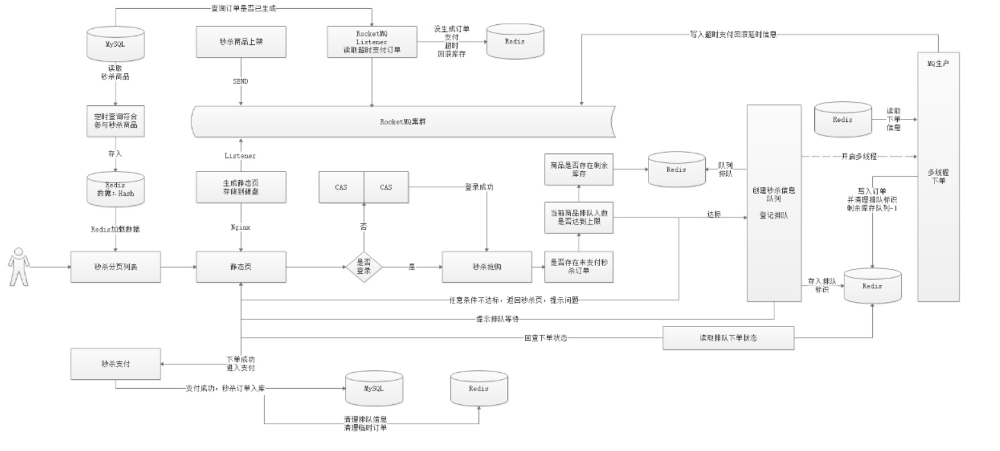
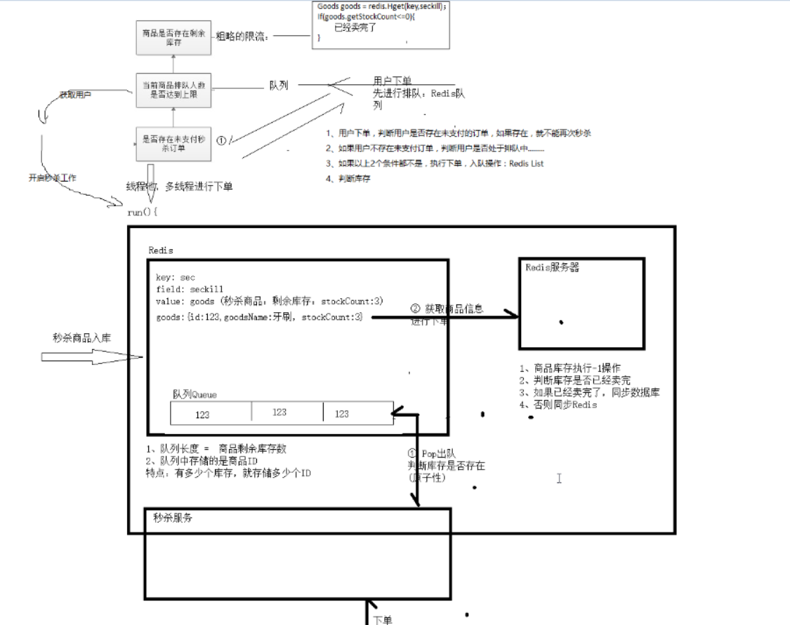
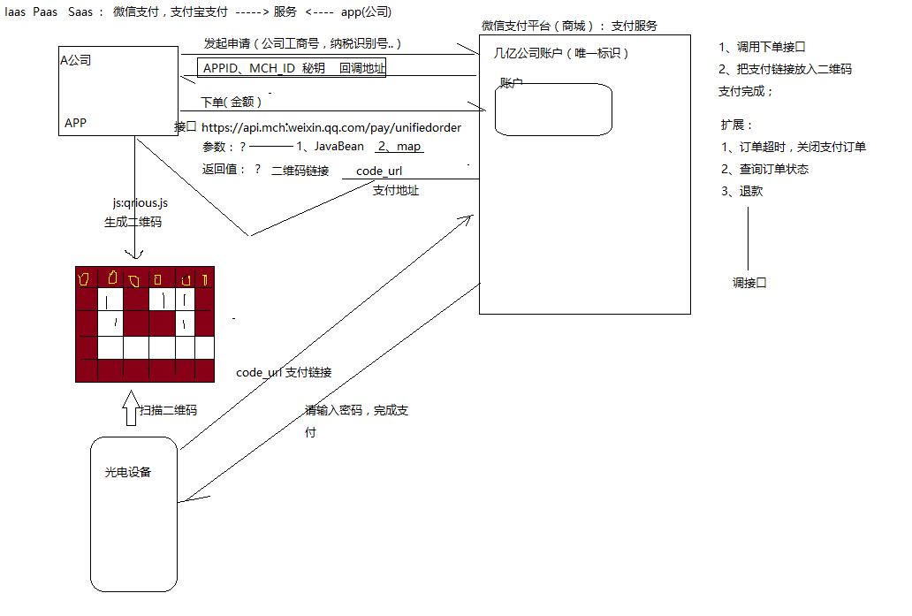
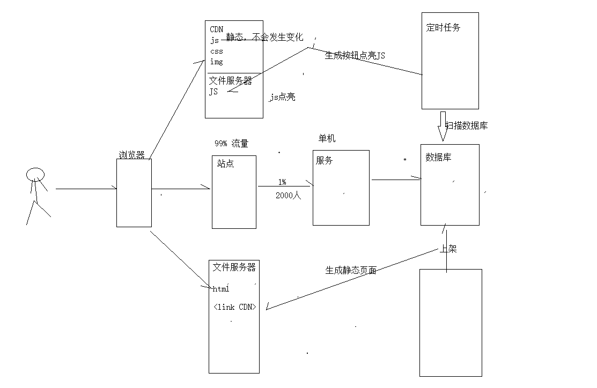
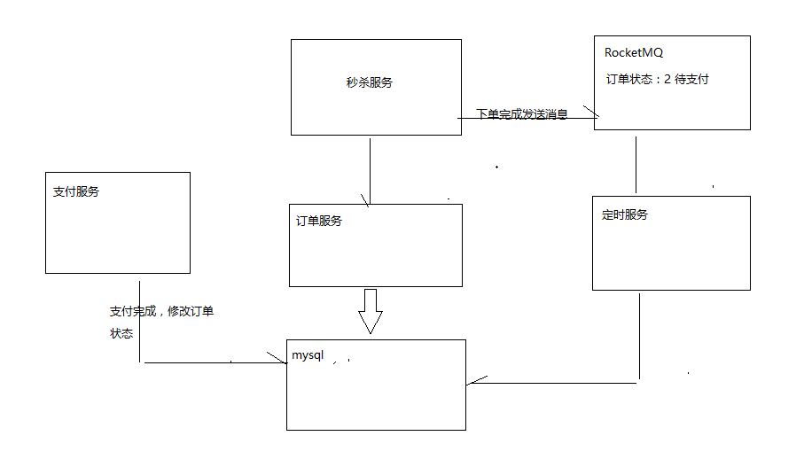
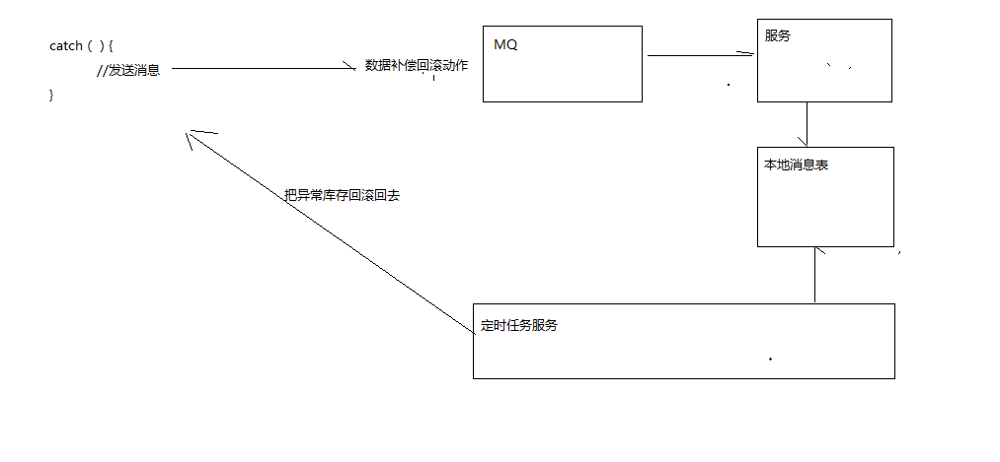

# 第七讲:微服务秒杀及秒杀优化设计实践

# 笔记

## 01_秒杀详情思路

## 02_微信支付实现

## 03_倒计时按钮

## 04_秒杀业务

## 一、从业务思考秒杀设计

## 1、秒杀基本概念

所谓“秒杀”，就是网络卖家发布一些超低价格的商品，所有买家在同一时间网上抢购的一种销售方式。通俗一点讲就是网络商家为促销等目的组织的网上限时抢购活动。由于商品价 格低廉，往往一上架就被抢购一空，有时只用一秒钟。

秒杀商品通常有两种限制：库存限制、时间限制。

业务流程：

## 2、业务特点

- 瞬时并发压力非常大

2000 QPS à 20w QPS

- 库存量少

控制库存超卖的问题

## 3、秒杀为什么这么难做？

秒杀系统，库存只有一份，所有人会在集中的时间读和写这些数据，多个人读一个数据。

- 对现有业务冲击

需要对秒杀业务进行单独开发，单独部署，不会影响其他业务系统的运行。

- 并发负载高限流
- 直接下单

动态下单 URL（活动没有开始之前，是无法获得动态 URL 下单连接）

- 下单前置检查库存

用户身份信息是否合法

# 二、架构优化设计实践

## 1、秒杀问题思考

- 并发负载非常高问题
  - 、尽量把请求拦截上游服务，不要让请求落在数据库上面。（不要让锁落在数据库）
- 、充分利用缓存。（读多，写少）--- 减少读数据到数据库。
- 、浏览器缓存
- 、nginx 缓存
- 、堆缓存
- 、网关限流
- 、dns 缓存
- 、cdn 缓存
- 对现有业务冲击
- 数据库负载高
- 服务器和网络带宽高
- 库存问题

锁问题

其他解决方案

- 数据一致性问题最终一致性

## 2、数据库设计

`title` varchar(100) **DEFAULT** NULL COMMENT '标题',

`small_pic` varchar(150) **DEFAULT** NULL COMMENT '商品图片',

`price` decimal(10,2) **DEFAULT** NULL COMMENT '原价格',

`cost_price` decimal(10,2) **DEFAULT** NULL COMMENT '秒杀价格',

`seller_id` varchar(100) **DEFAULT** NULL COMMENT '商家 ID',

`create_time` datetime **DEFAULT** NULL COMMENT '添加日期',

`check_time` datetime **DEFAULT** NULL COMMENT '审核日期',

`status` varchar(1) **DEFAULT** NULL COMMENT '审核状态，0 未审核，1 审核通过，2 审核不通过',

`start_time` datetime **DEFAULT** NULL COMMENT '开始时间',

`end_time` datetime **DEFAULT** NULL COMMENT '结束时间',

`num` int(11) **DEFAULT** NULL COMMENT '秒杀商品数',

`**stock_count**` int(11) **DEFAULT** NULL COMMENT '剩余库存数',

`introduction` varchar(2000) **DEFAULT** NULL COMMENT '描述',

**PRIMARY KEY** (`id`)

) **ENGINE**=**InnoDB** AUTO_INCREMENT=4 **DEFAULT CHARSET**=utf8;

**CREATE TABLE** `tb_seckill_order` (

`id` bigint(20) **NOT** NULL COMMENT '主键',

`seckill_id` bigint(20) **DEFAULT** NULL COMMENT '秒杀商品 ID',

`money` decimal(10,2) **DEFAULT** NULL COMMENT '支付金额',

`user_id` varchar(50) **DEFAULT** NULL COMMENT '用户',

`seller_id` varchar(50) **DEFAULT** NULL COMMENT '商家',

`create_time` datetime **DEFAULT** NULL COMMENT '创建时间',

`pay_time` datetime **DEFAULT** NULL COMMENT '支付时间',

## 3、秒杀实现思路

秒杀技术实现核心思想是运用缓存减少数据库瞬间的访问压力！读取商品详细信

息时运用缓存，当用户点击抢购时减少缓存中的库存数量，当库存数为 0 时或活

动期结束时，同步到数据库。 产生的秒杀预订单也不会立刻写到数据库中，而是先写到缓存，当用户付款成功后再写入数据库。

# 二、秒杀实践

## 1、秒杀入库

入库方式：2 种

- 商家录入商品

商家录入—运营商审核—上架—入库

- 定时入库

每天早上 8:00 入库一批自营商品，14:00 入库一批商品入库架构图：

Redis 缓存服务器中秒杀商品如何存储？？

- Redis 中库存第一种存储方式（×）
  - 、hset(key,value,goods); // 把秒杀商品对象添加到 Redis,使用 hash 结构进行存储
  - 、秒杀业务实现---下单

a、Goods goods = redis.hget(key,value); // 100 用户 获取秒杀商品

b、if(goods.getStockCount <=0){ // 库存判断，查询是否存在库存

// 此商品已经卖完了！

}

执行购买---发送了超卖的现象

c、减库存

- Redis 中库存第二种存储方式（√）
  - 、hset(key,value,stockCount); //把商品的剩余库存存入 Redis
  - 、下单

a、long result = redis.hincr(key,value,-1); // 原子操作减库存 2 用户，1 个库存

b、if(result < 0){

//此商品已经卖完了

}

- Redis 中库存的第三种方式（√）
  - 、hset(key,value,goods);
  - 、lpush(key,itemId) //使用队列来存储商品 id

总结：在开发秒杀项目时候，控制库存超卖问题是一个难点。通常情况下可以对其加锁解决库存超卖的问题。但是加锁会降低秒杀下单的性能，因此我们可以借助 Redis 单线程特性， 解决库存超卖的问题。同时 Redis 是第三方的库存存储服务，在分布式环境下，也是 ok 的。

## 2、详情静态

秒杀商品审核后，会向 RocketMQ 发送消息，将审核的商品信息推送给 broker，秒杀商品工程此时需要监听该消息，并生成静态页，在我们商城秒杀中，商品详情页推荐使用静态页。

技术方案：

1、freemarker 2、velocity

## 3、秒杀倒计时

目前页面倒计时的时间不准确，我们应该通过后台实现计算，时间差=活动结束时间-当前时 间，库存数量=递减数量。

## 4、秒杀下单

# 三、业务优化

## 1、多线程下单

秒杀下单操作一般都是比较复杂的，而且并发量特别高，比如，检查当前账号操作是否已经 秒杀过该商品，检查该账号是否存在存在刷单行为，记录用户操作日志等。

下订单这里，我们一般采用多线程下单，但多线程中我们又需要保证用户抢单的公平性，也 就是先抢先下单

## 2、限流排队

- 用户排队限流

流量消费。让大流量用户并发在队列中进行缓冲。

- 判断库存（粗颗粒度限流）

## 3、事务处理

业务补偿机制/Redis 异步捕获，人肉回滚的方式进行事务数据补偿。

## 4、支付处理

接受消息，根据消息订单 ID 查询数据库，得到订单状态，如果订单未支付，支付超时，此时实现库存回滚。