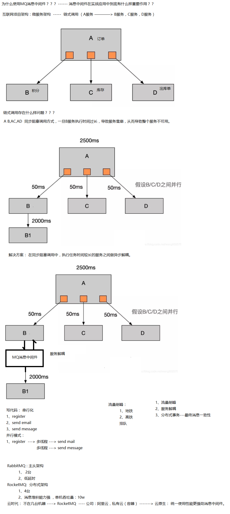
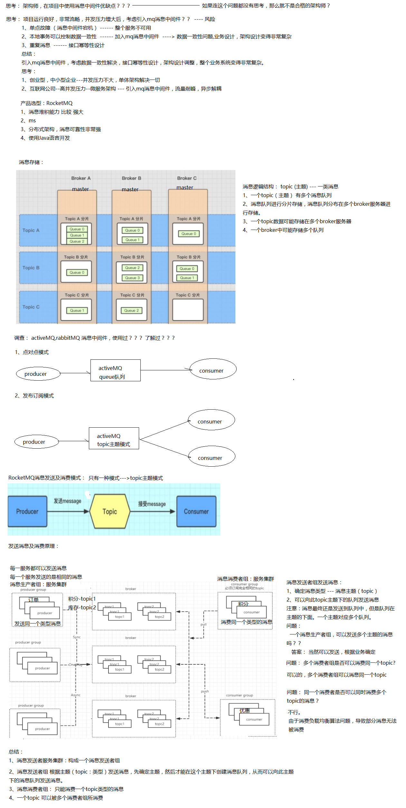
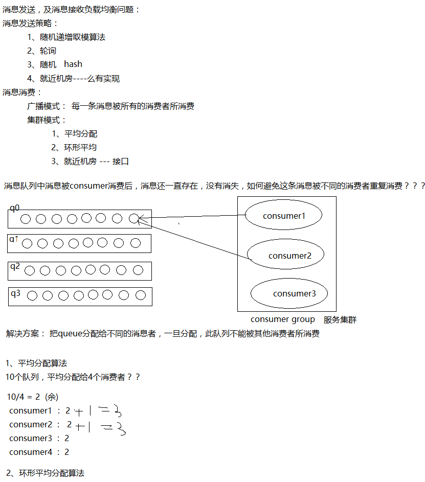

# 笔记









RocketMQ 基本理论及架构

课程主题：

1、为什么要学习 mq?

2、mq 产品的选型?

3、使用 mq 消息中间件的优缺点？

4、RocketMQ 消息的发送流程？

5、RocketMQ 消息存储结构？

6、消息是如何发送的？

# 一、前置知识

##### 1、链式调用

**2、木桶理论**

**3、MQ 引入**

**二、\****MQ** **前置知识**

**1\****、***\*MQ** **作用**

消息队列作为高并发系统的核心组件之一，能够帮助业务系统解构提升开发效率和系统稳

定性。主要具有以下优势：

- 削峰填谷（大促等流量洪流突然来袭时，MQ 可以缓冲突发流量，避免下游订阅系统因突发流量崩溃）
- 系统解耦（解决不同重要程度、不同能力级别系统之间依赖导致一死全死）
  - 提升性能（当存在一对多调用时，可以发一条消息给消息系统，让消息系统通知相关系统）
  - 蓄流压测（线上有些链路不好压测，可以通过堆积一定量消息再放开来压测）
- **、应用场景**

MQ 可应用在多个领域，包括异步通信解耦、企业解决方案、金融支付、电信、电子商务、

快递物流、广告营销、社交、即时通信、手游、视频、物联网、车联网等。从应用功能上来

讲。

例如：

- 日志监控，作为重要日志的监控通信管道，将应用日志监控对系统性能影响降到最低。
- 消息推送，为社交应用和物联网应用提供点对点推送，一对多广播式推送的能力。
- 金融报文，发送金融报文，实现金融准实时的报文传输，可靠安全。
- 电信信令，将电信信令封装成消息，传递到各个控制终端，实现准实时控制和信息传递。

从功能角度考虑：

RocketMQ 在实际应用中常用的使用场景、主要有异步处理，应用解耦，流量削锋和消息通

讯四个场景

如以上案例描述，传统的方式系统的性能（并发量，吞吐量，响应时间）会有瓶颈。

如何解决这个问题呢？

引入消息队列，将是必须的业务逻辑，异步处理。改造后的架构如下：

按照以上约定，用户的响应时间相当于是注册信息写入数据库的时间，也就是 50 毫

秒。注册邮件，发送短信写入消息队列后，直接返回，因此写入消息队列的速度很快，基

本可以忽略，因此用户的响应时间可能是 50 毫秒。因此架构改变后，系统的吞吐量提高

到每秒 20 QPS。比串行提高了 3 倍，比并行提高了两倍。

**1.1.2\****、应用解耦**

场景说明：用户下单后，订单系统需要通知库存系统。传统的做法是，订单系统调用

库存系统的接口。如下图：

传统模式的缺点：假如库存系统无法访问，则订单减库存将失败，从而导致订单失

败，订单系统与库存系统耦合

如何解决以上问题呢？引入应用消息队列后的方案，如下图：

流量削锋也是消息队列中的常用场景，一般在秒杀或团抢活动中使用广泛。 应用场

景：秒杀活动，一般会因为流量过大，导致流量暴增，应用挂掉。为解决这个问题，一般

需要在应用前端加入消息队列。

a、可以控制活动的人数 b、可以缓解短时间内高流量压垮应用

用户的请求，服务器接收后，首先写入消息队列。假如消息队列长度超过最大数量，

则直接抛弃用户请求或跳转到错误页面。 秒杀业务根据消息队列中的请求信息，再做后续处理

#### 1.1.4、日志处理

日志处理是指将消息队列用在日志处理中，比如Kafka 的应用，解决大量日志传输的

问题。架构简化如下

客户端 A 和客户端 B 使用同一队列，进行消息通讯。

聊天室通讯：

客户端 A，客户端 B，客户端 N 订阅同一主题，进行消息发布和接收。实现类似聊天

室效果。

以上实际是消息队列的两种消息模式，点对点或发布订阅模式。模型为示意图，供参考。

- **、示例**

#### 1.2.1 、电商系统

**1.2.3\****、事务处理**

比如银行转账。

**2\****、***\*MQ** **对比**

目前主流的 MQ 主要是

- ZeroMQ
- 推特的 Distributedlog
- ActiveMQ：Apache 旗下的老牌消息引擎
- RabbitMQ、Kafka：AMQP 的默认实现。
- RocketMQ
- Artemis：Apache 的 ActiveMQ 下的子项目
- Apollo：同样为 Apache 的 ActiveMQ 的子项目的号称下一代消息引擎
- 商业化的消息引擎IronMQ
- 实现了 JMS(Java Message Service)标准的 OpenMQ

那么其他消息中间件都有什么特性呢？

### 2.1 、ActiveMQ

```
 4）主要是基于解耦和异步来用的，较少在大规模吞吐的场景中使用
```

### 2.2 、RabbitMQ

**单机吞吐量：**万级

###### topic 数量都吞吐量的影响：

**时效性：**微秒级，延时低是一大特点。

**可用性：**高，基于主从架构实现高可用性

**消息可靠性：**

**功能支持：**基于 erlang 开发，所以并发能力很强，性能极其好，延时很低

**总结：**

```
 1）erlang 语言开发，性能极其好，延时很低；

     2）吐量到万级，MQ 功能比较完备

     3）开源提供的管理界面非常棒，用起来很好用

     4）社区相对比较活跃，几乎每个月都发布几个版本分

     5）在国内一些互联网公司近几年用 rabbitmq 也比较多一些 但是问题也是显而易见
```

的，RabbitMQ 确实吞吐量会低一些，这是因为他做的实现机制比较重。

```
     6）erlang 开发，很难去看懂源码，基本职能依赖于开源社区的快速维护和修复
```

**可用性：**非常高，分布式架构

**消息可靠性：**经过参数优化配置，消息可以做到 0 丢失

**功能支持：**MQ 功能较为完善，还是分布式的，扩展性好

**总结：**

```
 1）接口简单易用，可以做到大规模吞吐，性能也非常好，分布式扩展也很方便，
```

社区维护还可以，可靠性和可用性都是 ok 的，还可以支撑大规模的 topic 数量，支持复杂MQ 业务场景

```
     2）而且一个很大的优势在于，源码是 java，我们可以自己阅读源码，定制自己公司
```

的 MQ，可以掌控

```
     3）社区活跃度相对较为一般，不过也还可以，文档相对来说简单一些，然后接口这
```

块不是按照标准 JMS 规范走的有些系统要迁移需要修改大量代码

相比于其他的 mq 消息中间件具有主要优势特性有：

- 支持事务型消息（消息发送和 DB 操作保持两方的最终一致性，rabbitmq 和 kafka 不支

持）

- 支持结合rocketmq 的多个系统之间数据最终一致性（多方事务，二方事务是前提）
- 支持 18 个级别的延迟消息（rabbitmq 和 kafka 不支持）
- 支持指定次数和时间间隔的失败消息重发（kafka 不支持，rabbitmq 需要手动确认）
- 支持consumer 端 tag 过滤，减少不必要的网络传输（rabbitmq 和 kafka 不支持）
- 支持重复消费（rabbitmq 不支持，kafka 支持）

机，不会丢失数据，不会导致不可用

**消息可靠性：**经过参数优化配置，消息可以做到 0 丢失

**功能支持：**功能较为简单，主要支持简单的 MQ 功能，在大数据领域的实时计算以及日志采集被大规模使用

**总结：**

```
 1）kafka 的特点其实很明显，就是仅仅提供较少的核心功能，但是提供超高的吞吐
```

量，ms 级的延迟，极高的可用性以及可靠性，而且分布式可以任意扩展

```
     2）同时 kafka 最好是支撑较少的 topic 数量即可，保证其超高吞吐量

     3）kafka 唯一的一点劣势是有可能消息重复消费，那么对数据准确性会造成极其轻
```

微的影响，在大数据领域中以及日志采集中，这点轻微影响可以忽略

### 2.5、对比图

**特性**

**ActiveMQ**

**RabbitMQ**

**RocketMQ**

**k**

开发语言

java

erlang

java

scala

单机吞吐量

万级

万级

10 万级

10 万级

时效性

ms 级

us 级

ms 级

ms 级以内

可用性

高(主从架构)

高(主从架构)

非常高(分布式架构)

非常高(分布

功能特性

成熟的产品，在很多公司得到应用；有较多的文档；各种协议支持较好

基于 erlang 开发，所以并发能力很强，性能极其好，延时很低;管理界面较丰富

MQ 功能比较完备，扩展性佳

只支持主要的些消息查询， 没有提供，毕备的，在大数

###### a

式

**3\****、缺点***\*?**

一个使用了 MQ 的项目，如果连这个问题都没有考虑过，就把 MQ 引进去了，那就给自己的项目带来了风险。我们引入一个技术，要对这个技术的弊端有充分的认识，才能做好预防。要记住，不要给公司挖坑！ 回答:回答也很容易，从以下两个个角度来答

- 系统可用性降低:你想啊，本来其他系统只要运行好好的，那你的系统就是正常的。现在你非要加个消息队列进去，那消息队列挂了，你的系统不是呵呵了。因此，系统可用性降低
- 系统复杂性增加:要多考虑很多方面的问题，比如一致性问题、如何保证消息不被重复消费，如何保证保证消息可靠传输。因此，需要考虑的东西更多，系统复杂性增大。

既然有这些缺点，那么是不是不敢使用 MQ 了呢？答案很明显，不是，为了提高项目的性能，构建松耦合、异步的结构，必须要使用 MQ.

**4\****、产品选型**

我们在进行中间件选型时，一般都是通过下面几点来进行产品选型的：

1）.性能

2）.功能支持程度

3）.开发语言(团队中是否有成员熟悉此中间件的开发语言，市场上此种语言的开发人

员是否好招)

4）.有多少公司已经在生产环境上实际使用过，使用的效果如何

5）.社区的支持力度如何

6）.中间件的学习程度是否简单、文档是否详尽

7）.稳定性

8）.集群功能是否完备

```
  如果从以上 8 点来选型一个消息队列，作为一名熟悉java 的程序员，当遇到重新
```

选择消息队列的场景时，我会毫不犹豫的选型 rocketmq，rocketmq 除了在第 5 点上表现

略差(文档少，学习成本高)以及监控管理功能不友好外，从其它方面来说，它真的是一款

非常优秀的消息队列中间件。

# 三、RocketMQ 基本理论

## 1、发展历史

阿里巴巴消息中间件起源 于 2001 年的五彩石项目， Notify 在这期间应运而

生，用于交易核心消息的流转 。 2010 年， B2B 开始大规模使用 ActiveMQ 作为消息内

核，随着阿里业务 的快速发展，急需一款支持顺序消 息，拥有海量消息堆积能力的消息

中间件， MetaQ 1.0 在 2011 年诞生 。

2012 年， MetaQ 已经发展到了 3.0 版本，并抽象出了通用的消息引擎RocketMQ。 随后，对 RocketMQ 进行 了开源 ， 阿里的消息中间件正式走人了 公众

视 野 。

```
 2016 年， MetaQ 在双十一期间承载了万亿级消息的流转，跨越了一个新的里
```

程碑 ，同时 RocketMQ 进入 Apache 孵化 。

### 2、消息存储

Topic 是一个逻辑上的概念，实际上 Message 是在每个 Broker 上以Queue 的形式记录。

从上面的图片可以总结下几条结论。

也就是说每个Topic 在 Broker 上会划分成几个逻辑队列，每个逻辑队列保存一部

分消息数据，但是保存的消息数据实际上不是真正的消息数据，而是指向 commit log 的消

息索引

### 3、消息发送

- **、简化流程**

一个消息从发送，到接收，最简单的步骤：producer,topic,consumer,先由简单到复杂

的来理解它的一些核心概念

消息先发到 Topic，然后消费者去Topic 拿消息。只是 Topic 在这里只是个概念，那它

到底是怎么存储消息数据的呢，这里就要引入 Broker 概念。

##### 3.2 、细化流程

消息被发送到queue 中进行标记：

### 4、消息消费

##### 4.1 、广播消费

一条消息被多个 Consumer 消费，即使这些 Consumer 属于同一个 Consumer Group，消息也会被 Consumer

Group 中的每个 Consumer 都消费一次，广播消费中的 Consumer Group 概念可以认为在消息划分方面无意义。

##### 4.2 、集群消费

- 平均分配算法

这里所谓的平均分配算法，并不是指的严格意义上的完全平均，如上面的例子中，10 个queue，而消费者只有 4 个，无法是整除关系，除了整除之外的多出来的 queue,将依次根据消费者的顺序均摊。

consumer-1:3 个;consumer-2:3 个;consumer-3:2 个;consumer-4:2 个,如下图所示：

- 环形平均算法

是指根据消费者的顺序，依次在由 queue 队列组成的环形图中逐个分配。具体流程如下所示:

- 机房临近法

# 四、RocketMQ 架构

### 1、网络架构

##### 2.1 、基本概念

相对来说，nameserver 的稳定性非常高。原因有二：

- ）nameserver 互相独立，彼此没有通信关系，单台 nameserver 挂掉，不影响其他nameserver，即使全部挂掉，也不影响业务系统使用。无状态
- ）nameserver 不会有频繁的读写，所以性能开销非常小，稳定性很高。

总结：NameServer 是一个几乎无状态的节点，可集群部署，节点之间无任何信息同步

##### 2.2 、Namesrv 存在意义

服务发现机制：

当发出请求服务时,客户端通过注册中心服务知道所有的服务实例。客户端

**接着使用负载均衡算法选择可用的服务实例中的一个并进行发送**。

**3\****、何为** **broker\****？**

- 基本概念

Broker 就是用来存储消息的服务。Broker 通常都是以集群的方式存在，消息发送者把消息发送给 broker 进行存储。

- 与 nameserver 关系
- 负载均衡
- 可用性
- 可靠性
- 消息清理

总结：

Broker 部署相对复杂，Broker 分为 Master 与 Slave，一个 Master 可以对应多个 Slave，但

是一个 Slave 只能对应一个 Master，Master 与 Slave 的对应关系通过指定相同的BrokerName，不同的BrokerId 来定义，BrokerId 为 0 表示 Master，非 0 表示 Slave。Master 也可以部署多个。每个 Broker 与Name Server 集群中的所有节点建立长连接，定

时注册 Topic 信息到所有Name Server。

### 4、消费者

- 与 nameserver 关系
- 与 broker 关系
- 负载均衡
- 消费机制

总结：

Consumer 与 Name Server 集群中的其中一个节点（随机选择，但不同于上一次）建立长

连接，定期从Name Server 取Topic 路由信息，并向提供Topic 服务的 Master、Slave 建

立长连接，且定时向 Master、Slave 发送心跳

### 5、生产者

可以参照下图的动物园喂食模型，每一种动物都只能消费相对应的食品。

### 7、何为分区（queue）？

RocketMQ 是磁盘消息队列的模式，对于同一个消费组，一个分区只支持一个消费线程来

消费消息。过少的分区，会导致消费速度大大落后于消息的生产速度。所以在实际生产环

境中，一个Topic 会设置成多分区的模式，来支持多个消费者，参照下图：

### 8、RocketMQ 名词解释

- Producer
- Producer Group

生产者组，简单来说就是多个发送同一类消息的生产者称之为一个生产者组。

- Consumer

消息消费者，位于用户进程内。Consumer 通过NameServer 获取所有broker 的路由信息后，

向Broker 发送Pull 请求来获取消息数据。Consumer 可以以两种模式启动，**广播（Broadcast）

和集群（Cluster）**，**广播模式下，一条消息会发送给所有Consumer，集群模式下消息只

会发送给一个Consumer**。

- Message

代表一条消息，使用`MessageId`唯一识别，用户在发送时可以设置 messageKey，便于之后

查询和跟踪。一个 Message 必须指定 Topic，相当于寄信的地址。Message 还有一个可选

的 Tag 设置，以便消费端可以基于 Tag 进行过滤消息。也可以添加额外的键值对，例如你

需要一个业务 key 来查找 Broker 上的消息，方便在开发过程中诊断问题。

- Tag

标签可以被认为是对 Topic 进一步细化。一般在相同业务模块中通过引入标签来标记不同

用途的消息。

Tag 表示消息的第二级类型，比如交易消息又可以分为：交易创建消息，交易完成消息等。RocketMQ 提供 2 级消息分类，方便灵活控制。

1. Broker

Broker 是 RocketMQ 的核心模块，`负责接收并存储消息`，同时提供 Push/Pull 接口来将消

息发送给Consumer。Consumer 可选择从 Master 或者 Slave 读取数据。多个主/从组成Broker

集群，集群内的 Master 节点之间不做数据交互。Broker 同时提供消息查询的功能，可以通

过 MessageID 和 MessageKey 来查询消息。Borker 会将自己的 Topic 配置信息实时同步到NameServer。

1. Queue