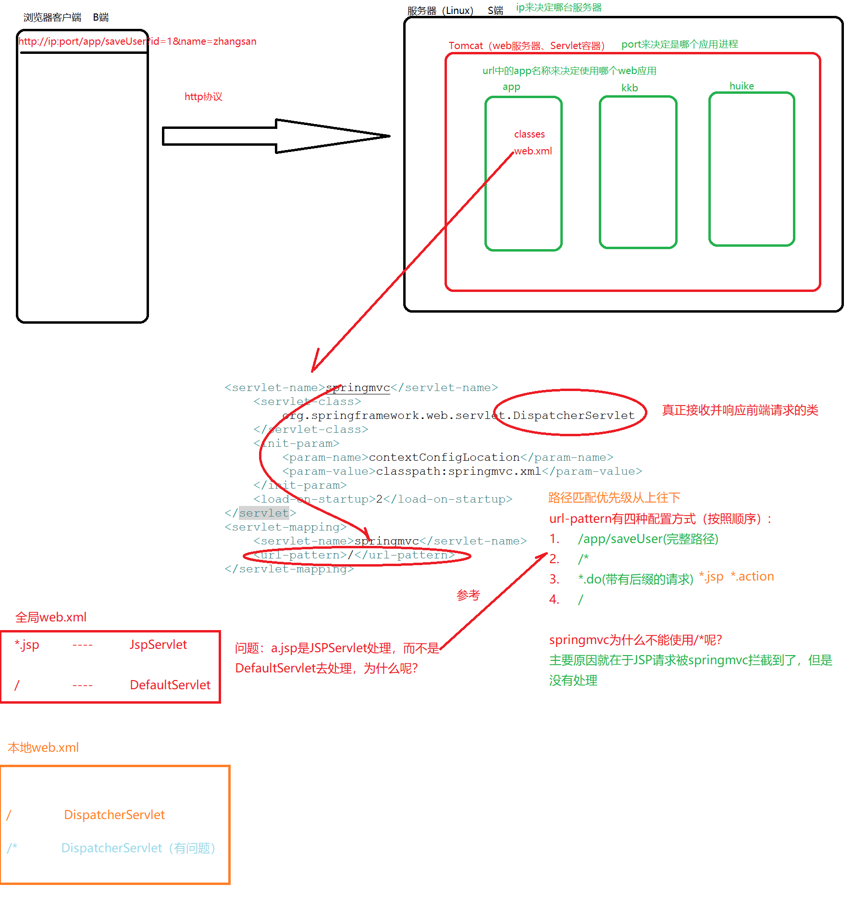
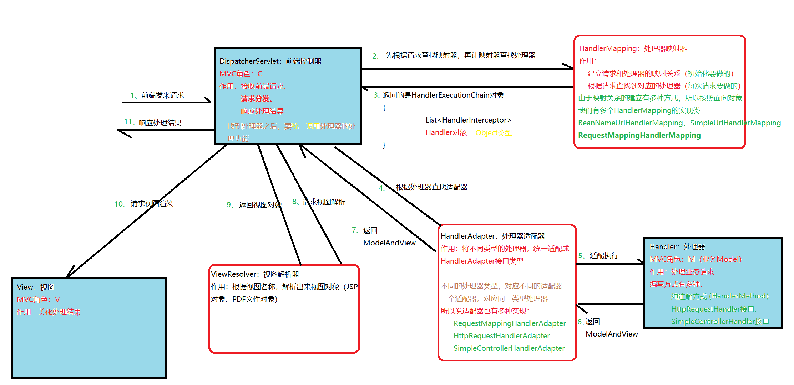
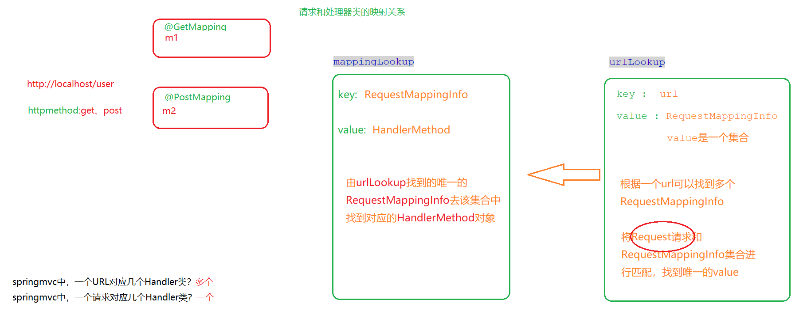

# 笔记

# 第一天

课程主题
	SpringMVC流程分析、适配器模式、手写SpringMVC框架
	
课程目标
	1.要掌握SpringMVC中的请求处理流程的原理
	2.要清楚SpringMVC中的六大组件的作用
	3.重点搞清楚处理器Handler、处理器映射器HandlerMapping、处理器适配器HandlerAdapter的功能
	4.掌握适配器模式的用法
	5.手写SpringMVC框架思路分析
	
课程回顾
	1.Spring 中AOP产生的代理对象的执行流程分析
	
课程内容
	1.看一下录播课内容
	2.分析web应用的访问全路径
	3.分析SpringMVC的执行流程（MVC组件和六大组件）
	4.适配器模式
	5.手写SpringMVC框架
		只要是使用Java来处理Web请求，底层都是使用的Servlet程序去处理的
		需求：
			http://localhost:8080/queryUser?id=1&name=zhangsan
			http://localhost:8080/saveUser
	

# 第二天

课程主题
	手写springmvc框架
	
课程目标
	1.通过手写框架，我们要清楚处理器Handler的写法
	2.通过手写框架，我们要清楚HandlerMapping的实现方式
	3.通过手写框架，我们要清楚HandlerAdapter的实现方式
	4.通过手写框架，我们要清楚DispatcherServlet的实现方式
	5.掌握自定义注解的开发
	
课程回顾
	1.每个同学需要画出来springmvc11个步骤访问流程图
	2.掌握web请求流程
	
课程内容
	需求：
		http://localhost/QueryUserServlet?id=1&name=james
		http://localhost/SaveUserServlet
		
		

	1.分析直接使用Servlet程序去实现表现层一些弊端
		a）每个请求都需要编写一个Servlet类，类太多，不容易维护
		b）Servlet类的实例需要由Tomcat去产生。
			思考：同一个Servlet类会被实例化几次？
						Servlet类的实例是在什么时候被实例化？
						
		改善优化结论：不要产生太多的Servlet实例
		
		方式1：通过继承统一的父类（基类）
		
			http://localhost/userServlet?method=query
		
			BaseServlet{
			
				doget(){
					//获取请求url中的method属性值
					去调用对应名称的方法
				}
				doPost(){
					doGet();
				}
			}
		
			UserServlet extends BaseServlet{
			
				query(){
					//实现query操作
				
				}
			}
		
		Servlet：在BS结构下，服务器端的Java实现标准（接口）
		
		方式2：有一个统一的Servlet程序去负责请求的接收与结果响应
					而具体的业务处理，交给一个普通的javaBean实例（非Servlet实现类）去实现
					
					DispatcherServlet{
					
						doGet(){
							//接收参数		HttpRequest
							
							//分发请求		Handler类（普通的JavaBean）
							
							//响应处理结果	HttpResponse
						
						}
					}
		
					//先制定标准，再编写Handler，否则没有标准实现的话，就在DispatcherServlet类中无法统一调用
					Handler{

​					
					}
	
	2.手写springmvc2.0版本（非注解方式）
	
	3.手写springmvc3.0版本（注解方式）

# 课堂主题

###### springmvc应用开发

课堂目标

熟悉springmvc六大组件的作用及使用方式掌握搭建ssm开发框架

掌握springmvc对于返回值的处理掌握springmvc对于参数的处理

理解REST和RESTful，掌握springmvc对于RESTful的支持 掌握springmvc拦截器的应用

掌握springmvc中基于cors的跨域解决方案掌握spring中的父子容器

了解springmvc的mock测试

了解ControllerAdvice类的开发ModelAttribute、InitBinder、ExceptionHandler 了解springmvc异常处理器

了解springmvc中的get\post请求乱码和响应乱码处理 了解springmvc中非注解开发方式

知识要点

[课堂主题](https://wordhtml.com/#_bookmark2)[课堂目标](https://wordhtml.com/#_bookmark1)[知识要点](https://wordhtml.com/#_bookmark0)[介绍篇](https://wordhtml.com/#_bookmark6)

[基础概念介绍](https://wordhtml.com/#_bookmark5)

[BS和CS开发架构](https://wordhtml.com/#_bookmark4)[应用系统三层架构](https://wordhtml.com/#_bookmark3)[MVC设计模式](https://wordhtml.com/#_bookmark7)

[SpringMVC介绍](https://wordhtml.com/#_bookmark8) [SpringMVC是什么](https://wordhtml.com/#_bookmark9)

[SpringMVC与Spring的联系](https://wordhtml.com/#_bookmark10)[为什么学习SpringMVC](https://wordhtml.com/#_bookmark11)

[六大组件介绍](https://wordhtml.com/#_bookmark12)

[项目搭建篇](https://wordhtml.com/#_bookmark15)

[搭建入门工程](https://wordhtml.com/#_bookmark14)

[添加依赖](https://wordhtml.com/#_bookmark13)[开发步骤](https://wordhtml.com/#_bookmark18)

[配置部分](https://wordhtml.com/#_bookmark17)

[web.xml](https://wordhtml.com/#_bookmark16) [springmvc.xml](https://wordhtml.com/#_bookmark19)

[编码部分](https://wordhtml.com/#_bookmark21)

[Controller](https://wordhtml.com/#_bookmark20)[ 访问测试](https://wordhtml.com/#_bookmark24)

[SSM框架整合](https://wordhtml.com/#_bookmark23)

[整合思路](https://wordhtml.com/#_bookmark22)[工程搭建](https://wordhtml.com/#_bookmark25)

[工程整合（配置文件）](https://wordhtml.com/#_bookmark28) [整合Mapper](https://wordhtml.com/#_bookmark27)

[applicationContext-dao.xml（核心）](https://wordhtml.com/#_bookmark26) [db.properties](https://wordhtml.com/#_bookmark32)

[log4j.properties](https://wordhtml.com/#_bookmark31)[ 整合Service](https://wordhtml.com/#_bookmark30)

[applicationContext-service.xml](https://wordhtml.com/#_bookmark29)[ 整合Controller](https://wordhtml.com/#_bookmark34)

[web.xml](https://wordhtml.com/#_bookmark33) [springmvc.xml](https://wordhtml.com/#_bookmark36)

[web.xml加载spring父容器](https://wordhtml.com/#_bookmark35)[整合测试（编写代码）](https://wordhtml.com/#_bookmark41)

[需求](https://wordhtml.com/#_bookmark40)

[需求分析](https://wordhtml.com/#_bookmark39)[持久层代码](https://wordhtml.com/#_bookmark38)[业务层代码](https://wordhtml.com/#_bookmark37)[表现层代码](https://wordhtml.com/#_bookmark47)[部署测试](https://wordhtml.com/#_bookmark46)

[应用掌握篇](https://wordhtml.com/#_bookmark45)

[返回值处理](https://wordhtml.com/#_bookmark44)

[不使用注解修饰](https://wordhtml.com/#_bookmark43)[ModelAndView](https://wordhtml.com/#_bookmark42) [void](https://wordhtml.com/#_bookmark52)

[String（推荐）](https://wordhtml.com/#_bookmark51)[逻辑视图名](https://wordhtml.com/#_bookmark50)

[redirect重定向](https://wordhtml.com/#_bookmark49) [forward转发](https://wordhtml.com/#_bookmark48)

[使用注解修饰](https://wordhtml.com/#_bookmark58)

[ResponseBody注解介绍](https://wordhtml.com/#_bookmark57)[注解介绍](https://wordhtml.com/#_bookmark56)

[常用的HttpMessageConverter](https://wordhtml.com/#_bookmark55) [ResponseBody示例](https://wordhtml.com/#_bookmark54)

[JSP示例代码](https://wordhtml.com/#_bookmark53)[Controller代码](https://wordhtml.com/#_bookmark59)

[参数绑定处理](https://wordhtml.com/#_bookmark61)

[什么是参数绑定](https://wordhtml.com/#_bookmark60)

[默认支持的参数类型](https://wordhtml.com/#_bookmark67)[参数绑定使用要求](https://wordhtml.com/#_bookmark66)

[简单类型](https://wordhtml.com/#_bookmark65)

[直接绑定](https://wordhtml.com/#_bookmark64)[注解绑定](https://wordhtml.com/#_bookmark63)

[RequestParam注解](https://wordhtml.com/#_bookmark62)[绑定POJO类型](https://wordhtml.com/#_bookmark73)

[绑定集合或者数组类型](https://wordhtml.com/#_bookmark72)[简单类型数组](https://wordhtml.com/#_bookmark71)

[POJO类型集合或者数组](https://wordhtml.com/#_bookmark70)[参数绑定示例](https://wordhtml.com/#_bookmark69)

[JSP代码](https://wordhtml.com/#_bookmark68)[Controller代码](https://wordhtml.com/#_bookmark74) [PO代码](https://wordhtml.com/#_bookmark75)

[自定义日期参数绑定](https://wordhtml.com/#_bookmark80)

[Converter代码](https://wordhtml.com/#_bookmark79)[Converter配置](https://wordhtml.com/#_bookmark78)

[文件类型参数绑定](https://wordhtml.com/#_bookmark77)[加入依赖包](https://wordhtml.com/#_bookmark76)[上传页面](https://wordhtml.com/#_bookmark83)

[配置Multipart解析器](https://wordhtml.com/#_bookmark82) [Controller类代码](https://wordhtml.com/#_bookmark81)

[RequestMapping注解](https://wordhtml.com/#_bookmark88) [value属性](https://wordhtml.com/#_bookmark87)

[请求URL映射](https://wordhtml.com/#_bookmark86)[窄化请求映射](https://wordhtml.com/#_bookmark85)

[method属性](https://wordhtml.com/#_bookmark84) [params属性](https://wordhtml.com/#_bookmark93)

[RESTful支持](https://wordhtml.com/#_bookmark92)

[HTTP介绍](https://wordhtml.com/#_bookmark91)

[HTTP协议概述](https://wordhtml.com/#_bookmark90)

[什么是HTTP协议？](https://wordhtml.com/#_bookmark89) [什么是URL/URI？](https://wordhtml.com/#_bookmark99) [什么是WEB资源？](https://wordhtml.com/#_bookmark98) [HTTP的作用是什么？](https://wordhtml.com/#_bookmark97)

[HTTP协议版本](https://wordhtml.com/#_bookmark96)[HTTP协议组成](https://wordhtml.com/#_bookmark95)

[请求协议信息](https://wordhtml.com/#_bookmark94)[响应协议信息](https://wordhtml.com/#_bookmark100)

[GET请求和POST请求的区别](https://wordhtml.com/#_bookmark102)[什么是RESTful](https://wordhtml.com/#_bookmark101)

[RESTful的特性](https://wordhtml.com/#_bookmark106)

[如何设计RESTful应用程序的API](https://wordhtml.com/#_bookmark105) [SpringMVC对RESTful的支持](https://wordhtml.com/#_bookmark104)

[RESTful的URL路径变量](https://wordhtml.com/#_bookmark103) [RESTful的CRUD](https://wordhtml.com/#_bookmark109) [RESTful的资源表述](https://wordhtml.com/#_bookmark108)

[静态资源访问](https://wordhtml.com/#_bookmark107)[拦截器应用](https://wordhtml.com/#_bookmark112)

[拦截器介绍](https://wordhtml.com/#_bookmark111)[定义拦截器](https://wordhtml.com/#_bookmark110)[配置拦截器](https://wordhtml.com/#_bookmark116)

[多拦截器拦截规则](https://wordhtml.com/#_bookmark115)

[拦截器应用（实现登录认证）](https://wordhtml.com/#_bookmark114) [需求](https://wordhtml.com/#_bookmark113)

[登录页面](https://wordhtml.com/#_bookmark118)[Controller类](https://wordhtml.com/#_bookmark117)

[HandlerInterceptor类](https://wordhtml.com/#_bookmark120) [HandlerInterceptor配置](https://wordhtml.com/#_bookmark119)

[CORS跨域解决方案](https://wordhtml.com/#_bookmark123)[什么是跨域](https://wordhtml.com/#_bookmark122)

[为什么要有同源策略](https://wordhtml.com/#_bookmark121)[如何解决跨域](https://wordhtml.com/#_bookmark127)

[什么是CORS](https://wordhtml.com/#_bookmark126)

[客户端跨域处理](https://wordhtml.com/#_bookmark125)[请求分类标准](https://wordhtml.com/#_bookmark124)[简单请求](https://wordhtml.com/#_bookmark129)

[非简单请求](https://wordhtml.com/#_bookmark128)

[服务器端跨域处理](https://wordhtml.com/#_bookmark132)[CORS实现1](https://wordhtml.com/#_bookmark131)

[跨域不提交Cookie](https://wordhtml.com/#_bookmark130)[跨域提交Cookie](https://wordhtml.com/#_bookmark133)

[CORS实现2](https://wordhtml.com/#_bookmark134)

[父子容器](https://wordhtml.com/#_bookmark136)

[应用了解篇](https://wordhtml.com/#_bookmark135)

[Mock测试（模拟测试）](https://wordhtml.com/#_bookmark143) [什么是mock测试](https://wordhtml.com/#_bookmark142)

[为什么使用mock测试](https://wordhtml.com/#_bookmark141)[MockMVC介绍](https://wordhtml.com/#_bookmark140)

[MockMvc](https://wordhtml.com/#_bookmark139)

[MockMVCBuilder](https://wordhtml.com/#_bookmark138) [MockMVCBuilders](https://wordhtml.com/#_bookmark137) [MockMvcRequestBuilders](https://wordhtml.com/#_bookmark150)

[ResultActions](https://wordhtml.com/#_bookmark149) [MockMvcResultMatchers](https://wordhtml.com/#_bookmark148) [MockMvcResultHandlers](https://wordhtml.com/#_bookmark147)

[MvcResult](https://wordhtml.com/#_bookmark146) [MockMVC使用](https://wordhtml.com/#_bookmark145)

[添加依赖](https://wordhtml.com/#_bookmark144)[测试类](https://wordhtml.com/#_bookmark151)

[ControllerAdvice](https://wordhtml.com/#_bookmark154) [@ControllerAdvice](https://wordhtml.com/#_bookmark153)

[介绍](https://wordhtml.com/#_bookmark152)[使用](https://wordhtml.com/#_bookmark158)

[@ModelAttribute](https://wordhtml.com/#_bookmark157)[介绍](https://wordhtml.com/#_bookmark156)

[作用于方法(常用)](https://wordhtml.com/#_bookmark155)

[无@RequestMapping](https://wordhtml.com/#_bookmark161)[有@RequestMapping](https://wordhtml.com/#_bookmark160)

[作用于方法参数](https://wordhtml.com/#_bookmark159)[@InitBinder](https://wordhtml.com/#_bookmark165)

[介绍](https://wordhtml.com/#_bookmark164)[使用](https://wordhtml.com/#_bookmark163)

[@ExceptionHandler](https://wordhtml.com/#_bookmark162)[介绍](https://wordhtml.com/#_bookmark169)

[使用](https://wordhtml.com/#_bookmark168)[异常处理器](https://wordhtml.com/#_bookmark167)

[异常理解](https://wordhtml.com/#_bookmark166)

[异常处理思路](https://wordhtml.com/#_bookmark172)[异常处理器演示](https://wordhtml.com/#_bookmark171)

[自定义异常类](https://wordhtml.com/#_bookmark170)[异常处理器实现](https://wordhtml.com/#_bookmark175)[异常处理器配置](https://wordhtml.com/#_bookmark174)[错误页面](https://wordhtml.com/#_bookmark173)

[异常测试](https://wordhtml.com/#_bookmark180)[乱码解决](https://wordhtml.com/#_bookmark179)

[GET请求乱码](https://wordhtml.com/#_bookmark178)

[原因分析](https://wordhtml.com/#_bookmark177)[解决方式1](https://wordhtml.com/#_bookmark176) [解决方式2](https://wordhtml.com/#_bookmark184) [解决方式3](https://wordhtml.com/#_bookmark183)

[POST请求乱码](https://wordhtml.com/#_bookmark182)[响应乱码](https://wordhtml.com/#_bookmark181)

[非注解开发方式](https://wordhtml.com/#_bookmark191)[处理器开发](https://wordhtml.com/#_bookmark190)

[实现 HttpRequestHandler 接口](https://wordhtml.com/#_bookmark189)[处理器配置](https://wordhtml.com/#_bookmark188)

[配置处理器映射器](https://wordhtml.com/#_bookmark187)[BeanNameUrlHandlerMapping](https://wordhtml.com/#_bookmark186)

[配置处理器适配器](https://wordhtml.com/#_bookmark185)[HttpRequestHandlerAdapter](https://wordhtml.com/#_bookmark193) [SimpleControllerHandlerAdapter](https://wordhtml.com/#_bookmark192)

[注意事项](https://wordhtml.com/#_bookmark194)

# 介绍篇

## 基础概念介绍

BS和CS开发架构

一种是 C/S 架构，也就是客户端/服务器；

一种是 B/S 架构，也就是浏览器/服务器架构。

说明：

我们现在使用Java开发的大多数都是web应用，这些应用几乎全都是基于 B/S 架构进行开发的。那么在 B/S 架构中，应用系统标准的三层架构分为：表现层、业务层、持久层。这种三层架构在我们的实际开发中使用的 非常多，所以我们课程中的案例也都是基于三层架构设计的。

JavaEE制定了一套规范，去进行BS结构的处理。这套规范就是Servlet。

应用系统三层架构

表现层：

也就是我们常说的web 层。

它负责接收客户端请求，向客户端响应结果，通常客户端使用http 协议请求web 层，web 层需要接收http 请求，完成 http 响应。

表现层包括展示层和控制层：控制层负责接收请求，展示层负责结果的展示。

表现层依赖业务层，接收到客户端请求一般会调用业务层进行业务处理，并将处理结果响应给客户端。 表现层的设计一般都使用 MVC 模型。（MVC 是表现层的设计模型，和其他层没有关系）

业务层：

也就是我们常说的 service 层。

它负责业务逻辑处理，和我们开发项目的需求息息相关。web 层依赖业务层，但是业务层不依赖 web 层。

业务层在业务处理时可能会依赖持久层，如果要对数据持久化需要保证事务一致性。（也就是我们说的， 事务应该放到业务层来控制）

持久层：

也就是我们是常说的 dao 层。

负责数据持久化，包括数据层即数据库和数据访问层，数据库是对数据进行持久化的载体，数据访问层是 业务层和持久层交互的接口，业务层需要通过数据访问层将数据持久化到数据库中。

通俗的讲，持久层就是和数据库交互，对数据库表进行曾删改查的。

MVC设计模式

MVC 是模型(model)－视图(view)－控制器(controller)的缩写， 是一种用于设计编写 Web 应用程序表现层的模式。

MVC 设计模式的三大角色：

Model（模型）：

模型包含业务模型和数据模型，数据模型用于封装数据，业务模型用于处理业务。View（视图）：

通常指的就是我们的 jsp 或者 html。作用一般就是展示数据的。通常视图是依据数据模型创建的。

Controller（控制器）：

是应用程序中处理用户交互的部分。作用一般就是处理程序逻辑的。

SpringMVC介绍

SpringMVC是什么

SpringMVC 是一种基于MVC 设计模型的请求驱动类型的轻量级 Web 框架，属于 SpringFrameWork 的后续产品，已经融合在 Spring Web Flow 里面。Spring 框架提供了构建 Web 应用程序的全功能 MVC 模块。使用 Spring 可插入的 MVC 架构，从而在使用 Spring 进行 WEB 开发时，可以选择使用 Spring 的Spring MVC 框架或集成其他 MVC 开发框架，如 Struts1(现在一般不用)，Struts2 等。

SpringMVC 已经成为目前最主流的 MVC 框架之一，并且随着 Spring3.0 的发布，全面超越 Struts2，成

为最优秀的 MVC 框架。

它通过一套注解，让一个简单的 Java 类成为处理请求的控制器，而无须实现任何接口。同时它还支持RESTful 编程风格的请求。

SpringMVC与Spring的联系

Spring MVC 全名叫Spring Web MVC ，它是Spring家族Web模块 的一个重要成员。这一点,我们可以从Spring 的整体结构中看得出来：

为什么学习SpringMVC

也许你要问，为什么要学习Spring MVC呢？Struts2不才是主流吗？看SSH的概念有多火？

其实很多初学者混淆了一个概念，SSH实际上指的是Struts1.x+Spring+Hibernate 。这个概念已经有十几年的历史了。在Struts1.x时代，它是当之无愧的霸主，但是在新的MVC框架涌现的时代，形式已经不是这样了， Struts2.x借助了Struts1.x的好名声，让国内开发人员认为Struts2.x是霸主继任者（其实两者在技术上无任何关 系），导致国内程序员大多数学习基于Struts2.x的框架，又一个貌似很火的概念出来了

S2SH（ Struts2+Spring+Hibernate ）整合开发。

不要再被蒙蔽了，看看下面的调查统计吧：

SpringMVC的市场占有率是40%，而Struts2只有可怜的6%。这已然说明了学习SpringMVC的必要性了，再说了， SpringMVC本身就是spring家族的一员，与整合spring时，SpringMVC根本无需中间整合包，而struts2得需要。

既然已经知道了SpringMVC的重要性了，那么下面就跟着我一起看看它的神奇之处吧！

六大组件介绍

六大组件(MVC组件其他三大组件)说明： 说明：

1. 在springmvc 的各个组件中，前端控制器、处理器、视图称为springmvc 的MVC组件
2. 在springmvc 的各个组件中，处理器映射器、处理器适配器、视图解析器称为springmvc 的三大组件
3. 需要开发的组件有：处理器、视图

DispatcherServlet：前端控制器

Handler：处理器

View：视图

1 springmvc框架提供了很多的View视图类型的支持，包括：jstlView、freemarkerView、pdfView等。我 们最常用的视图就是jsp。

2

3 一般情况下需要通过页面标签或页面模版技术将模型数据通过页面展示给用户，需要由程序员根据业务需求开发 具体的页面。

HandlerMapping：处理器映射器

HandlAdapter：处理器适配器

View Resolver：视图解析器

# 项目搭建篇

## 搭建入门工程

### 添加依赖

就是mvc 依赖、 jstl 依赖还有servlet-api 依赖

- <project xmlns=

  "http://maven.apache.org/POM/4.0.0

  "

  - xmlns:xsi=["http://www.w3.org/2001/XMLSchema-instance](http://www.w3.org/2001/XMLSchema-instance)"

- xsi:schemaLocation=

  "http://maven.apache.org/POM/4.0.0

   

  http://maven.apache.org/xsd/maven-4.0.0.xsd

  ">

  - 0.0
  - kkb
  - springmvc-demo
  - 0.1-SNAPSHOT
    - war 9
  - \* * * springframework * spring-webmvc * 0.7.RELEASE * 17

18

- \* servlet * jstl * 2
- 

24

- <!-- servlet -->
- \* servlet * servlet-api * 5 * provided
- 32
- 
- \* * * * apache.maven.plugins * maven-compiler-plugin * 2 * * 8 * 8 * UTF-8 * *

47

- \* apache.tomcat.maven * tomcat7-maven-plugin * 2 * * /

54 8080

- 
- 
- 
- 

59 60

### 开发步骤

#### 配置部分

web.xml

在web.xml 中添加前端控制器DispatcherServlet 的配置。

- 

- <web-app xmlns:xsi=

  "http://www.w3.org/2001/XMLSchema-instance

  "

  - xmlns=["http://java.sun.com/xml/ns/javaee](http://java.sun.com/xml/ns/javaee)"

- xsi:schemaLocation=

  "http://java.sun.com/xml/ns/javaee

   

  http://java.sun.com/xml/ns/javaee/web-app_2_5.xsd

  "

  - version="2.5">

6

7

- <!-- 问题1：xml中servelet、filter、listener、context-param加载顺序 -->
- <!-- 问题2：load-on-startup标签的作用，影响了servlet对象创建的时机 -->
- <!-- 问题3：url-pattern标签的配置方式有四种：/dispatcherServlet、 /servlet/* 、* 、/

,以上四种配置，优先级是如何的-->

- <!-- 问题4：url-pattern标签的配置为/

  报错，原因是它拦截了JSP请求，但是又不能处理JSP请求。为什么配置/就不拦截JSP请求，而配置/

  ，就会拦截JSP请求-->

  - <!-- 问题5：配置了springmvc去读取spring配置文件之后，就产生了spring父子容器的问题 -->

13

- <!-- 配置前端控制器 -->
- \* springmvc * springframework.web.servlet.DispatcherServlet * * * * * contextConfigLocation * classpath:springmvc.xml * * * * 2
- 
- \* springmvc *

32

- <!-- 通俗解释：/*，会拦截整个项目中的资源访问，包含JSP和静态资源的访问，对于静态资源的访问

springMVC提供了默认的Handler处理器 -->

- <!-- 但是对于JSP来讲，springmvc没有提供默认的处理器，我们也没有手动编写对于的处理器，此时按照springmvc的处理流程分析得知，它短路了 -->
- /
- 

37

- <!-- sss -->
  - <!-- sss --> 40
- <!-- -->
- <!-- sss -->
- <!-- /sss -->
- <!-- -->
- 

springmvc.xml

DispatcherServlet 启动时会去加载springmvc.xml 文件

- <beans xmlns=

  "http://www.springframework.org/schema/beans

  "

  - xmlns:xsi=["http://www.w3.org/2001/XMLSchema-instance](http://www.w3.org/2001/XMLSchema-instance)"

  - xmlns:context=["http://www.springframework.org/schema/context](http://www.springframework.org/schema/context)"

  - xmlns:mvc=["http://www.springframework.org/schema/mvc](http://www.springframework.org/schema/mvc)"

  - xsi:schemaLocation=

    "http://www.springframework.org/schema/beans

    - http://www.springframework.org/schema/beans/spring-beans.xsd
    - http://www.springframework.org/schema/context
    - http://www.springframework.org/schema/context/spring-context.xsd
    - http://www.springframework.org/schema/mvc
    - http://www.springframework.org/schema/mvc/spring-mvc.xsd"> 12

  - <!-- 配置处理器Bean的读取 -->

  - <!-- 扫描controller注解,多个包中间使用半角逗号分隔 -->

  - <context:component-scan base-package="com.kkb.springmvc.controller"/>

16

- <!-- 配置三大组件之处理器适配器和处理器映射器 -->
- <!-- 内置了RequestMappingHandlerMapping和RequestMappingHandlerAdapter等组件注册-->
- <mvc:annotation-driven />

20

- <!-- 配置三大组件之视图解析器 -->
- <!-- InternalResourceViewResolver:默认支持JSP视图解析-->
- \* *
- 
- 

配置说明：

mvc:annotation-drivern

编码部分

Controller

//@Controller：在类上添加该注解，指定该类为一个请求处理器，不需要实现任何接口或者继承任何类。

@Controller

public class HelloController {

1

2

3

4

5

6

7

8

9

10

11

12

13

14

15

不过企业开发中，推荐使用注解方式开发处理器。

}

//@RequestMapping：在方法上或者类上添加该注解，指定请求的`url`由该方法处理。

@RequestMapping("showView") public String showView() {

return "hello";

}

@RequestMapping("showData") @ResponseBody

public String showData() { return "showData";

}

注意事项：

@Controller 注解的类中每个@RequestMapping 注解的方法，最终都会转为HandlerMethod 类（而这个类才是SpringMVC 注解开发方式中真正意义的处理器）

### 访问测试

SSM框架整合

### 整合思路

将工程的三层结构中的JavaBean 分别使用Spring容器 （通过XML方式）进行管理。

1. 整合持久层mapper ，包括数据源 、 SqlSessionFactory 及mapper 代理对象的整合；
2. 整合业务层Service ，包括事务Bean 及service 的bean 的配置；
3. 整合表现层Controller ，直接使用springmvc 的配置。
   1. xml 加载spring 容器（包含多个XML文件，还分为父子容器 ）

###### 核心配置文件：

applicationContext-dao.xml applicationContext-service.xml

工程搭建

依赖包：

- <project xmlns=

  "http://maven.apache.org/POM/4.0.0

  "

  - xmlns:xsi=["http://www.w3.org/2001/XMLSchema-instance](http://www.w3.org/2001/XMLSchema-instance)"

- xsi:schemaLocation=

  "http://maven.apache.org/POM/4.0.0

   

  http://maven.apache.org/xsd/maven-4.0.0.xsd

  ">

  - 0.0
  - kkb
  - ssm-5
  - 0.1-SNAPSHOT

- war 9

  - 

11

12

13

- springframework
- spring-beans
- 0.7.RELEASE

17

18

- springframework
- spring-core
- 0.7.RELEASE

22

23

- springframework
- spring-context
- 0.7.RELEASE

27

28

- springframework
- spring-expression
- 0.7.RELEASE
  - 33

34

35

- springframework
- spring-tx
- 0.7.RELEASE

39

40

- springframework
- spring-jdbc
- 0.7.RELEASE
  - 45

46

47

- mysql
- mysql-connector-java
- 1.35
  - 52

53

54

- commons-dbcp
- commons-dbcp
- 4
  - 59

60

61

- mybatis
- mybatis
- 4.5
  - 66

67

68

- mybatis
- mybatis-spring
- 3.1
  - 73

74 75

76

77

78

- springframework
- spring-aspects
- 0.7.RELEASE

82

83

- aopalliance
- aopalliance
- 0

87

- <!-- 业务层依赖 结束 --> 89

90

91

92

93

- springframework
- spring-webmvc
- 0.7.RELEASE

97

98

- springframework
- spring-web
- 0.7.RELEASE
  - 103

104

105

- servlet
- jstl
- 2
  - 110

111

- servlet
- servlet-api
- 1.0
- provided
  - 117

118

119

- springframework
- spring-context-support
- 0.7.RELEASE

123

124

- springframework
- spring-oxm
- 0.7.RELEASE

128

129

- thoughtworks.xstream
- xstream
- 4.10
  - 134

135

136

- fasterxml.jackson.core
- jackson-databind
- 9.6
  - 141

142

143

144

145

146

- springframework
- spring-test
- 0.7.RELEASE
  - 151

152

153

- junit
- junit
- 12
  - 158

159

160

- jayway.jsonpath
- json-path
- 2.0
  - 165

166

167

168

- commons-fileupload
- commons-fileupload
- 3.1

172

- 
- 

175

- <!-- 配置Maven的JDK编译级别 -->
- \* apache.maven.plugins * maven-compiler-plugin * 2 * * 8 * 8 * UTF-8 *
- 
- \* apache.tomcat.maven * tomcat7-maven-plugin * 2 * * / * 80 *
- 

### 工程整合（配置文件）

整合Mapper

applicationContext-dao.xml（核心）

在classpath 下，创建spring 目录，然后创建SqlMapConfig.xml ：

- 

- <beans xmlns=

  "http://www.springframework.org/schema/beans

  "

  - xmlns:context=["http://www.springframework.org/schema/context](http://www.springframework.org/schema/context)"

  - xmlns:xsi=

    "http://www.w3.org/2001/XMLSchema-instance

    "

    - xsi:schemaLocation=["http://www.springframework.org/schema/beans](http://www.springframework.org/schema/beans) http://www.springframework.org/schema/beans/spring-beans.xsd

  - http://www.springframework.org/schema/context http://www.springframework.org/schema/context/spring-context.xsd">

7

- <!-- 加载properties -->
  - <context:property-placeholder location="classpath:db.properties" /> 10
- <bean id="dataSource" class="org.apache.commons.dbcp.BasicDataSource"
  - destroy-method="close">
  - 
  - 
  - 
  - 
  - 
  - 
  - 20
- <!-- 配置SqlSessionFacotory -->
- 

23

24

- 
- 
- 28
- <!-- 配置mapper扫描器，xml中的mapper配置去掉 -->
  - 31
    - 
  - 
- 

db.properties

在classpath 下，创建db.properties ：

- driver=com.mysql.jdbc.Driver
- url=jdbc:mysql://localhost:3306/ssm?characterEncoding=utf8
- username=root
- password=root

log4j.properties

stdout

log4j.rootLogger=DEBUG,

\# Console output...

\#dev env [debug] product env [info]

1

2

3

4

5

6

在classpath 下，创建log4j.properties ：

[%t] - %m%n

log4j.appender.stdout.layout.ConversionPattern=%5p

log4j.appender.stdout=org.apache.log4j.ConsoleAppender

log4j.appender.stdout.layout=org.apache.log4j.PatternLayout

整合Service

applicationContext-service.xml

在spring 文件夹下创建applicationContext-service.xml ，文件中配置service 。在这个配置文件中，需要配置service 的bean 和事务管理。

- 

- <beans xmlns=

  "http://www.springframework.org/schema/beans

  "

  - xmlns:context=["http://www.springframework.org/schema/context](http://www.springframework.org/schema/context)"

  - xmlns:aop=["http://www.springframework.org/schema/aop](http://www.springframework.org/schema/aop)"

  - xmlns:tx=["http://www.springframework.org/schema/tx](http://www.springframework.org/schema/tx)"

  - xmlns:xsi=

    "http://www.w3.org/2001/XMLSchema-instance

    "

    - xsi:schemaLocation=["http://www.springframework.org/schema/beans](http://www.springframework.org/schema/beans) http://www.springframework.org/schema/beans/spring-beans.xsd

  - http://www.springframework.org/schema/context

     

    http://www.springframework.org/schema/context/spring-context.xsd

    - http://www.springframework.org/schema/aop http://www.springframework.org/schema/aop/spring-aop.xsd http://www.springframework.org/schema/tx http://www.springframework.org/schema/tx/spring-tx.xsd">

10

- <!-- 扫描Service -->
- <context:component-scan base-package="com.kkb.ssm.service" />

13

14

- <!-- 事务管理器，对mybatis操作数据库进行事务控制，此处使用jdbc的事务控制 -->
- <bean id="transactionManager"
  - class="org.springframework.jdbc.datasource.DataSourceTransactionManager">
  - <!-- 指定要进行事务管理的数据源 -->
  - 
- 

21

22

- <tx:advice id="txAdvice" transaction-manager="transactionManager">
  - tx:attributes

25

- <tx:method name="save*" propagation="REQUIRED" />
- <tx:method name="add*" propagation="REQUIRED" />
- <tx:method name="insert*" propagation="REQUIRED" />
- <tx:method name="delete*" propagation="REQUIRED" />
- <tx:method name="del*" propagation="REQUIRED" />
- <tx:method name="remove*" propagation="REQUIRED" />
- <tx:method name="update*" propagation="REQUIRED" />
- <tx:method name="modify*" propagation="REQUIRED" />
- <tx:method name="find*" read-only="true" />
- <tx:method name="query*" read-only="true" />
- <tx:method name="select*" read-only="true" />
- <tx:method name="get*" read-only="true" />
- 
  - 40

41

- aop:config
  - <aop:advisor advice-ref="txAdvice"
    - pointcut="execution(* com.kkb.ssm.service.impl.*.*(..))" />
  - 
- 

整合Controller

Spring 和springmvc 之间无需整合，直接用springmvc的配置

web.xml

在web.xml 中添加springmvc 的配置：

- 
- <web-app xmlns:xsi=["http://www.w3.org/2001/XMLSchema-instance](http://www.w3.org/2001/XMLSchema-instance)"

3 xmlns=["http://java.sun.com/xml/ns/javaee](http://java.sun.com/xml/ns/javaee)" xmlns:web="http://java.sun.com/xml/ns/javaee/web-app_2_5.xsd"

- xsi:schemaLocation=

  "http://java.sun.com/xml/ns/javaee

   

  http://java.sun.com/xml/ns/javaee/web-app_2_5.xsd

  "

  - id="WebApp_ID" version="2.5">

6

- <!-- 配置springmvc的前端控制器 -->
- \* springmvc * springframework.web.servlet.DispatcherServlet * * contextConfigLocation * classpath:spring/springmvc.xml * * 1

<!-- 配置处理器映射器和处理器适配器 -->

<mvc:annotation-driven />

- 
- \* springmvc * / * 21

22

springmvc.xml

在spring 包下创建springmvc.xml 文件，内容如下：

2 ' src="data:image/png;base64,R0lGODlhcQIEAHcAMSH+GlNvZnR3YXJlOiBNaWNyb3NvZnQgT2ZmaWNlACH5BAEAAAAALAAAAAABAAEAgAAAAAECAwICRAEAOw==" v:shapes="_x0000_s3576">

<!-- 配置视图解析器 -->

<bean

class="org.springframework.web.servlet.view.InternalResourceViewResolver">

<!-- 使用注解的handler可以使用组件扫描器，加载handler -->

<context:component-scan base-package="com.kkb.ssm.controller" />

9

10

11

12

13

14

15

16

17

18

19

20

21

22

web.xml加载spring父容器

在web.xml中，使用监听器来对spring的配置文件进行加载：

- <!-- 加载spring容器 -->
- \* contextConfigLocation * * classpath:spring/applicationContext-*.xml *
- 
- \* springframework.web.context.ContextLoaderListener
- 

### 整合测试（编写代码）

#### 需求

实现商品查询列表，从mysql 数据库查询商品信息。

#### 需求分析

###### 表现层

请求URL：/queryItem 请求参数：无

请求返回值：json格式数据

业务层

业务处理逻辑（需求分析）：实现商品列表的查询

持久层

只针对表进行增删改查操作

持久层代码

业务层代码

根据需求开发service的接口以及实现类，注意：使用注解 @Service开发service。

- @Service
  - public class ItemServiceImpl implements ItemService { 3
  - @Autowired
    - private ItemMapper mapper; 6
  - public List queryItemList() {
    - ItemExample example = new ItemExample();
    - return mapper.selectByExample(example); 10 }

11

12 }

#### 表现层代码

在Controller 类上添加 @Controller 注解

在Controller 方法上添加 @RequestMapping注解进行url请求映射

- @Controller
- public class ItemController {
  - @Autowired
    - private ItemService service; 5
  - @RequestMapping("/item")
  - @ResponseBody
  - public List queryItem() {
    - // 根据查询条件去数据库中查询商品列表
      - List itemList = service.queryItemList(); 11

12 return itemList; 13 }

14 }

#### 部署测试

http://localhost:8080/ssm/item

应用掌握篇

返回值处理不使用注解修饰ModelAndView

void

在Controller方法形参上可以定义request和response，使用request 或response 指定响应结果：

1、使用request转发向页面，如下：

2、也可以通过response页面重定向：

3、也可以通过response指定响应结果，例如响应json数据如下：

##### String（推荐）

###### 逻辑视图名

redirect重定向

redirect:

相当于“ response.sendRedirect() ” 浏 览 器 URL 发 生 改 变 Request域不能共享

forward转发

forward：

相当于“ request.getRequestDispatcher().forward(request,response) ” 浏览器URL不发送改变

Request 域可以共享

使用注解修饰ResponseBody注解介绍注解介绍

ResponseBody注解的作用：

@RequestBody注解的作用和@ResponseBody注解正好相反，它是处理请求参数的http消息转换的。

常用的HttpMessageConverter

MappingJacksonHttpMessageConverter

StringHttpMessageConverter

ResponseBody示例

JSP示例代码

- <%@ page language="java" contentType="text/html; charset=UTF-8"
  - pageEncoding="UTF-8"%>
    - 
  - \* * * JSON格式数据参数绑定和返回值处理演示demo * * * * [测 试String类型返回值](https://tool.lu/markdown/${pageContext.request.contextPath}/responsebody/returnString)
- [测试POJO](https://tool.lu/markdown/${pageContext.request.contextPath}/responsebody/returnPOJO)

类型返回值

- <!-- 使用@RestController注解-->
- [测 试String类型返回值](https://tool.lu/markdown/${pageContext.request.contextPath}/restcontroller/returnString)
- [测 试POJO类型返回值](https://tool.lu/markdown/${pageContext.request.contextPath}/restcontroller/returnPOJO)
- 
- 

Controller代码

1 @RequestMapping("responsebody")

2 @Controller

3 public class MyResponseBodyController { 4

5

6

7

8

9

方式1（使用@ResponseBody注解）：

// 如果在使用@ResponseBody注解的前提下，如果返回值是POJO类型，则返回值会由

MappingJacksonHttpMessageConverter（需要第三方jar包支持）进行处理

return user;

}

}

22

23

24

方式2（使用@RestController注解）：

1 /**

- \* 用来学习JSON交互
  - \* @author think 4 *

5 */

- @RequestMapping("restcontroller")
- @RestController //相当于Controller注解和ResponseBody注解的组合
  - public class MyRestcontroller { 9
- //@RequestMapping注解中的consumes和produces分别是为请求头和响应头设置contentType
- @RequestMapping(value="returnString",produces="text/plain;charset=UTF-8")
- public String returnString() {
  - // 如果在使用@ResponseBody注解的前提下，如果返回值是String类型，则返回值会由

StringHttpMessageConverter进行处理

- return "查询失败";

15 }

- @RequestMapping("returnPOJO")
  - public User returnPOJO() throws CustomException{ 18
- User user = new User();
- user.setId(1);
- user.setUsername("bingbing");
  - user.setSex("女"); 23
- // 如果在使用@ResponseBody注解的前提下，如果返回值是POJO类型，则返回值会由

MappingJacksonHttpMessageConverter（需要第三方jar包支持）进行处理

- return user; 26 }

27 }

## 参数绑定处理

### 什么是参数绑定

###### 什么是参数绑定？

Controller各种数据类型的方法形参） 4 --赋值操作，将转换之后的值赋值给Controller方法形参 " src="data:image/png;base64,R0lGODlhGgMEAHcAMSH+GlNvZnR3YXJlOiBNaWNyb3NvZnQgT2ZmaWNlACH5BAEAAAAALAAAAAABAAEAgAAAAAECAwICRAEAOw==" v:shapes="_x0000_s3598">

请求参数格式

请求参数值的数据类型

请求参数值要绑定的目标类型

1 Controller类中的方法参数，比如简单类型、POJO类型、集合类型等。

SpringMVC内置的参数解析组件

### 默认支持的参数类型

Controller方法形参中可以随时添加如下类型的参数（Servlet API支持），处理适配器会自动识别并进行赋值

HttpServletRequest

通过request 对象获取请求信息

HttpServletResponse

通过response 处理响应信息

HttpSession

通过session 对象得到session 中存放的对象

InputStream、OutputStream

Reader、Writer

Model/ModelMap

ModelMap 继承自LinkedHashMap ，Model是一个接口，它们的底层实现都是同一个类

（ BindingAwareModelMap ），作用就是向页面传递数据，相当于Request 的作用，如下：

### 参数绑定使用要求

#### 简单类型

###### 直接绑定

注解绑定

RequestParam注解

value：

required：

- 是否必须，默认是true，表示请求中一定要有相应的参数，否则将报；
  - TTP Status 400 - Required Integer parameter 'XXXX' is not present

###### defaultValue：

绑定POJO类型

#### 绑定集合或者数组类型

###### 简单类型数组

POJO类型集合或者数组

来接收，那么这个List必须放在另一个POJO类中。" src="data:image/png;base64,R0lGODlhPwMEAHcAMSH+GlNvZnR3YXJlOiBNaWNyb3NvZnQgT2ZmaWNlACH5BAEAAAAALAAAAAABAAEAgAAAAAECAwICRAEAOw==" v:shapes="_x0000_s3608">

### 参数绑定示例

JSP代码

- <%@ page language="java" contentType="text/html; charset=UTF-8"
  - pageEncoding="UTF-8"%>
    - 
  - 
  - 
  - 
  - 参数绑定演示demo
  - 
  - *

11

12

<!-- 将request请求参数，绑定到简单类型（基本类型和String类型）方法参数 -->

13

<!-- 直接绑定 -->

14

<a href="${pageContext.request.contextPath}/user/findUserById?

id=1&name=bingbing">查询用户1

15

<!-- @RequestParam注解绑定 -->

16

[查询用户](https://tool.lu/markdown/${pageContext.request.contextPath}/user/findUserById2?uid=1)

2

17

18

<!-- 将request请求参数，绑定到POJO类型(简单POJO和包装POJO的)方法参数 -->

19

20

用户名称：

21

用户性别：

22

所属省份：

23

所属城市：

24

25

26

27

<!-- 将request请求参数，绑定到[元素是简单类型的集合或数组]参数 -->

28

<!-- 使用数组接收 -->

29

[根](https://tool.lu/markdown/${pageContext.request.contextPath}/user/findUserByIds?id=1&id=2&id=3)

据ID批量删除用户

30

<!-- 使用List接收（错误示例） -->

31

[根据ID批量删除用户](https://tool.lu/markdown/${pageContext.request.contextPath}/user/findUserByIds2?id=1&id=2&id=3)

32

<!-- 使用Bean的List属性接收 -->

33

<a href="${pageContext.request.contextPath}/user/findUserByIds3?

uid=1&uid=2&uid=3">根据ID批量删除用户

34

35

36

<!-- 将request请求参数，绑定到[元素是POJO类型的List集合或Map集合]参数 -->

37

38

用户名称：

39

用户性别：

40

<!-- itemList[集合下标]：集合下标必须从0开始 -->

41

<!-- 辅助理解：先将name属性封装到一个Item对象中，再将该Item对象放入itemList集合的指定下

标 处 -->

42

购买商品1名称：

43

购买商品1价格：

44

购买商品2名称：

45

购买商品2价格：

46

<!-- itemMap['item3']：其中的item3、item4就是Map集合的key -->

47

<!-- 辅助理解：先将name属性封装到一个Item对象中，再将该Item对象作为value放入itemMap集合

的指定key处 -->

48

购买商品3名称：

49

购买商品3价格：

50

购买商品4名称：

51

购买商品4价格：

52

53

54

55

<!-- 将request请求参数，绑定到Date类型方法参数 -->

56

<!-- 请求参数是：【年月日】 格式 -->

- 

根据日期删除用户(String)

- <!-- 请求参数是：【年月日 时分秒】 格式 -->
  - [根据日期删除用户(Date)](https://tool.lu/markdown/${pageContext.request.contextPath}/user/deleteUser2?birthday=2018-01-01 12:10:33)

60

- <!-- 文件类型参数绑定 -->
- 

enctype="multipart/form-data">

- 图片：
- 
- 66
- 
- 

##### Controller代码

1 /**

- \* 用来学习参数绑定
  - \* @author think 4 *

5 */

- @RequestMapping("user")
- @Controller
  - public class UserController { 9
- @RequestMapping("findUserById")
- public String findUserById(Integer id,Model model,HttpServletRequest request) {
  - model.addAttribute("msg", "直接参数绑定接收到的参数："+id);
- model.addAttribute("msg", "通过Request getParameter参数接收到的参数："+request.getParameter("id"));
  - return "success";

15 }

- // @RequestParam：可以理解为getParameter("参数key")
- @RequestMapping("findUserById2")
- public String findUserById2(@RequestParam("uid") Integer id,Model model) {
  - model.addAttribute("msg", "接收到的参数："+id);

20 return "success"; 21 }

- @RequestMapping("saveUser")
- public String saveUser(User user,Model model) {
  - model.addAttribute("msg", "接收到的参数："+user.toString());

25 return "success"; 26 }

- @RequestMapping("deleteUser")
- public String deleteUser(String birthday,Model model) {
  - model.addAttribute("msg", "接收到的参数："+birthday);

30 return "success"; 31 }

32 @RequestMapping("deleteUser2")

33

34

35

36

37

38

39

40

41

42

43

44

45

46

47

48

49

50

51

52

53

54

55

56

57 }

public String deleteUser2(Date birthday,Model model) { model.addAttribute("msg", "接收到的参数："+birthday); return "success";

}

@RequestMapping("findUserByIds")

public String findUserByIds(Integer[] id,Model model) { model.addAttribute("msg", " 接 收 到 的 参 数 ："+id); return "success";

}

@RequestMapping("findUserByIds2")

public String findUserByIds2(List id,Model model) { model.addAttribute("msg", "接收到的参数："+id);

return "success";

}

@RequestMapping("findUserByIds3")

public String findUserByIds3(User user,Model model) { model.addAttribute("msg", "接收到的参数："+user.getUid()); return "success";

}

@RequestMapping("updateUser")

public String updateUser(User user,Model model) { model.addAttribute("msg", "接收到的参数："+user.getUid()); return "success";

}

PO代码

- public class User {
  - private int id;
  - private String username;
  - private Date birthday;
- private String sex; 6
  - // 演示包装POJO参数绑定
  - private Address address;

9

- // 演示批量简单类型参数接收
- private List uid = new ArrayList<>();

12

- // 将request请求参数，绑定到[元素是POJO类型的List集合]参数
- private List itemList = new ArrayList<>();

15

- // 将request请求参数，绑定到[元素是POJO类型的Map集合]参数
- private Map<String, Item> itemMap = new HashMap<>();

18

19 //setter/getter方法20 }

### 自定义日期参数绑定

1 对于springmvc无法解析的参数绑定类型，比如[年月日时分秒格式的日期]绑定到Date类型会报错，此时需要自定义

[参数转换器]进行参数绑定。

##### Converter代码

- public class DateConverter implements Converter<String, Date> {
  - @Override
  - public Date convert(String source) {
    - SimpleDateFormat simpleDateFormat = new SimpleDateFormat("yyyy-MM-dd");
    - try {
      - return simpleDateFormat.parse(source);
    - } catch (ParseException e) {
  - e.printStackTrace(); 9 }

10 return null; 11 }

12 }

13

##### Converter配置

3 4 5 6 7 8 9 10 11 ' src="data:image/png;base64,R0lGODlhPwMEAHcAMSH+GlNvZnR3YXJlOiBNaWNyb3NvZnQgT2ZmaWNlACH5BAEAAAAALAAAAAABAAEAgAAAAAECAwICRAEAOw==" v:shapes="_x0000_s3610">

文件类型参数绑定

SpringMVC 文件上传的实现，是由commons-fileupload 这个第三方jar包实现的。

加入依赖包

- \* commons-fileupload * commons-fileupload * 3.1
- 

#### 上传页面

配置Multipart解析器

在springmvc.xml 中配置multipart 类型解析器：

3 4 5 ' src="data:image/png;base64,R0lGODlhPwMEAHcAMSH+GlNvZnR3YXJlOiBNaWNyb3NvZnQgT2ZmaWNlACH5BAEAAAAALAAAAAABAAEAgAAAAAECAwICRAEAOw==" v:shapes="_x0000_s3612">

Controller类代码

- @RequestMapping("fileupload")
  - public String findUserById(MultipartFile uploadFile) throws Exception {
    - // 编写文件上传逻辑（mvc模式和三层结构模式）
    - // 三层模式：表现层（controller、action）、业务层（service、biz）、持久层（dao、

mapper）

- // MVC模式主要就是来解决表现层的问题的（原始的表现层是使用Servlet编写，即编写业务逻辑，又编写视图展示）

6

- if (uploadFile != null) {
  - System.out.println(uploadFile.getOriginalFilename());
  - // 原始图片名称
  - String originalFilename = uploadFile.getOriginalFilename();
  - // 如果没有图片名称，则上传不成功
  - if (originalFilename != null && originalFilename.length() > 0) {
    - // 存放图片的物理路径
    - String picPath = "E:\";
    - // 获取上传文件的扩展名
    - String extName =

originalFilename.substring(originalFilename.lastIndexOf("."));

- // 新文件的名称
- String newFileName = UUID.randomUUID() + extName;
- // 新的文件
- File newFile = new File(picPath + newFileName);
- // 把上传的文件保存成一个新的文件
- uploadFile.transferTo(newFile);
- // 同时需要把新的文件名更新到数据库中

24 }

25 }

RequestMapping注解

value属性

请求URL映射

作用：用于映射URL和HandlerMethod方法。用法如下：

#### 窄化请求映射

###### 作用：限制此类下的所有方法的访问请求url必须以请求前缀开头，对url进行模块化分类管理。 用法如下：

@RequestMapping("item") @Controller

public class ItemController {

1

2

3

4

5

6

7

8

9

10

访问时的URL是/item/findItem

}

@RequestMapping("findItem")

public String findItem(Model model) {

model.addAttribute("msg", "ItemController...findItem方法执行了"); return "success";

}

method属性

作用：限定请求URL只能通过指定的method请求方式去访问该 HandlerMethod

###### 用法如下：

- @RequestMapping(value="/findItem",method=RequestMethod.GET)
- @RequestMapping(value="/findItem",method=RequestMethod.POST)
- @RequestMapping(value="/findItem",method={RequestMethod.GET,RequestMethod.POST})

params属性

作用：通过设置params 参数条件，进行访问HandlerMethod 的限制

###### 用法如下：

URL请求

5000">删除商品，金额大于5000 2
3 [删除商品，金额大于7000](https://tool.lu/markdown/item/removeItem?name=iphoneXs&price>7000) ' src="data:image/png;base64,R0lGODlh9AIEAHcAMSH+GlNvZnR3YXJlOiBNaWNyb3NvZnQgT2ZmaWNlACH5BAEAAAAALAAAAAABAAEAgAAAAAECAwICRAEAOw==" v:shapes="_x0000_s3618">

Controller方法：

5000"}) public String removeItem(Model model) { model.addAttribute("msg", "ItemController...removeItem方法执行了"); return "success"; } ' src="data:image/png;base64,R0lGODlhcgIEAHcAMSH+GlNvZnR3YXJlOiBNaWNyb3NvZnQgT2ZmaWNlACH5BAEAAAAALAAAAAABAAEAgAAAAAECAwICRAEAOw==" v:shapes="_x0000_s3620">

RESTful支持

###### 理解什么是REST之前，先去理解一下什么是HTTP

HTTP介绍

HTTP协议概述

什么是HTTP协议？

1 * HTTP是建立在TCP/IP协议基础之上的一个网络协议。2

3 * HTTP协议属于网络七层结构中最上层（应用层）的协议。

4

5 * HTTP协议是一个无状态协议（不会记录每次访问时的信息） 6

7 * HTTP是一个客户端和服务器端请求和应答的标准（TCP）。客户端是终端用户，服务器端是网站。

8

什么是URL/URI？

###### URI：Uniform Resource Identifier，统一资源标识符。

URL：Uniform Resource Location，统一资源定位符。

URL和URI的区别：URL是URI的子集。

什么是WEB资源？

###### 通过浏览器可以访问到的所有资源都是web资源 ，web资源分为静态资源和动态资源： 动态资源是通过后台程序展示页面数据的，比如Servlet请求。

静态资源的数据是不变的，比如HTML、JPG、AVI。

HTTP的作用是什么？

HTTP协议版本

###### HTTP1.1和HTTP1.0版本之间最大的区别就是：可以一个连接传输多个web资源。

推荐使用HTTP1.1版本！！！

HTTP协议组成

###### HTTP协议由两部分组成：请求协议信息和响应协议信息。

请求协议信息

- \- 请求协议由哪几部分组成？
- \- 请求协议的请求行包含哪些信息？
- \- 请求协议的请求头如何理解？请求头中常用的一些配置的作用各自是什么？
- \- MIME是什么？常见的MIME类型有哪些？
- \- 请求协议的请求体有几种表现形式？

6

###### HTTP请求协议信息由三部分组成：请求行、请求头、请求体，简称行头体。

请求行

请求方法：

URI：

1 Uniform Resource Identifier，统一资源标识符。它相当于一个网络资源的名称，只是名称的表现形式是/开头的路径形式。

2

3 URL：Uniform Resource Location，统一资源定位符4

5 URL和URI的区别：URL是URI的子集。

6

###### 协议/版本：

请求头

请求头说明：

Content-Type

是请求消息中非常重要的内容，表示请求正文中的文档属于什么MIME类型。Content- Type: [type]/[subtype]; parameter。例如最常见的就是text/html，它的意思是说返回的内容是文本类型，这个文本又是HTML格式的。

Host

指定请求资源的Intenet主机和端口号，必须表示请求url的原始服务器或网关的位置。HTTP/1.1请求必须包含主机头域，否则系统会以400状态码返回

Accept

浏览器可接受的MIME类型

Accept- Charset

浏览器可接受的字符集

Accept- Encoding

浏览器能够进行解码的数据编码方式，比如gzip。Servlet能够向支持gzip的浏览器返回经gzip编码的HTML页面。许多情形下这可以减少5到10倍的下载时间

Accept- Language

浏览器所希望的语言种类，当服务器能够提供一种以上的语言版本时要用到

Authorization

授权信息，通常出现在对服务器发送的WWW-Authenticate头的应答中

Connection

表示是否需要持久连接。如果Servlet看到这里的值为“Keep- Alive”，或者看到请求使用的是HTTP1.1（HTTP 1.1默认进行持久连接），它就可以利用持久连接的优点，当页面包含多个元素时（例如Applet，图片），显著地减少下载所需要的时间。要实现这一点，Servlet需要在应答中发送一个Content-Length头，最简单的实现方法是：先把内容 写入 ByteArrayOutputStream，然后在正式写出内容之前计算它的大小

Content- Length

表示请求消息正文的长度

Cookie

这是最重要的请求头信息之一，可以在客户端记录访问状态。

From

请求发送者的email地址，由一些特殊的Web客户程序使用，浏览器不会用到它

If-Modified- Since

只有当所请求的内容在指定的日期之后又经过修改才返回它，否则返回304“Not Modified”应答

Pragma

指定“no-cache”值表示服务器必须返回一个刷新后的文档，即使它是代理服务器而且已 经有了页面的本地拷贝

Referer

包含一个URL，用户从该URL代表的页面出发访问当前请求的页面，使用场景：防盗链、统计网站访问信息。

User-Agent

浏览器类型（客户端类型），如果Servlet返回的内容与浏览器类型有关则该值非常有用

UA-Pixels， UA-Color，UA- OS，UA-CPU

由某些版本的IE浏览器所发送的非标准的请求头，表示屏幕大小、颜色深度、操作系统和CPU类型

MIME概述：多用途互联网邮件扩展类型，也叫媒体类型。

MIME格式：大类型/小类型，阅读是反过来，比如text/html,读成html文本。

常见MIME类型如下：

###### 请求体

通过表单POST提交的请求体的表现形式主要有三种：

1 - application/x-www-form-urlencoded：会对中文进行URL编码，并且多个参数以&连接，上传文件只能上传文件名称。

2

3 - text/plain：纯文本方式，不会对中文进行URL编码，不会使用&连接多个key-value参数，上传文件只能上传文件名称。

4

5 - multipart/form-data：多部件表现形式，这种方式主要可以完成文件上传，可以将上传的文件名称和文件内容都传递给服务器端。

6

###### 总结

请求协议由三部分组成：行头体

响应协议信息

- \- 响应协议由哪几部分组成？
- \- 响应协议的状态行包含哪些信息？
- \- 状态行中的状态码的含义分别是如何表示的？列出常见的几个状态码及说明？
- \- 响应协议的响应头包含哪些头信息？
- \- 响应协议的响应体如何理解？

6

###### 响应协议由哪几部分组成？

响应协议信息，也由三部分组成：状态行、响应头、响应体（响应正文）。

###### 状态行

1 HTTP/1.1 200 OK

2

3 状态行由**协议/版本**、**数字形式的状态码**、**状态描述**三部分组成。

4

###### 状态码说明：

响应头

响应头中的信息也是key value方式展现的。

Content- Type

是返回消息中非常重要的内容，表示后面的文档属于什么MIME类型。Content-Type: [type]/[subtype]; parameter。例如最常见的就是text/html，它的意思是说返回的内容是文本类型，这个文本又是HTML格式的。原则上浏览器会根据Content-Type来决定如何显示返回的消息体内容

Location

Location响应报头域用于重定向接受者到一个新的位置。例如：客户端所请求的页面已不 存在原先的位置，为了让客户端重定向到这个页面新的位置，服务 器端可以发回Location 响应报头后使用重定向语句，让客户端去访问新的域名所对应的服务器上的资源。当我们在JSP中使用重定向语句的时候，服务器 端向客户端发回的响应报头中，就会有Location响应报头域。

Server

Server响应报头域包含了服务器用来处理请求的软件信息。它和User-Agent请求报头域是 相对应的，前者发送服务器端软件的信息，后者发送客户 端软件(浏览器)和操作系统的信息。下面是Server响应报头域的一个例子：Server: Apache-Coyote/1.1

WWW-

Authenticate

WWW-Authenticate响应报头域必须被包含在401(未授权的)响应消息中，这个报头域和前面讲到的Authorization请求报头域是 相关的，当客户端收到401响应消息，就要决定是否请求服务器对其进行验证。如果要求服务器对其进行验证，就可以发送一个包含了Authorization报头域的请求，下面是WWW-Authenticate响应报头域的一个例子：WWW- Authenticate: Basic realm="Basic Auth Test!" 从这个响应报头域，可以知道服务器端对我们所请求的资源采用的是基本验证机制。

Content- Length

表示响应消息正文的长度

Expires

Expires实体报头域给出响应过期的日期和时间。通常，代理服务器或浏览器会缓存一些页 面。当用户再次访问这些页面时，直接从缓存中加载并显示给用 户，这样缩短了响应的时间，减少服务器的负载。为了让代理服务器或浏览器在一段时间后更新页面，我们可以使用Expires实体报头域指定页面过期的时 间。当用户又一次访问页面时，如果Expires报头域给出的日期和时间比Date普通报头域给出的日期和时间要早(或相同)，那么代理服务器或浏 览器就 不会再使用缓存的页面而是从服务器上请求更新的页面。不过要注意，即使页面过期了，也并不意味着服务器上的原始资源在此时间之前或之后发生了改变。

Last- Modified

Last-Modified实体报头域用于指示资源最后的修改日期及时间。

Set-Cookie

设置和页面关联的Cookie。Servlet不应使用response.setHeader("Set-Cookie",

...)，而是应使用HttpServletResponse提供的专用方法addCookie。参见下文有关Cookie设置的讨论。

Allow

服务器支持哪些请求方法（如GET、POST等）。

Content- Encoding

文档的编码（Encode）方法。只有在解码之后才可以得到Content-Type头指定的内容类 型。利用gzip压缩文档能够显著地减少HTML文档的下载时间。Java的GZIPOutputStream 可以很方便地进行gzip压缩，但只有Unix上的Netscape和Windows上的IE 4、IE 5才支持它。因此，Servlet应该通过查看Accept-Encoding头（即request.getHeader("Accept-Encoding")）检查浏览器是否支持gzip，为支持gzip的浏览器返回经gzip压缩的HTML页面，为其他浏览器返回普通页面。

响应体

GET请求和POST请求的区别

###### 提交数据的方式不同

使用场景不同

传递参数的大小不同

总之POST传递的请求参数大小比GET方式要大，要多。

什么是RESTful

什么是REST

什么是RESTful

RESTful的特性

###### 资源（Resources）：

表现层（Representation）：

状态转化（State Transfer）：

如何设计RESTful应用程序的API

RESTful 的示例：

1 /account/1 HTTP GET ： 得 到 id = 1 的 account 2

3 /account/1 HTTP DELETE： 删 除 id = 1 的 account

4

5 /account/1 HTTP PUT： 更 新 id = 1 的 account

SpringMVC对RESTful的支持

RESTful的URL路径变量

URL-PATTERN ：设置为/，方便拦截RESTful 请求。

2 DispatcherServlet 3 / 4 " src="data:image/png;base64,R0lGODlhGgMEAHcAMSH+GlNvZnR3YXJlOiBNaWNyb3NvZnQgT2ZmaWNlACH5BAEAAAAALAAAAAABAAEAgAAAAAECAwICRAEAOw==" v:shapes="_x0000_s1039">

@PathVariable：可以解析出来URL中的模板变量（{id}） URL:

###### Controller:

RESTful的CRUD

RESTful的资源表述

###### 内容协商的方式有三种：

扩展名：比如.json表示我要JSON格式数据、.xml表示我要XML格式数据请求参数：默认是”format”

请求头设置Accept参数：比如设置Accept为application/json表示要JSON格式数据

静态资源访问

如果在DispatcherServlet中设置url-pattern为 /则必须对静态资源进行访问处理。

在springmvc.xml文件中，使用mvc:resources 标签，具体如下：

- <!-- 当DispatcherServlet配置为/来拦截请求的时候，需要配置静态资源的访问映射 -->
- <mvc:resources location="/js/" mapping="/js/"/>
- <mvc:resources location="/css/" mapping="/css/"/>

SpringMVC 会把mapping 映射到ResourceHttpRequestHandler，这样静态资源在经过DispatcherServlet 转发时就可以找到对应的Handler 了。

## 拦截器应用

SpringMVC 的拦截器主要是针对特定处理器进行拦截的。

### 拦截器介绍

SpringMVC 拦截器（ Interceptor ）实现对每一个请求处理前后进行相关的业务处理，类似与servlet 中的

Filter。

SpringMVC 中的Interceptor 拦截请求是通过HandlerInterceptor 接口来实现的。

在SpringMVC 中定义一个Interceptor 非常简单，主要有4种方式：

1. 实现SpringMVC 的HandlerInterceptor 接口；
2. 继承实现了HandlerInterceptor 接口的类，比如SpringMVC 已经提供的实现了HandlerInterceptor 接口的抽象类HandlerInterceptorAdapter ；
3. 实现SpringMVC 的WebRequestInterceptor 接口；
4. 继承实现了WebRequestInterceptor 的类；

### 定义拦截器

实现HandlerIntercepter 接口：

1 public class MyHandlerIntercepter implements HandlerInterceptor{ 2

- //Handler执行前调用
- //应用场景：登录认证、身份授权
- //返回值为true则是放行，为false是不放行
- @Override
- public boolean preHandle(HttpServletRequest request,
- HttpServletResponse response, Object handler) throws Exception { 9

10 return false; 11 }

12

- //进入Handler开始执行，并且在返回ModelAndView之前调用
- //应用场景：对ModelAndView对象操作，可以把公共模型数据传到前台，可以统一指定视图
- @Override
- public void postHandle(HttpServletRequest request,

17

18

19

20 }

HttpServletResponse response, Object handler, ModelAndView modelAndView) throws Exception {

21

22

23

24

25

26

27

28

29

30 }

31

//执行完Handler之后调用

//应用场景：统一异常处理、统一日志处理

@Override

public void afterCompletion(HttpServletRequest request, HttpServletResponse response, Object handler, Exception ex) throws Exception {

}

### 配置拦截器

SpringMVC 拦截器是绑定在HandlerMapping 中的，即：如果某个HandlerMapping 中配置拦截，则该

HandlerMapping 映射成功的Handler 会使用该拦截器。

SpringMVC 的全局拦截器配置，其实是把配置的拦截器注入到每个已初始化的HandlerMapping 中了。

- <!-- 配置全局mapping的拦截器 -->
- mvc:interceptors
  - <!-- 公共拦截器可以拦截所有请求，而且可以有多个 -->
  - 
  - 
  - <!-- 如果有针对特定URL的拦截器，则进行以下配置 -->
  - mvc:interceptor
    - <!-- /**表示所有URL和子URL路径 -->
    - <mvc:mapping path="/orders/**" />
      - <!-- 特定请求的拦截器只能有一个 -->
    - 
  - 
  - 14

### 多拦截器拦截规则

拦截器应用（实现登录认证）

#### 需求

###### 拦截器对访问的请求URL 进行登录拦截校验。

码：

密

分析如下：

1 1、 如果请求的URL是公开地址（无需登录就可以访问的URL,具体指的就是保护login字段的请求URL），采取放行。

2

3 2、 如果用户session存在，则放行。

4

5 3、 不放行，都要跳转到登录页面。

<%@ page language="java" contentType="text/html; charset=UTF-8" pageEncoding="UTF-8"%>

登录页面

1

2

3

4

5

6

7

8

9

10

11

12

13

14

15

16

17

18

19

20

21

22

23

24

#### 登录页面

| 用户名： |
| -------- |
|          |

##### Controller类

- @Controller
  - public class LoginController { 3 // 登 录
- @RequestMapping("/login")
- public String login(HttpSession session, String username, String password) {
  - // Service进行用户身份验证7
- // 把用户信息保存到session中
- session.setAttribute("username", username);

10

11

12

13 }

14

// 重定向到商品列表页面

return "redirect:/item/findItem";

15

16

17

18

19

20

21

22

23

24 }

25

// 退 出

@RequestMapping("/logout")

public String logout(HttpSession session) {

// 清 空 session session.invalidate();

// 重定向到登录页面

return "redirect:/login.jsp";

}

##### HandlerInterceptor类

1

public class LoginInterceptor implements HandlerInterceptor {

2

3

@Override

4

public boolean preHandle(HttpServletRequest request,

5

HttpServletResponse response, Object handler) throws Exception {

6

7

//获取请求的URI

8

String requestURI = request.getRequestURI();

9

10

System.out.println(requestURI);

11

//1、 如果请求的URL是公开地址（无需登录就可以访问的URL），采取放行。

12

if(requestURI.indexOf("login")>-1) return true;

13

//2、 如果用户session存在，则放行。

14

String username = (String) request.getSession().getAttribute("username");

15

if(username !=null && !username.equals("")) return true;

16

//3、 如果用户session中不存在，则跳转到登录页面。

17

response.sendRedirect("/springmvc-demo/login.jsp");

18

return false;

19

}

20

21

//其他代码略

22

}

23

HandlerInterceptor配置

- <!-- 配置全局mapping的拦截器 -->
- mvc:interceptors
  - <!-- 拦截所有请求URL-->
  - 
- 

CORS跨域解决方案

### 什么是跨域

浏览器因为安全考虑，所以设置了[同源策略](https://baike.baidu.com/item/同源策略/3927875?fr=aladdin)。同源策略简单理解就是DNS域名，端口号，协议完全相同就称为同源。 同源下的页面之间才能进行js的dom操作，如果不在同一个源下任何跨文档dom访问都是被阻止的。不同源下的访问 可以称之为跨域访问。

下面表格里的a.js是无法获取b.js的内容的。

情况

举例

端口号不同

http://www.baidu.com/a.js vs. http://www.baidu.com:8080/b.js

主域相同子域不同

http://www.baidu.com/a.js vs. http://blog.baidu.com/b.js

协议不同

http://www.baidu.com/a.js vs. https://www.baidu.com/b.js

域名不同

http://www.baidu.com/a.js vs. http://www.qq.com/b.js

域名和对应ip

http://www.baidu.com/a.js vs. http://192.168.2.2/b.js

当然在实际应用中，多数出现在ajax请求时，在不同域下请求数据会遇到禁止跨域的问题。

为什么要有同源策略

如何解决跨域

解决跨域主要考虑两方面：

一个是避开Ajax 请求方式； 一个是解决同源限制的问题。

解决跨域的方式有多种：

基于JavaScript标签 的src 方式基于Jquery 的JSONP 方式

基于CORS 的方式（解决同源的问题）

JSONP 和CORS 的区别：

JSONP 只能解决GET 方式提交

CORS 不仅支持GET 方式，同时也支持POST 提交方式。

我们重点就来讲解CORS 跨域方式。

什么是CORS

CORS 是一个W3C 标准，全称是"跨域资源共享"（ Cross-origin resource sharing ）。

它允许浏览器向跨源服务器，发出XMLHttpRequest 请求，从而克服了AJAX 只能同源使用的限制。CORS 需要浏览器和服务器同时支持。目前，所有浏览器都支持该功能， IE 浏览器不能低于 IE10 。CORS 原理：

客户端自动向请求头 header 中注入Origin 。

服务器端需要向响应头 header 中注入Access-Control-Allow-Origin

浏览器检测到header 中的Access-Control-Allow-Origin ，则就可以跨域操作了。

### 客户端跨域处理

#### 请求分类标准

浏览器将CORS 请求分成两类：简单请求（ simple request ）和非简单请求（ not-so-simple request ）。只要同时满足以下两大条件，就属于简单请求。

###### 凡是不同时满足上面两个条件，就属于非简单请求。

简单请求

对于简单请求，浏览器直接发出CORS 请求。具体来说，就是在头信息之中，增加一个Origin 字段。请求信息：

###### 响应信息：

字段说明

- （1）Access-Control-Allow-Origin
  - 该字段是必须的。它的值要么是请求时Origin字段的值，要么是一个*，表示接受任意域名的请求。

3

- （2）Access-Control-Allow-Credentials
  - 该字段可选。它的值是一个布尔值，表示是否允许发送Cookie。
  - 默认情况下，Cookie不包括在CORS请求之中。如果
  - 设为true，即表示服务器明确许可，Cookie可以包含在请求中，一起发给服务器。
  - 这个值也只能设为true，如果服务器不要浏览器发送Cookie，删除该字段即可。

#### 非简单请求

非简单请求是那种对服务器有特殊要求的请求，比如请求方法是PUT 或DELETE ，或者Content-Type 字段的类型是

非简单请求的CORS 请求，会在正式通信之前，增加一次HTTP 查询请求，称为"预检"请求（ preflight ）。

###### 请求信息：

HTTP 请求的方法是PUT ，并且发送一个自定义头信息X-Custom-Header 。

###### 浏览器发现，这是一个非简单请求，就自动发出一个"预检"请求，要求服务器确认可以这样请求。下面是这个"预 检"请求的HTTP 头信息。

"预检"请求用的请求方法是OPTIONS ，表示这个请求是用来询问的。头信息里面，关键字段是Origin ，表示请求来自哪个源。

除了Origin 字段，"预检"请求的头信息包括两个特殊字段。

一旦服务器通过了"预检"请求，以后每次浏览器正常的 CORS 请求，就都跟简单请求一样，会有一个Origin 头信息字段。服务器的回应，也都会有一个Access-Control-Allow-Origin 头信息字段。

### 服务器端跨域处理

CORS实现1

springmvc4.x 以下，使用springmvc 的拦截器实现跨域不提交Cookie

- public boolean preHandle(HttpServletRequest request, HttpServletResponse response, Object arg2) throws Exception {
  - // 有跨域行为时参考网址 http://namezhou.iteye.com/blog/2384434
  - if (request.getHeader("Origin") != null) {
    - response.setContentType("text/html;charset=UTF-8");
    - // 允许哪一个URL
  - response.setHeader("Access-Control-Allow-Origin", "*");
    - // 允许那种请求方法
  - response.setHeader("Access-Control-Allow-Methods", "POST, GET, OPTIONS, DELETE");
  - response.setHeader("XDomainRequestAllowed", "1");
    - System.out.println("正在跨域"); 14 }

15 return true; 16 }

17 }

18

###### 配置拦截器的代码，请自行补充！！

跨域提交Cookie

###### 注意事项

Access-Control-Allow-Credentials 为 true 的时候， Access-Control-Allow-Origin 一定不能设置为”*”，否则报错。

###### 如果有多个拦截器，一定要把处理跨域请求的拦截器放到首位。JS代码

Jquery Ajax

angularJS

1. 全局 在模块配置中添加

1 app.config(['$[Math Processing Error]httpProvider',function($httpProvider) { 2

3 $httpProvider.defaults.withCredentials = true; 4

5 }

6

7 ]);

$http.get(url, {withCredentials: true});

1

2

3

4

5

###### 1. 单个请求

$http.post(url,data, {withCredentials: true});

$httpProvider.defaults.withCredentials = true;

Java代码

1 public class AllowOriginInterceptor implements HandlerInterceptor { 2

- @Override
- public boolean preHandle(HttpServletRequest request, HttpServletResponse response, Object arg2) throws Exception {
  - // 有跨域行为时参考网址 http://namezhou.iteye.com/blog/2384434
  - if (request.getHeader("Origin") != null) {
    - response.setContentType("text/html;charset=UTF-8");
    - // 允许哪一个URL 访问 getHeader("Origin") 根据请求来的url动态允许
  - response.setHeader("Access-Control-Allow-Origin",

request.getHeader("Origin"));

- // 允许那种请求方法
- response.setHeader("Access-Control-Allow-Methods", "POST, GET, OPTIONS, DELETE,HEAD");
  - response.setHeader("Access-Control-Max-Age", "0");
  - // 允许请求头里的参数列表
  - response.setHeader("Access-Control-Allow-Headers",
- "Origin, No-Cache, X-Requested-With, If-Modified-Since, Pragma, Last-Modified, Cache-Control, Expires, Content-Type, X-E4M-With,userId,token");
  - // 允许对方带cookie访问
- response.setHeader("Access-Control-Allow-Credentials", "true");
- response.setHeader("XDomainRequestAllowed", "1");
  - System.out.println("正在跨域"); 20 }

21 return true; 22 }

23 }

24

CORS实现2

SpringMVC4.x 以上处理CORS 跨域方式。

某个方法可以跨域访问，在某个方法上使用@CrossOrigin

某个Controller 类都可以跨域访问，在类上上使用@CrossOrigin

全局访问，在springmvc.xml 中配置

2 3 ' src="data:image/png;base64,R0lGODlhPwMEAHcAMSH+GlNvZnR3YXJlOiBNaWNyb3NvZnQgT2ZmaWNlACH5BAEAAAAALAAAAAABAAEAgAAAAAECAwICRAEAOw==" v:shapes="_x0000_s3678">

## 父子容器

问题1：在子容器声明一个Bean，然后父容器中使用@Autowired 注解注入，验证注入是否成功。

问题2： @Autowired 注解的开启方式有哪些？如果父容器中不开启@Autowired 注解，是如何操作？

# 应用了解篇

Mock测试（模拟测试）

什么是mock测试

在单元测试过程中，对于某些不容易构造或者不容易获取的对象，用一个虚拟的对象来创建以便测试的测试方 法，就是mock 测试。

这个虚拟的对象就是mock 对象。 mock 对象就是真实对象在调试期间的代替品。

使用Mock Object进行测试，主要是用来模拟那些在应用中不容易构造（如HttpServletRequest必须在Servlet容器中才能构造出来）或者比较复杂的对象（如JDBC中的ResultSet对象）从而使测试顺利进行的工 具。

目前，在Java阵营中主要的Mock测试工具有JMock，MockCreator，Mockrunner，EasyMock，MockMaker 等，在微软的.Net阵营中主要是Nmock，.NetMock等。

为什么使用mock测试

MockMVC介绍

###### 基于RESTful风格的SpringMVC单元测试，我们可以测试完整的Spring MVC流程，即从URL请求到控制器处理，再到视图渲染都可以测试。

MockMvc

对于服务器端的Spring MVC测试支持主入口点。通过MockMVCBuilder构造

MockMVCBuilder由MockMVCBuilders建造者的静态方法去建造。

核心方法：perform(RequestBuilder rb)--- 执行一个RequestBuilder请求，会自动执行SpringMVC的流程并映射到相应的控制器执行处理，该方法的返回值是一个ResultActions；

MockMVCBuilder

MockMvcBuilder是使用构建者模式来构造MockMvc的构造器

其主要有两个实现：StandaloneMockMvcBuilder和DefaultMockMvcBuilder，分别对应之前的两种测试方式。

不过我们可以直接使用静态工厂MockMvcBuilders创建即可，不需要直接使用上面两个实现类。

MockMVCBuilders

负责创建MockMVCBuilder对象有两种创建方式

standaloneSetup(Object... controllers):

通过参数指定一组控制器，这样就不需要从上下文获取了。

webAppContextSetup(WebApplicationContext wac)

###### 指定WebApplicationContext，将会从该上下文获取相应的控制器并得到相应的MockMvc

MockMvcRequestBuilders

用来构建Request请求的

其 主 要 有 两 个 子 类 MockHttpServletRequestBuilder 和 MockMultipartHttpServletRequestBuilder（如文件上传使用），即用来Mock客户端请求需要的所有数 据。

ResultActions

andExpect：添加ResultMatcher验证规则，验证控制器执行完成后结果是否正确； andDo：添加ResultHandler结果处理器，比如调试时打印结果到控制台； andReturn：最后返回相应的MvcResult；然后进行自定义验证/进行下一步的异步处理；

MockMvcResultMatchers

用来匹配执行完请求后的结果验证如果匹配失败将抛出相应的异常包含了很多验证API方法

MockMvcResultHandlers

结果处理器，表示要对结果做点什么事情

比如此处使用MockMvcResultHandlers.print()输出整个响应结果信息。

MvcResult

单元测试执行结果，可以针对执行结果进行自定义验证逻辑。

MockMVC使用

添加依赖

- <!-- spring 单元测试组件包 -->
  - \* springframework * spring-test * 0.7.RELEASE
  - 7
    - <!-- 单元测试Junit -->
    - \* junit * junit * 12
    - 14
      - <!-- Mock测试使用的json-path依赖 -->
      - \* jayway.jsonpath * json-path

#### 测试类

- import static org.springframework.test.web.servlet.request.MockMvcRequestBuilders.get;
- import static org.springframework.test.web.servlet.result.MockMvcResultHandlers.print;
  - import static org.springframework.test.web.servlet.result.MockMvcResultMatchers.status;
- import static org.springframework.test.web.servlet.result.MockMvcResultMatchers.jsonPath;
- import static org.springframework.test.web.servlet.result.MockMvcResultMatchers.content;

6

- import org.junit.Before;
- import org.junit.Test;
- import org.junit.runner.RunWith;
- import org.springframework.beans.factory.annotation.Autowired;
- import org.springframework.http.MediaType;
- import org.springframework.test.context.ContextConfiguration;
- import org.springframework.test.context.junit4.SpringJUnit4ClassRunner;
- import org.springframework.test.context.web.WebAppConfiguration;
- import org.springframework.test.web.servlet.MockMvc;
- import org.springframework.test.web.servlet.MvcResult;
- import org.springframework.test.web.servlet.request.MockMvcRequestBuilders;
- import org.springframework.test.web.servlet.result.MockMvcResultHandlers;
- import org.springframework.test.web.servlet.result.MockMvcResultMatchers;
- import org.springframework.test.web.servlet.setup.MockMvcBuilders;
- import org.springframework.web.context.WebApplicationContext;
- //@WebAppConfiguration：可以在单元测试的时候，不用启动Servlet容器，就可以获取一个Web应用上下文 23
- @RunWith(SpringJUnit4ClassRunner.class)
- @ContextConfiguration(locations = "classpath:spring/*.xml")
- @WebAppConfiguration
  - public class TestMockMVC { 28
- @Autowired
- private WebApplicationContext wac; 31

32 private MockMvc mockMvc; 33

- @Before
- public void setup() {
  - // 初始化一个MockMVC对象的方式有两种：单独设置、web应用上下文设置
  - // 建议使用Web应用上下文设置
  - mockMvc = MockMvcBuilders.webAppContextSetup(wac).build(); 39 }

40

- @Test
- public void test() throws Exception {
- // 通过perform去发送一个HTTP请求
- // andExpect：通过该方法，判断请求执行是否成功
- // andDo :对请求之后的结果进行输出

46 MvcResult result = mockMvc.perform(MockMvcRequestBuilders.get("/item/showEdit").param("id", "1"))

- .andExpect(MockMvcResultMatchers.view().name("item/item-edit"))
- .andExpect(MockMvcResultMatchers.status().isOk())
- .andDo(MockMvcResultHandlers.print())
- .andReturn();

51

52 System.out.println("================================");

53 System.out.println(result.getHandler()); 54 }

55

- @Test
- public void test2() throws Exception {
  - // 通过perform去发送一个HTTP请求
  - // andExpect：通过该方法，判断请求执行是否成功
  - // andDo :对请求之后的结果进行输出
- MvcResult result = mockMvc.perform(get("/item/findItem").param("id", "1").accept(MediaType.APPLICATION_JSON))
  - .andExpect(status().isOk()) 63

.andExpect(content().contentTypeCompatibleWith(MediaType.APPLICATION_JSON))

- .andExpect(jsonPath("$.id").value(1))
- .andExpect(jsonPath("$.name").value("台式机123"))
- .andDo(print())
- .andReturn();

68

69 System.out.println("================================");

70 System.out.println(result.getHandler()); 71 }

72 }

73

74

@WebAppConfiguration

ControllerAdvice

@ControllerAdvice

介绍

1 - 该注解顾名思义是一个增强器，是对注解了@Controller注解的类进行增强。

2

3 - 该注解使用@Component注解，这样的话当我们使用context:component-scan扫描时也能扫描到。

4

5 - 该注解内部使用@ExceptionHandler、@InitBinder、@ModelAttribute注解的方法会应用到所有的

Controller类中 @RequestMapping注解的方法。

@ControllerAdvice

public class MyControllerAdvice {

1

2

3

4

5

6

7

8

9

10

11

12

13

14

15

16

17

18

19

20

21

22

23

24

25

26

27

28

#### 使用

}

//应用到所有@RequestMapping注解方法，在其执行之前把返回值放入ModelMap中

@ModelAttribute

public Map<String, Object> ma(){

Map<String, Object> map = new HashMap<>(); map.put("name", "tom");

return map;

}

//应用到所有【带参数】的@RequestMapping注解方法，在其执行之前初始化数据绑定器@InitBinder

public void initBinder(WebDataBinder dataBinder) {

DateFormat dateFormat = new SimpleDateFormat("yyyy-MM-dd"); dataBinder.registerCustomEditor(Date.class,

new CustomDateEditor(dateFormat,true)); System.out.println("...initBinder...");

}

//应用到所有@RequestMapping注解的方法，在其抛出指定异常时执行@ExceptionHandler(Exception.class)

@ResponseBody

public String handleException(Exception e) { return e.getMessage();

}

@ModelAttribute

###### 就是将数据放入Model中，然后可以在页面中展示该数据。

介绍

该注解特点：主要作用于ModelMap这个模型对象的，用于在视图中显示数据。该注解注意事项：和@ResponseBody注解的使用是互斥的。

作用于方法(常用)

有没有@RequestMapping 注解的方法都可以。

无@RequestMapping

执行时机：在本类内所有@RequestMapping 注解方法之前执行。

- @Controller
  - public class ModelAttributeController { 3
- // 如果方法有返回值，则直接将该返回值放入`ModelMap`中，`key`可以指定
- // @ModelAttribute
- @ModelAttribute(value="myUser")
- public User populateModel() {
  - User user=new User();
  - user.setAccount("ray");
- return user; 11 }

12

- // 如果方法没有返回值，则可以利用它的执行时机这一特点，做一些预处理。
- @ModelAttribute
- public void populateModel(@RequestParam String abc, Model model) {
  - model.addAttribute("attributeName", abc); 17 }

18

- @RequestMapping(value = "/hello")
- public String hello() {
  - // 逻辑视图名称
- return "hello"; 23 }

24 }

有@RequestMapping

- @Controller
  - public class ModelAttributeController { 3
- // 逻辑视图名称根据请求`URL`生成，比如URL：`item/findItem`，那么这个URL就是逻辑视图名称
- @RequestMapping(value = "/hello")
- @ModelAttribute
- public String hello() {
  - //返回值会放入ModelMap中,key为返回值类型的首字母小写
- return "hello"; 10 }

11

12 }

#### 作用于方法参数

作用于有@RequestMapping 注解的方法：

STEP1 ：获取ModelMap 中指定的数据（由@ModelAttribute 注解的方法产生）

STEP2 ：将使用该注解的参数对象放到ModelMap 中。

//对象合并使用方式，比如一个用户的大部分信息都是从数据库获取出来的，而表单过来的数据只有一个，此时使用 对象合并就会方便很多

@Controller

public class ModelAttributeController {

1

2

3

4

5

6

7

8

9

10

11

12

13

14

15

16

17

如果STEP1 和STEP2 中的对象在ModelMap 中key 相同，则合并这两部分对象的数据。

}

@ModelAttribute("myUser") public User populateModel() {

User user=new User(); user.setAccount("ray"); return user;

}

@RequestMapping(value = "/hello")

public String hello(@ModelAttribute("myUser") User user) { user.setName("老王");

return "hello";

}

@InitBinder

#### 介绍

由 @InitBinder 标识的方法，可以通过PropertyEditor 解决数据类型转换问题，比如String-->Date 类型。

不过PropertyEditor 只能完成String-->任意类型 的转换，这一点不如Converter 灵活， Converter 可以完成任意类型-->任意类型 的转换。

它可以对 WebDataBinder 对象进行初始化， WebDataBinder 是 DataBinder 的子类,用于完成由表单字段到

JavaBean 属性的绑定。

###### 注意事项：

@InitBinder 方法不能有返回值,它必须声明为void 。

@InitBinder 方法的参数通常是 WebDataBinder 。

#### 使用

###### 课堂补充

@ExceptionHandler

介绍

这个注解表示Controller 中任何一个@RequestMapping 方法发生异常，则会被注解了@ExceptionHandler 的方法拦截到。

###### 拦截到对应的异常类则执行对应的方法，如果都没有匹配到异常类，则采用近亲匹配的方式。

使用

课堂补充

异常处理器

异常处理器（ HandlerExceptionResolver ）： SpringMVC 在处理请求过程中出现的异常信息交由异常处理器进行处理，异常处理器可以实现针对一个应用系统中出现的异常进行相应的处理。

异常理解

###### 我们通常说的异常包含编译时异常（已检查异常、预期异常）和运行时异常（未检查异常）。

继承RuntimeException 类的异常类，就是运行时异常。

继承Exception 类的异常类，没有继承RuntimeException 类的异常类，就是编译时异常。

###### 常见异常举例：

运行时异常，比如：空指针异常、数组越界异常。对于这样的异常，只能通过程序员丰富的经验来解决和测试 人员不断的严格测试来解决。

编译时异常，比如：数据库异常、文件读取异常、自定义异常等。对于这样的异常，必须使用try catch 代码

块或者throws 关键字来处理异常。

### 异常处理思路

异常处理器演示

#### 自定义异常类

1 public class BusinessException extends Exception { 2

3 private static final long serialVersionUID = 1L;

4

- //异常信息

6 private String message; 7

- public BusinessException(String message) {
  - super(message);

10

11 }

12

this.message = message;

13

14

15

16

17

18

19

20 }

21

public String getMessage() { return message;

}

public void setMessage(String message) { this.message = message;

}

#### 异常处理器实现

1 public class BusinessExceptionResolver implements HandlerExceptionResolver { 2

- @Override
- public ModelAndView resolveException(HttpServletRequest request,
  - HttpServletResponse response, Object handler, Exception ex) { 6
- //自定义预期异常
- BusinessException businessException = null;
- //如果抛出的是系统自定义的异常
- if(ex instanceof BusinessException){
  - businessException = (BusinessException) ex;
- }else{
- businessException = new BusinessException("未知错误"); 14 }

15

- ModelAndView modelAndView = new ModelAndView();
- //把错误信息传递到页面
- modelAndView.addObject("message", businessException.getMessage());
- //指向错误页面
- modelAndView.setViewName("error");
  - return modelAndView; 22 }

23 }

24

#### 异常处理器配置

在springmvc.xml 中加入以下代码：

- <!-- 自定义异常处理器（全局） -->
- 

#### 错误页面

}

- <%@ page language="java" contentType="text/html; charset=UTF-8"
  - pageEncoding="UTF-8"%>
    - 
  - 
  - 
  - 
  - 错误信息
  - 
  - 
  - ${message }
  - \* 13

// 查询要显示的商品内容

Item item = itemService.queryItemById(id);

if(item == null) throw new BusinessException("查询不到商品无法修改"); return item;

@RequestMapping(value = "/showItemEdit") @ResponseBody

public String showItemEdit(Integer id) throws Exception{

1

2

3

4

5

6

7

8

9

10

11

12

#### 异常测试

乱码解决GET请求乱码原因分析

GET 请求参数是通过请求首行中的 URI 发送给Web服务器（ Tomcat ）的。

Tomcat 服务器会对URI 进行编码操作（此时使用的是 Tomcat 设置的字符集，默认是 iso8859-1 ） 到了我们的应用程序中的请求参数，已经是被Tomcat 使用ISO8859-1 字符集进行编码之后的了。

#### 解决方式1

修改tomcat配置文件，指定UTF-8编码，如下：

' src="data:image/png;base64,R0lGODlhPwMEAHcAMSH+GlNvZnR3YXJlOiBNaWNyb3NvZnQgT2ZmaWNlACH5BAEAAAAALAAAAAABAAEAgAAAAAECAwICRAEAOw==" v:shapes="_x0000_s3705">

#### 解决方式2

###### 对请求参数进行重新编码，如下：

解决方式3

过滤器+请求装饰器统一解决请求乱码

MyRequestWrapper MyCharacterEncodingFilter

POST请求乱码

在web.xml 中加入：

2 CharacterEncodingFilter 3 org.springframework.web.filter.CharacterEncodingFilter 4 5 encoding 6 utf-8 7 8 9 10 CharacterEncodingFilter 11 /* 12 " src="data:image/png;base64,R0lGODlhPwMEAHcAMSH+GlNvZnR3YXJlOiBNaWNyb3NvZnQgT2ZmaWNlACH5BAEAAAAALAAAAAABAAEAgAAAAAECAwICRAEAOw==" v:shapes="_x0000_s3707">

### 响应乱码

使用@RequestMapping 注解中的produces 属性，指定响应体中的编码格式。

- // @RequestMapping注解中的consumes和produces分别是为请求头和响应头设置contentType
- @RequestMapping(value = "findUserById", produces = "text/plain;charset=UTF-8")
- @ResponseBody
- public String findUserById(Integer id) {
  - // 在使用@ResponseBody注解的前提下
  - // 如果返回值是String类型，则返回值会由StringHttpMessageConverter进行处理
  - return "查询失败";

8 }

//数据填充

request.setAttribute("msg","实现HttpRequestHandler接口的开发方式" );

非注解开发方式

### 处理器开发

1

2

3

4

5

#### 实现HttpRequestHandler 接口

request.getRequestDispatcher("/WEB-INF/jsp/msg.jsp").forward(request, response);

}

}

处理器配置

' src="data:image/png;base64,R0lGODlhPwMEAHcAMSH+GlNvZnR3YXJlOiBNaWNyb3NvZnQgT2ZmaWNlACH5BAEAAAAALAAAAAABAAEAgAAAAAECAwICRAEAOw==" v:shapes="_x0000_s3712">

配置处理器映射器

###### 如果在DispatcherServlet.properties文件中出现的处理器适配器和处理器映射器，如果没有特殊要求（比如在适配器中配置转换器、在映射器中配置拦截器），那么就不需要再单独进行配置了。

BeanNameUrlHandlerMapping

该处理器映射器的映射思路：

解析bean 标签中的name 属性值（请求 URL ），作为key 。解析bean 标签中的class 属性值，作为value 。

根据映射器的映射规则，在springmvc.xml 中配置请求 URL 和处理器之间的映射关系

1

2 <bean name="/helloHandler class="com.kkb.springmvc.controller.DemoController"/>

### 配置处理器适配器

##### HttpRequestHandlerAdapter

1 public class HttpRequestHandlerAdapter implements HandlerAdapter { 2

- @Override
- public boolean supports(Object handler) {
- return (handler instanceof HttpRequestHandler); 6 }

7

- @Override
- @Nullable

10 public ModelAndView handle(HttpServletRequest request, HttpServletResponse response, Object handler)

- throws Exception { 12
- ((HttpRequestHandler) handler).handleRequest(request, response);
  - return null; 15 }

16 }

' src="data:image/png;base64,R0lGODlhPwMEAHcAMSH+GlNvZnR3YXJlOiBNaWNyb3NvZnQgT2ZmaWNlACH5BAEAAAAALAAAAAABAAEAgAAAAAECAwICRAEAOw==" v:shapes="_x0000_s3716">

@Override

public boolean supports(Object handler) { return (handler instanceof Controller);

}

public class SimpleControllerHandlerAdapter implements HandlerAdapter {

1

2

3

4

5

6

7

8

9

10

##### SimpleControllerHandlerAdapter

}

@Override @Nullable

public ModelAndView handle(HttpServletRequest request, HttpServletResponse response, Object handler)

throws Exception {

return ((Controller) handler).handleRequest(request, response);

}

11

12

13

14

15

- <!-- 配置处理器适配器 ，所有适配器都实现HandlerAdapter接口 -->
- 

### 注意事项

###### 处理器映射器和处理器适配器可以同时存在多个。

非注解方式开发的处理器只能使用非注解的映射器和适配器进行处理。