Kubernetes(K8s)

# 一、Openstack&VM

## 1、认识虚拟化

### 1.1、什么是虚拟化

在计算机中，虚拟化（英语：Virtualization）是一种资源管理技术，是将计算机的各种实体资源，如服 务器、网络、内存及存储等，予以抽象、转换后呈现出来，打破实体结构间的不可切割的障碍，使用户 可以比原本的组态更好的方式来应用这些资源。这些资源的新虚拟部份是不受现有资源的架设方式，地 域或物理组态所限制。一般所指的虚拟化资源包括计算能力和资料存储。

虚拟化技术是一套解决方案。完整的情况需要CPU、主板芯片组、BIOS和软件的支持，例如VMM软件 或者某些操作系统本身。即使只是CPU支持虚拟化技术，在配合VMM的软件情况下，也会比完全不支 持虚拟化技术的系统有更好的性能。

在实际的生产环境中，虚拟化技术主要用来解决高性能的物理硬件产能过剩和老的旧的硬件产能过低的 重组重用，透明化底层物理硬件，从而最大化的利用物理硬件 对资源充分利用

虚拟化技术种类很多，例如：软件虚拟化、硬件虚拟化、内存虚拟化、网络虚拟化(vip)、桌面虚拟化、 服务虚拟化、虚拟机等等。

### 1.2、虚拟化分类

（1）全虚拟化架构

虚拟机的监视器（hypervisor ）是类似于用户的应用程序运行在主机的OS之上，如VMware 的 workstation ，这种虚拟化产品提供了虚拟的硬件。

（2）OS层虚拟化架构

（3）硬件层虚拟化

硬件层的虚拟化具有高性能和隔离性，因为hypervisor直接在硬件上运行，有利于控制VM的OS访问硬 件资源，使用这种解决方案的产品有VMware ESXi 和 Xen server

Hypervisor 是一种运行在物理服务器和操作系统之间的中间软件层,可允许多个操作系统和应用共享一 套基础物理硬件，因此也可以看作是虚拟环境中的“元”操作系统，它可以协调访问服务器上的所有物理 设备和虚拟机，也叫虚拟机监视器（Virtual Machine Monitor ，VMM）。

Hypervisor 是所有虚拟化技术的核心。当服务器启动并执行Hypervisor 时，它会给每一台虚拟机分配适 量的内存、CPU、网络和磁盘，并加载所有虚拟机的客户操作系统。 宿主机

Hypervisor 是所有虚拟化技术的核心，软硬件架构和管理更高效、更灵活，硬件的效能能够更好地发挥 出来。常见的产品有：VMware 、KVM、Xen等等

## 2、OpenStack与KVM、VMWare

### 2.1、OpenStack

OpenStack ：开源管理项目 OpenStack 是一个旨在为公共及私有云的建设与管理提供软件的开源项 目。它不是一个软件，而是由几个主要的组件组合起来完成一些具体的工作。OpenStack 由以下五个相 对独立的组件构成：

- OpenStack Compute(Nova)是一套控制器，用于虚拟机计算或使用群组启动虚拟机实例;

- OpenStack 镜像服务(Glance)是一套虚拟机镜像查找及检索系统，实现虚拟机镜像管理;
- OpenStack 对象存储(Swift)是一套用于在大规模可扩展系统中通过内置冗余及容错机制，以对象为单 位的存储系统，类似于Amazon S3;
- OpenStack Keystone，用于用户身份服务与资源管理以及
- OpenStack Horizon ，基于Django 的仪表板接口，是个图形化管理前端。 这个起初由美国国家航空航 天局和Rackspace 在2010年末合作研发的开源项目，旨在打造易于部署、功能丰富且易于扩展的云计算 平台。OpenStack 项目的首要任务是简化云的部署过程并为其带来良好的可扩展性，企图成为数据中心 的操作系统，即云操作系统。

***Openstack\**\***项***\*目\****层***\*级\****关***\*系\****：**

- 第一层是基础设施层，这一层主要包含Nova、Glance 和Keystone，如果我们要想得到最基本的基础 设施的服务，必须安装部署这三个项目。
- 第二层是扩展基础设施层，这一层可以让我们得到更多跟基础设施相关的高级服务，主要包含

Cinder 、Swift、Neutron、Designate 和Ironic等，其中Cinder 提供块存储，Swift提供对象存储， Neutron提供网络服务，Designate 提供DNS服务，Ironic提供裸机服务。

- 第三层是可选的增强特性，帮用户提供一些更加高级的功能，主要包含Ceilometer 、Horizon 和 Barbican ，其中Ceilometer提供监控、计量服务，Horizon 提供用户界面，Barbican 提供秘钥管理服 务。
- 第四层主要是消费型服务，所谓的消费型服务，主要是指第四层的服务都需要通过使用前三层的服务 来工作。

第四层主要有Heat、Magnum 、Sahara、Solum和Murano等，其中Heat主要提供orchestration服 务，Magnum主要提供容器服务，Sahara主要提供大数据服务，我们可以通过Sahara很方便地部署 Hadoop、Spark 集群。Solum主要提供应用开发的服务，并且可以提供一些类似于CI/CD 的功能。 Muarno主要提供应用目录的服务，类似于App Store，就是用户可以把一些常用的应用发布出来供其他 用户去使用。最右边是Kolla，Kolla的主要功能是容器化所有的OpenStack 服务，便于OpenStack 安装 部署和升级。

### 2.2、KVM

KVM(Kernel-based Virtual Machine) 基于内核的虚拟机 KVM 是集成到Linux 内核的Hypervisor ，是X86 架构且硬件支持虚拟化技术（Intel VT或AMD-V）的Linux 的全虚拟化解决方案。它是Linux 的一个很小 的模块，利用Linux 做大量的事，如任务调度、内存管理与硬件设备交互等。 KVM最大的好处就在于它 是与Linux 内核集成的，所以速度很快。

### 2.3、VMWare

VMWare (Virtual Machine ware) VMWare (Virtual Machine ware)是一个“虚拟PC”虚拟机管理管理软 件。它的产品可以使你在一台机器上同时运行二个或更多Windows、DOS 、LINUX系统。

与“多启动”系统相比，VMWare 采用了完全不同的概念。多启动系统在一个时刻只能运行一个系统，在 系统切换时需要重新启动机器。VMWare是真正“同时”运行，多个操作系统在主系统的平台上，就象标 准Windows应用程序那样切换。而且每个操作系统你都可以进行虚拟的分区、配置而不影响真实硬盘的 数据，你甚至可以通过网卡将几台虚拟机用网卡连接为一个局域网，极其方便。安装在VMware操作系 统性能上比直接安装在硬盘上的系统低不少，因此，比较适合学习和测试。

# 二、容器&编排技术

## 1、容器发展史

### 1.1、Chroot

容器技术的概念可以追溯到1979年的UNIX Chroot。这项功能将Root 目录及其它子目录变更至文件系统 内的新位置，且只接受特定进程的访问，其设计目的在于为每个进程提供一套隔离化磁盘空间。1982年 其被添加至BSD。

chroot只是提供了对进程文件目录虚拟化的功能，不能够防止进程恶意访问系统。这个问题在 FreeBSDGails 容器技术中得以解决

### 1.2、FreeBSD Jails

FreeBSD Jails 与Chroot的定位类似，不过其中包含有进程沙箱机制以对文件系统、用户及网络等资源进 行隔离。通过这种方式，它能够为每个Jail、定制化软件安装包乃至配置方案等提供一个对应的IP地址。 Jails技术为FreeBSD 系统提供了一种简单的安全隔离机制。它的不足在于这种简单性的隔离也同时会影 响Jails中应用访问系统资源的灵活性。

### 1.3、Solaris Zones

Solaris Zone技术为应用程序创建了虚拟的一层，让应用在隔离的Zone中运行，并实现有效的资源管 理。每一个Zone 拥有自己的文件系统，进程空间，防火墙，网络配置等等。

Solaris Zone技术真正的引入了容器资源管理的概念。在应用部署的时候为Zone配置一定的资源，在运 行中可以根据Zone的负载动态修改这个资源限制并且是实时生效的，在其他Zone不需要资源的时候， 资源会自动切换给需要的资源的Zone，这种切换是即时的不需要人工干预的，最大化资源的利用率， 在必要的情况下，也可以为单个Zone隔离一定的资源。

### 1.4、LXC

LXC指代的是Linux Containers ，其功能通过Cgroups以及Linux Namespaces 实现。也是第一套完整的 Linux 容器管理实现方案。在LXC出现之前， Linux 上已经有了类似 Linux-Vserver 、OpenVZ 和 FreeVPS。虽然这些技术都已经成熟，但是这些解决方案还没有将它们的容器支持集成到主流 Linux 内 核。相较于其它容器技术，LXC能够在无需任何额外补丁的前提下运行在原版Linux内核之上。目前LXC 项目由Canonical有限公司负责赞助及托管。

### 1.5、Docker

Docker项目最初是由一家名为DotCloud 的平台即服务厂商所打造，其后该公司更名为Docker。Docker 在起步阶段使用LXC，而后利用自己的Libcontainer库将其替换下来。与其它容器平台不同，Docker引 入了一整套与容器管理相关的生态系统。其中包括一套高效的分层式容器镜像模型、一套全局及本地容 器注册表、一个精简化REST API以及一套命令行界面等等。

与Docker具有同样目标功能的另外一种容器技术就是CoreOS 公司开发的Rocket. Rocket基于App Container 规范并使其成为一项更为开放的标准。

## 2、Docker容器

### 2.1、Docker历史

2010年，几个搞IT的年轻人，在美国旧金山成立了一家名叫“dotCloud ”的公司。

这家公司主要提供基于PaaS的云计算技术服务。具体来说，是和LXC有关的容器技术。LXC，就是Linux 容器虚拟技术（Linux container）、后来，dotCloud 公司将自己的容器技术进行了简化和标准化，并 命名为——Docker 。

Docker技术诞生之后，并没有引起行业的关注。而dotCloud 公司，作为一家小型创业企业，在激烈的 竞争之下，也步履维艰。正当他们快要坚持不下去的时候，脑子里蹦出了“开源”的想法。

什么是“开源”？开源，就是开放源代码。也就是将原来内部保密的程序源代码开放给所有人，然后让大 家一起参与进来，贡献代码和意见。

Open Source，开源

有的软件是一开始就开源的。也有的软件，是混不下去，创造者又不想放弃，所以选择开源。自己养不 活，就吃“百家饭”嘛。

2013年3月，dotCloud 公司的创始人之一，Docker之父，28岁的Solomon Hykes正式决定，将Docker 项目开源。

不开则已，一开惊人。

越来越多的IT工程师发现了Docker的优点，然后蜂拥而至，加入Docker开源社区。

Docker的人气迅速攀升，速度之快，令人瞠目结舌。

开源当月，Docker 0.1 版本发布。此后的每一个月，Docker都会发布一个版本。到2014年6月9日， Docker 1.0版本正式发布。

此时的Docker，已经成为行业里人气最火爆的开源技术，没有之一。甚至像Google 、微软、 Amazon、VMware 这样的巨头，都对它青睐有加，表示将全力支持。

Docker火了之后，dotCloud 公司干脆把公司名字也改成了Docker Inc.。

Docker和容器技术为什么会这么火爆？说白了，就是因为它“轻”。

### 2.2、Docker原理

容器是一种轻量级的虚拟化技术，因为它跟虚拟机比起来，它少了一层 hypervisor 层。先看一下下面 这张图，这张图简单描述了一个容器的启动过程。

最下面是一个磁盘，容器的镜像是存储在磁盘上面的。上层是一个容器引擎，容器引擎可以是 docker，也可以是其它的容器引擎。引擎向下发一个请求，比如说创建容器，这时候它就把磁盘上面的 容器镜像运行成在宿主机上的一个进程。

对于容器来说，最重要的是怎么保证这个进程所用到的资源是被隔离和被限制住的，在 Linux 内核上面 是由 cgroup 和 namespace 这两个技术来保证的

### 2.3、NameSpace

namespace 是用来做资源隔离的，在 Linux 内核上有七种 namespace，docker 中用到了前六种。第 七种 cgroup namespace 在 docker 本身并没有用到，但是在 runC 实现中实现了 cgroup namespace。

**3\****、***\*D&K&O**

### 3.1、Docker&KVM

VM 利用 Hypervisor 虚拟化技术来模拟 CPU、内存等硬件资源，这样就可以在宿主机上建立一个 Guest OS，这是常说的安装一个虚拟机。

每一个 Guest OS 都有一个独立的内核，比如 Ubuntu、CentOS 甚至是 Windows 等，在这样的 Guest OS 之下，每个应用都是相互独立的，VM 可以提供一个更好的隔离效果。但这样的隔离效果需要付出 一定的代价，因为需要把一部分的计算资源交给虚拟化，这样就很难充分利用现有的计算资源，并且每 个 Guest OS 都需要占用大量的磁盘空间，比如 Windows 操作系统的安装需要 10~~30G 的磁盘空间， Ubuntu 也需要 5~~6G，同时这样的方式启动很慢。正是因为虚拟机技术的缺点，催生出了容器技术。

容器是针对于进程而言的，因此无需 Guest OS，只需要一个独立的文件系统提供其所需要文件集合即 可。所有的文件隔离都是进程级别的，因此启动时间快于 VM，并且所需的磁盘空间也小于 VM。当然 了，进程级别的隔离并没有想象中的那么好，隔离效果相比 VM 要差很多。

总体而言，容器和 VM 相比，各有优劣，因此容器技术也在向着强隔离方向发展。

Docker提供了一种程序运行的容器，同时保证这些容器相互隔离。虚拟机也有类似的功能，但是它通过 Hypervisor 创建了一个完整的操作系统栈。不同于虚拟机的方式，Docker依赖于Linux 自带的 LXC(Linux Containers)技术。LXC利用了Linux 可以对进程做内存、CPU、网络隔离的特性。Docker镜 像不需要新启动一个操作系统，因此提供了一种轻量级的打包和运行程序的方式。而且Docker能够直接 访问硬件，从而使它的I/O操作比虚拟机要快得多。

疑问：

Docker可以直接跑在物理服务器上，这引起大家的疑问：假如已经用了Docker，还有必要使用 OpenStack 吗？

Docker和KVM的性能测试对比图表。和预期的一样，启动KVM和Docker容器的时间差异非常显著，而 且在内存和CPU利用率上，双方差距非常大，如下表所示。

双方巨大的性能差异，导致了在相同工作负载下，KVM需要更多的CPU和内存资源，导致成本上升。 **3.2\****、***\*KVM&openstack**

openstack 是云管理平台，其本身并不提供虚拟化功能，真正的虚拟化能力是由底层的hypervisor（如 KVM 、Qemu 、Xen等）提供。所谓管理平台，就是为了方便使用而已。如果没有openstack ，一样可 以通过virsh、virt-manager 来实现创建虚拟机的操作，只不过敲命令行的方式需要一定的学习成本，对 于普通用户不是很友好。

KVM 是最底层的hypervisor ，是用来模拟CPU的运行，然鹅一个用户能在KVM上完成虚拟机的操作还需 要network 及周边的I/O支持，所以便借鉴了qemu 进行一定的修改，形成qemu-kvm。但是openstack 不会直接控制qemu-kvm，会用一个libvirt 的库去间接控制qemu-kvm。qemu-kvm的地位就像底层驱 动来着。

OpenStack ：开源管理项目

OpenStack 是一个旨在为公共及私有云的建设与管理提供软件的开源项目。它不是一个软件，而是由几 个主要的组件组合起来完成一些具体的工作。OpenStack 由以下五个相对独立的组件构成：

OpenStack Compute(Nova)是一套控制器，用于虚拟机计算或使用群组启动虚拟机实例； OpenStack 镜像服务(Glance)是一套虚拟机镜像查找及检索系统，实现虚拟机镜像管理； OpenStack 对象存储(Swift)是一套用于在大规模可扩展系统中通过内置冗余及容错机制，以对象为 单位的存储系统，类似于Amazon S3；

OpenStack Keystone，用于用户身份服务与资源管理以及

OpenStack Horizon ，基于Django 的仪表板接口，是个图形化管理前端。

这个起初由美国国家航空航天局和Rackspace 在2010年末合作研发的开源项目，旨在打造易于部署、功 能丰富且易于扩展的云计算平台。OpenStack 项目的首要任务是简化云的部署过程并为其带来良好的可 扩展性，企图成为数据中心的操作系统，即云操作系统。

KVM ：开放虚拟化技术

KVM （Kernel-based Virtual Machine ）是一个开源的系统虚拟化模块，它需要硬件支持，如Intel VT技 术或者AMD V技术，是基于硬件的完全虚拟化，完全内置于Linux 。

2008年，红帽收购Qumranet获得了KVM技术，并将其作为虚拟化战略的一部分大力推广，在2011年 发布RHEL6时支持KVM作为唯一的hypervisor。KVM主打的就是高性能、扩展性、高安全，以及低成 本。

与Linux 的缘分

一个被某些热心支持者成为云时代的Linux ，是公有云与私有云的开源操作系统。一个则是Linux 内核的 一部分，将Linux 转换成一个Type-1 hypervisor ，无需任何变更就能享受现有的Linux 内核进程调度、 内存管理和设备支持。

OpenStack 炙手可热，它如同Linux 一样，旨在构建一个内核，所有的软件厂商都围绕着它进行工作。 OpenStack 的许多子项目，对云计算平台中的各种资源（如计算能力、存储、网络）提供敏捷管理。此 外，OpenStack 也提供对虚拟化技术的支持。

KVM 集成在Linux 的各个主要发行版本中，使用Linux 自身的调度器进行管理。KVM专注于成为最好的虚 拟机监控器，是使用Linux 企业的不二选择，加上它还支持Windows平台，所以也是异构环境的最佳选 择。

OpenStack 与KVM都发展迅猛

OpenStack 是一个拥有众多支持者的大项目。时至今日，已经有超过180家企业和400多位开发人员对 这一项目积极地做着贡献，而其生态系统甚至更为庞大，已经超过了5600人和850家机构。在今年9 月，OpenStack 基会正式成立。白金会员有红帽、IBM与惠普等，黄金会员包括思科、戴尔与英特尔 等。

OpenStack 基本上是一个软件项目，有近55万行代码。分解成核心项目、孵化项目，以及支持项目和相 关项目。除了以上提及的五大组成，与虚拟网络有关的Quantum首次被列为核心项目。

KVM 是一个脱颖而出的开放虚拟化技术。它是由一个大型的、活跃的开放社区共同开发的，红帽、 IBM、SUSE等都是其成员。2011年，IBM、红帽、英特尔与惠普等建立开放虚拟化联盟（OVA），帮助 构建KVM生态系统，提升KVM采用率。如今，OVA已经拥有超过250名成员公司，其中，IBM有60多位 程序员专门工作于KVM开源社区。

### 3.3、Docker&openstack

OpenStack 和Docker之间是很好的互补关系。Docker的出现能让IaaS层的资源使用得更加充分，因为 Docker相对虚拟机来说更轻量，

对资源的利用率会更加充分；

云平台提供一个完整管理数据中心的解决方案，至于用哪种hypervisor 或container只是云平台中的一 个小部分。像OpenStack 这样的云平台包含了多租户的安全、隔离、管理、监控、存储、网络等其他部 分。云数据中心的管理需要很多服务支撑，但这和用Docker还是KVM其实没多大关系。

Docker不是一个全功能的VM, 它有很多严重的缺陷，比如安全、Windows 支持，因此不能完全替代 KVM 。现在Docker社区一直在弥补这些缺陷，当然这会带来一定的性能损耗。

## 4、容器编排

### 4.1、应用部署变迁

### 4.2、容器管理

怎么去管理这么多的容器 • 怎么横向扩展

- 容器down 了，怎么恢复 • 更新容器后不影响业务 • 如何监控容器

- 如何调度新创建的容器 • 数据安全问题

### 4.3、云原生

云原生是一条最佳路径或者最佳实践。更详细的说，

云原生的技术范畴包括了以下几个方面：

第一部分是云应用定义与开发流程。这包括应用定义与镜像制作、配置 CI/CD 、消息和 Streaming 以及数据库等。

第二部分是云应用的编排与管理流程。这也是 Kubernetes 比较关注的一部分，包括了应用编排与 调度、服务发现治理、远程调用、API 网关以及 Service Mesh。

第三部分是监控与可观测性。这部分所强调的是云上应用如何进行监控、日志收集、Tracing 以及 在云上如何实现破坏性测试，也就是混沌工程的概念。

第四部分就是云原生的底层技术，比如容器运行时、云原生存储技术、云原生网络技术等。 第五部分是云原生工具集，在前面的这些核心技术点之上，还有很多配套的生态或者周边的工具需 要使用，比如流程自动化与配置管理、容器镜像仓库、云原生安全技术以及云端密码管理等。 最后则是 Serverless。Serverless 是一种 PaaS 的特殊形态，它定义了一种更为“极端抽象”的应用 编写方式，包含了 FaaS 和 BaaS 这样的概念。而无论是 FaaS 还是 BaaS，其最为典型的特点就是 按实际使用计费（Pay as you go），因此 Serverless 计费也是重要的知识和概念。

### 4.4、Swarm

目前三大主流的容器平台Swarm, Mesos和Kubernetes 具有不同的容器调度系统 ；

Swarm的特点是直接调度Docker容器，并且提供和标准Docker API一致的API。

每台服务器上都装有Docker并且开启了基于HTTP的DockerAPI。这个集群中有一个SwarmManager的 管理者，用来管理集群中的容器资源。管理者的管理对象不是服务器层面而是集群层面的，也就是说通 过Manager ，我们只能笼统地向集群发出指令而不能具体到某台具体的服务器上要干什么（这也是 Swarm的根本所在）。至于具体的管理实现方式，Manager向外暴露了一个HTTP接口，外部用户通过 这个HTTP接口来实现对集群的管理。

### 4.5、Mesos

Mesos针对不同的运行框架采用相对独立的调度系统，其框架提供了Docker容器的原生支持。 Mesos 并不负责调度而是负责委派授权，毕竟很多框架都已经实现了复杂的调度。

### 4.6、Kubernetes

Kubernetes 则采用了Pod和Label 这样的概念把容器组合成一个个的互相存在依赖关系的逻辑单元。相 关容器被组合成Pod后被共同部署和调度，形成服务（Service）。这个是Kubernetes 和Swarm， Mesos的主要区别。

Kubernetes （k8s）是自动化容器操作的开源平台，这些操作包括部署，调度和节点集群间扩展。如果 你曾经用过Docker容器技术部署容器，那么可以将Docker看成Kubernetes 内部使用的低级别组件。 Kubernetes 不仅仅支持Docker，还支持Rocket，这是另一种容器技术。

使用Kubernetes 可以：

自动化容器的部署和复制

随时扩展或收缩容器规模

将容器组织成组，并且提供容器间的负载均衡

很容易地升级应用程序容器的新版本

提供容器弹性，如果容器失效就替换它，等等...

# 笔记

今日课程主题：
1、认识kubernetes (k8s) 在企业中应用场景？ ----- 为什么要学习K8s??
2、云技术（云计算平台） --- 虚拟化及虚拟化基本概念及原理
3、云技术（云计算平台） --- 容器技术及容器技术基本概念及原理
4、云原生 --- 云计算、私有云、公有云、混合云
5、容器管理技术 --- 容器编排技术
6、容器编排技术 --- kubernetes 基本架构、组件及组件原理。

前提：基本认识： k8s 偏向运维技术 ，后端程序员为什么要学习k8s??
	1、以前项目开发：开发，运维是密不可分 --- 上线 运维，开发密不可分
	2、开发&运维 结合更紧密 --- DevOps --- 流水线生产方式
公司对程序员要求：
	高级程序员（研发公司）：
	1、应用发布 （linux） --- CI/CD --- k8s 
	2、运维
	3、线上故障排查能力
	技术主管：
	运维能力（熟练）
	技术专家：
	运维能力（精通）
未来展望：
	1、所有的项目都是流水线生产方式 ---- 降本增效
	2、所有的项目都是容器化方式进行部署 --- 迁移，充分利用服务器资源
	3、k8s对项目开发架构有影响，是的对项目架构有新的一些思考--serverless

技术方向：容器编排技术非常火，成为当下项目开发流水线生产一个技术标准。（程序员必须了解，认识，精通）

普及程度：
	1、一线城市很多公司都已经普及，构建了自己公司私有云环境。（阿里云，网易云...）
	2、还有很多公司没有普及：k8s非常难，学习曲线非常陡峭..

=================================================课程内容==========================================================

1、认识kubernetes (k8s) 在企业中应用场景？ ----- 为什么要学习K8s??
	* 创业型公司，中小型企业，使用k8s构建一套自动化运维平台（自动维护服务数量，保持服务永远和预期的数据保持一致性，让服务可以永远提供服务）
	  ----- 降本增效 
	  ----- 私有云 
	  ----- 公有云（阿里云、腾讯云、网易云...）
	* 互联网企业，有很多服务器资源（物理机），为了充分利用服务器资源，使用k8s构建私有云环境，项目运行在云。
	* 项目开发中，产品需求不停的迭代，更新（产品）--- 意味着项目不停的发布新的版本 --- k8s可以实现项目从
	  开发到生产无缝迁移。
    以上3点： 可以大大为公司节省开发，上线整个成本，降本增效

2、云技术（云计算平台） --- 虚拟化及虚拟化基本概念及原理
	* 什么是虚拟化技术？？？
		* 虚拟化（英语：Virtualization）是一种资源管理技术，就是用来把物理资源（服务器，网络，硬件，CPU）
		进行隔离（分离）的一种技术。打破了物理资源不可分割障碍。
	* 虚拟化技术作用？
		* 对高性能物理计算机的资源进行充分利用
		* 对老旧硬件资源重组后再充分利用
	* 虚拟化分类
		* 全虚拟化架构 --- 在硬件上面-os,os内部可以安装多个操作系统，达到物理资源隔离
		* OS层虚拟化架构 --- 在os系统内部，可以复制多个os系统，达到资源隔离目的
		* 硬件层虚拟化 --- 直接在硬件上安装多个操作系统，达到物理资源隔离目的
		注意：资源隔离实际上使用的调度程序，把这些资源调度分配给os,这个调度程序hypervisor
3、虚拟化技术---（云计算平台）
	* 目前你认为有几种方式构建云计算平台？？？
		* 物理机构建云计算机平台（机房建设，硬件选择，网络建设，环境维护...）
		* 虚拟化技术构建云计算平台
	* OpenStack：
		* 开源管理项目 OpenStack是一个旨在为公共及私有云的建设与管理提供软件的开源项目.
		* 美国国家航天局 & RackSpace 开发 ，开源
		作用： 提供云平台的基础设施服务，让云平台管理，架构变得更简单。
	* KVM(Kernel-based Virtual Machine)基于linux内核的虚拟机
		* KVM 虚拟机技术，已经融入到linux内核。
	* VMWare
		* VMWare (Virtual Machine ware)是一个“虚拟PC”虚拟机管理管理软件
4、云技术（云计算平台） --- 容器技术及容器技术基本概念及原理
	* 有了虚拟化技术，为什么还需要使用容器化技术构建云计算平台？？
		* KVM虚拟化在同等CPU,内存，IO，网络，运行相同服务，占用资源非常大。
		* 容器化技术 就是非常轻量级资源隔离技术,容器化镜像小道几KB,达到几百M,隔离性没有虚拟机彻底
	* 容器化技术发展
		* 1979年的UNIX Chroot ，根据目录来进行隔离。
		* FreeBSD Jails ，给目录分配一个网络地址，可以对目录进行隔离。
		* Solaris Zone ，已经实现了隔离，每一个空间都有独立存储，网络，防火墙.
		* LXC指代的是Linux Containers,通过Cgroups以及Linux Namespaces实现资源隔离。
		* Docker利用LXC实现了一套容器化技术完整一套方案，容器化就是利用Cgroups以及Linux Namespaces实现资源隔离。
		总结： 容器就是运行在操作系统中的一个进程，利用Cgroups+namepspace实现进程间隔离。
	* docker原理
		* docker底层利用 cgroup + nampspace 实现资源隔离
		* docker创建procces容器进程，必须依赖磁盘镜像。（原始容器都是依赖centos镜像）
	* OpenStack&KVM&docker
		* openstack 主要用于云计算平台管理，同时提供一些基础设施一些管理服务。
		* KVM 虚拟化技术 --- 可以利用虚拟化技术构建云计算平台
		* docker 和 openstack 可以形成优势互补。
			docker是一个非常轻量级的容器技术，使用容器技术构建云平台，充分利用服务资源，性能非常高
			OpenStack可以管理基础设置服务。基础设施服务构建交给openstack
结语： 
	* 虚拟化技术 --- 资源隔离
	* 容器化技术 --- 资源隔离
	* openstack & docker & kvm
=======================================================kubernetes=====================================================
1、云架构 ---- 软件开发思想
	* iaas
	* paas
	* caas
	* saas
	* faas,baas
	* service mesh
	* serverless
	一次思维升华，下一个风口。
2、k8s

# 图片

## 01_为什么要使用k8s

.png)

.png)

## 02_虚拟化技术原理

.png)

.png)

## 03_容器技术的理解

.png)

.png)

# Kubernetes(K8s)

# 一、Kubernetes

## 1、borg系统

Borg. Google的Borg系统运行几十万个以上的任务，来自几千个不同的应用，跨多个集群，每个集群

（cell）有上万个机器。它通过管理控制、高效的任务包装、超售、和进程级别性能隔离实现了高利用 率。它支持高可用性应用程序与运行时功能，最大限度地减少故障恢复时间，减少相关故障概率的调度 策略。以下就是Borg的系统架构图。其中Scheduler负责任务的调度。

## 2、k8s基本介绍

就在Docker容器技术被炒得热火朝天之时，大家发现，如果想要将Docker应用于具体的业务实现，是 存在困难的——编排、管理和调度等各个方面，都不容易。于是，人们迫切需要一套管理系统，对Docker及容器进行更高级更灵活的管理。就在这个时候，K8S出现了。

***\*K8S\****，就是基于容器的集群管理平台，它的全称，是kubernetes**

## 3、k8s主要功能

Kubernetes是docker容器用来编排和管理的工具，它是基于Docker构建一个容器的调度服务，提供资 源调度、均衡容灾、服务注册、动态扩缩容等功能套件。Kubernetes提供应用部署、维护、 扩展机制等功能，利用Kubernetes能方便地管理跨机器运行容器化的应用，其主要功能如下：

数据卷: Pod中容器之间共享数据，可以使用数据卷。

应用程序健康检查: 容器内服务可能进程堵塞无法处理请求，可以设置监控检查策略保证应用健壮性。

复制应用程序实例: 控制器维护着Pod副本数量，保证一个Pod或一组同类的Pod数量始终可用。弹性伸缩: 根据设定的指标（CPU利用率）自动缩放Pod副本数。

服务发现: 使用环境变量或DNS服务插件保证容器中程序发现Pod入口访问地址。

负载均衡: 一组Pod副本分配一个私有的集群IP地址，负载均衡转发请求到后端容器。在集群内部其他Pod可通过这个ClusterIP访问应用。

滚动更新: 更新服务不中断，一次更新一个Pod，而不是同时删除整个服务。服务编排: 通过文件描述部署服务，使得应用程序部署变得更高效。

资源监控: Node节点组件集成cAdvisor资源收集工具，可通过Heapster汇总整个集群节点资源数据，然后存储到InfluxDB时序数据库，再由Grafana展示。

提供认证和授权: 支持属性访问控制（ABAC）、角色访问控制（RBAC）认证授权策略。

## 4、k8s集群架构

这个集群主要包括两个部分：

#### 一个Master节点（主节点） 一群Node节点（计算节点）

一看就明白：Master节点主要还是负责管理和控制。Node节点是工作负载节点，里面是具体的容器。

#### 1） Master节点

Master节点包括API Server、Scheduler

、Controller manager

、etcd。

API Server 是整个系统的对外接口，供客户端和其它组件调用，相当于“营业厅”。Scheduler负责对集群内部的资 源进行调度，相当于“调度室”。Controller manager负责管理控制器，相当于“大总管”。

#### 2）node节点

Node节点包括Docker、kubelet、kube-proxy、Fluentd、kube-dns（可选），还有就是**Pod**

## 5、k8s master

### 5.1 、api server

Kubernetes API Server: Kubernetes API，集群的统一入口，各组件协调者，以HTTP API提供接口服务，所有对象资源的增删改查和监听操作都 交给APIServer处理后再提交给Etcd存储。

### 5.2 、 ManagerController 5.3、etcd

etcd 是一个分布式的、可靠的 key-value 存储系统，它用于存储分布式系统中的关键数据，这个定义非常重要。

etcd是一个第三方服务，分布式键值存储系统。用于保持集群状态，比如Pod、Service等对象信息

etcd是一个高可用的分布式键值(key-value)数据库。etcd内部采用raft协议作为一致性算法，etcd基于Go语言实现。Etcd是Kubernetes集群中的一个十分重要的组件，用于保存集群所有的网络配置和对象 的状态信息。整个kubernetes系统中一共有两个服务需要用到etcd用来协同和存储配置，分别是：

1）网络插件flannel、对于其它网络插件也需要用到etcd存储网络的配置信息2）kubernetes本身，包括各种对象的状态和元信息配置

### 5.4、scheduler

根据调度算法为新创建的Pod选择一个Node节点。 scheduler在整个系统中承担了承上启下的重要功能，承上是指它负责接收controller manager创建新的Pod，为其安排一个落脚的目标Node，启下是指安置工作完成后，目标Node上的kubelet服务进程接管后继工作。

也就是说scheduler的作用是通过调度算法为待调度Pod列表上的每一个Pod从Node列表中选择一个最 合适的Node。

## 6、k8s node

### 6.1 、kubelet

【kubelet负责管理[pods](https://www.kubernetes.org.cn/kubernetes-pod)和它们上面的容器，images镜像、volumes、etc】

kubelet是Master在Node节点上的Agent，每个节点都会启动 kubelet进程，用来处理 Master 节点下发到本节点的任务，管理本机运行容器的生命周期，比如创建容器、Pod挂载数据卷、 下载secret、获取容器和节点状态等工作。kubelet将每个Pod转换成一组容器。

1、kubelet 默认监听四个端口，分别为 10250 、10255、10248、4194

10250（kubelet API）：kubelet server 与 apiserver 通信的端口，定期请求 apiserver 获取自己所应当处理的任务，通过该端口可以访问获取 node 资源以及状态。

10248（健康检查端口）：通过访问该端口可以判断 kubelet 是否正常工作, 通过 kubelet 的启动参数 --healthz-port 和 --healthz-bind-address 来指定监听的地址和端口。

4194（cAdvisor 监听）：kublet 通过该端口可以获取到该节点的环境信息以及 node 上运行的容器状态等内容，访问 [http://localhost:4194](http://localhost:4194/) 可以看到 cAdvisor 的管理界面,通过 kubelet 的启动参

数 可以指定启动的端口。

10255 （readonly API）：提供了 pod 和 node 的信息，接口以只读形式暴露出去，访问该端口不需要认证和鉴权。

### 6.2 、kube-proxy

在Node节点上实现Pod网络代理，维护网络规则和四层负载均衡工作，kube-proxy 本质上,类似一个反向代理. 我们可以把每个节点上运行的 kube-proxy 看作 service 的透明代理兼LB.

kube-proxy 监听 apiserver 中service 与Endpoint 的信息, 配置iptables 规则,请求通过iptables 直接转发给 pod

### 6.3 、docker

运行容器的引擎。

### 6.4 、pod

Pod是最小部署单元，一个Pod有一个或多个容器组成，Pod中容器共享存储和网络，在同一台Docker

主机上运行

1）pod基本结构

#### Pause的作用：

我们看下在node节点上都会起很多pause容器，和pod是一一对应的。

每个Pod里运行着一个特殊的被称之为Pause的容器，其他容器则为业务容器，这些业务容器共享Pause容器的网络栈和Volume挂载卷，因此他们之间通信和数据交换更为高效，在设计时我们可以充 分利用这一特性将一组密切相关的服务进程放入同一个Pod中。同一个Pod里的容器之间仅需通过localhost就能互相通信。

#### kubernetes中的pause容器主要为每个业务容器提供以下功能：

PID 命名空间：Pod中的不同应用程序可以看到其他应用程序的进程ID 网络命名空间：Pod中的多个容器能够访问同一个IP和端口范围

IPC命名空间：Pod中的多个容器能够使用SystemV IPC或POSIX消息队列进行通信

UTS命名空间：Pod中的多个容器共享一个主机名； Volumes（共享存储卷）：Pod中的各个容器可以访问在Pod级别定义的Volumes

## 7、 Other组件

CoreDNS：可以为集群中的SVC创建一个域名IP的对应关系解析DasHBoard：给 K8S 集群提供一个 B/S 结构访问体系

Ingress Controller：官方只能实现四层代理，INGRESS 可以实现七层代理Federation：提供一个可以跨集群中心多K8S统一管理功能Prometheus：提供K8S集群的监控能力

ELK：提供 K8S 集群日志统一分析介入平台

# 二、核心组件原理

## 1、RC[控制器]

ReplicationController

用来确保容器应用的副本数始终保持在用户定义的副本数，即如果有容器异常退出，会自动创建新的

Pod来替代，而如果异常多出的容器也会自动回收。

在新版本的 Kubernetes 中建议使用ReplicaSet 来取代ReplicationController

## 2、RS[控制器]

ReplicaSet

ReplicaSet跟ReplicationController没有本质的不同，只是名字不一样，并且ReplicaSet支持集合式的selector

虽然ReplicaSet可以独立使用，但一般还是建议使用Deployment来自动管理ReplicaSet,这样就无需担 心跟其他机制的不兼容问题（比如 ReplicaSet 不支持 rolling-update 但 Deployment支持）

## 3、Deployment

Deployment为Pod和ReplicaSet 提供了一个 声明式定义方法，用来替代以前的 ReplicationController

来方便的管理应用。

典型的应用场景：

- 、定义Deployment 来创建 Pod 和 ReplicaSet
- 、滚动升级和回滚应用
- 、扩容和索容
- 、暂停和继续 Deployment

Deployment不仅仅可以滚动更新，而且可以进行回滚，如果发现升级到V2版本后，发现服务不可用， 可以回滚到V1版本。

## 4、HPA

HPA(HorizontalPodAutoScale)

Horizontal Pod Autoscaling 仅适用于 Deployment 和 ReplicaSet,在V1版本中仅支持根据Pod的CPU利用率扩容，在vlalpha版本中，支持根据内存和用户自定义的metric扩缩容

## 5、StatefullSet

StatefullSet 是为了解决有状态服务的问题（对应Deployments 和 ReplicaSets 是为无状态服务而设计），其应用场景包括：

- 稳定的持久化存储，即Pod重新调度后还是能访问的相同持久化数据，基于PVC来实现

（2） 稳定的网络标志，及Pod重新调度后其 PodName 和 HostName 不变，基于Headlesss Service（即没有 Cluster IP 的 Service）来实现。

- 有序部署，有序扩展，即Pod是有顺序的，在部署或者扩展的时候要依据定义的顺序依次进行

（即从 0 到 N-1,在下一个Pod运行之前所有之前的Pod必须都是Running 和 Ready 状态），基于 init containers 来实现。

- 有序收缩，有序删除（即从N-1 到 0）

## 6、DaemonSet

DaemonSet确保全部（或者一些 [ node打上污点（可以想象成一个标签）,pod如果不定义容忍这个污点，那么pod就不会被调度器分配到这个node ]）

Node上运行一个Pod的副本。当有Node加入集群时，也会为他们新增一个Pod。当有Node从集群移除 时，这些Pod也会被回收。删除DaemonSet将会删除他创建的所有Pod,使用DaemonSet 的一些典型用法：

- 运行集群存储daemon,例如在每个Node上运行glustered,ceph
- 在每个Node上运行日志收集Daemon,例如：fluentd、
- 在每个Node上运行监控Daemon,例如：Prometheus Node Exporter

Job 负责批处理任务，即仅执行一次的任务，它保证批处理任务的一个或多个Pod成功结束

Cron Job管理基于时间Job,即：

在给定时间点只运行一次周期性地在给定时间点运行

## 7、Volume

数据卷，共享Pod中容器使用的数据。

## 8、Label

Kubernetes中任意API对象都是通过Label进行标识，Label的实质是一系列的Key/Value键值对，其中key于value由用户自己指定。

Label可以附加在各种资源对象上，如Node、Pod、Service、RC等，一个资源对象可以定义任意数量 的Label，同一个Label也可以被添加到任意数量的资源对象上去。

Label是Replication Controller和Service运行的基础，二者通过Label来进行关联Node上运行的Pod。

我们可以通过给指定的资源对象捆绑一个或者多个不同的Label来实现多维度的资源分组管理功能，以 便于灵活、方便的进行资源分配、调度、配置等管理工作。 一些常用的Label如下：

版本标签："release":"stable","release":"canary"......

环境标签："environment":"dev","environment":"qa","environment":"production" 架构标签："tier":"frontend","tier":"backend","tier":"middleware"

分区标签："partition":"customerA","partition":"customerB" 质量管控标签："track":"daily","track":"weekly"

Label相当于我们熟悉的标签，给某个资源对象定义一个Label就相当于给它大了一个标签，随后可以通 过Label Selector（标签选择器）查询和筛选拥有某些Label的资源对象，Kubernetes通过这种方式实现了类似SQL的简单又通用的对象查询机制。

Label Selector在Kubernetes中重要使用场景如下: **->** kube-Controller进程通过资源对象RC上定义Label Selector来筛选要监控的Pod副本的数量，从而实现副本数量始终符合预期设定的全自动控制流程; **->** kube-proxy进程通过Service的Label Selector来选择对应的Pod，自动建立起每个Service岛对应Pod的请求转发路由表，从而实现Service的智能负载均衡; **->** 通过对某些Node定义特定的Label，并且在Pod定义文件中使用Nodeselector这种标签调度策略，kuber-scheduler进程可以实现Pod”定向调度 “的特性;

# 三、服务发现

## 1、service

### 1.1 、什么是Service

Service是一个抽象的概念。它通过一个虚拟的IP的形式(VIPs)，映射出来指定的端口，通过代理客户端 发来的请求转发到后端一组Pods中的一台（也就是endpoint）

Service定义了Pod逻辑集合和访问该集合的策略，是真实服务的抽象。Service提供了统一的服务访问 入口以及服务代理和发现机制，关联多个相同Label的Pod，用户不需要了解后台Pod是如何运行。 外部系统访问Service的问题: **->** 首先需要弄明白Kubernetes的三种IP这个问题 **-** Node IP：Node节点的IP地址 **-** Pod IP： Pod的IP地址 **-** Cluster IP：Service的IP地址

**->** 首先,Node IP是Kubernetes集群中节点的物理网卡IP地址，所有属于这个网络的服务器之间都能通 过这个网络直接通信。这也表明Kubernetes集群之外的节点访问Kubernetes集群之内的某个节点或者TCP/IP服务的时候，必须通过Node IP进行通信

**->** 其次，Pod IP是每个Pod的IP地址，他是Docker Engine根据docker0网桥的IP地址段进行分配的，通常是一个虚拟的二层网络。

最后Cluster IP是一个虚拟的IP，但更像是一个伪造的IP网络，原因有以下几点: **->** Cluster IP仅仅作用于Kubernetes Service这个对象，并由Kubernetes管理和分配P地址 **->** Cluster IP无法被ping，他没有一个“实体网络对象”来响应 **->** Cluster IP只能结合Service Port组成一个具体的通信端口，单独的Cluster IP不具备通信的基础，并且他们属于Kubernetes集群这样一个封闭的空间。 **->** Kubernetes集群之内，Node IP网、Pod IP网于Cluster IP网之间的通信，采用的是Kubernetes自己设计的一种编程方式的特殊路由规则。

- **、\****service***\*原理**

## 2、IPTables

Iptables模式为Services的默认代理模式。在iptables 代理模式中，kube-proxy不在作为反向代理的在VIPs 和backend Pods之间进行负载均衡的分发。这个工作放给工作在四层的iptables来实现。iptables 和netfilter紧密集成，密切合作，都在kernelspace 就实现了包的转发。

在这个模式下，kube-proxy 主要有这么几步来实现实现报文转发：

通过watching kubernetes集群 cluster API， 获取新建、删除Services或者Endpoint Pod指令。kube-proxy 在node上设置iptables规则，当有请求转发到Services的 ClusterIP上后，会立即被捕获，并重定向此Services对应的一个backend的Pod。

kube-proxy会在node上为每一个Services对应的Pod设置iptables 规则，选择Pod默认算法是随机策略。

在iptables模式中，kube-proxy把流量转发和负载均衡的策略完全委托给iptables/netfiter 来做，这些转发操作都是在kernelspace 来实现，比userspace 快很多。

在iptables 中kube-proxy 只做好watching API 同步最新的数据信息这个角色。路由规则信息和转发都放在了kernelspace 的iptables 和netfiter 来做了。但是，这个这个模式不如userspace模式的一点是， 在usersapce模式下，kube-proxy做了负载均衡，如果选择的backend 一台Pod没有想要，kube-proxy 可以重试，在iptables模式下，就是一条条路由规则，要转发的backend Pod 没有响应，且没有被K8S 摘除，可能会导致转发到此Pod请求超时，需要配合K8S探针一起使用。

### 2.1 、负载均衡的方式

在Linux中使用iptables完成tcp的负载均衡有两种模式：随机、轮询

### 2.2 、随机方式

下面以一个example说明iptables两种LB方式的具体实现：

系统中提供3个servers，下面我们通过配置iptables使流量均衡访问这3台server。

#### rules说明：

第一条规则中，指定--probability 0.33 ，则说明该规则有33%的概率会命中，

第二条规则也有33%的概率命中，因为规则中指定 --probability 0.5。 则命中的概率为：50% * （1 - 33%）=0.33

第三条规则中，没有指定 --probability 参数，因此意味着当匹配走到第三条规则时，则一定命中，此时走到第三条规则的概率为：1 - 0.33 -0.33 ≈ 0.33。

由上可见，三条规则命中的几率一样的。此外，如果我们想修改三条规则的命中率，可以通过 -- probability 参数调整。

假设有n个server，则可以设定n条rule将流量均分到n个server上，其中 --probability 参数的值可通过以下公式计算得到：

注意：因为iptables中，规则是按顺序匹配的，由上至下依次匹配，因此设计iptables规则时，要严格 对规则进行排序。因此上述三条规则的顺序也不可以调换，不然就无法实现LB均分了。

### 2.3 、轮询方式

轮询算法中有两个参数：

在规则中 n 和 p 代表着： 从第 p 个包开始，每 n 个包执行该规则。这样可能有点绕口，直接看栗子吧：

还是上面的例子，有3个server，3个server轮询处理流量包，则规则配置如下：

## 3、IPVS

### 3.1 、什么是IPVS

IPVS（IP虚拟服务器）实现传输层负载平衡，通常称为第4层LAN交换，是Linux内核的一部分。

IPVS在主机上运行，在真实服务器集群前充当负载均衡器。 IPVS可以将对基于TCP和UDP的服务的请求定向到真实服务器，并使真实服务器的服务在单个IP地址上显示为虚拟服务。

### 3.2 、IPVS vs. IPTABLES

IPVS模式在Kubernetes v1.8中引入，并在v1.9中进入了beta。 IPTABLES模式在v1.1中添加，并成为自v1.2以来的默认操作模式。 IPVS和IPTABLES都基于netfilter。 IPVS模式和IPTABLES模式之间的差异如下：

IPVS为大型集群提供了更好的可扩展性和性能。

IPVS支持比iptables更复杂的负载平衡算法（最小负载，最少连接，位置，加权等）。IPVS支持服务器健康检查和连接重试等。

我们都知道，在Linux 中iptables设计是用于防火墙服务的，对于比较少规则的来说，没有太多的性能影响。但是对于，一个K8S集群来说，会有上千个Services服务，当然也会转发到Pods，每个都是一条iptables规则，对集群来说，每个node上会有大量的iptables规则，简直是噩梦。

同样IPVS可以解决可能也会遇见这样大规模的网络转发需求，但是IPVS用hash tabels来存储网络转发规则，比iptables 在这上面更有优势，而且它主要工作在kernelspace，减少了上下文切换带来的开 销。

### 3.3 、IPVS负载步骤

kube-proxy和IPVS在配置网络转发中，有这么几步：

通过watching kubernetes集群 cluster API， 获取新建、删除Services或者Endpoint Pod指令， 有新的Service建立，kube-proxy回调网络接口，构建IPVS规则。

同时，kube-proxy会定期同步 Services和backend Pods的转发规则，确保失效的转发能被更新修复。

有请求转发到后端的集群时，IPVS的负载均衡直接转发到backend Pod。

### 3.4 、IPVS负载算法

IPVS支持的负载均衡算法有这么几种：

rr: 轮询

lc: 最小连接数dh: 目的地址hash sh: 源地址hash

sed: 最短期望延迟

nq: 无须队列等待

在node上通过 “–ipvs-scheduler”参数，指定kube-proxy的启动算法。

# 笔记

今日课程主题：
1、认识kubernetes (k8s) 在企业中应用场景？ ----- 为什么要学习K8s??
2、云技术（云计算平台） --- 虚拟化及虚拟化基本概念及原理
3、云技术（云计算平台） --- 容器技术及容器技术基本概念及原理
4、云原生 --- 云计算、私有云、公有云、混合云
5、容器管理技术 --- 容器编排技术
6、容器编排技术 --- kubernetes 基本架构、组件及组件原理。

前提：基本认识： k8s 偏向运维技术 ，后端程序员为什么要学习k8s??
	1、以前项目开发：开发，运维是密不可分 --- 上线 运维，开发密不可分
	2、开发&运维 结合更紧密 --- DevOps --- 流水线生产方式
公司对程序员要求：
	高级程序员（研发公司）：
	1、应用发布 （linux） --- CI/CD --- k8s 
	2、运维
	3、线上故障排查能力
	技术主管：
	运维能力（熟练）
	技术专家：
	运维能力（精通）
未来展望：
	1、所有的项目都是流水线生产方式 ---- 降本增效
	2、所有的项目都是容器化方式进行部署 --- 迁移，充分利用服务器资源
	3、k8s对项目开发架构有影响，是的对项目架构有新的一些思考--serverless

技术方向：容器编排技术非常火，成为当下项目开发流水线生产一个技术标准。（程序员必须了解，认识，精通）

普及程度：
	1、一线城市很多公司都已经普及，构建了自己公司私有云环境。（阿里云，网易云...）
	2、还有很多公司没有普及：k8s非常难，学习曲线非常陡峭..

=================================================课程内容==========================================================

1、认识kubernetes (k8s) 在企业中应用场景？ ----- 为什么要学习K8s??
	* 创业型公司，中小型企业，使用k8s构建一套自动化运维平台（自动维护服务数量，保持服务永远和预期的数据保持一致性，让服务可以永远提供服务）
	  ----- 降本增效 
	  ----- 私有云 
	  ----- 公有云（阿里云、腾讯云、网易云...）
	* 互联网企业，有很多服务器资源（物理机），为了充分利用服务器资源，使用k8s构建私有云环境，项目运行在云。
	* 项目开发中，产品需求不停的迭代，更新（产品）--- 意味着项目不停的发布新的版本 --- k8s可以实现项目从
	  开发到生产无缝迁移。
    以上3点： 可以大大为公司节省开发，上线整个成本，降本增效

2、云技术（云计算平台） --- 虚拟化及虚拟化基本概念及原理
	* 什么是虚拟化技术？？？
		* 虚拟化（英语：Virtualization）是一种资源管理技术，就是用来把物理资源（服务器，网络，硬件，CPU）
		进行隔离（分离）的一种技术。打破了物理资源不可分割障碍。
	* 虚拟化技术作用？
		* 对高性能物理计算机的资源进行充分利用
		* 对老旧硬件资源重组后再充分利用
	* 虚拟化分类
		* 全虚拟化架构 --- 在硬件上面-os,os内部可以安装多个操作系统，达到物理资源隔离
		* OS层虚拟化架构 --- 在os系统内部，可以复制多个os系统，达到资源隔离目的
		* 硬件层虚拟化 --- 直接在硬件上安装多个操作系统，达到物理资源隔离目的
		注意：资源隔离实际上使用的调度程序，把这些资源调度分配给os,这个调度程序hypervisor
3、虚拟化技术---（云计算平台）
	* 目前你认为有几种方式构建云计算平台？？？
		* 物理机构建云计算机平台（机房建设，硬件选择，网络建设，环境维护...）
		* 虚拟化技术构建云计算平台
	* OpenStack：
		* 开源管理项目 OpenStack是一个旨在为公共及私有云的建设与管理提供软件的开源项目.
		* 美国国家航天局 & RackSpace 开发 ，开源
		作用： 提供云平台的基础设施服务，让云平台管理，架构变得更简单。
	* KVM(Kernel-based Virtual Machine)基于linux内核的虚拟机
		* KVM 虚拟机技术，已经融入到linux内核。
	* VMWare
		* VMWare (Virtual Machine ware)是一个“虚拟PC”虚拟机管理管理软件
4、云技术（云计算平台） --- 容器技术及容器技术基本概念及原理
	* 有了虚拟化技术，为什么还需要使用容器化技术构建云计算平台？？
		* KVM虚拟化在同等CPU,内存，IO，网络，运行相同服务，占用资源非常大。
		* 容器化技术 就是非常轻量级资源隔离技术,容器化镜像小道几KB,达到几百M,隔离性没有虚拟机彻底
	* 容器化技术发展
		* 1979年的UNIX Chroot ，根据目录来进行隔离。
		* FreeBSD Jails ，给目录分配一个网络地址，可以对目录进行隔离。
		* Solaris Zone ，已经实现了隔离，每一个空间都有独立存储，网络，防火墙.
		* LXC指代的是Linux Containers,通过Cgroups以及Linux Namespaces实现资源隔离。
		* Docker利用LXC实现了一套容器化技术完整一套方案，容器化就是利用Cgroups以及Linux Namespaces实现资源隔离。
		总结： 容器就是运行在操作系统中的一个进程，利用Cgroups+namepspace实现进程间隔离。
	* docker原理
		* docker底层利用 cgroup + nampspace 实现资源隔离
		* docker创建procces容器进程，必须依赖磁盘镜像。（原始容器都是依赖centos镜像）
	* OpenStack&KVM&docker
		* openstack 主要用于云计算平台管理，同时提供一些基础设施一些管理服务。
		* KVM 虚拟化技术 --- 可以利用虚拟化技术构建云计算平台
		* docker 和 openstack 可以形成优势互补。
			docker是一个非常轻量级的容器技术，使用容器技术构建云平台，充分利用服务资源，性能非常高
			OpenStack可以管理基础设置服务。基础设施服务构建交给openstack
结语： 
	* 虚拟化技术 --- 资源隔离
	* 容器化技术 --- 资源隔离
	* openstack & docker & kvm
=======================================================kubernetes=====================================================
1、云架构（云原生） ---- 软件开发思想
	云原生：就是为了让应用程序（项目、mysql、es、mq...）运行在云上的解决方案，叫做云原生（云架构）
	特点：
	1) 容器化 ： 应用程序运行在容器中
	2）微服务 ： 微小的服务，将单体架构根据业务进行拆分，服务进行链式调用模式--可持续交付，部署
	3）可持续交付，部署： CI/CD
	4) DevOps
2、云原生架构理念：
	* iaas 【Infrastructure as a service 基础设施即服务】
		# 用户：购买服务器，建设机房，DNS,交换机，路由，网络... (硬件环境)
		# 云计算提供商：提供 网络、存储、dns、服务器..服务，用户只需要租用云主机即可，不需要关系硬件建设。
	        # 网络、存储、dns、服务器，操作系统 这样服务就叫做基础设施即服务。
		思考： 用户购买一台iaas服务？ 就相当于买了一台空的服务器。
		
	* paas 【platform as a service】
		# 在iaas基础上安装一些软件：基础服务软件---MYSQL,RocketMQ,ElasticSearch...作为基础服务
		思考：用户购买这样的服务后，此时用户只需要关系项目业务代码开发，基础软件服务不需要自己安安装。
	* caas 【container as a service】
		# 容器就是一个服务。软件，服务都运行在容器中。
	* saas 【software as a service】
		# OA（多租户）
		# 钉钉 （多租户）
		# 财务 （多租户）
	* faas 【function as a service】,baas 【backend as a service】
		# 视频服务提供商（直播）---- 函数收费 （函数运行，收费）
		# CDN服务商 （视频缓存服务）---- 函数收费
		# 短信服务 --- 发一条短信
		# 支付服务 --- 函数收费
	* service mesh
		# 客户端 --> proxy代理服务--> 服务（集群）
		# 客户端+proxy（集成在一起：服务治理--降级，限流、监控..）--> 服务+proxy（集成在一起：服务治理--降级，限流、监控..）（集群）
		注意：
		# 一般企业直接使用 proxy代理模式就ok，至于服务治理:springcloud
		# service mesh 不建议使用，落地非常困难，中小型企业玩不起，技术能力
	* serverless
		# server 服务器，less 无  ---> 无服务器
		# 未来开发境界：程序员只需要关心代码业务开发即可，服务器环境不需要关心，所有的服务都上云。
		# 未来： 
		公有云： 阿里云，腾讯云、网易云，百度云，滴滴云...
		私有云： k8s 自己公司构建自己的私有云  ------ 很多公司在使用私有云

3、应用架构部署模式变迁
	* 物理机
		操作系统
	* 虚拟机
		OpenStack
	* 云原生
		kubernetes
	思考：微服务架构，服务拆分成千上万个服务，就需要非常多的容器来进行部署，那么这些容器怎么管理？
		怎么横向扩容？
		服务宕机了，怎么恢复，你是如何知道的？
		版本更新，上线，更新容器后，线上业务如何不受影响？
		监控容器？
		调度问题？
		安全问题？
	window系统：海量的文件，如何管理？？
		资源管理器（管理文件：调度）
4、容器编排（管理）技术
	* 解决问题
		怎么横向扩容？
		服务宕机了，怎么恢复，你是如何知道的？
		版本更新，上线，更新容器后，线上业务如何不受影响？
		监控容器？
		调度问题？
		安全问题？
		以上问题，容器编排技术来说，一个指令，一个按钮就可以搞定一切。
	* docker-compose
		非常轻量级容器编排技术，可以通过yaml文件方式，对容器进行批量管理，不能实现复杂容器编排
	* rancher
		可视化的容器管理工具，v2版本提供对k8s兼容。中小型使用，性能非常差，不能实现复杂的容器编排。
	* swarm
		docker公司自己研发的容器编排技术，docker也在使用kubernetes. 
	* mesos
		apache软件基金会提供开源的容器编排技术。
	* borg
		google研发一套容器编排技术，这套技术没有对外公开，强大，稳定。
	* kubernetes
		google研发一套容器编排技术，使用go开发。性能非常强大、稳定、通过指令、yaml编程方式管理容器，非常灵活。
5、kubernetes -- k8s 基本认识
	* borg 系统 （战略武器）
		 Borg. Google的Borg系统运行几十万个以上的任务，来自几千个不同的应用，跨多个集群，每个集群（cell）有上万个机器
		 十几年前，已经再大量使用。google秘密物理。
	* kubernetes 
		k8s软件参考 borg系统架构，使用go语言开发的。
		主要：编排容器---> 镜像
		架构：
			* master ,slave(node节点)
			* master(scheduler,controllers,api server ,etcd)
			* image
			* dashboard ui 
6、k8s 集群  -- 分布式架构（一个master-主节点,一群node节点-计算节点）
	* master
		* Api Server 网关 ，所有的请求指令都必须经过 ApiServer 转发
		* scheduler 调度器，把请求指令（crud）调用到合适的node节点上。把调度请求发送给apiserver,apiserver将会把请求指令存储在etcd. node节点有kubelet监控etcd，监控到本node节点的指令，就会获取指令，在node节点执行。
		* controllers 控制器（十几个控制器），每一个控制器对应相应的资源，控制器对这些资源进行管理（curd）
		* etcd nosql,存储一些指令，用来做服务注册与发现
	* node节点
		* pod 是k8s最小的管理单位，pod内部有一个或者多个容器，pod是一个用来封装容器的容器。
		  一个node节点可以多个pod,理论上是无限制的，取决于硬件环境。
		* docker 容器引擎（程序），k8s管理容器，容器由docker进行创建，k8s底层必须有docker引擎。
		* kubelet 监听etcd,获取指令管理pod,kubelet是真正管理pod的组件。
		* kube-proxy 代理服务，主要用来做负载均衡。设置iptables负载规则，更新service虚拟endpoints
		* fluentd 日志收集组件
		* dns 域名解析服务器

7、controllers ---- 控制器
	* replication controller ： 副本控制器，控制副本数量与预期设定的数量保持一致。
	* Node Controller : 检查node节点监控状况；由k8s本身内部实现的。
	* namespce controller : 创建pod,会把pod分配在不同命名空间下，定期清理无效的namespace
	* service controller : 虚拟服务控制器，维护虚拟ip,提供负载均衡。
	* endpoints controller : 提供了pod,service关联服务。
	* service Account controller : 安全认证
	* persistent volume controller : 持久化存储控制器-有状态服务部署，数据持久化存储 PVC
	* daemon set controller : 让每一个服务器都具有一个相同的服务。
	* deployment controller : 部署控制器，支持滚动更新，发版
	* Job controller  ： 定时任务控制器
	* pod autoscale controller : 自动更新控制器，cup利用率>=80% ,自动扩容。

8、scheduler 调度器
	* podQueue (即将要创建的pod进行排队)
	* nodeList (把存储pod的节点的集合)
	* scheduler通过调度策略算法把pod 和 某一个node进行配对，存储在etcd,node节点kubelet监控到数据，把pod获取到在本地创建pod.
	* 调度算法
		* 预选调度
			判断pod是否存在冲突
			pod名称是否重复
		* 最优节点
			cpu利用率最小的节点
9、kubelet&kube-proxy
	* kubelet 是 k8s 在node节点上的代理服务。pod的CRUD的是有node节点上kubelet来进行操作。kubelet实际上就相当于链式调用，上游服务是master(scheduler,apiserver),有node记得kubelet接受请求，执行具体操作。
	* kube-proxy 反向代理，但是kube-proxy不执行具体的代理任务，设置iptables/ipvs路由规则，serviceVIP & iptables来实现的路由规则

# 图片

## 01_pod核心原理

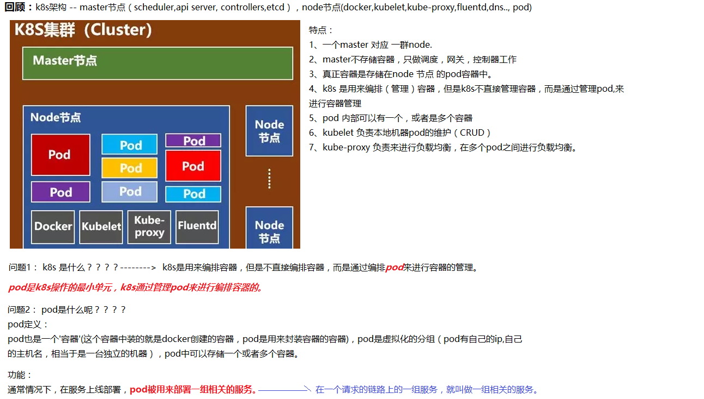

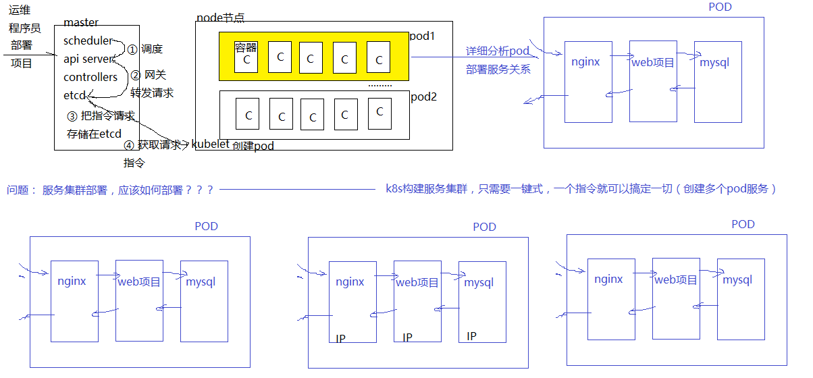

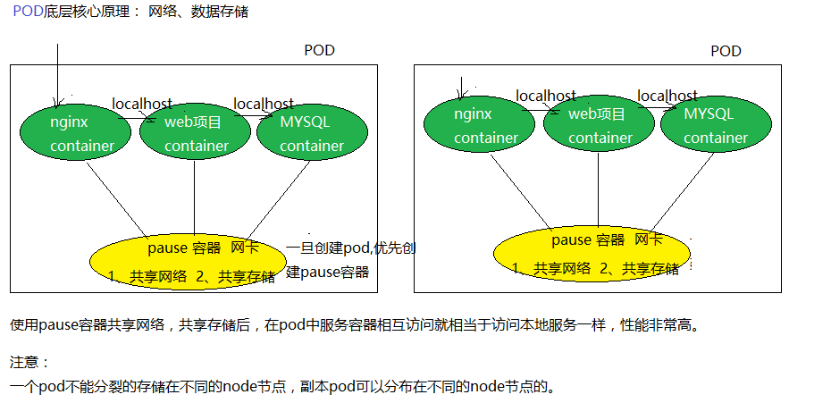

## 02_副本控制器

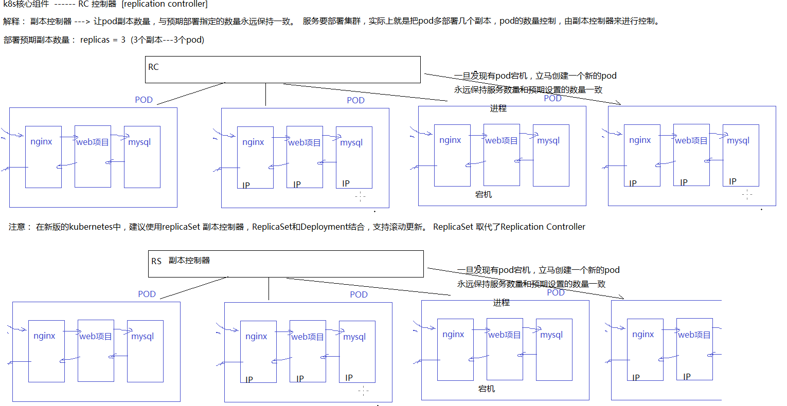

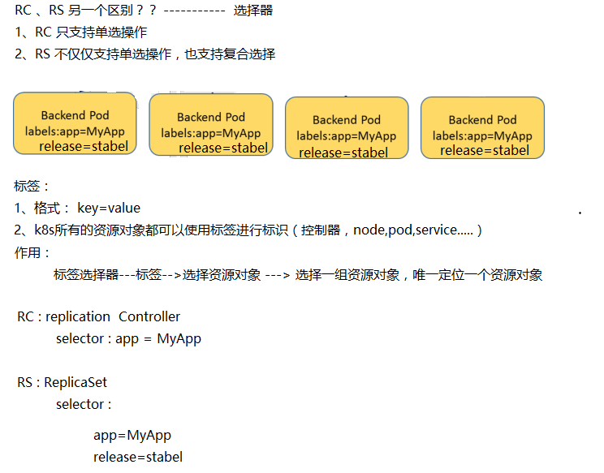

## 03_deployment资源对象

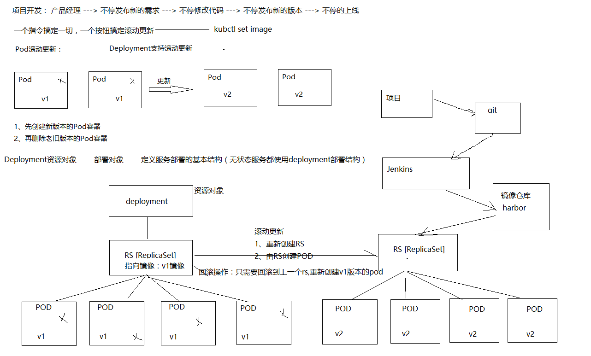

## 04_HPA自动扩容

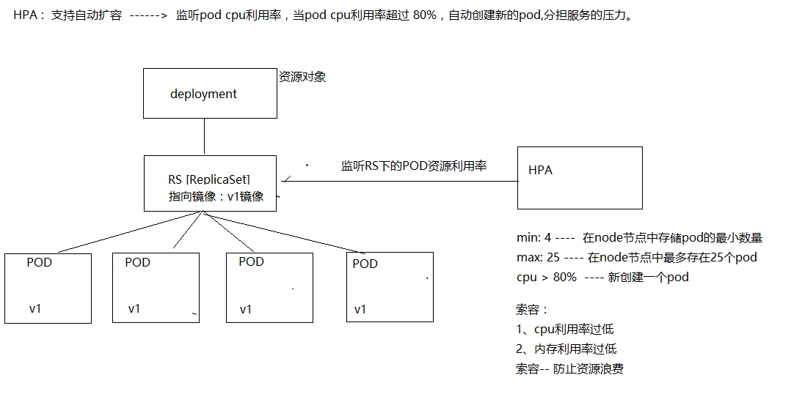

## 05_StatefulSet资源对象

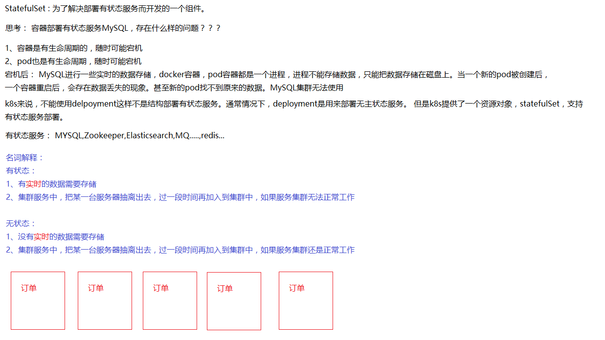

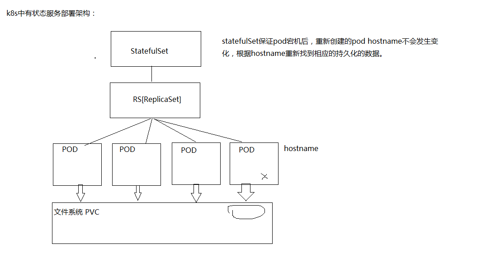

## 06_DaemonSet资源对象

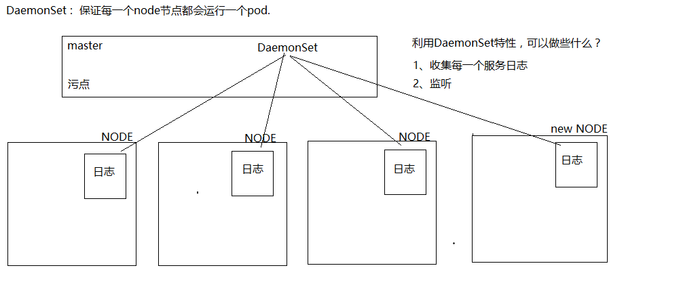

## 07_pod如何实现访问

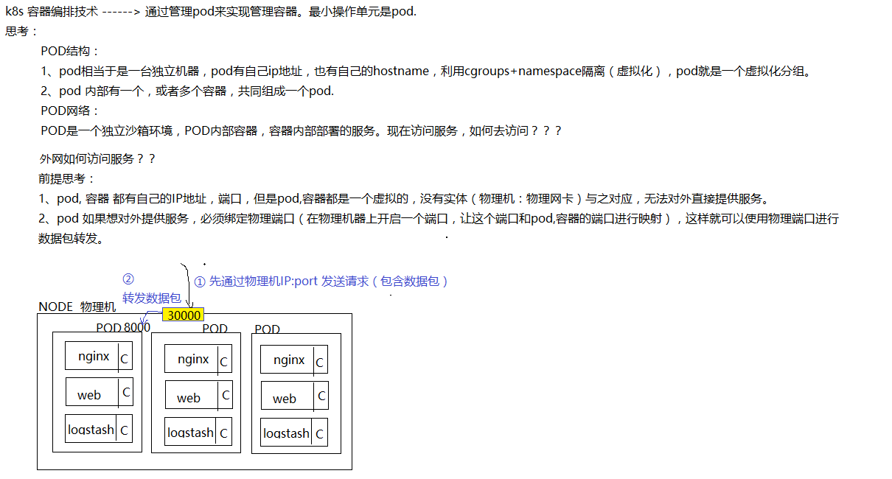

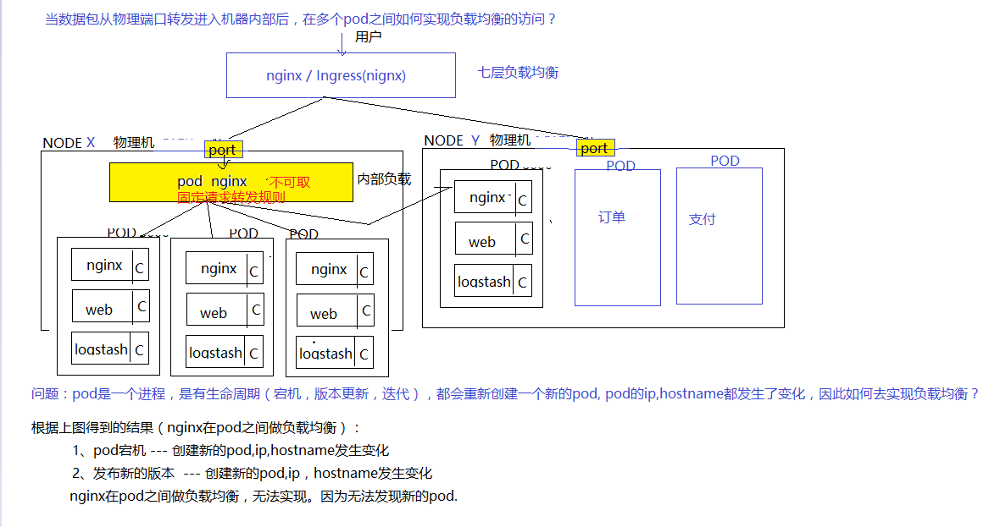

## 08_service 服务注册发现

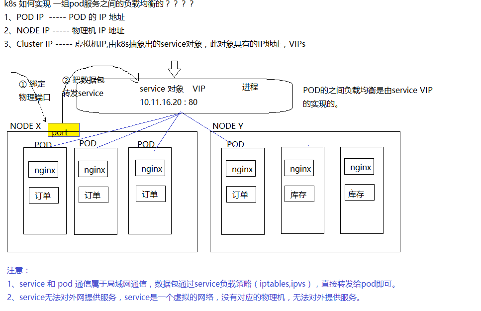

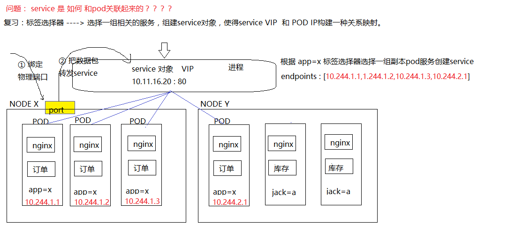

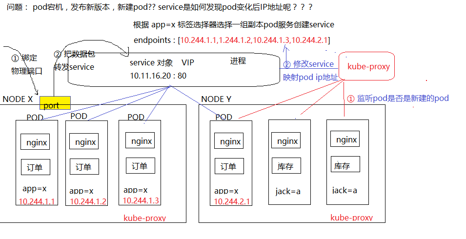

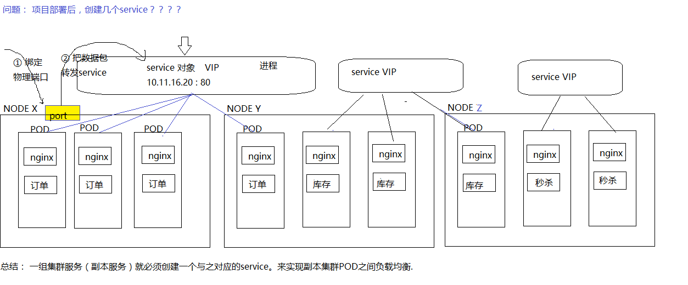

## 09_service是如何产生的

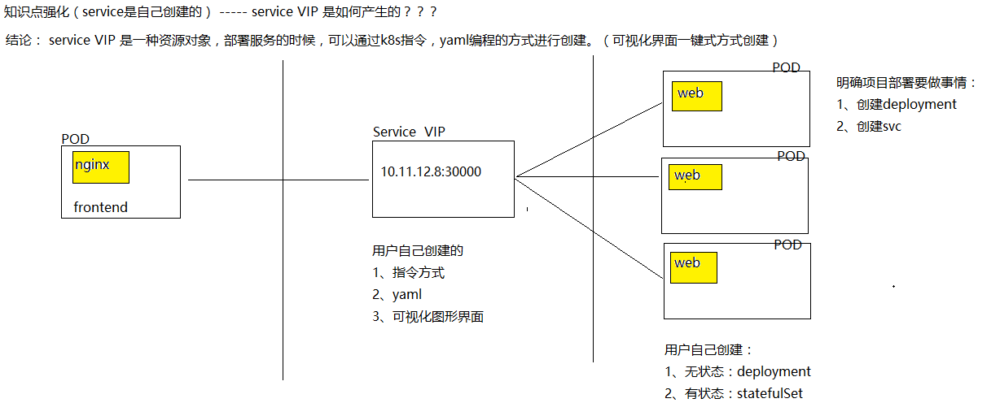

## 10_service的负载策略问题

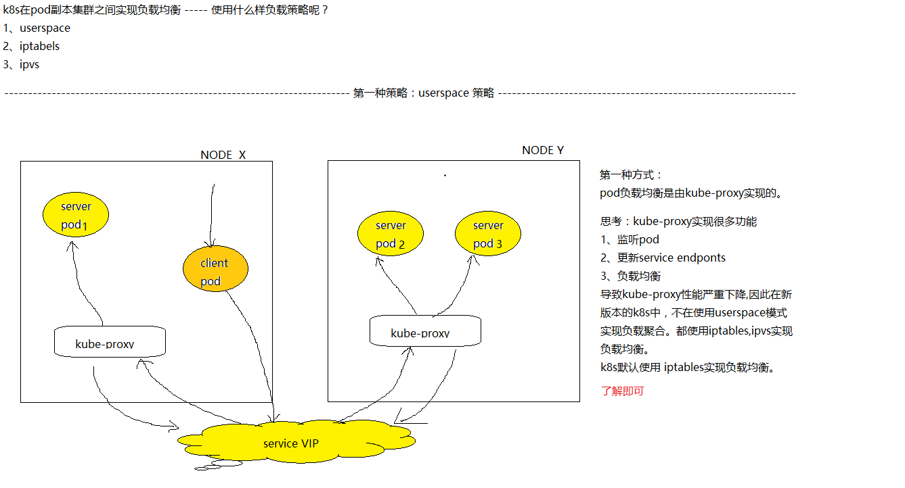

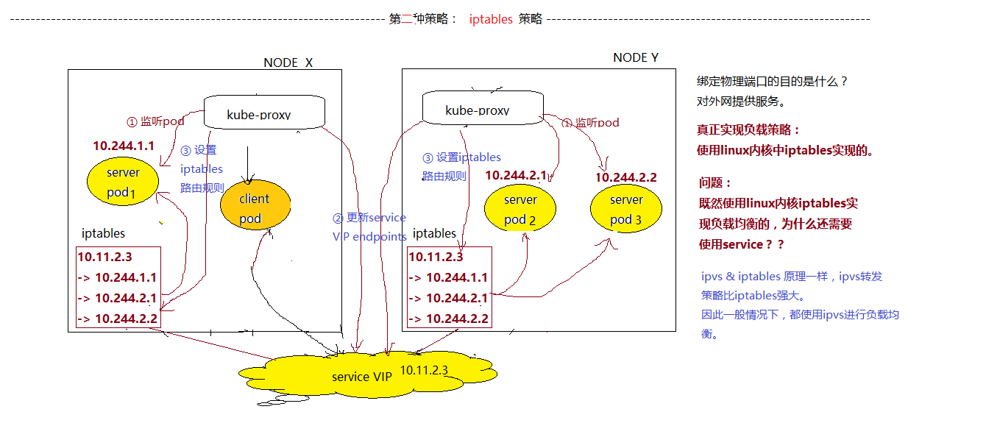

# Harbor - 企业级Docker私有仓库

# 一 、 安 装 底 层 需 求

**Python**应 该 是 **2\****.7**或 更 高 版 本

**Docker**引 擎 应 为 **1\****.10**或 更 高 版 本

**Docker** **Compose**需 要 为 **1\****.6.0**或 更 高 版 本

[**docker-compose**](https://github.com/vmware/harbor/releases)： **curl** **-L** [**https://github.com/docker/compose/releases/download/1.9.0/docker-compose-`uname**]([https://github.com/docker/compose/releases/download/1.9.0/docker-compose-%60uname](https://github.com/docker/compose/releases/download/1.9.0/docker-compose-`uname)) **-s`-`uname** **-m`** **> /usr/local/bin/docker-compose**

# 二 、 Harbor 安 装 ： Harbor 官 方 地 址 ： https://github.com/vmware/harbor/releases

## 1、 解 压 软 件 包 ： tar xvf harbor-offline-installer-.tgz

[**https://github.com/vmware/harbor/releases/download/v1.2.0/harbor-offline-installer-v1.2.0.tgz**](https://github.com/vmware/harbor/releases/download/v1.2.0/harbor-offline-installer-v1.2.0.tgz)

## 2、 配 置 harbor.cfg

**a**、 必 选 参 数

**hostname**： 目 标 的 主 机 名 或 者 完 全 限 定 域 名

**ui_url_protocol**： **http**或 **https**。 默 认 为 **http**

**db_password**： 用 于 **db_auth**的 **MySQL**数 据 库 的 根 密 码 。 更 改 此 密 码 进 行 任 何 生 产 用 途 **max_job_workers**： （ 默 认 值 为 **3**） 作 业 服 务 中 的 复 制 工 作 人 员 的 最 大 数 量 。 对 于 每 个 映 像 复 制 作 业 ，

工 作 人 员 将 存 储 库 的 所 有 标 签 同 步 到 远 程 目 标 。 增 加 此 数 字 允 许 系 统 中 更 多 的 并 发 复 制 作 业 。 但 是 ， 由 于 每 个 工 作 人 员 都 会 消 耗 一 定 数 量 的 网 络 **/** **CPU** **/** **IO**资 源 ， 请 根 据 主 机 的 硬 件 资 源 ， 仔 细 选 择 该 属 性 的 值

**customize_crt**： （ **on**或 **off**。 默 认 为 **on**） 当 此 属 性 打 开 时 ， **prepare**脚 本 将 为 注 册 表 的 令 牌 的 生 成 **/**验 证 创

建 私 钥 和 根 证 书

**ssl_cert**： **SSL**证 书 的 路 径 ， 仅 当 协 议 设 置 为 **https**时 才 应 用

**ssl_cert_key**： **SSL**密 钥 的 路 径 ， 仅 当 协 议 设 置 为 **https**时 才 应 用

**secretkey_path** ： 用 于 在 复 制 策 略 中 加 密 或 解 密 远 程 注 册 表 的 密 码 的 密 钥 路 径

## 3、 创 建 https 证 书 以 及 配 置 相 关 目 录 权 限

**openssl** **genrsa** **-des3** **-out** **server.key** **2048**

**openssl** **req** **-new** **-key** **server.key** **-out** **server.csr**

**cp** **server.key** **server.key.org**

**openssl** **rsa** **-in** **server.key.org** **-out** **server.key**

**openssl** **x509** **-req** **-days** **365** **-in** **server.csr** **-signkey** **server.key** **-out** **server.crt**

**mkdir** **/data/cert**

**chmod** **-R** **777** **/data/cert**

## 4、 运 行 脚 本 进 行 安 装

**./install.sh**

## 5、 访 问 测 试

[**https://reg.yourdomain.com**](https://reg.yourdomain.com/) 的 管 理 员 门 户 （ 将 **r\****eg.yourdomain.com**更 改 为 您 的 主 机 名 \**h\****arbor.cfg**） 。 请 注 意 ， 默 认 管 理 员 用 户 名 \**/**密 码 为 **admin** **/** **Harbor12345**

## 6、 上 传 镜 像 进 行 上 传 测 试

**a**、 指 定 镜 像 仓 库 地 址

**vim** **/etc/docker/daemon.json**

**{**

**"insecure-registries":** **["serverip"]**

**}**

**b**、 下 载 测 试 镜 像

**docker** **pull** **hello-world**

**c**、 给 镜 像 重 新 打 标 签

**docker** **tag** **hello-world** **serverip/hello-world:latest**

**d**、 登 录 进 行 上 传

**docker** **login** **serverip**

## 7、 其 它 Docker 客 户 端 下 载 测 试

**a**、 指 定 镜 像 仓 库 地 址

**vim** **/etc/docker/daemon.json**

**{**

**"insecure-registries":** **["serverip"]**

**}**

**b**、 下 载 测 试 镜 像

**docker** **pull** **serverip/hello-world:latest**

# 三 、 Harbor 原 理 说 明

## 1、 软 件 资 源 介 绍

**Harbor**是 **V\****Mware**公 司 开 源 的 企 业 级 \**D\****ockerRegistry** 项 目 ， 项 目 地 址 为 **h\****ttps://github.com/vmware/harbor** 。 其 目 标 是 帮 助 用 户 迅 速 搭 建 一 个 企 业 级 的 **D\****ockerregistry**服 务 。 它 以 \**D\****ocker**公 司 开 源 的 \**r\****egistry**为 基 础 ， 提 供 了 管 理 \**U\****I**， 基 于 角 色 的 访 问 控 制 \**(\****Role** **Based** **Access** **Control)**， **AD/LDAP**集 成 、 以 及 审 计 日 志 **(\****Auditlogging)** 等 企 业 用 户 需 求 的 功 能 ， 同 时 还 原 生 支 持 中 文 。 **Harbor**的 每 个 组 件 都 是 以 **Docker**容 器 的 形 式 构 建 的 ， 使 用 **Docker** **Compose**来 对 它 进 行 部 署 。 用 于 部 署 **Harbor**的 **Docker** **Compose**模 板 位 于 **/Deployer/docker-compose.yml**， 由 **5**个 容 器 组 成 ， 这 几 个 容 器 通 过 **Docker** **link**的 形 式 连 接 在 一 起 ， 在 容 器 之 间 通 过 容 器 名 字 互 相 访 问 。 对 终 端 用 户 而 言 ， 只 需 要 暴 露 **proxy** （ 即 **Nginx**） 的 服 务 端 口

**Proxy**： 由 **Nginx** 服 务 器 构 成 的 反 向 代 理 。

**Registry**： 由 **Docker**官 方 的 开 源 **registry** 镜 像 构 成 的 容 器 实 例 。

**UI**： 即 架 构 中 的 **core** **services**， 构 成 此 容 器 的 代 码 是 **Harbor** 项 目 的 主 体 。

**MySQL**： 由 官 方 **MySQL** 镜 像 构 成 的 数 据 库 容 器 。

**Log**： 运 行 着 **rsyslogd** 的 容 器 ， 通 过 **log-driver** 的 形 式 收 集 其 他 容 器 的 日 志

## 2、 Harbor 特 性

- 基 于 角 色 控 制 ： 用 户 和 仓 库 都 是 基 于 项 目 进 行 组 织 的 ， 而 用 户 基 于 项 目 可 以 拥 有 不 同 的 权 限
- 基 于 镜 像 的 复 制 策 略 ： 镜 像 可 以 在 多 个 **Harbor**实 例 之 间 进 行 复 制
- 支 持 **LDAP**： **Harbor**的 用 户 授 权 可 以 使 用 已 经 存 在 **LDAP**用 户
- 镜 像 删 除 **&** 垃 圾 回 收 ： **Image**可 以 被 删 除 并 且 回 收 **Image**占 用 的 空 间 ， 绝 大 部 分 的 用 户 操 作 **API**， 方 便 用 户 对 系 统 进 行 扩 展

- 用 户 **U\****I**： 用 户 可 以 轻 松 的 浏 览 、 搜 索 镜 像 仓 库 以 及 对 项 目 进 行 管 理
- 轻 松 的 部 署 功 能 ： **Harbor**提 供 了 **o\****nline**、 \**offline**安 装 ， 除 此 之 外 还 提 供 了 **v\****irtualappliance**安 装
- **Harbor** 和 **docker** **registry** 关 系 ： **Harbor**实 质 上 是 对 **docker** **registry** 做 了 封 装 ， 扩 展 了 自 己 的 业 务 模 块

## 3、 Harbor 认 证 过 程

- **dockerdaemon**从 **d\****ocker** **registry**拉 取 镜 像 。
- 如 果 **d\****ockerregistry**需 要 进 行 授 权 时 ， \**registry**将 会 返 回 **4\****01** **Unauthorized**响 应 ， 同 时 在 响 应 中 包 含 了 **d\****ocker**

**client**如 何 进 行 认 证 的 信 息 。

- **dockerclient**根 据 **r\****egistry**返 回 的 信 息 ， 向 \**a\****uth** **server**发 送 请 求 获 取 认 证 **t\****oken**。
- **auth** **server**则 根 据 自 己 的 业 务 实 现 去 验 证 提 交 的 用 户 信 息 是 否 存 符 合 业 务 要 求 。
- 用 户 数 据 仓 库 返 回 用 户 的 相 关 信 息 。
- **auth** **server**将 会 根 据 查 询 的 用 户 信 息 ， 生 成 **t\****oken**令 牌 ， 以 及 当 前 用 户 所 具 有 的 相 关 权 限 信 息 \**.**上 述 就 是 完 整 的 授 权 过 程 **.**当 用 户 完 成 上 述 过 程 以 后 便 可 以 执 行 相 关 的 **p\****ull/push**操 作 。 认 证 信 息 会 每 次 都 带 在 请 求 头 中

**Harbor**整 体 架 构

## 4、 Harbor 认 证 流 程

- 首 先 ， 请 求 被 代 理 容 器 监 听 拦 截 ， 并 跳 转 到 指 定 的 认 证 服 务 器 。
- 如 果 认 证 服 务 器 配 置 了 权 限 认 证 ， 则 会 返 回 **4\****01**。 通 知 \**d\****ockerclient**在 特 定 的 请 求 中 需 要 带 上 一 个 合 法 的 \**token**。 而 认 证 的 逻 辑 地 址 则 指 向 架 构 图 中 的 **c\****ore** **services**。
  - 当 **d\****ocker** **client**接 受 到 错 误 **c\****ode**。 \**client**就 会 发 送 认 证 请 求 **(**带 有 用 户 名 和 密 码 **)**到 **c\****oreservices**进 行 \**b\****asic**

**auth**认 证 。

- 当 **C**的 请 求 发 送 给 **n\****gnix**以 后 ， \**ngnix**会 根 据 配 置 的 认 证 地 址 将 带 有 用 户 名 和 密 码 的 请 求 发 送 到 **c\****ore** **serivces**。
- **coreservices**获 取 用 户 名 和 密 码 以 后 对 用 户 信 息 进 行 认 证 **(**自 己 的 数 据 库 或 者 介 入 **L\****DAP**都 可 以 \**)**。 成 功 以 后 ， 返 回 认 证 成 功 的 信 息

# 

# Kubernetes(K8s)-k8s服务安装

# 一、环境准备

## 1、机器环境

节点CPU核数必须是 ：>= 2核 ，否则k8s无法启动

DNS网络： 最好设置为 本地网络连通的DNS,否则网络不通，无法下载一些镜像

linux内核： linux内核必须是 4 版本以上，因此必须把linux核心进行升级

准备3台虚拟机环境，或者是3台阿里云服务器都可。

k8s-master01: 此机器用来安装k8s-master的操作环境k8s-node01: 此机器用来安装k8s node节点的环境k8s-node02: 此机器用来安装k8s node节点的环境

## 2、依赖环境

\# 关闭防火墙

systemctl stop firewalld && systemctl disable firewalld # 置空iptables

yum -y install iptables-services && systemctl start iptables && systemctl enable iptables && iptables -F && service iptables save

\#4、关闭selinux

\#闭swap分区【虚拟内存】并且永久关闭虚拟内存

swapoff -a && sed -i '/ swap / s/^\(.*\)$/#\1/g' /etc/fstab #关闭selinux

setenforce 0 && sed -i 's/^SELINUX=.*/SELINUX=disabled/' /etc/selinux/config

\#5、升级Linux内核为4.44版本

rpm -Uvh http://www.elrepo.org/elrepo-release-7.0-4.el7.elrepo.noarch.rpm #安装内核

yum --enablerepo=elrepo-kernel install -y kernel-lt #设置开机从新内核启动

grub2-set-default 'CentOS Linux (4.4.189-1.el7.elrepo.x86_64) 7 (Core)' #注意：设置完内核后，需要重启服务器才会生效。

\#查询内核

uname -r

\#########################################################################

\#6、调整内核参数，对于k8s

cat > kubernetes.conf <<EOF net.bridge.bridge-nf-call-iptables=1 net.bridge.bridge-nf-call-ip6tables=1 net.ipv4.ip_forward=1 net.ipv4.tcp_tw_recycle=0 vm.swappiness=0 vm.overcommit_memory=1 vm.panic_on_oom=0 fs.inotify.max_user_instances=8192 fs.inotify.max_user_watches=1048576 fs.file-max=52706963 fs.nr_open=52706963 net.ipv6.conf.all.disable_ipv6=1

net.netfilter.nf_conntrack_max=2310720 EOF

\#将优化内核文件拷贝到/etc/sysctl.d/文件夹下，这样优化文件开机的时候能够被调用 cp kubernetes.conf /etc/sysctl.d/kubernetes.conf

\#手动刷新，让优化文件立即生效

sysctl -p /etc/sysctl.d/kubernetes.conf

\#7、调整系统临时区 --- 如果已经设置时区，可略过

\#设置系统时区为中国/上海

timedatectl set-timezone Asia/Shanghai #将当前的 UTC 时间写入硬件时钟

timedatectl set-local-rtc 0 #重启依赖于系统时间的服务systemctl restart rsyslog

systemctl restart crond

\#7、关闭系统不需要的服务

systemctl stop postfix && systemctl disable postfix

\#8、设置日志保存方式 #1）.创建保存日志的目录mkdir /var/log/journal #2）.创建配置文件存放目录

mkdir /etc/systemd/journald.conf.d #3）.创建配置文件

cat > /etc/systemd/journald.conf.d/99-prophet.conf <<EOF [Journal]

Storage=persistent Compress=yes SyncIntervalSec=5m RateLimitInterval=30s RateLimitBurst=1000 SystemMaxUse=10G SystemMaxFileSize=200M MaxRetentionSec=2week ForwardToSyslog=no

EOF

\#4）.重启systemd journald的配置systemctl restart systemd-journald

\#9、打开文件数调整 (可忽略，不执行)

echo "* soft nofile 65536" >> /etc/security/limits.conf echo "* hard nofile 65536" >> /etc/security/limits.conf

\#10、kube-proxy 开启 ipvs 前置条件

modprobe br_netfilter

cat > /etc/sysconfig/modules/ipvs.modules <<EOF #!/bin/bash

modprobe -- ip_vs modprobe -- ip_vs_rr modprobe -- ip_vs_wrr modprobe -- ip_vs_sh

modprobe -- nf_conntrack_ipv4 EOF

\##使用lsmod命令查看这些文件是否被引导

chmod 755 /etc/sysconfig/modules/ipvs.modules && bash

/etc/sysconfig/modules/ipvs.modules && lsmod | grep -e ip_vs -e nf_conntrack_ipv4

## 3、docker部署

## 4、kubeadm[一键安装k8s]

# 二、集群安装

## 1、依赖镜像

上传镜像压缩包，把压缩包中的镜像导入到本地镜像仓库

编写脚本问题，导入镜像包到本地docker镜像仓库：

导入成功后镜像仓库如下图所示：

## 2、k8s部署

kubernetes主节点初始化成功后，如下所示：

按照k8s指示，执行下面的命令：

执行命令前查询node:

执行命令后查询node:

我们发现已经可以成功查询node节点信息了，但是节点的状态却是NotReady,不是Runing的状态。原 因是此时我们使用ipvs+flannel的方式进行网络通信，但是flannel网络插件还没有部署，因此节点状态 此时为NotReady

## 3、flannel插件

部署完毕查询pod,发现一些异常错误现象：

发现通过flannel部署的pod都出现pending,ImagePullBackOff这样的问题： 查询日志信息，发现了一些错误：

部署flannel网络插件时候，注意网络连通的问题：

## 4、节点Join

构建kubernetes主节点成功，会产生一个日志文件（命令中指定日志输出文件 “tee kubeadm- init.log”），内容如下所示：

红色 部分给出的命令即是把其他节点加入进来的命令。

执行完毕，查看效果如下所示：

发现还有一些节点处于NotReady状态，是因为这些节点pod容器还处于初始化的状态，需要等一点时 间：

更详细查看命令，可以看见初始化节点所属节点：

## 5、私有仓库

**6\****、案例实战**

# 图

## 01_网络拓扑图


# YAML语法规范

参考了[YAML官网](http://yaml.org/spec/1.2/spec.html)
 `YAML`是专注于写配置文件的语言，这个名字的含义是`YAML Ain't Markup Language(YAML不是一种标记语言)`，但是实际上`YAML`还是一种标记语言，只不过是更加聚焦于数据的标记语言。

- YAML的基本语法规则

> 1. 大小写敏感
> 2. 使用缩进表示层级关系（这个和Python很像了，估计是从Python借鉴的）
>    缩进时绝对不允许使用Tab键，只允许使用空格键
>    缩进的空格数不重要，只要元素左侧能对齐就可以。
>    字符串可以不用引号标注

**YAML完全兼容Json的语法，可以把Json看做是YAML的一个子集**

我们来看一下YAML支持的数据类型

- 对象：就是键值对的集合，和Json中对象的概念一样
- 列表：又称为序列，是一组有序排列的值，和Json中列表的概念一样
- scalars(纯量)：不可拆分的数据类型，和Json中的基本数据类型一样

来看一下`YAML`具体的语法。

- 在一个`yml`文件中，使用`---`来表示一段文档（或者一组配置）的开始，使用`...`来表示一段文档的结束。如果`yml`中只有一组配置，则可以省略掉`---`.
- 使用`#`来表示注解
- 使用`-`来表示单个的列表项，比如


```undefined
- A
- B
- C
```

对应Json中的`[ 'A', 'B', 'C' ]`


```undefined
-
  - A
  - B
  - C
-
  - D
  - E
  - F
```

对应于Json的`[ [ 'A', 'B', 'C' ], [ 'D', 'E', 'F' ] ]`

尤其是要注意，由于YAML兼容Json的语法，所以我们直接在yml文件中写`[ [ A, B, C ], [ D, E, F ] ]`也是可以的。

- 使用`:`来表示键值对


```undefined
name: chico
age: 18
```

对应Json的`{ name: 'chico', age: 18 }`


```undefined
-
  name: chico
  age: 18
-
  name: dong
  age: 19
```

对应Json中的`[ { name: 'chico', age: 18 }, { name: 'dong', age: 19 } ]`

看一个将列表和对象结合起来的


```php
american:
  - Boston Red Sox
  - Detroit Tigers
  - New York Yankees
national:
  - New York Mets
  - Chicago Cubs
  - Atlanta Braves
```

对应Json `{ american: [ 'Boston Red Sox', 'Detroit Tigers', 'New York Yankees' ], national: [ 'New York Mets', 'Chicago Cubs', 'Atlanta Braves-' ] }`

与Json不同的是，YAML中键值对的键不要求一定是字符串，可以是一些复杂的类型，但是Json中要求键值对的键必须是字符串。

当YAML中键值对的键是复杂类型的时候，必须要用`?`说明，比如


```ruby
?[a,b,c]:color
#或者
?-a
-b
-c
:color
```

- YAML中`null`用`~`表示
  比如`money:~`
- YAML中段落用`|`和缩进表示，YAML会保留该段落中的回车换行符
  比如


```bash
description: |
#注意：和 |之间的空格
  这是一篇非常非常长的介绍YAML的文章
  文章是非常有内容的
```

- YAML中用`>`和缩进表示把段落连城一句话，YAML会把该段落中的回车换行替换成空格，最终连成一句话


```undefined
description: >
  这是一篇介绍YAML的文章，非常长
  但是把他们连成一句话了
```

- YAML中`+`表示保留段落末尾的换行，`-`表示删除文本末尾的换行


```ruby
a: |+
  保留了换行符

b: |-
  删除了换行符
```

- YAML中也会把`"`双引号和`'`单引号中的字符串连成一行,引号中可以包含转义字符


```bash
description:
  "虽然表面上看这是两行，
  但其实是一行"
#和下面这个是一样的
description:
  虽然表面上看这是两行，
  但其实是一行
```

- YAML中使用`!`和`!!`来做强制类型转换
  比如


```rust
#强行把123转换成str
e:!!str 123
#强行把boolean型转换为str
b:!!str true
```

- YAML中可以通过`&`来锚点，通过`*`来引用


```undefined
s1:
  name: chico
  favourite: &SS reading
s2:
  name: dong
  favourite: *SS
```

-  `<<`表示追加
   比如


```cpp
default: &&default
  host: http
  path:index
server1:
  name:server1
  <<:*default
server2:
  name:server2
  <<:*default
```

等价于


```css
default: &&default
  host: http
  path:index
server1:
  name:server1
  host: http
  path:index
server2:
  name:server2
  host: http
  path:index
```

- YAML还支持set和ordered map
  在YAML中set就是一组值全部为null的键值对，比如


```bash
--- !!set #强行转换为set
? hahaha
? chico dong
? haha lala
```

对应的json是`{ hahaha: null, 'chico dong': null, 'haha lala': null }`

在YAML中ordered map就是一组有序的键值对（可以认为是放在list中的键值对），
 比如


```bash
--- !!omap #强行转换为有序键值对
- hahaha: haha
- chico dong: dong
- lala: "haha lala"
```

对应的Json为`[ { hahaha: 'haha' }, { 'chico dong': 'dong' }, { lala: 'haha lala' } ]`
 感觉这个和正常的yaml嵌套写法没什么区别

# 一、k8s相关指令 ------ 容器编排（操作的最小单元是POD）

## 查看k8s帮助文档 ----- 查询所有的指令
	* kubectl --help
## 查询节点信息（状态）
	* kubectl get node -- 查询集群节点的信息
	* kubectl get node -o wide -- 查询节点的详细信息
	* kubectl get node == kubectl get nodes
	注意：查询节点信息，Status:Ready 表示集群节点运行ok。
## 查询pod（k8s最小的操作单元）对象指令
	* kubectl get pod -- 查询pod信息，没有指定命令空间，默认查询的命名空间是 default
	* kubectl get pod -o wide --查询pod的详细信息
	* kubectl get pod -o wide -n kube-system --查询指定命名空间下的pod,pod是通过命名空间进行隔离。
	注意：kube-system 系统命名空间，此空间内运行的是k8s系统所需的pod.(scheduler,etcd，apiserver..)
## 查询 ReplicaSet -- 副本控制器对象
	* kubectl get rs
	* kubectl get rs -o wide
## 查询 Deployment -- 查询部署对象
	* kubectl get deployment
	* kubectl get deployment -o wide
## 查询service
	* kubectl get svc
	* kubectl get svc -o wide

需求1：创建一个pod,并且在这个pod中部署一个nginx容器？？？
	* kubectl run my-nginx --image=nginx:v1 --port=80

需求2：目前只有一个pod,现在对现有pod服务进行扩容？？
	* kubectl scale deployment/my-nginx --replicas=3 -- 设置副本数量为3
	* 另一种写法：kubectl scale deployment my-nginx --replicas=3
	* 删除pod: kubectl delete pod pod名称
	* 删除所有pod: kubectl delete pod --all 

需求3：外网如何访问？？
	* kubectl expose deployment my-nginx --port=3000 --target-port=80 -- 创建一个service
	* kubectl edit svc my-nginx  -- 编辑service服务的yaml配置文件
总结：精细化编排容器
	1、 指令
	2、yaml
	3、可视化图形化界面：按钮 ---- 操作颗粒度较粗

# Kubernetes(K8s)-k8s资源清单

# 一、k8s资源指令

## 1、基础操作

```bash
#创建且运行一个pod
#deployment、rs、pod被自动创建
kubectl run my-nginx --image=nginx --port=80

#增加创建副本数量
kubectl scale deployment/my-nginx --replicas = 3

#添加service
#kubectl expose将RC、Service、Deployment或Pod作为新的Kubernetes Service公开。
 kubectl expose deployment/my-nginx --port=30000 --target-port=80
 
 #编辑service配置文件
 kubectl edit svc/my-nginx
 
#其他的基础指令
#查看集群中有几个Node
kubectl get nodes

# 查看pod
kubectl  get pods

# 查看服务详情信息
kubectl describe pod my-nginx-379829228-cwlbb

# 查看已部署
[root@jackhu ~]# kubectl  get deployments

# 删除pod
[root@jackhu ~]# kubectl delete pod my-nginx-379829228-cwlbb

# 删除部署的my-nginx服务。彻底删除pod
[root@jackhu ~]# kubectl delete deployment my-nginx
deployment "my-nginx" deleted

# 删除service服务
kubectl delete service my-nginx


```


## 2、命令手册

kubenetes命令手册，详情请查询下表：

| 类型               | 命令                                                         | 描述                               |
| ------------------ | ------------------------------------------------------------ | ---------------------------------- |
| 基础命令           | create                                                       | 通过文件名或标准输入创建资源       |
| ecpose             | 将一个资源公开为一个新的Service                              |                                    |
| run                | 在集群中运行一个特定的镜像                                   |                                    |
| set                | 在对象上设置特定的功能                                       |                                    |
| get                | 显示一个或多个资源                                           |                                    |
| explain            | 文档参考资料                                                 |                                    |
| edit               | 使用默认的编辑器编辑一个资源                                 |                                    |
| delete             | 通过文件名，标准输入，资源名称或者标签选择器来删除资源       |                                    |
| 部署命令           | rollout                                                      | 管理资源的发布                     |
| rolling-update     | 对给定的复制控制器滚动更新                                   |                                    |
| scale              | 扩容会缩容Pod数量，Deployment，ReplicaSet，RC或Job           |                                    |
| autoscale          | 创建一个自动选择扩容或缩容并设置Pod数量                      |                                    |
| 集群管理命令       | certificate                                                  | 修改证书资源                       |
| cluster-info       | 显示集群信息                                                 |                                    |
| top                | 显示资源（CPU/Memory/Storage)使用，需要Heapster运行          |                                    |
| cordon             | 标记节点不可调                                               |                                    |
| uncordon           | 标记节点可调度                                               |                                    |
| drain              | 驱逐节点上的应用，准备下线维护                               |                                    |
| taint              | 修改节点taint标记                                            |                                    |
| 故障诊断和调试命令 | describe                                                     | 显示特定资源或资源组的详细信息     |
| logs               | 在一个Pod中打印一个容器日志，如果Pod只有一个容器，容器名称是可选的 |                                    |
| attach             | 附加到一个运行的容器                                         |                                    |
| exec               | 执行命令到容器                                               |                                    |
| port-forward       | 转发一个或多个本地端口到一个pod                              |                                    |
| proxy              | 运行一个proxy到Kubernetes API server                         |                                    |
| cp                 | 拷贝文件或者目录到容器中                                     |                                    |
| auth               | 检查授权                                                     |                                    |
| 高级命令           | apply                                                        | 通过文件名或标准输入对资源应用配置 |
| patch              | 使用补丁修改，更新资源的字段                                 |                                    |
| replace            | 通过文件名或标准输入替换一个资源                             |                                    |
| convert            | 不同的API版本之间转换配置文件                                |                                    |
| 设置命令           | label                                                        | 更新资源上的标签                   |
| annotate           | 更新资源上的注释                                             |                                    |
| completion         | 用于实现kubectl工具自动补全                                  |                                    |
| 其他命令           | api-versions                                                 | 打印受支持的API 版本               |
| config             | 修改kubeconfig文件（用于访问API，比如配置认证信息）          |                                    |
| help               | 所有命令帮助                                                 |                                    |
| plugin             | 运行一个命令插件                                             |                                    |
| version            | 打印客户端和服务版本信息                                     |                                    |

# 二、资源清单

## 1、required

必须存在的属性【创建资源清单的时候没有这些属性的存在它是不允许被执行的】

| 参数名称                | 字段类型 | 说明                                                         |
| ----------------------- | -------- | ------------------------------------------------------------ |
| version                 | String   | 这里是指的是K8SAPI的版本，目前基本上是v1，可以用kubectl api-version命令查询 |
| kind                    | String   | 这里指的是yam文件定义的资源类型和角色，比如：Pod             |
| metadata                | Object   | 元数据对象，固定值就写metadata                               |
| metadata.name           | String   | 元数据对象的名字，这里由我们编写，比如命名Pod的名字          |
| metadata.namespace      | String   | 元数据对象的命名空间，由我们自身定义，如果不定义的话则默认是default名称空间 |
| Spec                    | Object   | 详细定义对象，固定值就写Spec                                 |
| spec.containers[]       | List     | 这里是Spec对象的容器列表定义，是个列表                       |
| spec.containers[].name  | String   | 这里定义容器的名字                                           |
| spec.containers[].image | String   | 这里定义要用到的镜像名称                                     |

## 2、optional

主要属性【这些属性比较重要，如果不指定的话系统会自动补充默认值】

| 参数名称                                    | 字段类型 | 说明                                                         |
| ------------------------------------------- | -------- | ------------------------------------------------------------ |
| spec.containers[].name                      | String   | 这里定义容器的名字                                           |
| spec.containers[].image                     | String   | 这里定义要用到的镜像名称                                     |
| spec.containers[].imagePullPolicy           | String   | 定义镜像拉取策略，有Always、Never、IfNotPresent三个值可选（1）Always:意思是每次都尝试重新拉取镜像（2）Never:表示仅使用本地镜像（3）lfNotPresent:如果本地有镜像就使用本地镜像，没有就拉取在线镜像。上面三个值都没设置的话，默认是Always。 |
| spec.containers[].command[]                 | List     | 指定容器启动命令，因为是数组可以指定多个，不指定则使用镜像打包时使用的启动命令。 |
| spec.containers[].args[]                    | List     | 指定容器启动命令参数，因为是数组可以指定多个。               |
| spec.containers[].workingDir                | String   | 指定容器的工作目录，进入容器时默认所在的目录                 |
| spec.containers[].volumeMounts[]            | List     | 指定容器内部的存储卷配置                                     |
| spec.containers[].volumeMounts[].name       | String   | 指定可以被容器挂载的存储卷的名称                             |
| spec.containers[].volumeMounts[].mountPath  | String   | 指定可以被容器挂载的存储卷的路径                             |
| spec.containers[].volumeMounts[].readOnly   | String   | 设置存储卷路经的读写模式，true或者false，默认为读写模式      |
| spec.containers[].ports[]                   | List     | 指定容器需要用到的端口列表                                   |
| spec.containers[].ports[].name              | String   | 指定端口名称                                                 |
| spec.containers[].ports[].containerPort     | String   | 指定容器需要监听的端口号                                     |
| spec.containers[].ports[].hostPort          | String   | 指定容器所在主机需要监听的端口号，默认跟上面containerPort相同，注意设置了hostPort同一台主机无法启动该容器的相同副本（因为主机的端口号不能相同，这样会冲突) |
| spec.containers[].ports[].protocol          | String   | 指定端口协议，支持TCP和UDP，默认值为 TCP                     |
| spec.containers[].env[]                     | List     | 指定容器运行前需设置的环境变量列表                           |
| spec.containers[].env[].name                | String   | 指定环境变量名称                                             |
| spec.containers[].env[].value               | String   | 指定环境变量值                                               |
| spec.containers[].resources                 | Object   | 指定资源限制和资源请求的值（这里开始就是设置容器的资源上限） |
| spec.containers[].resources.limits          | Object   | 指定设置容器运行时资源的运行上限                             |
| spec.containers[].resources.limits.cpu      | String   | 指定CPU的限制，单位为core数，将用于docker run --cpu-shares参数这里前面文章 Pod资源限制有讲过） |
| spec.containers[].resources.limits.memory   | String   | 指定MEM内存的限制，单位为MlB、GiB                            |
| spec.containers[].resources.requests        | Object   | 指定容器启动和调度时的限制设置                               |
| spec.containers[].resources.requests.cpu    | String   | CPU请求，单位为core数，容器启动时初始化可用数量              |
| spec.containers[].resources.requests.memory | String   | 内存请求，单位为MIB、GiB，容器启动的初始化可用数量           |

## 3、other

额外的的一些属性。

| 参数名称              | 字段类型 | 说明                                                         |
| --------------------- | -------- | ------------------------------------------------------------ |
| spec.restartPolicy    | String   | 定义Pod的重启策略，可选值为Always、OnFailure，默认值为Always。1.Always:Pod一旦终止运行，则无论容器是如何终止的，kubelet服务都将重启它。2.OnFailure:只有Pod以非零退出码终止时，kubelet才会重启该容器。如果容器正常结束（退出码为0），则kubelet将不会重启它。3.Never:Pod终止后，kubelet将退出码报告给Master，不会重启该Pod。 |
| spec.nodeSelector     | Object   | 定义Node的Label过滤标签，以key:value格式指定，选择node节点   |
| 去运行                |          |                                                              |
| spec.imagePullSecrets | Object   | 定义pull镜像时使用secret名称，以name:secretkey格式指定       |
| spec.hostNetwork      | Boolean  | 定义是否使用主机网络模式，默认值为false。设置true表示使用宿主机网络，不使用docker0网桥，同时设置了true将无法在同一台宿主机上启动第二个副本。 |

查看资源有那些资源清单属性，使用以下命令

```bash
# 查询所有的资源清单资源
kubectl explain pod
# 查看属性说明
kubectl explain pod.apiVersion
```


## 4、资源清单格式

```yaml
#如果没有给定group名称，那么默认为core，可以使用kubectlapi-versions命令获取当前k8s版本上所有的apiversion版本信息（每个版本可能不同)
apiVersion: group/apiversion
#资源类别
kind:
#资源元数据
metadata: 
  name: 
  namespace: 
  lables: 
  annotations: #主要目的是方便用户阅读查找
spec: #期望的状态（disired state)
status: #当前状态，本字段由Kubernetes自身维护，用户不能去定义
```


## 5、常用命令

```bash
#获取apiVersion版本信息
kubectl api-versions
#获取资源的apiVersion的版本信息(以pod为例)，该命令同时输出属性设置帮助文档
kubectl explain pod

# 字段配置格式说明
apiVersion <string> #表示字符串类型 
metadata <Object> #表示需要嵌套多层字段
1abels <map[string]string> #表示由k：v组成的映射 
finalizers <[]string> #表示字串列表 
ownerReferences <[]Object>#表示对象列表 
hostPID <boolean> #布尔类型 
priority <integer> #整型 
name <string> -required- #如果类型后面接-required-，表示为必填字段

#通过yaml文件创建pod
kubectl create -f xxx.yaml

#使用 -o 参数 加 yaml，可以将资源的配置以yaml的格式输出出来，也可以使用json，输出为json格式
kubectl get pod {podName} -o yaml
```


# 三、部署实例

## 1、nginx

1）创建deployment

```yaml
#tomcat服务部署
apiVersion: v1
kind: ReplicationController
metadata:
  name: myweb
spec:
  replicas: 2
  selector:
    app: myweb
  template:
    metadata:
      labels:
        app: myweb
    spec:
      containers:
        - name: myweb
          image: docker.io/kubeguide/tomcat-app:v1
          ports:
          - containerPort: 8080
          env:
          - name: MYSQL_SERVICE_HOST
            value: 'mysql'
          - name: MYSQL_SERVICE_PORT
            value: '3306'


#创建deployment
apiVersion: apps/v1
kind: Deployment
metadata:
  name: myapp-deploy
  namespace: default
spec:
  replicas: 3
  selector:
    matchLabels:
      app: myapp
      release: stabel
  template:
    metadata:
      labels:
        app: myapp
        release: stabel
        env: test
    spec:
      containers:
      - name: myapp
        image: nginx:v1
        imagePullPolicy: IfNotPresent
        ports:
        - name: http
          containerPort: 80
         
        
#创建service服务
apiVersion: v1
kind: Service
metadata:
  name: myweb
  namespace: default
spec:
  type: ClusterIP
  selector:
    app: myapp
    release: stabel
  ports:
  - name: http
    port: 80
    targetPort: 80

#创建pod
kubectl create[apply] -f xx.yaml 
#创建成功后，发现报错：因为在这个pod中创建了2个容器，但是此2个容器出现了端口冲突
#查看原因：
kubectl describe pod my-app
# 查询某个容器的日志
kubectl log my-app -c test
```

2）创建tomcat-svc.yaml

```yaml
apiVersion: v1
kind: Service
metadata:
  name: myweb
spec:
  type: NodePort
  ports:
    - port: 8080
      targetPort: 8080
      nodePort: 30088
  selector:
    app: myweb
```


## 3、eureka部署

1) deployment

```yaml
apiVersion: apps/v1
kind: Deployment
metadata:
  name: myweb-deployment
  namespace: default
spec:
  replicas: 3
  selector:
    matchLabels:
      app: myweb
      release: stabel
  template:
    metadata:
      labels:
        app: myweb
        release: stabel
        env: test
    spec:
      containers:
      - name: myweb
        image: myweb:v1
        imagePullPolicy: IfNotPresent
        ports:
        - name: http
          containerPort: 10086
```


2）svc.yaml

```yaml
apiVersion: v1
kind: Service
metadata:
  name: web
  namespace: default
spec:
  type: NodePort
  selector:
    app: myweb
    release: stabel
  ports:
  - name: http
    port: 80
    targetPort: 10086
```

# 图片

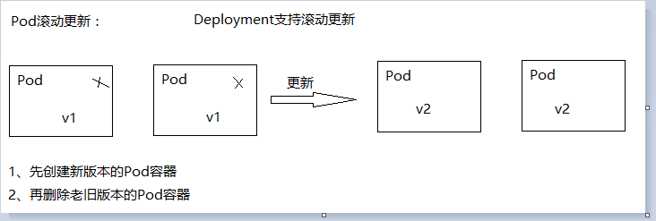

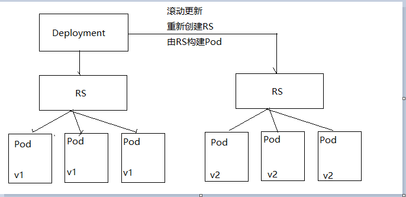

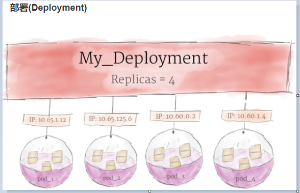

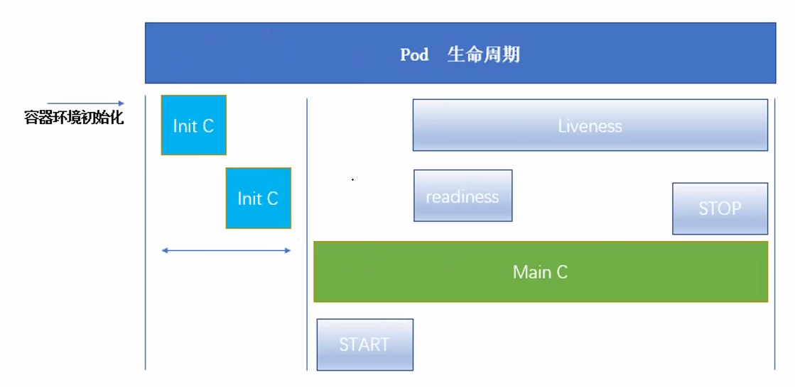

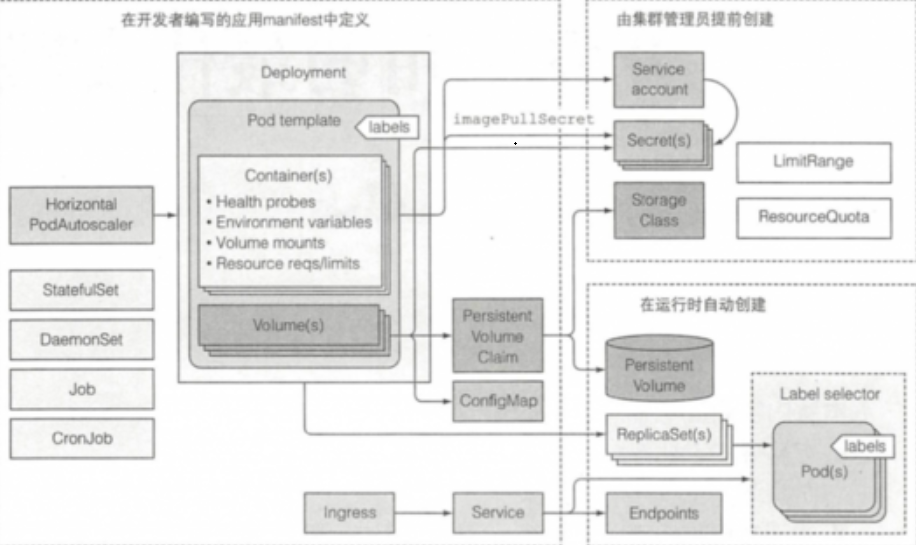

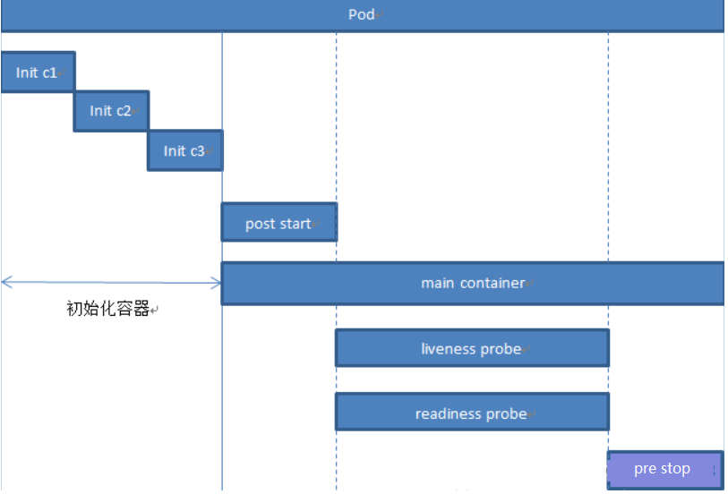

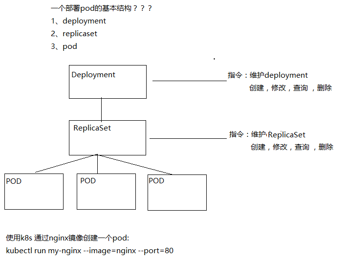

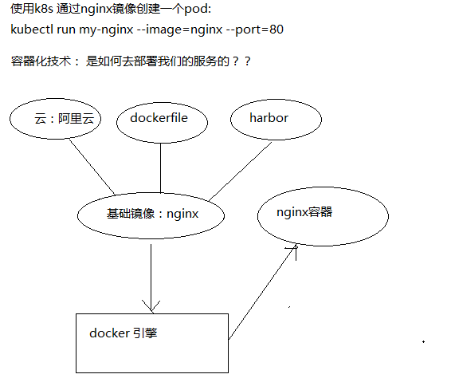

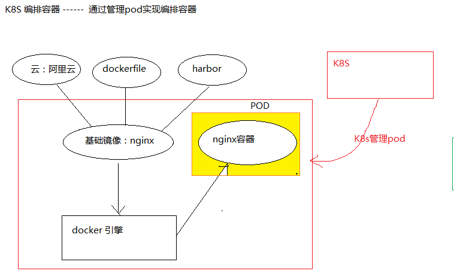

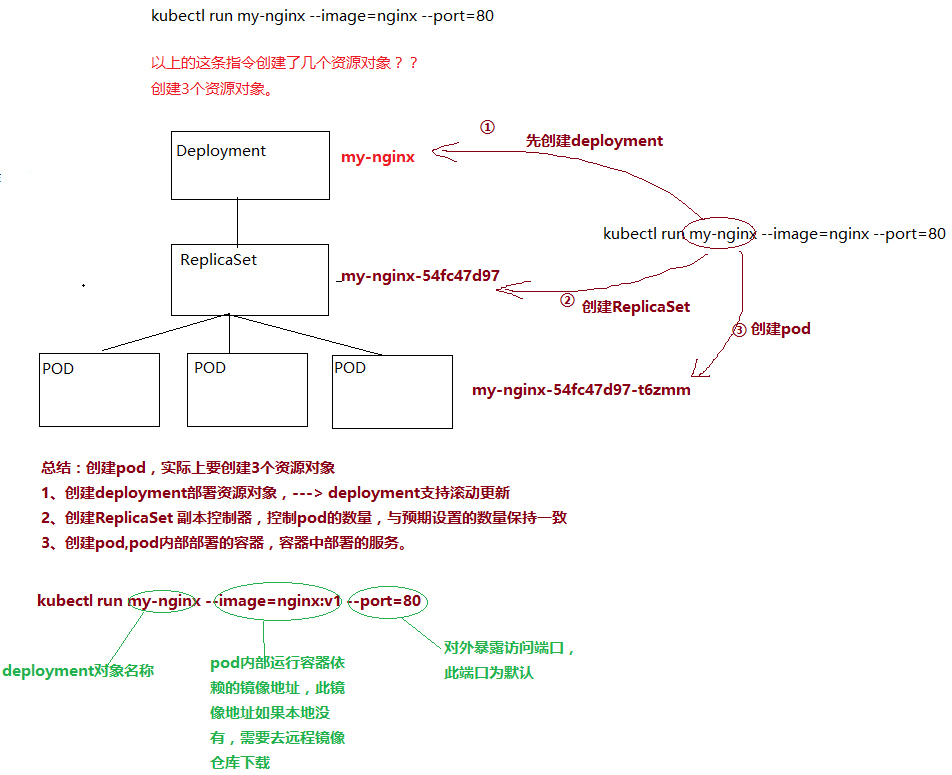

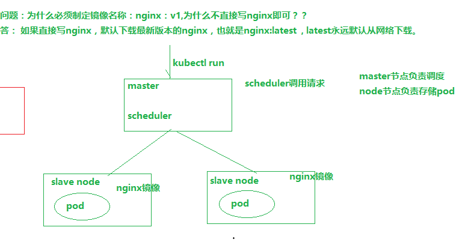

# 问题

1、按照我对docker的理解，宿主机a，想要访问宿主机机b中的容器，
哪怕是局域网访问，一定要让这个容器绑定宿主机b的物理端口，然后通过宿主机b的ip和端口访问

但是老师今天的课程中，他说k8s内网访问不用绑定物理端口。这是为啥？因为flannel.这个东西做的吗？
这个flannel具体是啥东西？

2、还有就是，一个pod里面如果有多个不同的容器，比如这个pod里面有nginx redis mysql那么我们的操作
是不是应该创建3个service？

3、老师创建service的时候，用的是3000这个端口，绑定80端口、假设我的pod里有多个容器，端口不同。
那么我创建service的时候，是不是要用多个端口去绑定容器的端口？Service的虚拟端口和容器的端口是一对一的吗
我怀疑我这里是进入了一个思维误区，因为昨天老师没有讲一个pod多个容器，有些地方我有点难抽象出来、
比如，一个pod下面多个容器，那么容器的ip和pod的ip是不是一样的？容器的端口和pod的端口的关系？

4、kube-proxy 占用物理端口的事情

5、ipvsadm -Ln 查询不到 路由ip映射关系？？
   kubectl edit configmap kube-proxy -n kube-system 修改configmap资源对象，修改为ipvs模式。

6、service是否存在单点故障？？？
	service资源对象存储在etcd，高可用交给etcd.
7、service是否会存储单点性能问题？？？
	不会。service只负责分发请求，不负责具体的业务的处理。因此service的性能没有任何压力。


## yaml文件方式创建 deployment 
#创建deployment
apiVersion: apps/v1
kind: Deployment
metadata:
  name: myapp-deploy
  namespace: default
 ## 第一段： 用来描述Deployment对象。
spec:
  replicas: 3  --- 告知副本控制器ReplicaSet维护3个副本
  selector:    --- 通过标签选择器去维护pod
    matchLabels:
      app: myapp
      release: stabel
  ## 第二段：给ReplicaSet来使用的。
  template:
    metadata:
      labels:
        app: myapp
        release: stabel
        env: test
    spec:
      containers:
      - name: myapp
        image: hub.kaikeba.com/library/myapp:v1
        imagePullPolicy: IfNotPresent
        ports:
        - name: http
          containerPort: 80
## 第三段：描述pod


## 创建service服务

#创建service服务
apiVersion: v1
kind: Service
metadata:
  name: myweb
  namespace: default
spec:
  type: NodePort
  selector:
    app: myapp
    release: stabel
  ports:
  - name: http
    port: 80
    targetPort: 80

# Kubernetes(K8s)-k8s资源清单

# 一、资源控制器

## 1、什么是控制器？

Kubernetes 中内建了很多controller (控制器) ,这些相当于一个状态机,用来控制Pod的具体状态和行 为

Pod 的分类

自主式 Pod：Pod 退出了，此类型的 Pod 不会被创建

控制器管理的 Pod：在控制器的生命周期里，始终要维持 Pod 的副本数目

**2\****、***\*常用控制器**

ReplicationController （旧版本）

ReplicaSet

Deployment

DaemonSet

StatefulSet

Job/Cronjob

**3\****、***\*自主式\****p***\*od**

## 4、RC&RS

ReplicationController (RC)用来确保容器应用的副本数始终保持在用户定义的副本数,即如果有容器 异常退出,会自动创建新的Pod来替代;而如果异常多出来的容器也会自动回收;

在新版本的Kubernetes 中建议使用Replicaset来取代ReplicationController. ReplicaSet 跟 ReplicationController 没有本质的不同,只是名字不一样,并且ReplicaSet支持集合式的selector;

apiVersion: extensions/v1beta1

kind: ReplicaSet

metadata:

name: frontend

spec:

rrrrrrrr: 3

ssssssss:

matchLabels:

```
tier: frontend
```

template:

metadata:

```
labels:

  tier: frontend
```

spec:

```
containers:

  \- name: Java-nginx

    image: hub.kaikeba.com/library/myapp :v1

    env:

      \- name: GET\_HOSTS\_FROM

        value: dns

    ports:

      \- containerPort : 80
```

## 5、Deployment

Deployment为Pod和ReplicaSet提供了一个声明式定义(declarative) 方法,用来替代以前的 ReplicationController 来方便的管理应用。典型的应用场景包括;

定义Deployment来创建Pod和ReplicaSet

滚动升级和回滚应用

扩容和缩容

暂停和继续Deployment

\#1)、部署一简单的Nginx应用

apiVersion: extensions/v1beta1

kind: Deployment

metadata:

name: nginx-deployment

spec:

replicas: 3

template:

metadata:

```
labels:

  app: nginx
```

spec:

```
containers:

  \- name: nginx

    image: nginx:1.7.9

    ports:
```

Deployment更新策略

Deployment可以保证在升级时只有一定数量的Pod是down的。默认的,它会确保至少有比期望的 Pod数量少一个是up状态(最多一个不可用)

Deployment同时也可以确保只创建出超过期望数量的一定数量的Pod,默认的,它会确保最多比期望 的Pod数量多一个的Pod是up的(最多1个surge )

未来的Kuberentes版本中,将从1-1变成25%-25%

## 6、DaemonSet

\#确保只运行一个副本，运行在集群中每一个节点上。（也可以部分节点上只运行一个且只有一个pod副本，如 监控ssd硬盘）

\# kubectl explain ds

\# vim filebeat.yaml

apiVersion: apps/v1

kind: DaemonSet

metadata:

name: my-deamon

namespace: default

labels:

app: daemonset

spec:

selector:

matchLabels:

```
app: my-daemonset
```

template:

metadata:

```
labels:

  app: my-daemonset
```

spec:

```
containers:

\- name: daemon-app

  image: hub.kaikeba.com/library/myapp :v1
```

# 二、Pod's lifecycle

## 1、再次理解Pod

Pod是kubernetes 中你可以创建和部署的最⼩也是最简的单位。 ⼀个Pod代表着集群中运⾏的⼀个 进程。 Pod中封装着应⽤的容器（有的情况下是好⼏个容器） ， 存储、 独⽴的⽹络IP， 管理容器如何 运⾏的策略选项。 Pod代 表着部署的⼀个单位： kubernetes 中应⽤的⼀个实例， 可能由⼀个或者多个 容器组合在⼀起共享资源。 在Kubrenetes集群中Pod有如下两种使⽤⽅式：

⼀个Pod中运⾏⼀个容器。 “每个Pod中⼀个容器”的模式是最常⻅的⽤法； 在这种使⽤⽅式 中， 你可以把Pod想象成是单个容器的封装， kuberentes管理的是Pod⽽不是直接管理容 器。

在⼀个Pod中同时运⾏多个容器。 ⼀个Pod中也可以同时封装⼏个需要紧密耦合互相协作的容 器， 它们之间共享资源。 这些在同⼀个Pod中的容器可以互相协作成为⼀个service单位—— ⼀个容器共享⽂件， 另⼀个“sidecar ”容器来更新这些⽂件。 Pod将这些容器的存储资源作为 ⼀个实体来管理。

每个Pod都是应⽤的⼀个实例。 如果你想平⾏扩展应⽤的话（运⾏多个实例） ， 你应该运⾏多个 Pod， 每个Pod都是⼀个应⽤实例。 在Kubernetes 中， 这通常被称为replication。

服务如何部署：

- 建议一个pod中部署一个容器（通常情况下都是这样的）
- 有一些业务上紧密耦合的服务，可以部署在一个容器，通信效率比较高。

## 2、Pod Phase

Pod 的 status 属性是一个 [PodStatus](https://kubernetes.io/docs/reference/generated/kubernetes-api/v1.11/#podstatus-v1-core) 对象，拥有一个 phase 字段。它简单描述了 Pod 在其生 命周期的阶段。

**阶\****段**

**描\****述**

**Pending**

Pod 已被 Kubernetes 接受，但尚未创建一个或多个容器镜像。这包括被调度之 前的时间以及通过网络下载镜像所花费的时间，执行需要一段时间。

**Running**

Pod 已经被绑定到了一个节点，所有容器已被创建。至少一个容器正在运行，或 者正在启动或重新启动。

**Succeeded**

所有容器成功终止，也不会重启。

**Failed**

所有容器终止，至少有一个容器以失败方式终止。也就是说，这个容器要么已非 0 状态退出，要么被系统终止。

**Unknown**

由于一些原因，Pod 的状态无法获取，通常是与 Pod 通信时出错导致的。

使用命令查询pod的状态：

## 3、重启策略

## 4、生命周期详解

pod生命周期示意图（初始化容器,post start,main container..,pre stop）：

说明：

初始化容器阶段初始化pod中每一个容器,他们是串行执行的，执行完成后就退 出了

启动主容器main container

在main container 刚刚启动之后可以执行post start命令

在整个main container 执行的过程中可以做两类探测：liveness probe(存活 探测)和readiness probe(就绪探测)

在main container 结束前可以执行pre stop命令

配置启动后钩子(post start)和终止前钩子(pre stop)

post start：容器创建之后立即执行，如果失败了就会按照重启策略重启容器 pre stop：容器终止前立即执行，执行完成之后容器将成功终止

可以使用以下命令查看post start和pre stop的设置格式：

kubectl explain pod.spec.containers.lifecycle.preStop

kubectl explain pod.spec.containers.lifecycle.postStart

## 5、pod init

### 5.1、init容器

Pod能够持有多个容器，应用运行在容器里面，但是它也可能有一个或多个先于应用容器启动的 Init容器

Init容器与普通的容器非常像，除了如下两点：

Init容器总是运行到成功完成为止

每个Init容器都必须在下一个Init容器启动之前成功完成

如果Pod的Init容器失败，Kubernetes 会不断地重启该Pod，直到Init容器成功为止。然而，如果 Pod对应的restartPolicy为Never，它不会重新启动

### 5.2、init作用

因为Init容器具有与应用程序容器分离的单独镜像，所以它们的启动相关代码具有如下优势：

①

它们可以包含并运行实用工具，但是出于安全考虑，是不建议在应用程序容器镜像中包含

这些实用工具的

②

它们可以包含使用工具和定制化代码来安装，但是不能出现在应用程序镜像中。例如，创

建镜像没必要FROM另一个镜像，只需要在安装过程中使用类似sed、awk、python或dig这 样的工具。

应用程序镜像可以分离出创建和部署的角色，而没有必要联合它们构建一个单独的镜像。 Init容器使用LinuxNamespace ，所以相对应用程序容器来说具有不同的文件系统视图。

因此，它们能够具有访问Secret的权限，而应用程序容器则不能。

⑤

它们必须在应用程序容器启动之前运行完成，而应用程序容器是并行运行的，所以Init容

器能够提供了一种简单的阻塞或延迟应用容器的启动的方法，直到满足了一组先决条件。

### 5.3、特殊说明

①

在Pod启动过程中，Init容器会按顺序在网络和数据卷初始化之后启动。每个容器必须在

下一个容器启动之前成功退出(网络和数据卷初始化是在pause)

②

如果由于运行时或失败退出，将导致容器启动失败，它会根据Pod的restartPolicy指定的

策略进行重试。然而，如果Pod的restartPolicy设置为Always ，Init容器失败时会使用 RestartPolicy策略

③

在所有的Init容器没有成功之前，Pod将不会变成Ready状态。Init容器的端口将不会在

Service中进行聚集。正在初始化中的Pod处于Pending 状态，但应该会将Initializing状态设置 为true

如果Pod重启，所有Init容器必须重新执行

对Init容器spec的修改被限制在容器image字段，修改其他字段都不会生效。更改Init容器

的image字段，等价于重启该Pod

⑥

Init容器具有应用容器的所有字段。除了readinessProbe （就绪检测），因为Init容器无

法定义不同于完成（completion ）的就绪（readiness）之外的其他状态。这会在验证过程中 强制执行

⑦

在Pod中的每个app和Init容器的名称必须唯一；与任何其它容器共享同一个名称，会在

验证时抛出错误

### 5.4、一个例子

\#init-pod.yaml

apiVersion: v1

kind: Pod

metadata:

name: init-pod

labels:

app: myapp

spec:

containers:

\- name: myapp

image: hub.kaikeba.com/library/busybox :v1

command: ['sh', '-c', 'echo -n "running at " && date +%T && sleep 600'] initContainers :

\- name: init-mydb

image: hub.kaikeba.com/library/busybox :v1

command: ['sh', '-c', 'until nslookup init-db; do echo waiting for init- db;date +%T; sleep 2;echo; done;']

\#init-db.yaml

kind: Service

apiVersion: v1

metadata:

name: init-db

spec:

ports:

\- protocol: TCP

```
port: 80

targetPort: 3366
```

\#创建

kubectl create -f init-pod.yaml

\#查看pod状态 init没成功

kubectl get pod

\#查看log

kubectl logs init-pod -c init-mydb

\#创建svr

kubectl create -f init-db.yaml

\#查看

kubectl get svc

\#svc有ip地址，等待init容器运行成功

kubectl get pod

\#删除

kubectl delete -f init-pod.yaml

kubectl delete -f init-db.yaml

① 在Pod启动过程中，Init容器会按顺序在网络和数据卷初始化之后启动。每个容器必须在下一 个容器启动之前成功退出(网络和数据卷初始化是在pause)

- 如果由于运行时或失败退出，将导致容器启动失败，它会根据Pod的restartPolicy指定的策略 进行重试。然而，如果Pod的restartPolicy设置为Always ，Init容器失败时会使用RestartPolicy策略
- 在所有的Init容器没有成功之前，Pod将不会变成Ready状态。Init容器的端口将不会在Service 中进行聚集。正在初始化中的Pod处于Pending 状态，但应该会将Initializing状态设置为true
  - 如果Pod重启，所有Init容器必须重新执行
- 对Init容器spec的修改被限制在容器image字段，修改其他字段都不会生效。更改Init容器的 image字段，等价于重启该Pod
- Init容器具有应用容器的所有字段。除了readinessProbe （就绪检测），因为Init容器无法定义 不同于完成（completion ）的就绪（readiness）之外的其他状态。这会在验证过程中强制执行
- 在Pod中的每个app和Init容器的名称必须唯一；与任何其它容器共享同一个名称，会在验证时 抛出错误

### 6、容器探针

探针是由kubelet 对容器执行的定期诊断。要执行诊断，kubelet调用由容器实现的Handler。有三 种类型的处理程序：

**ExecAction**：在容器内执行指定命令。如果命令退出时返回码为0则认为诊断成功。 **TCPSocketAction** ：对指定端口上的容器的IP地址进行TCP检查。如果端口打开，则诊断被认 为是成功的。

**HTTPGetAction**：对指定的端口和路径上的容器的IP地址执行HTTPGet请求。如果响应的状 态码大于等于200且小于400，则诊断被认为是成功的

每次探测都将获得以下三种结果之一：

**成\****功**：容器通过了诊断。

**失\****败**：容器未通过诊断。

**未\****知**：诊断失败，因此不会采取任何行动

**探\****测***\*方\****式**

**①**

**livenessProbe**：指示容器是否正在运行。如果存活探测失败，则kubelet会杀死容器，

并且容器将受到其重启策略的影响。如果容器不提供存活探针，则默认状态为Success （会随 着容器的生命周期一直存在）

**②**

**readinessProbe**：指示容器是否准备好服务请求。如果就绪探测失败，端点控制器将从

与Pod匹配的所有Service的端点中删除该Pod的IP地址。初始延迟之前的就绪状态默认为 Failure 。如果容器不提供就绪探针，则默认状态为Success

**检\****测***\*探\****针** **-** **就\****绪***\*检\****测**

readinessProbe-httpget

\#readinessProbe-httpget

apiVersion: v1

kind: Pod

metadata:

name: readiness-httpget-pod

namespace: default

spec:

containers:

\- name: readiness-httpget-container

image: hub.kaikeba.com/library/myapp :v1

imagePullPolicy : IfNotPresent

readinessProbe :

```
httpGet:

  port: 80

  path: /index1.html

initialDelaySeconds : 1

periodSeconds: 3
```

**检\****测***\*探\****针** **-** **存\****活***\*检\****测**

livenessProbe-exec方式

apiVersion: v1

kind: Pod

metadata:

name: liveness-exec-pod

namespace: default

spec:

containers:

\- name: liveness-exec-container

image: hub.kaikeba.cn/library/busybox :v1

imagePullPolicy : IfNotPresent

command: ["/bin/sh","-c","touch /tmp/live;sleep 60;rm -rf /tmp/live;sleep 3600"]

livenessProbe :

```
exec:

  command: \["test","-e","/tmp/live"\]

initialDelaySeconds : 1

periodSeconds: 3
```

livenessProbe-Httpget 方式

**存\****活***\*检\****测**

apiVersion: v1

kind: Pod

metadata:

name: liveness-httpget-pod

namespace: default

spec:

containers:

\- name: liveness-httpget-container

image: hub.kaikeba.com/library/myapp :v1

imagePu11Policy : IfNotPresent

ports:

\- name: http

```
containerPort: 80
```

livenessProbe :

```
httpGet:

  port: http

  path: /index.html

initialDelaySeconds : 1

periodSeconds: 3

timeoutSeconds : 10
```

livenessProbe-Tcp方式

apiVersion: v1

kind: Pod

metadata:

name: probe-tcp

spec:

containers:

\- name: nginx

image: hub.kaikeba.com/library/myapp :v1 livenessProbe :

```
initialDelaySeconds : 5

timeoutSeconds : 1

tcpSocket:

  port: 80

periodSeconds: 3
```

存活就绪

apiVersion: v1

kind: Pod

metadata:

name: liveness-httpget-pod

namespace: default

spec:

containers:

\- name: liveness-httpget-container

image: hub.kaikeba.com/library/myapp :v1 imagePullPolicy : IfNotPresent

ports:

\- name: http

```
containerPort: 80
```

readinessProbe :

```
httpGet:

  port: 80

  path: /index1.html

initialDelaySeconds : 1

periodSeconds: 3
```

livenessProbe :

```
httpGet:

  port: http

  path: /index.html

initialDelaySeconds : 1

periodSeconds: 3

timeoutSeconds : 10
```

**启\****动***\*及\****退***\*出\****动***\*作**

image: nginx

lifecycle:

```
poststart:

  exec:

    command: \["/bin/sh","-c","echo Hello from the postStart handler > /usr/share/message" \]

prestop:

  exec:

    command: \["/bin/sh","-c","echo Hello container stop"\]
```

# pv&pvc&statefulSet

# 一、k8s-volumes

## 1、什么要用volumes?

k8s 中容器中的磁盘的生命周期是短暂的, 这就带来了一些列的问题

1. 当一个容器损坏之后, kubelet会重启这个容器, 但是容器中的文件将丢失----容器以干净的状态 重新启动
2. 当很多容器运行在同一个pod中时, 很多时候需要数据文件的共享
   1. 在 k8s 中，由于 pod 分布在各个不同的节点之上，并不能实现不同节点之间持久性数据的共 享，并且，在节点故障时，可能会导致数据的永久性丢失。

**volumes\****就***\*是\****用***\*来\****解***\*决\****以***\*上\****问***\*题\****的**

Volume 的生命周期独立于容器，Pod 中的容器可能被销毁和重建，但 Volume 会被保留。

注意：docker磁盘映射的数据将会被保留,和kubernetes有一些不一样

## 2、什么是volume？

volume用来对容器的数据进行挂载，存储容器运行时所需的一些数据。当容器被重新创建时，实 际上我们发现volume挂载卷并没有发生变化。

kubernetes中的卷有明确的寿命————与封装它的pod相同。所以，卷的生命比pod中的所有容 器都长，当这个容器重启时数据仍然得以保存。

当然，当pod不再存在时，卷也不复存在，也许更重要的是kubernetes支持多种类型的卷，pod可 以同时使用任意数量的卷

## 3、卷的类型

kubenetes卷的类型：

**第\****一***\*种\****就***\*是\****本***\*地\****卷**

像hostPath类型与docker里面的bind mount类型，就是直接挂载到宿主机文件的类型 像 emptyDir是这样本地卷，也就是类似于volume类型 这两点都是绑定node节点的

**第\****二***\*种\****就***\*是\****网***\*络\****数***\*据\****卷**

比如Nfs、ClusterFs、Ceph，这些都是外部的存储都可以挂载到k8s上

**第\****三***\*种\****就***\*是\****云***\*盘**

比如AWS、微软(azuredisk)

**第\****四***\*种\****就***\*是\****k***\*8s\****自***\*身\****的***\*资\****源**

比如secret、configmap、downwardAPI

## 4、emptyDir

先来看一下本地卷 像emptyDir类似与docker的volume，而docker删除容器，数据卷还会存在， 而emptyDir删除容器，数据卷也会丢失，一般这个只做临时数据卷来使用

创建一个空卷，挂载到Pod中的容器。Pod删除该卷也会被删除。

应用场景：Pod中容器之间数据共享

当pod被分配给节点时，首先创建emptyDir卷，并且只要该pod在该节点上运行，该卷就会存在。 正如卷的名字所述，它最初是空的，pod中的容器可以读取和写入emptyDir卷中的相同文件，尽管该卷 可以挂载到每个容器中的相同或者不同路径上。当处于任何原因从节点删除pod时，emptyDir中的数据 将被永久删除

注意：容器崩溃不会从节点中移除pod，因此emptyDir卷中的数据在容器崩溃时是安全的

emptyDir的用法

## 5、一个例子

apiVersion: v1

kind: Pod

metadata:

name: test-pod

spec:

containers :

\- image: hub.kaikeba.com/library/myapp :v1 name: test-container

volumeMounts :

\- mountPath: /cache

```
name: cache-volume
```

volumes:

\- name: cache-volume

emptyDir: {}

\---

apiVersion: v1

kind: Pod

metadata:

name: test-pod

spec:

containers :

\- image: hub.kaikeba.com/library/myapp :v1 name: test-container

volumeMounts :

\- mountPath: /cache

```
name: cache-volume
```

\- name: test-1

image: hub.kaikeba.com/library/busybox :v1 command: ["/bin/sh","-c","sleep 6000s"] imagePullPolicy : IfNotPresent

volumeMounts :

\- mountPath: /cache

```
name: cache-volume
```

volumes:

\- name: cache-volume

emptyDir: {}

## 6、HostPath

挂载Node文件系统上文件或者目录到Pod中的容器。 应用场景：Pod中容器需要访问宿主机文件 ;

## 7、一个例子

apiVersion: v1

kind: Pod

metadata:

name: test-pod

spec:

containers :

\- image: hub.kaikeba.com/library/myapp :v1 name: test-container

volumeMounts :

\- mountPath: /cache

```
name: cache-volume
```

volumes:

\- name: cache-volume

hostPath:

```
path: /data

type: Directory
```

这里创建的数据和我们被分配的node节点的数据都是一样的，创建的数据都会更新上去，删除容 器，不会删除数据卷的数据。

**type\****类***\*型**

除了所需的path属性职位，用户还可以为hostPath卷指定type.

## 8、NFS网络存储

**Kubernetes\****进***\*阶\****之***\*PersistentVolume** **静\****态***\*供\****给***\*实\****现***\*N\****FS***\*网\****络***\*存\****储**

NFS是一种很早的技术，单机的存储在服务器方面还是非常主流的，但nfs唯一的就是缺点比较大就 是没有集群版，做集群化还是比较费劲的，文件系统做不了，这是一个很大的弊端，大规模的还是需要 选择一些分布式的存储，nfs就是一个网络文件存储服务器，装完nfs之后，共享一个目录，其他的服务 器就可以通过这个目录挂载到本地了，在本地写到这个目录的文件，就会同步到远程服务器上，实现一 个共享存储的功能，一般都是做数据的共享存储，比如多台web服务器，肯定需要保证这些web服务器 的数据一致性，那就会用到这个共享存储了，要是将nfs挂载到多台的web服务器上，网站根目录下， 网站程序就放在nfs服务器上，这样的话。每个网站，每个web程序都能读取到这个目录，一致性的数 据，这样的话就能保证多个节点，提供一致性的程序了。

- 单独拿一台服务器做nfs服务器，我们这里先搭建一台NFS服务器用来存储我们的网页根目录
- 暴露目录，让是让其他服务器能挂载这个目录

给这个网段加上权限，可读可写

找个节点去挂载测试一下,只要去共享这个目录就要都去安装这个客户端

\#其他节点也需要安装nfs

yum install nfs-utils -y

mount -t nfs 192.168.30.27:/opt/k8s /mnt

- /mnt
- -h

192.168.30.27:/opt/k8s 36G 5.8G 30G 17% /mnt

touch a.txt

去服务器端查看已经数据共享过来了

删除nfs服务器的数据也会删除 接下来怎么将K8s进行使用 我们把网页目录都放在这个目录下 # mkdir wwwroot

\# vim nfs.yaml

apiVersion: apps/v1beta1

kind: Deployment

metadata:

name: nfs

spec:

replicas: 3

template:

metadata:

```
labels:

  app: nginx
```

spec:

```
containers :

\- name: nginx

  image: hub.kaikeba.com/library/myapp :v1

  volumeMounts :

  \- name: wwwroot

    mountPath: /usr/share/nginx/html

  ports:

  \- containerPort: 80

volumes:

\- name: wwwroot

  nfs:

    server: 192.168.66.13

    path: /opt/k8s/wwwroot
```

\---

apiVersion: v1

kind: Service

metadata:

name: nginx-service

labels:

app: nginx

spec:

ports:

\- port: 80

targetPort : 80

selector:

app: nginx

type: NodePort

我们在源pod的网页目录下写入数据，并查看我们的nfs服务器目录下也会共享

# 二、PV&PVC

## 1、pv&pvc说明

管理 存储 和管理 计算 有着明显的不同。 PersistentVolume 给用户和管理员提供了一套API，抽象 出 存储 是如何 提供和消耗的细节 。在这里，我们介绍两种新的API资源： PersistentVolume （简称PV） 和 PersistentVolumeClaim （简称PVC） 。

PersistentVolume（持久卷，简称PV）是集群内，由管理员提供的网络存储的一部分。就像 集群中的节点一样，PV也是集群中的一种资源。它也像Volume一样，是一种volume插件， 但是它的生命周期却是和使用它的Pod相互独立的。PV这个API对象，捕获了诸如NFS、 ISCSI、或其他云存储系统的实现细节。

PersistentVolumeClaim （持久卷声明，简称PVC）是用户的一种存储请求。它和Pod类似， Pod消耗Node资源，而PVC消耗PV资源。Pod能够请求特定的资源（如CPU和内存）。PVC能 够请求指定的大小和访问的模式（可以被映射为一次读写或者多次只读）。

PVC允许用户消耗抽象的存储资源，用户也经常需要各种属性（如性能）的PV。集群管理员需要提 供各种各样、不同大小、不同访问模式的PV，而不用向用户暴露这些volume如何实现的细节。因为这 种需求，就催生出一种 StorageClass 资源。

StorageClass 提供了一种方式，使得管理员能够描述他提供的存储的等级。集群管理员可以将不 同的等级映射到不同的服务等级、不同的后端策略。

**K8s\****为***\*了\****做***\*存\****储***\*的\****编***\*排** 数据持久卷PersistentVolume 简称pv/pvc主要做容器存储的编排

- PersistentVolume（PV）：对存储资源创建和使用的抽象，使得存储作为集群中的资源管理 pv 都是运维去考虑，用来管理外部存储的
- 静态 ：提前创建好pv，比如创建一个100G 的pv,200G的pv,让有需要的人拿去用，就是说pvc连接 pv,就是知道pv创建的是多少，空间大小是多少，创建的名字是多少，有一定的可匹配性
  - 动态
- PersistentVolumeClaim （PVC）：让用户不需要关心具体的Volume实现细节 使用多少个容量来 定义，比如开发要部署一个服务要使用10个G，那么就可以使用pvc这个资源对象来定义使用10个G， 其他的就不用考虑了

**pv&pvc\****区***\*别**

PersistentVolume （持久卷） 和 PersistentVolumeClaim （持久卷申请） 是k8s提供的两种API资 源，用于抽象存储细节。

管理员关注如何通过pv提供存储功能而无需关注用户如何使用，同样的用户只需要挂载pvc到容器 中而不需要关注存储卷采用何种技术实现。

pvc和pv的关系与pod和node关系类似，前者消耗后者的资源。pvc可以向pv申请指定大小的存储 资源并设置访问模式,这就可以通过Provision -> Claim 的方式，来对存储资源进行控制。

## 2、生命周期

volume 和 claim 的生命周期，PV是集群中的资源，PVC是对这些资源的请求，同时也是这些资源 的“提取证”。PV和PVC的交互遵循以下生命周期：

**供\****给**

有两种PV提供的方式：静态和动态。

**静\****态**

集群管理员创建多个PV，它们携带着真实存储的详细信息，这些存储对于集群用户是可用 的。它们存在于Kubernetes API中，并可用于存储使用。

**动\****态**

当管理员创建的静态PV都不匹配用户的PVC时，集群可能会尝试专门地供给volume给PVC。 这种供给基于StorageClass：PVC必须请求这样一个等级，而管理员必须已经创建和配置过这 样一个等级，以备发生这种动态供给的情况。请求等级配置为“”的PVC，有效地禁用了它自身 的动态供给功能。

**绑\****定**

用户创建一个PVC（或者之前就已经就为动态供给创建了），指定要求存储的大小和访问模 式。master中有一个控制回路用于监控新的PVC，查找匹配的PV（如果有），并把PVC和PV 绑定在一起。如果一个PV曾经动态供给到了一个新的PVC，那么这个回路会一直绑定这个PV 和PVC。另外，用户总是至少能得到它们所要求的存储，但是volume可能超过它们的请求。 一旦绑定了，PVC绑定就是专属的，无论它们的绑定模式是什么。

如果没找到匹配的PV，那么PVC会无限期得处于unbound未绑定状态，一旦PV可用了，PVC 就会又变成绑定状态。比如，如果一个供给了很多50G的PV集群，不会匹配要求100G的 PVC。直到100G的PV添加到该集群时，PVC才会被绑定。

**使\****用**

Pod使用PVC就像使用volume一样。集群检查PVC，查找绑定的PV，并映射PV给Pod。对于 支持多种访问模式的PV，用户可以指定想用的模式。一旦用户拥有了一个PVC，并且PVC被绑 定，那么只要用户还需要，PV就一直属于这个用户。用户调度Pod，通过在Pod的volume块 中包含PVC来访问PV。

**释\****放**

当用户使用PV完毕后，他们可以通过API来删除PVC对象。当PVC被删除后，对应的PV就被认 为是已经是“released”了，但还不能再给另外一个PVC使用。前一个PVC的属于还存在于该PV 中，必须根据策略来处理掉。

**回\****收**

PV的回收策略告诉集群，在PV被释放之后集群应该如何处理该PV。当前，PV可以被 Retained （保留）、 Recycled（再利用）或者Deleted（删除）。保留允许手动地再次声明 资源。对于支持删除操作的PV卷，删除操作会从Kubernetes 中移除PV对象，还有对应的外部 存储（如AWS EBS，GCE PD，Azure Disk，或者Cinder volume）。动态供给的卷总是会被 删除。

## 3、POD&PVC

先创建一个容器应用

name: my-pod

spec:

containers :

\- name: nginx

```
image: nginx:latest

ports:

\- containerPort: 80

volumeMounts :

  \- name: www

    mountPath: /usr/share/nginx/html
```

volumes:

\- name: www

```
persistentVolumeClaim :

  claimName: my-pvc
```

卷需求yaml,这里的名称一定要对应，一般两个文件都放在一块 # vim pvc.yaml

apiVersion: v1

kind: PersistentVolumeClaim

metadata:

name: my-pvc

spec:

accessModes :

\- ReadWriteMany

resources:

requests:

```
storage: 5Gi
```

接下来就是运维出场了，提前创建好pv

\# vim pv1.yaml

apiVersion: v1

kind: PersistentVolume

metadata:

name: my-pv1

spec:

capacity:

storage: 5Gi

accessModes :

\- ReadWriteMany

nfs:

path: /opt/k8s/demo1

server: 192.168.66.13

提前创建好pv,以及挂载目录

我再创建一个pv，在nfs服务器提前把目录创建好,名称修改一下

\# vim pv2.yaml

apiVersion: v1

kind: PersistentVolume

metadata:

name: my-pv2

spec:

capacity:

storage: 10Gi

accessModes :

\- ReadWriteMany

nfs:

path: /opt/k8s/demo2

server: 192.168.66.13

然后现在创建一下我们的pod和pvc,这里我写在一起了

\# vim pod.yaml

apiVersion: v1

kind: Pod

metadata:

name: my-pod

spec:

containers :

\- name: nginx

image: nginx:latest

ports:

\- containerPort: 80

volumeMounts :

```
\- name: www

  mountPath: /usr/share/nginx/html
```

volumes:

\- name: www

```
persistentVolumeClaim :

  claimName: my-pvc
```

\---

apiVersion: v1

kind: PersistentVolumeClaim

metadata:

name: my-pvc

spec:

accessModes :

\- ReadWriteMany

resources:

requests:

```
storage: 5Gi
```

## 4、StatefulSet

用户通过yaml创建StatefulSet，StatefulSet找到StorageClass ，StorageClass指定到nfs- provisioner为nfs的pv提供者，这是一个pod的服务，用来自动生成pv的，此pod来绑定到对应的nfs服 务。以此来通过nfs服务进行动态的pv生成，然后通过StatefulSet的pvc，与pod进行绑定，实现数据的 持久化存储。

**持\****久***\*化\****演***\*示\****说***\*明\****—***\*—\****—***\*—NFS** 1、安装NFS服务器

在每台节点安装

yum -y install nfs-utils rpcbind

\#启动

systemctl start rpcbind

systemctl start nfs

\#测试

mkdir /test

showmount -e 192.168.241.130

mount -t nfs 192.168.241.130:/nfs /test cd /test/

touch 1

umount /etst

创建pv

apiVersion: v1

kind: PersistentVolume

metadata:

name: nfspv1

spec:

capacity:

storage: 10Gi

accessModes :

\- ReadWriteOnce

persistentVolumeReclaimPolicy : Retain

storageClassName : nfs

nfs:

path: /nfs

server: 192.168.66.13

创建pvc

apiVersion: v1

kind: Service

metadata:

name: nginx

labels:

app: nginx

spec:

ports:

\- port: 80

name: web

clusterIP: None

selector:

app: nginx

\---

apiVersion: apps/v1

kind: StatefulSet

metadata:

name: web

spec:

selector:

matchLabels :

```
app: nginx
```

serviceName : nginx

replicas: 2

template:

metadata:

```
labels:

  app: nginx
```

spec:

```
containers :

\- name: nginx

  image: nginx

  ports:

  \- containerPort: 80

    name: web

  volumeMounts :

  \- name: www

    mountPath: /usr/share/nginx/html volumeClaimTemplates :
```

\- metadata:

```
name: www
```

spec:

```
accessModes : \[ "ReadWriteOnce" \]

storageClassName : nfs

resources:

  requests:

    storage: 1Gi
```

作业：部署MySQL 部署。

关于statefulSet**

匹配Pod name(网络标识)的模式为:(statefulset名称)-(序号)，比如上面的示例：web-0， web-1，web-2

statefulSet为每个pod副本创建了一个DNS域名，这个域名的格式为：(podname).(headless server name)，也就意味着服务间是通过pod域名来通信而非pod的ip，因为当pod所在node发 生故障时，pod会被飘逸到其他node上，pod ip会发生变化，但是pod域名不会发生变化

statefulSet使用headless 服务来控制pod的域名，这个域名的FQDN为(servicename). (namespace).svc.cluster.local其中cluster.local指的是集群的域名

根据volumeClaimTemplates 为给个pod创建一个pvc，pvc的命名规则匹配模式

([volumeClaimTemplates.name)-(pod_name](https://links.jianshu.com/go?to=http%3A%2F%2FvolumeClaimTemplates.name) -(pod_name))，比如上面的 [volumeMounts.name=www](https://links.jianshu.com/go?to=http%3A%2F%2FvolumeMounts.name%3Dwww) ，podname=web(0-2)，因此创建出来的pvc是www-web-0，www- web-1，www-web-2

删除pod不会删除pvc，手动删除pvc将自动释放pv

StatefulSet的启停顺序

有序部署：部署statefulset时，如果有多个pod副本，他们会被顺序的创建(从0到N-1) 并且， 在下一个pod运行之前所有之前的pod必须都是running和ready状态

有序删除：当pod被删除时，他们被终止的顺序是从N-1到0

有序扩展：当pod执行扩展操作时，与部署一样，它前面的pod必须都处于running 和ready 状态

Statefulset使用场景：稳定的持久化存储，即pod重新调度后还是能访问到相同的持久化数 据，基于pvc来实现 稳定的网络标识符，即pod重新调度后其podname和hostname不变 有序部 署，有序扩展，基于init containers来实现 有序收缩

# Registry&Harbor私有仓库

这篇博文写的是两种不同的搭建Docker私有仓库的方法，都必须要基于一个Docker服务器上，相 比较而言，Harbor功能更强大些。

之前详细写过Registry私有仓库的搭建方法，这里的Registry只是有一点配置不一样而已，若要搭 建Registry私有仓库，最好结合：[Docker镜像的创建+构建私有仓库及其使用方法](https://blog.51cto.com/14154700/2436956)这篇博文来，对比其 不一样的地方，选择适合自己的方案。

# 一、搭建Registry私有仓库

环境准备：

两台centos 7.3，一台为Docker私有仓库服务器，另一台为测试端，两台须可ping通； 参考博文：[Docker的安装详细配置](https://blog.51cto.com/14154700/2442086)，对两台服务器进行安装docker环境。

## 1、第一台服务

开始配置第一台Docker私有仓库服务器：

[root@docker ~]# docker pull registry #下载registry镜像

[root@docker ~]# docker run -tid --name registry --restart=always -p 5000:5000 - v /data/registry:/var/lib/registry registry

\#运行该镜像，各个选项含义如下：

\# -tid：以后台持久运行，并分配一个可交互的为终端# --name registry ：给容器定义一个名字

\# --restart=always：该容器可以随着docker服务的启动而启动

\# -p：将容器的端口映射到宿主机，冒号前面是宿主机的端口，冒号后面是容器的端口，registry的默认端口是5000

\# -v：将宿主机的目录挂载到容器中，冒号前面是宿主机的目录，冒号后面是容器中的目录[root@docker ~]# docker images #查看当前的镜像

REPOSITORY TAG IMAGE ID CREATED SIZE

centos latest 0f3e07c0138f 2 weeks ago 220MB

registry latest f32a97de94e1 7 months ago 25.8MB

[root@docker ~]# docker tag centos:latest 192.168.20.7:5000/centos:latest #更改镜像名称，以便符合私有仓库名称规范

\#注：私有仓库镜像的命名规则：192.168.20.7:5000/XXX（宿主机的IP:5000端口/镜像名称）

[root@docker ~]# vim /usr/lib/systemd/system/docker.service #更改docker的配置文件，以便指定私有仓库

ExecStart=/usr/bin/dockerd -H unix:// --insecure-registry 192.168.20.7:5000

\#定位到上面那行，在后面添加“--insecure-registry”并指定私有仓库的IP及端口，然后保存退出即可[root@docker ~]# systemctl daemon-reload #重载配置文件

[root@docker ~]# systemctl restart docker #重启docker服务

[root@docker ~]# docker push 192.168.20.7:5000/centos:latest #上传镜像至私有仓库

[root@docker ~]# curl 192.168.20.7:5000/v2/_catalog #查看私有仓库中的镜像

{"repositories":["centos"]}

[root@docker ~]# curl 192.168.20.7:5000/v2/centos/tags/list #查看镜像的详细信息

{"name":"centos","tags":["latest"]}

## 2、第二台服务

第二台Docker服务器进行如下操作：

# 二、配置Harbor私有仓库

Harbor私有仓库和第一个Registry私有仓库相比较而言，功能强大很多，并且支持web图形化管 理，推荐使用。

环境和搭建Registry的一样，如下：

两台centos 7.3，一台为Docker私有仓库服务器，另一台为测试端，两台须可ping通； 参考博文：[Docker的安装详细配置](https://blog.51cto.com/14154700/2442086)，对两台服务器进行安装docker环境。

## 1、安装compose

打开github.com官网，在登录页面的右上角搜索compose找到docker/compose再找releases，

（网址：https://github.com/docker/compose/releases） 如下：

复制自己所需版本下提供的两条命令，在第一台Docker服务器上依次进行操作：

## 2、安装harbor

github官网搜索harbor，再点击goharbor/harbor，再点击“releases”，根据自己所需，下载相应 的版本，上传至服务器（网址如下：https://github.com/goharbor/harbor/releases 也可下载在线安装的包，没试过，可自行尝试），如下：

\#将下载的安装包解压到指定目录

tar zxf harbor-offline-installer-v1.7.4.tgz -C /usr/src #切换至解压后的目录中

cd /usr/src/harbor/ #编辑这个配置文件

vim harbor.cfg

..............#省略部分内容

\#将hostname更改为本机IP

\#[此处可以写域名：hostname = hub.kaikeba.com] hostname = 192.168.20.7

\#设置https协议ui_url_protocol = https

\#这行指定的是登录harbor的登录名及密码

\#默认用户为“admin”，密码为“Harbor12345” harbor_admin_password = Harbor12345

..............#省略部分内容

\#自定义证书开启customize_crt = on

\#创建证书存储目录：ssl_cert = /data/cert/server.crt 配置文件中有说明

mkdir -p /data/cert/

\#创建证书

\#进入创建的存储证书的目录cd !$

\#首先生成证书私钥

openssl genrsa -des3 -out server.key 2048 #证书的服务

openssl req -new -key server.key -out server.csr #备份私钥

cp server.key server.key.org #转换为证书

openssl rsa -in server.key.org -out server.key #给证书签名

openssl x509 -req -days 365 -in server.csr -signkey server.key -out server.crt #给所有的证书授权

chmod 755 *

\#执行自带的安装脚本，安装完毕，浏览器即可访问

./install.sh

\# 10,11,12 几台工作机器：编辑docker主配置文件daemon.json加入，注意逗号的问题，否则无法连接

harbor

"insecure-registries": ["[https://hub.kaikeba.com"\]](https://hub.kaikeba.com"\]/)

\# 配置上阿里云镜像

{"exec-opts": ["native.cgroupdriver=systemd"],"log-driver": "json-file","log- opts": {"max-size": "100m"},"registry-mirrors": ["[https://pee6w651.mirror.aliyuncs.com"\],"insecure-registries"](https://pee6w651.mirror.aliyuncs.com"\]%2C"insecure-registries"/): ["[https://hub.kaikeba.com"\]}](https://hub.kaikeba.com"\]}/)

## 3、登录harbor

使用浏览器访问harbor服务器的IP地址，使用配置文件中指定的用户名及密码登录（默认用户为

“admin”，密码为“Harbor12345”）

注意：登录时，证书认证时候，选择高级， 略过即可

## 4、新建项目

点击“新建项

目”

## 5、项目名称

定义项目名称：

## 6、上传镜像

回到Harbor 服务器，开始向Harbor上

## 7、流程说明

- 浏览器访问流程

1. docker访问流程

   

   