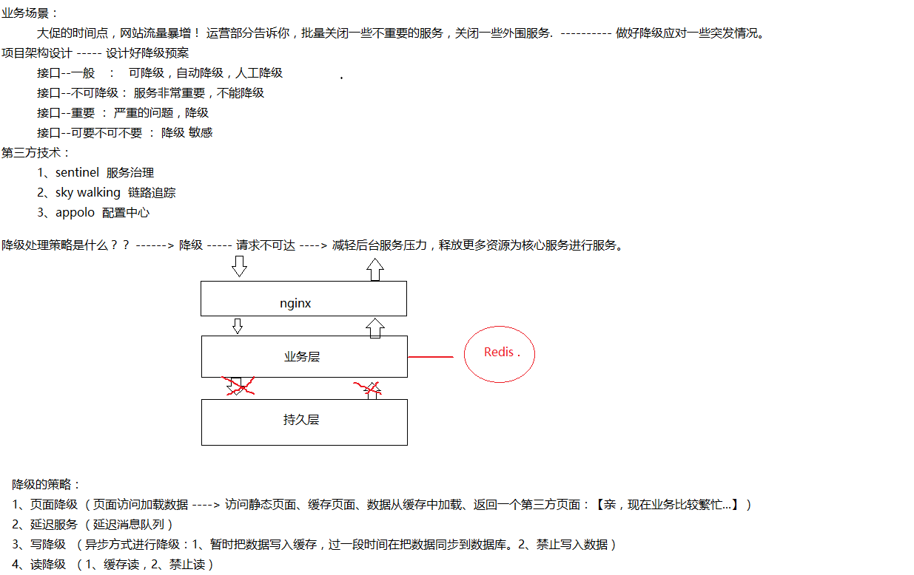
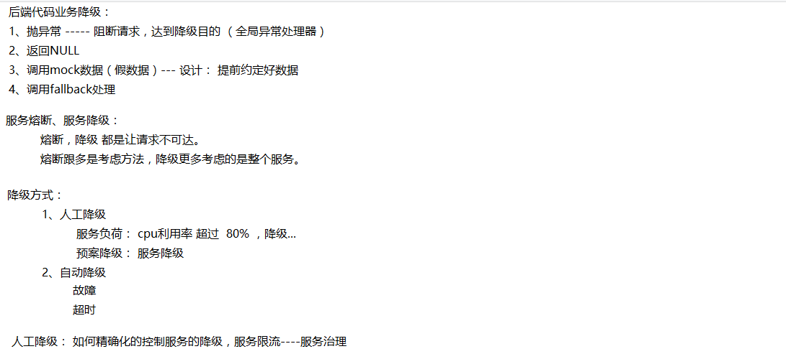
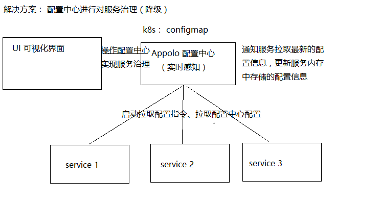
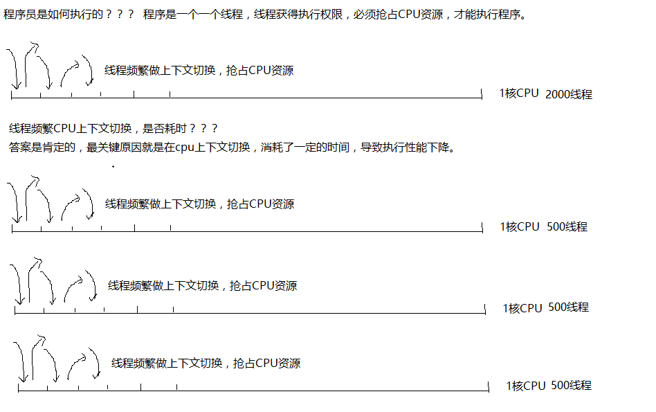
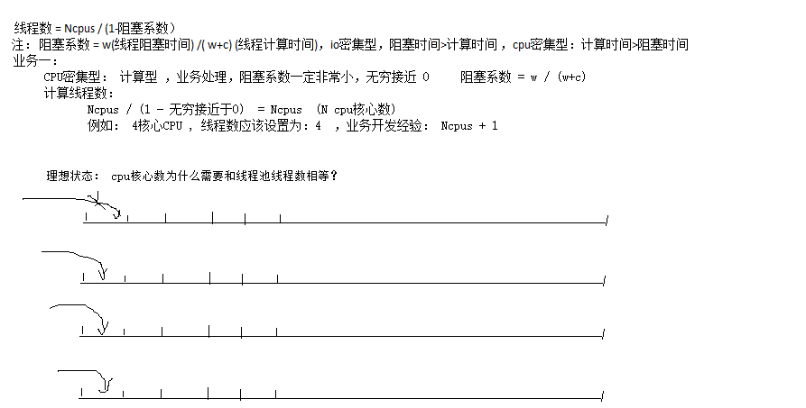
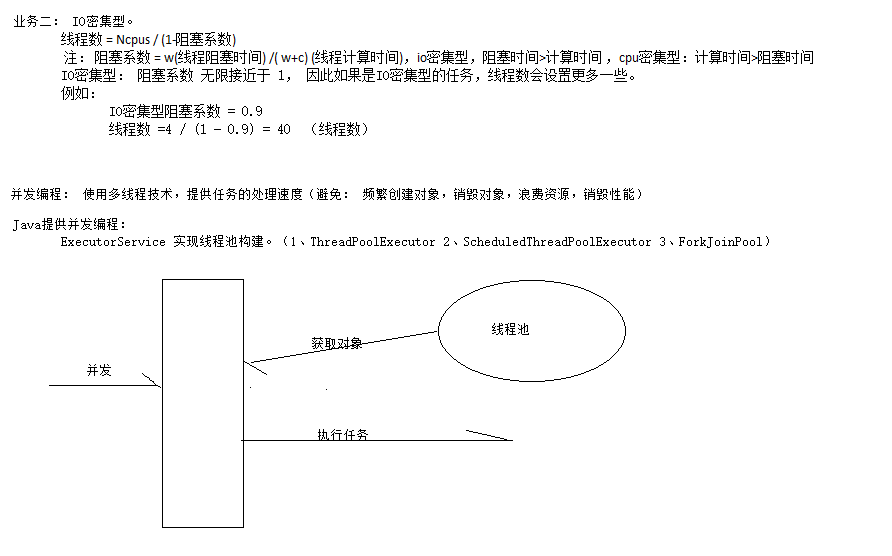

# 大型互联网高并发业务架构设计实践-慧科商城

# 1、软件架构中的高并发思考

## 1.1、什么是高并发？

**高\****并***\*发\****（**High Concurrency）是互联网分布式系统架构设计中必须考虑的因素之一，它通常 是指 ，通过设计保证系统能够同时并行处理很多请求。

高并发相关常用的一些指标有响应时间（Response Time），吞吐量（Throughput ），每 秒查询率 QPS（Query Per Second），并发用户数等。

**响\****应***\*时\****间**：系统对请求做出响应的时间。例如系统处理一个 HTTP 请求需要 200ms，这个 200ms 就是系统的响应时间。

**吞\****吐***\*量**：单位时间内处理的请求数量（并发数量）

**QPS**：每秒响应请求数。在互联网领域，这个指标和吞吐量区分的没有这么明显。

**并\****发***\*用\****户***\*数**：同时承载正常使用系统功能的用户数量。例如一个即时通讯系统，同时在线量 一定程度上代表了系统的并发用户数。

名词：

- Response Time
- Throughput
- QPS
- UV
- TPS （数据库）
- DAU
- PV
- IP

……………..

## 1.2、高并发下系统设计问题的思考

大家也许开发过高并发的系统或者一些高并发类似秒杀程序，但肯定都有接触过，像电商平 台的秒杀、抢购等活动，还有 12306 春运抢票。

第一：高并发

互联网公司，做一些有奖活动，而且数量有限，奖品给力，如果是先到先得的策略，那就类 似秒杀系统了。

这类系统最大的问题就是活动周期短，瞬间流量大（高并发），很少人可以成功下单，绝大 多数人都是很遗憾。所以从运营体验上，没有成功下单的人，心里肯定是不好受的，如果这 时候，因为技术、网络问题，影响用户体验，那就更是骂声一片。

下面是基本的概念的建立。

技术要做的事，一方面优化程序，让程序性能最优，单次请求时间能从 50ms 优化到 25ms ， 那就可以在一秒钟内成功响应翻倍的请求了。

另一方面就是增加服务器，用更大的集群来处理用户请求 ，设计好一个可靠且灵活扩充的分 布式方案就更加重要了。

第二：时间短(Throughput)

火热的秒杀活动，真的是一秒钟以内就会把商品抢购一空，而大部分用户的感受是，提交订 单的过程却要等待好几秒、甚至十几秒，更糟糕的当然是请求报错。

那么一个好的秒杀体验，当然希望尽可能减少用户等待时间，准确的提示用户当前是否还有 商品库存。而这些，也是需要有优秀的程序设计来保证的。

- 异步解耦
- 缓存

第三：系统容量预估( Throughput) – 硬件 层面

系统设计的时候，都需要有一个容量预估，那就是要提前计算好，我们设计的系统，要承载 多大的数量级。

订单业务：判断库存----默认库存是无限的- --下单时间：1ms

硬件层面预估：根据硬件预估服务器并发数

2Cpus,4GB

静态线程：请求一些静态资源 （CDN，js，css..,静态数据） --- 占用内存：2m

动态线程：请求数据库，从数据查询数据加载到内存 ---- 10M ( 预估)

请求数量：200

静态：150

动态：50

占 用 ： 150*2M + 50*10M = 300MB+500MB = 800MB 4*800 = 3.2G （ 操 作 系 统 ： 800MB）

服务器请求：4*200 == 800 QPS

估算结果：（0 ， 800）

4Cpus , 16GB =====> 4*800 = 3200 QPS ===> 2000

估算结果：（0，3200）

2000 请求 4CPUs ---- 每一个 CPU 分得 500 个请求，cpu 时间分片切换需要消耗时间

以上并发数量思考：只考虑线程占用内存，根据内存算法，估算并发能力。

并发能力能力：

- cpus
- 程序执行时间（程序员写的代码是否 ok ）
- 内存

例如： 提交订单操作，耗时 100ms

订单并发能力：1000ms / 100ms * 4 = 40QPS --- 订单处理 QPS 非常不理想。

必须对程序员做优化：

订单：100ms ---> 10ms

1000ms/10ms * 4 = 400 QPS

继续优化：

数据库分表分库，缓存，1ms

第四：好的分布式方案(Throughput)---应用 架构

一个好的分布式方案，首先当然是稳定可靠，不要出乱子，然后就是方便扩充，最好的 效果当然是增加一台服务器，并发处理量可以 1:1 线性增长。

分布式架构：微服务架构

- 高可扩展性
- 收缩容比较方便

例如：单机 QPS 1000, 10 台机器：10000 ， 100 台服务器 ----> 10W

一个好的分布式架构 --- 可以提高服务器增加的规模 --- 尽可能 1:1 线性增长 思考：木桶原理

服务端性能提升（靠堆机器），应用层（nginx，lvs/F5、分布式）、数据层( 分布式) **2.2\****、***\*如\****何***\*保\****障***\*系\****统***\*的\****高***\*并\****发***\*？**

**服\****务***\*尽\****量***\*进\****行***\*拆分部署（分布式：\****SOA,***\*微\****服***\*务）\****;**

**尽\****量***\*将\****请***\*求\****拦***\*截在系统上游**（越上游越好）;

**读\****多***\*写\****少***\*多\****使***\*用缓存**（缓存抗读压力）;

浏览器和 APP ：做限速（漏桶原理）

站点层：按照 uid 做限速，做页面缓存

服务层：按照业务做写请求队列控制流量，做数据缓存

数据层：压力就小了，无忧无虑

其他方面：结合业务做优化

具体的解决方案：

- 缓存（应用级别缓存、http 缓存、多级缓存）
- 连接池 （频繁创建对象，销毁对象，浪费资源）
- 异步 （异步解耦）
- 扩容 （增加服务节点）
- 队列 （异步）

项目简单逻辑分层图示结构：优化策略具体可以分为 数据层优化，应用层优化，前端优化

数据层优化：

数据库优化：--- RT --- 吞吐量

1、集群（分表、分库、读写分离【解决读压力】） 2、索引

- 开启缓存
- SQL 优化
- 冗余设计
- 防止写复杂 SQL
- 冷热数据分离

分布式文件系统：

- 开源文件系统 FastDFS OSS
- 云服务

日志数据/搜索数据/简单业务数据：

elasticSearch ms

Redis 缓存

应用层优化：

- web 服务器优化 （线程池，连接队列）
- JVM 优化
- 代码结构优化（code review）
  - 分布式拆分（提高吞吐量，提高集群部署网络数量） 5、异步架构
- 异步并发编程
- 队列
- 线程池
- nosql

前端优化工作：

- DNS 缓存
- CDN 缓存
- 浏览器缓存
- nginx 缓存

# 2、多级缓存应用

前提：

程序内存数据（读写速度）> Redis 缓存 > mysql > 磁盘 单机网络请求（本地请求）> 局域网请求 > 跨机房请求 优化方案： 把资源放在程序调用最近的地方。

http 缓存：

- DNS 缓存
- CDN 缓存
- 浏览器缓存
- nginx 缓存

应用（application program）级别缓存：代码级别缓存 JVM heap 缓存，堆外缓存

所谓缓存：让数据离用户更近，访问速度更快，RT 时间更短，吞吐量更高。

例如：

CPU 架构（三级缓存）： L1(查询) / L2（查询）/ L3（查询）

Maven: 先查询本地仓库，远程仓库

项目来说： 构造项目缓存 – mybatis : 一级缓存，二级缓存

1、堆缓存

使用 Java 堆内存缓存对象。 使用技术方案： Ehcache 实现缓存。

2、内存缓存

内存缓存，缓存的大小取决于内存大小。 技术方案：Ehcache 实现缓存

3、磁盘缓存

缓存数据存储在磁盘，JVM 启动后，还能从磁盘加载。技术方案：Ehcache 实现缓存， 设置过期时间

4、分布式缓存

使用第三方缓存服务器：Redis,memcached

堆缓存： 对象不需要序列化/反序列化 堆外数据： 反序列化

多级缓存（整体）：

大型项目中：构造高性能项目，一定重视缓存应用。非常重要

# 3、连接池详解

连接池目的：通过连接池减少频繁创建连接，释放连接，降低消耗，提升性能 （吞吐量） 连接池： 数据库连接，Redis 连接池，Http 连接池……..

技术方案： Apache commons pool2 , jedis, druid, dbcp…………..

各位程序员： 是否 知道 连接 池怎 么配 置？ 设置 多少 个队 列， 设置 多少 个线 程？ ？ 例如：

1w QPS 2W TPS 连接池应用设置多少？？？

回答：尽量设置大些吧，设置个 500 吧 ---- 此话 是否 正确 ？？

Oracle 数据测试数据分析：

https://github.com/brettwooldridge/HikariCP/wiki/About-Pool-Sizing

通过 oracle 公司公布的测试数据发现：

连接池设置变小了，执行数据 反而变快了，RT 时间变短了….. ，性能更好了 …… 原因造成的？？？

这是什么

根据线程执行原理，当线程太多，每一个 CPU 分配的线程就很多，多个线程在 CPU 频繁切 换造成性能严重下降。

问题：线程池数据设置越少越好呢？？？ 到底应该设置多少？？

当然不是，线程池设置数量必须考虑：cpu 核心数量，考虑业务类型：

CPU 密集型（计算型） --- 业务处理

IO 密集型 --- 数据存取

线程数 = Ncpus / (1- 阻塞系数)

注： 阻塞系数 = w(线程阻塞时间) /( w+c) (线程计算时间)，io 密集型，阻塞时间> 计算 时间 ，cpu 密集型：计算时间>阻塞时间

理想状态：多个核心 CPU,每一个 cpu 同时处理一个线程,让这线程处理完毕后，再处理 其他线程。线程数 = Ncpu

# 4、线程池详解

线程池的目的类似于连接池，通过减少频繁创建和销毁线程来降低性能损耗。每个线程 都需要一个内存栈，用于存储如局部变量、操作栈等信息，可以通过-Xss 参数来调整每个线 程栈大小，通过调整该参数可以创建更多的线程，不过 JVM 不能无限制地创建线程。

通过使用线程池可以限制创建的线程数，从而保护系统。线程池一般配合队列一起工作， 使用线程池限制并发处理任务的数量。

然后设置队列的大小，当任务超过队列大小时，通过一定的拒绝策略来处理，这样可以 保护系统免受大流量而导致崩溃——只是部分拒绝服务，还是有一部分是可以正常服务的。

线程池一般有核心线程池大小和线程池最大大小配置，当线程池中的线程空闲一段时间 时将会被回收，而核心线程池中的线程不会被回收。

多少个线程合适呢？

建议根据实际业务情况来压测决定，或者根据利特尔法则来算出一个合理的线程 池大小，其定义是，在一个稳定的系统中，长时间观察到的平均用户数量 L，等 于长时间观察到的有效到达速率λ与平均每个用户在系统中花费的时间的乘积， 即 L= λW。但实际情况是复杂的，如存在处理超时、网络抖动都会导致线程花 费时间不一样。因此，还要考虑超时机制、线程隔离机制、快速失败机制等，来 保护系统免遭大量请求或异常情况的冲击。

Java 提供了 ExecutorService 的三种实现。

- **ThreadPoolExecutor\****：** 标准线程池。
- **ScheduledThreadPoolExecutor\****：** 支持延迟任务的线程池。
- **ForkJoinPool\****：** 类似于 ThreadPoolExecutor，但是使用 work-stealing 模 式，其会为线程池中的每个线程创建一个队列，从而用 work-stealing（任务窃 取）算法使得线程可以从其他线程队列里窃取任务来执行。即如果自己的任务处 理完成了，则可以去忙碌的工作线程那里窃取任务执行。

## 4.1、Java 线程池

使用 Executors 来创建线程池。

（1）创建单线程的线程池。

ExecutorService executorService = Executors.*newSingleThreadExecutor* (); （2）创建固定数量的线程池。

ExecutorService executorService = Executors.*newFixedThreadPool* (10);

（3）创建可缓存的线程池，初始大小为 0，线程池最大大小为 Integer.MAX_VALUE

其使用 SynchronousQueue 队列，一个没有数据缓冲的阻塞队列。对其执行 put 操作后必须等待 take 操作消费该数据，反之亦然。该线程池不限制最大大 小，如果线程池有空闲线程则复用，否则会创建一个新线程。如果线程池中的线 程空闲 60 秒，则将被回收。该线程默认最大大小为 Integer.MAX_VALUE，请确 认必要后再使用该线程池。

ExecutorService executorService = Executors.*newCachedThreadPool* ();

（4）支持延迟执行的线程池，其使用 DelayedWorkQueue 实现任务延迟。

（5）work-stealing 线程池

ExecutorService executorService = Executors.*newWorkStealingPool* (5);

ThreadPoolExecutor 配置。

- **corePoolSize\****：** 核心线程池大小，线程池维护的线程最小大小，即没有任务 处理情况下，线程池可以有多个空闲线程，类似于 DBCP 中的 minIdle。
- **maximumPoolSize\****：** 线程池最大大小，当任务数非常多时，线程池可创建的 最大线程数量。

**keepAliveTime\****：** 线程池中线程的最大空闲时间，存活时间超过该时间的线程会 被回收，线程池会一直缩小到 corePoolSize 大小。

- **workQueue\****：** 线程池使用的任务缓冲队列，包括有界阻塞数组队列 ArrayBlockingQueue、有界/无界阻塞链表队列 LinkedBlockingQueue、优先级

阻塞队列 PriorityBlockingQueue、无缓冲区阻塞队列 SynchronousQueue。有界 阻塞队列须要设置合理的队列大小。

- **threadFactory\****：** 创建线程的工厂，我们可以设置线程的名字、是否是后台 线程。
- **rejectedExecutionHandler\****：** 当缓冲队列满后的拒绝策略，包括 Abort（直 接抛出 RejectedExecutionException）、Discard（按照 LIFO 丢弃）、 DiscardOldest（按照 LRU 丢弃）、CallsRun（主线程执行）。

## 4.2、Tomcat 线程池

以 Tomcat 8 为例配置如下，配置方式一。

- **acceptCount\****：** 请求等待队列大小。当 Tomcat 没有空闲线程处理连接请求时， 新来的连接请求将放入等待队列，默认为 100。当队列超过 acceptCount 后，新 连接请求将被拒绝。
- **maxConnections\****：** Tomcat 能处理的最大并发连接数。当超过后还是会接收 连接并放入等待队列（acceptCount 控制），连接会等待，不能被处理。BIO 默 认是 maxThreads 数量。NIO 和 NIO2 默认是 10000，ARP 默认是 8192。
- **minSpareThreads\****：** 线程池最小线程数，默认为 10。该配置指定线程池可以 维持的空闲线程数量。
- **maxThreads\****：** 线程池最大线程数，默认为 200。当线程池空闲一段时间后会 释放到只保留 minSpareThreads 个线程。

举例，假设 maxThreads=100，maxConnections=50，acceptCount=50，假设并发 请求为 200，则有 50 个线

程并发处理 50 个并发连接，50 个连接进入等待队列，剩余 100 个将被拒绝。也 就是说 Tomcat 最大并发线程数是由 maxThreads 和 maxConnections 中最小的一 个决定。BIO 场景下 maxConnections 和 maxThreads 是一样的，当我们需要长连 接场景时，应使用 NIO 模式，并发连接数是大于线程数的。

第二种配置方式：

此处我们使用了 org.apache.catalina.Executor 实现，其表示一个可在多个 Connector 间共享的线程池，而且有更丰富的配置。

- **namePrefix\****：** 创建的 Tomcat 线程名字的前缀。
- **deamon\****：** 是否守护线程运行，默认为 true。
- **minSpareThreads\****：** 线程池最小线程数，默认为 25。
- **maxThreads\****：** 线程池最大线程数，默认为 200。
- **maxIdleTime\****：** 空闲线程池的存活时间，默认为 60s。当线程空闲超过该时 间后，线程将被回收。
- **maxQueueSize\****：** 任务队列最大大小，默认为 Integer.MAX_VALUE，建议改小。 可以认为是 maxConnections。
- **prestartminSpareThreads\****：** 是否在 Tomcat 启动时就创建 minSpareThreads 个线程放入线程池，默认为 false。
- **executorTerminationTimeoutMillis\****：** 在停止 Executor 时，等待请求处理 线程终止的超时时间。

最后，要根据业务场景和压测来配置合理的线程池大小，配置太大的线程池在并 发量较大的情况下会引起请求处理不过来导致响应慢，甚至造成 Tomcat 僵死。

## 4.3、线程数计算

线程数量计算公式：

公式一：

NthreadsNum = Ncpu * (1 + w/c)

公式二：

NthreadsNum = Ncpu /(1 - w/(w+c)) == Ncpu / (1- 阻塞系数) 共识：

1、计算密集型任务 阻塞系数 无限接近于 0

2、IO 密集型阻塞系数 无限接近于 1

例如：A 任务阻塞系数 = 0.9

NthreadsNum = 16cpus / (1-0.9) = 160 线程

# 5、异步并发

在应用中一个服务可能会调用多个依赖服务来处理业务 ，而这些依赖服务是可以同时调 用的。如果顺序调用的话需要耗时 100ms ，而并发调用只需要 50ms ，那么可以使用 Java 并 发机制来并发调用依赖服务，从而降低该服务的响应时间。

在开发应用系统过程中，通过异步并发并不能使响应变得更快，更多是为了提升吞吐量、 对请求更细粒度控制，或是通过多依赖服务并发调用降低服务响应时间。当一个线程在处理 任务时 ，通过 Fork 多个线程来处理任务并等待这些 线程的处理结果，这种应 用并不是真正 的异步。

异步是针对 CPU 和 IO 的 ，当 IO 没有 就绪 时要 让出 CPU 来处 理其 他任 务 ，这才 是异 步。 异步：Future

异步：Callback ---- 后台开启几个副线程，异步处理后台任务。

# 6、服务扩容

对于这样一个系统，随着产品使用的用户越来越多，网站的流量会增加，最终单台服务器无 法处理那么大的流量，此时就需要用分而治之的思想来解决问题。

第一步是尝试通过简单扩容来解决。

第二步，如果简单扩容搞不定，就需要水平拆分和垂直拆分数据/应用来提升系统的伸缩性， 即通过扩容提升系统负载能力。

第三步，如果通过水平拆分/垂直拆分还是搞不定，那就需要根据现有系统特性，从架构层 面进行重构甚至是重新设计，即推倒重来。

对于系统设计，理想的情况下应支持线性扩容和弹性扩容，即在系统瓶颈时，只需要增加机 器就可以解决系统瓶颈，如降低延迟提升吞吐量，从而实现扩容需求。

如果你想扩容，则支持水平/垂直伸缩是前提。在进行拆分时，一定要清楚知道自己的目的 是什么，拆分后带来的问题如何解决，拆分后如果没有得到任何收益就不要为了拆而拆，即 不要过度拆分，要适合自己的业务。本章主要从应用和数据层面讲解如何按照业务和功能进 行应用或数据层面的拆分

# 7、队列应用---RocketMQ（十万-单机 ）-- 提 高吞吐量

队列，在数据结构中是一种线性表，从一端插入数据，然后从另一端删除数据。 本书的目的不是讲解各种队列及如何实现，而是讲述在应用层面使用队列能解决 哪些场景问题。

在我们的系统中，不是所有的处理都必须实时处理，不是所有的请求都必须实时 反馈结果给用户，不是所有的请求都必须 100%一次性处理成功，不知道哪个系 统依赖“我”来实现其业务处理，保证最终一致性，不需要强一致性。此时，我 们应该考虑使用队列来解决这些问题。当然我们也要考虑是否需要保证消息处理 的有序性及如何保证，是否能重复消费及如何保证重复消费的幂等性。在实际开 发时，我们经常使用队列进行异步处理、系统解耦、数据同步、流量削峰、扩展 性、缓冲等。

**应用场景**

- **异步处理** ：使用队列的一个主要原因是进行异步处理，比如，用户注册成功 后，需要发送注册成功邮件/新用户积分/优惠券等；缓存过期时，先返回过期数 据，然后异步更新缓存、异步写日志等。通过异步处理，可以提升主流程响应速 度，而非主流程/非重要处理可以集中处理，这样还可以将任务聚合批量处理。 因此，可以使用消息队列/任务队列来进行异步处理。
- **系统解耦** ：比如，用户成功支付完成订单后，需要通知生产配货系统、发票 系统、库存系统、推荐系统、搜索系统等进行业务处理，而未来需要支持哪些业

务是不知道的，并且这些业务不需要实时处理、不需要强一致，只需要保证最终 一致性即可，因此，可以通过消息队列/任务队列进行系统解耦。

- **数据同步** ：比如，想把 MySQL 变更的数据同步到 Redis，或者将 MySQL 的数 据同步到 Mongodb，或者让机房之间的数据同步，或者主从数据同步等，此时可 以考虑使用 databus、canal、otter 等。使用数据总线队列进行数据同步的好处 是可以保证数据修改的有序性。
- **流量削峰** ：系统瓶颈一般在数据库上，比如扣减库存、下单等。此时可以考 虑使用队列将变更请求暂时放入队列，通过缓存+队列暂存的方式将数据库流量 削峰。同样，对于秒杀系统，下单服务会是该系统的瓶颈，此时，可以使用队列 进行排队和限流，从而保护下单服务，通过队列暂存或者队列限流进行流量削峰。

队列的应用场景非常多，以上只列举了一些常见用法和场景。

## 7.1、缓冲队列

使用缓冲队列应对突发流量时，并不能使处理速度变快，而是使处理速度变平滑， 从而不会因瞬间压力太大而压垮应用。

通过缓冲区队列可以实现批量处理、异步处理和平滑流量。

## 7.2、任务队列

使用任务队列可以将一些不需要与主线程同步执行的任务扔到任务队列进 行异步处理。笔者用得最多的是线程池任务队列（默认为 LinkedBlockingQueue） 和 Disruptor 任务队列（RingBuffer）。

如用户注册完成后，将发送邮件/送积分/送优惠券任务扔到任务队列进行异 步处理；刷数据时，将任务扔到队列异步处理，处理成功后再异步通知用户，处 理成功后异步通知用户。以及查询聚合时，将多个可并行处理的任务扔到队列， 然后等待最慢的一个任务返回。

## 7.3、消息队列

使用消息队列存储各业务数据，其他系统根据需要订阅即可比如，修改商品数据、 变更订单状态时，都应该将变更信息发送到消息队列，如果其他系统有需要，则 直接订阅该消息队列即可。

一般我们会在应用系统中采用双写模式，同时写 DB 和 MQ，然后异构系统可以订 阅 MQ 进行业务处理（见下图）。因为在双写模式下没有事务保证，所以会出现 数据不一致的情况，如果对一致性要求没那么严格，则这种模式是没问题的，而 且在实际应用中这种模式也非常多。

# 8、图片

## 01_服务降级处理

## 02_线程数设置

