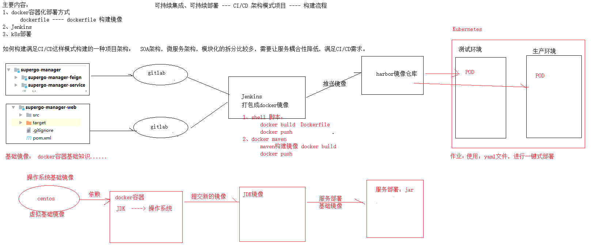

# Docker从基础到高级实战

# Dockerfile

## 什么是Dockerfile

Dockerfile是由一系列命令和参数构成的脚本，这些命令应用于基础镜像并最终创建一个 新的镜像。

1、对于开发人员：可以为开发团队提供一个完全一致的开发环境；

2、对于测试人员：可以直接拿开发时所构建的镜像或者通过Dockerfile文件构建一个新 的镜像开始工作了；

3、对于运维人员：在部署时，可以实现应用的无缝移植。

## 常用命令

**命令**

**作用**

FROM image_name:tag

定义了使用哪个基础镜像启动构建流程

MAINTAINER user_name

声明镜像的创建者

ENV key value

设置环境变量 (可以写多条)

RUN command

是Dockerfile的核心部分(可以写多条)

ADD source_dir/file dest_dir/file

将宿主机的文件复制到容器内，如果是一个压缩文件， 将会在复制后自动解压

COPY source_dir/file dest_dir/file

和ADD相似，但是如果有压缩文件并不能解压

WORKDIR path_dir

设置工作目录

EXPOSE port1 prot2

用来指定端口，使容器内的应用可以通过端口和外界交互

CMD argument

在构建容器时使用，会被docker run 后的argument覆盖

ENTRYPOINT argument

和CMD相似，但是并不会被docker run指定的参数覆盖

VOLUME

将本地文件夹或者其他容器的文件挂载到容器中

## 使用脚本创建镜像

### 创建JDK1.8镜像

步骤： （1）创建目录

- 下载jdk-8u65-linux-x64.tar.gz并上传到服务器（虚拟机）中的/usr/local/dockerjdk8目录
- 创建文件Dockerfile
- 执行命令构建镜像

注意后边的空格和点，不要省略

- 查看镜像是否建立完成
- 创建容器

果然可以创建哟~

### 创建Eureka镜像

- 进入控制台，eureka工程的目录下，执行maven命令
- 服务器创建/usr/local/dockereureka目录， 将生成的supergo-eureka-1.0-SNAPSHOT.jar上传到服务器的此目录
  - 创建文件Dockerfile
- 创建镜像
- 创建容器

docker run -di --name=myeureka -p 6868:6868 eureka

# Jenkins持续集成&部署

# 一、什么是持续集成？

持续集成是一个开发的实践，需要开发人员定期集成代码到共享存储库。这个概念是为了消除发现 的问题，后来出现在构建生命周期的问题。持续集成要求开发人员有频繁的构建。最常见的做法是，每 当一个代码提交时，构建应该被触发。

## 1、CI/DI简介

互联网软件的开发和发布，已经形成了一套标准流程，假如把开发工作流程分为以下几个阶段： 编码 --> 构建 --> 集成 --> 测试 --> 交付 --> 部署

正如你在上图中看到，[持续集成(Continuous Integration)]、[持续交付(Continuous Delivery)] 和 [持续部署(Continuous Deployment)]有着不同的软件自动化交付周期。

## 2、持续集成[CI]

上面整个流程中最重要的组成部分就是持续集成（Continuous integration，简称CI）。

持续集成指的是，频繁地（一天多次）将代码集成到主干。将软件个人研发的部分向软件整体部分 交付，频繁进行集成以便更快地发现其中的错误。

它的好处主要有两个：

持续集成并不能消除Bug，而是让它们非常容易发现和改正。持续集成的目的，就是让产品可以快 速迭代，同时还能保持高质量。它的核心措施是，代码集成到主干之前，必须通过自动化测试。只要有

一个测试用例失败，就不能集成。

## 3、持续交付

持续交付（Continuous delivery ）指的是，频繁地将软件的新版本，交付给质量团队或者用户，以 供评审。如果评审通过，代码就进入生产阶段。

持续交付在持续集成的基础上，将集成后的代码部署到更贴近真实运行环境的「类生产环境」 (production-like environments)中。持续交付优先于整个产品生命周期的软件部署，建立在高水平自 动化持续集成之上

持续交付可以看作持续集成的下一步。它强调的是，不管怎么更新，软件是随时随地可以交付的。

## 4、持续部署[DI]

**持\****续***\*部\****署**（continuous deployment ）是持续交付的下一步，指的是代码通过评审以后，自动部署 到生产环境。

持续部署的目标是，代码在任何时刻都是可部署的，可以进入生产阶段。

持续部署的前提是能自动化完成测试、构建、部署等步骤。

总的来说，持续集成、持续交付、持续部署提供了一个优秀的 DevOps 环境。对于整个开发团队来 说，能很大地提升开发效率，好处与挑战并行。无论如何，频繁部署、快速交付以及开发测试流程自动 化都将成为未来软件工程的重要组成部分。

开源的java语言开发持续集成工具，支持CI，CD；

易于安装部署配置：可通过yum安装,或下载war包以及通过docker容器等快速实现安装部署，可方便web界 面配置管理；

消息通知及测试报告：集成RSS/E-mail通过RSS发布构建结果或当构建完成时通过e-mail通知，生成 JUnit/TestNG测试报告；

分布式构建：支持Jenkins能够让多台计算机一起构建/测试；

文件识别:Jenkins能够跟踪哪次构建生成哪些jar，哪次构建使用哪个版本的jar等；

丰富的插件支持:支持扩展插件，你可以开发适合自己团队使用的工具，如git，svn，maven，docker等。

# 二、Jenkins

## 1、jenkins是什么？

Jenkins是一款开源 CI&CD 软件，用于自动化各种任务，包括构建、测试和部署软件。Jenkins 支 持各种运行方式，可通过系统包、Docker 或者通过一个独立的 Java 程序

官网：https://jenkins.io/ 官方文档：https://jenkins.io/doc/

Jenkins特性：

伴随着Jenkins，有时人们还可能看到它与Hudson关联。 Hudson是由 Sun Microsystems 开发的一个非常流行的开源，基于 Java 的持续集成工具，后来被Oracle收购。Sun被Oracle收购之后， 一个从 Hudson 源代码的分支由 Jenkins 创建出台

**2\****、***\*Jenkins\****安***\*装**

**2.1\****、***\*准\****备工***\*作**

1）第一次使用 Jenkins ，您需要：

机器要求：

256 MB 内存，建议大于 512 MB

10 GB 的硬盘空间（用于 Jenkins 和 Docker 镜像）

需要安装以下软件：

Java 8 ( JRE 或者 JDK 都可以)

[Docker](https://www.docker.com/) （导航到网站顶部的Get Docker链接以访问适合您平台的Docker下载）

2）下载并运行 Jenkins

1. [下载](http://mirrors.jenkins.io/war-stable/latest/jenkins.war) [Jenkins](http://mirrors.jenkins.io/war-stable/latest/jenkins.war) .
2. 打开终端进入到下载目录.

javax.net.ssl.SSLHandshakeException :

sun.security.validator.ValidatorException : PKIX path building failed:

sun.security.provider.certpath.SunCertPathBuilderException : unable to find valid certification path to requested target

1. 运行命令 java -jar war .
   1. 打开浏览器进入链接 [http://localhost:8080](http://localhost:8080/) . 按照说明完成安装.

### 2.2、Jenkins启动

#### 2.2.1、离线问题

发现jenkins处于离线状态（且在后台启动其实已经报错），无法安装相应的插件，因此需要解决此 离线问题：

原因是就是升级站点的链接[h](https://updates.jenkins.io/update-center.json)[ttps://updates.jenkins.io/update-center.json](https://updates.jenkins.io/update-center.json)默认是https的，如何 解决呢？

#### 2.2.2、解决方案

第一步：打开配置页面 http://localhost:8080/pluginManager/advanced 进去以后是这样的

第二步： Https协议改为http 修改后的为： http://updates.jenkins.io/update-center.json

第三步：重启Jenkins OK，重启后再次输入密码进入就是正常的啦，正常的页面如下：

### 2.3、访问jenkins

打开浏览器，访问ip：8080进行安装，ip为linux机器ip

提示需要输入管理员密码，输入 77faa20f2ad544f7bcb6593b1cf1436b ，点击 继续 ，会初始化一 小段时间

这里我选择 安装推荐的插件

上面等插件安装完后，就进入到下面界面，提示要创建第一个admin用户，并设置用户名密码

这里我直接创建用户名为admin，密码自定义:

点击 保存并完成 ,然后进行实例配置：

提示配置jenkins URL，这里保持默认即可，继续点击 保存并完成

提示jenkins已经就绪，现在就可以开始使用jenkins了：

### 2.4、Jenkins配置

\#查看jenkins的配置文件，定义了home、JAVA_CMD、user、port等基础配置，保持默认即可 [root@lzx ~]# cat /etc/sysconfig/jenkins

\## Path: Development/Jenkins

\## Description: Jenkins Automation Server

\## Type: string

\## Default: "/var/lib/jenkins"

\## ServiceRestart: jenkins

\#

\# Directory where Jenkins store its configuration and working # files (checkouts, build reports, artifacts, ...).

\#

JENKINS_HOME ="/var/lib/jenkins"

\## Type: string

\## Default: ""

\## ServiceRestart: jenkins

\#

\# Java executable to run Jenkins

\# When left empty, we'll try to find the suitable Java.

\#

JENKINS_JAVA_CMD =""

\## Type: string

\## Default: "jenkins"

\## ServiceRestart: jenkins

\#

\# Unix user account that runs the Jenkins daemon

\# Be careful when you change this, as you need to update

\# permissions of $JENKINS_HOME and /var/log/jenkins.

\#

JENKINS_USER ="jenkins"

\## Type: string

\## Default: "false"

\## ServiceRestart: jenkins

\#

\# Whether to skip potentially long-running chown at the

\# $JENKINS_HOME location. Do not enable this, "true", unless # you know what you're doing. See JENKINS-23273.

\#

\#JENKINS_INSTALL_SKIP_CHOWN="false"

\## Type: string

\## Default: "-Djava.awt.headless=true"

\## ServiceRestart: jenkins

\#

\# Options to pass to java when running Jenkins.

\#

JENKINS_JAVA_OPTIONS ="-Djava.awt.headless=true"

\## Type: integer(0:65535)

\## Default: 8080

\## ServiceRestart: jenkins

\#

\# Port Jenkins is listening on.

\# Set to -1 to disable

\#

JENKINS_PORT ="8080"

\## Type: string

\## Default: ""

\## ServiceRestart: jenkins

\#

\# IP address Jenkins listens on for HTTP requests.

\# Default is all interfaces (0.0.0.0).

\#

JENKINS_LISTEN_ADDRESS =""

\## Type: integer(0:65535)

\## Default: ""

\## ServiceRestart: jenkins

\#

\# HTTPS port Jenkins is listening on.

\# Default is disabled.

\#

JENKINS_HTTPS_PORT =""

\## Type: string

\## Default: ""

\## ServiceRestart: jenkins

\#

\# Path to the keystore in JKS format (as created by the JDK 'keytool'). # Default is disabled.

\#

JENKINS_HTTPS_KEYSTORE =""

\## Type: string

\## Default: ""

\## ServiceRestart: jenkins

\#

\# Password to access the keystore defined in JENKINS_HTTPS_KEYSTORE. # Default is disabled.

\#

JENKINS_HTTPS_KEYSTORE_PASSWORD =""

\## Type: string

\## Default: ""

\## ServiceRestart: jenkins

\#

\# IP address Jenkins listens on for HTTPS requests.

\# Default is disabled.

\#

JENKINS_HTTPS_LISTEN_ADDRESS =""

\## Type: integer(1:9)

\## Default: 5

\## ServiceRestart: jenkins

\#

\# Debug level for logs -- the higher the value, the more verbose.

\# 5 is INFO.

\#

JENKINS_DEBUG_LEVEL ="5"

\## Type: yesno

\## Default: no

\## ServiceRestart: jenkins

\#

\# Whether to enable access logging or not.

\#

JENKINS_ENABLE_ACCESS_LOG ="no"

\## Type: integer

\## Default: 100

\## ServiceRestart: jenkins

\#

\# Maximum number of HTTP worker threads.

\#

JENKINS_HANDLER_MAX ="100"

\## Type: integer

\## Default: 20

\## ServiceRestart: jenkins

\#

\# Maximum number of idle HTTP worker threads.

\#

JENKINS_HANDLER_IDLE ="20"

\## Type: string

\## Default: ""

\## ServiceRestart: jenkins

\#

\# Pass arbitrary arguments to Jenkins.

\# Full option list: java -jar jenkins.war --help

\#

JENKINS_ARGS =""

### 2.5、主程序目录

[root@lzx ~]# ls ~/.jenkins/ //查看程序主目录

config.xml nodes hudson.model.UpdateCenter.xml plugins hudson.plugins.git.GitTool.xml queue.xml.bak identity.key.enc secret.key jenkins.CLI.xml secret.key.not-so-secret jenkins.install.InstallUtil.lastExecVersion secrets jenkins.install.UpgradeWizard.state updates jenkins.model.JenkinsLocationConfiguration.xml userContent jobs users logs workflow-libs nodeMonitors.xml

jobs

logs

nodes

浏览器上面创建的任务都会存放在这里 存放jenkins相关的日志

多节点时用到

plugins

secrets

插件所在目录

密码秘钥所在目录 //jobs和plugins目录比较重要

### 2.6、JDK配置

JDK安装配置：[先把JDK安装到Linux服务器，且配置完善]

### 2.7、maven配置

#### 2.7.1、安装maven

官网地址：http://maven.apache.org/download.cgi

下载地址：[apache-maven-3.3.9-bin.tar.gz](http://mirror.bit.edu.cn/apache/maven/maven-3/3.3.9/binaries/apache-maven-3.3.9-bin.tar.gz)

配置环境变量：vim /etc/profile 写到最后，我用的3.3.3 的版本

#### 2.7.2、Jenkins配置maven

### 2.8、插件安装

如果jenkins需要安装什么插件，可以直接安装即可。

1）Maven Integration plugin 安装此插件才能构建maven项目

2）Deploy to

container Plugin 安 装此插件，才能将

打好的包部署到tomcat上

**2.9\****、***\*系\****统设***\*置**

这个没有话看一下上面的插件，没安装maven 的插件就没有这个配置：

这个配置费劲九牛二虎之力，在N次报错后遍寻错误无解时候，在系统提供的英文文档里面偶然看 到其中一个回答，好长好长看到其中一句，试了试竟然成功了，沃德天！

### 2.10、git配置

#### 2.10.1、git地址错误

原因分析：**这\****是***\*由\****于***\*g\****it***\*客\****户***\*端\****版***\*本\****过***\*低\****造***\*成\****的***\*！\****或***\*者\****系***\*统\****中***\*没\****有***\*安\****装***\*g\****it***\*所\****造***\*成\****的** Jenkins本机默认 使用"yum install -y git" 安装的git版本比较低，应该自行安装更高版本的git

#### 2.10.2、安装git

**安\****装***\*g\****it**

[root@jenkins ~]# yum -y install libcurl-devel expat-devel curl-devel gettext- devel openssl-devel zlib-devel

[root@jenkins ~]# yum -y install gcc perl-ExtUtils-MakeMaker

[root@jenkins ~]# cd /usr/local/src/

[root@jenkins src]# wget

https://mirrors.edge.kernel.org/pub/software/scm/git/git-2.1.1.tar.gz [root@jenkins src]# tar -zvxf git-2.1.1.tar.gz

[root@jenkins src]# cd git-2.1.1

[root@jenkins git-2.1.1]# make prefix=/usr/local/git all

[root@jenkins git-2.1.1]# make prefix=/usr/local/git install

**添\****加***\*g\****it***\*到\****环***\*境\****变***\*量**

**查\****看***\*更\****新***\*后\****的***\*g\****it***\*版\****本***\*和\****所***\*在\****路***\*径**

#### 2.10.3、设置git

查看git安装地址：

设置git安装地址：

依次打开"**系\****统***\*管\****理**" -> "**系***\*统\****设***\*置**" -> "**Git**" -> "**Path** **to** **Git** **executable**"，在此处填入"whereis git"查询出的地址 + "/bin/git" （如上面"whereis git"的地址为"/usr/local/git"，则应该填入 "/usr/local/git/bin/git"） 并保存

## 3、docker安装 3.1、安装文档

设置映射目录：

安装还是比较速度的：

## 3.2、安装命令

## 3.3、错误提示

1）无法使用宿主机的git环境问题

问题描述：docker安装Jenkins，无法使用宿主机的git环境问题。

解决 方案：docker安装Jenkins，其实不需要使用宿主机git环境，因为在安全jenkins的时候已经安 装了git插件，所以不需要配置宿主机git.

2）无法使用宿主机Java环境

错误描述：Cannot run program "/usr/local/jdk/bin/java" (in directory

"/var/jenkins_home/workspace/Ccloud 预生产"): error=2, No such file or directory

原因：/usr/local/jdk/bin/java找不到或者不存在

解决办法：删掉jenkins全局配置里的JDK配置。docker jenkins 是一个专用来做部署的容器，自带 Java，不需要额外配置JDK

3） **jenkins\****时***\*间\****与***\*北\****京***\*时\****间***\*不\****一***\*致\****（***\*早\****8***\*个\****小***\*时\****）***\*的\****解***\*决\****办***\*法**

docker启动jenkins时加上 -e JAVA_OPTS=-Duser.timezone=Asia/Shanghai docker run ... - e JAVA_OPTS=-Duser.timezone=Asia/Shanghai

4）pushImage

注意：Jenkins 已经安装了maven 插件，但是必须配置maven插件，但是不需要写mvn 5) Unknown lifecycle phase "‐DpushImage"

# 三、持续构建

## 1、构建maven项目

点击新建，出现下图，名字随便起，选择构建一个maven项目

## 2、构建配置

源码地址：

构建触发器：

\#磁盘空间不足，导致启动失败，必须加 ‘#!/bin/bash ’ ，否则会启动不起来

\#!/bin/bash

\#export BUILD_ID=dontKillMe 这一句很重要，这样指定了，项目启动之后才不会被Jenkins杀掉。 export BUILD_ID=dontKillMe

\#指定最后编译好的jar存放的位置

www_path=/var/codespace/test/

\#Jenkins中编译好的jar位置

jar_path=/root/.jenkins/workspace/test/supergo-eureka/target

\#Jenkins中编译好的jar名称

jar_name=supergo-eureka-1.0-SNAPSHOT.jar

\#获取运行编译好的进程ID，便于我们在重新部署项目的时候先杀掉以前的进程

pid=$(cat /var/codespace/test/test-web.pid)

\#进入指定的编译好的jar的位置

cd ${jar_path}

\#将编译好的jar复制到最后指定的位置

cp ${jar_path} /${jar_name} ${www_path}

## 3、构建成功

## 四、持续部署 1、执行shell脚本

以上脚本执行完毕，就会自动启动相应的项目。配置位置如下：

注意：必须加上 #!/bin/bash，否则不能启动起来 **2\****、***\*执\****行***\*完\****毕**

执行完毕后，我们发现项目可以访问了

# 五、Jenkins&Docker

vi /lib/systemd/system/docker.service

/usr/bin/dockerd -H unix:///var/run/docker.sock -H tcp://0.0.0.0:2375 -- insecure-registry 192.168.66.66:5000

\#修改daemon.json

\#vi /etc/docker/daemon.json

\#注意此种方式：也可以，但是某些版本无法识别，具体看情况，如果无法识别，使用第2种

{"insecure -registries":["192.168.66.66 :5000"]}

\#较高版本的docker容器配置如下所示：

\#命令： vi /lib/systemd/system/docker.service

\#配置方式，此配置相当关键，配置完毕后可上传镜像了。

ExecStart=/usr/bin/dockerd -H unix:///var/run/docker.sock -H tcp://0.0.0.0:2375 --insecure-registry 192.168.66.66 :5000

## 1、docker私有仓库

- 拉取私有仓库镜像
- 启动私有仓库容器
- 打开浏览器

（4）修改宿主机的docker配置，让其可以远程访问

其中ExecStart=后添加配置 :

修改后如下：

此步用于让 docker信任私有仓库地址。配置完毕结果如下所示：

docker tag jdk1.8 192.168.66.66:5000/jdk1.8

docker push 192.168.66.66:5000/jdk1.8

（5）重启docker 服务

## 2、上传镜像

（1）标记此镜像为私有仓库的镜像

2）上传标记的镜像

3）删除镜像

简单的删除方法：

复杂的删除方法（不一定删除成功）【只作为参考】 查询Degist:

执行以上命令输出SHA256加密的Digest：

1）、通过 /v2/<镜像名称>/manifests/ 的方式获取镜像的digest

注意获取的请求头中需要加Accept: application/vnd.docker.distribution.manifest.v2+json 否则获取不到正确的digest（虽然也能够获取到一个digest，但是之后的删除操作会失败）

没加那个header值导致失败的返回值是：

404{"errors":[{"code":"MANIFEST_UNKNOWN","message":"manifest unknown"}

2）、删除镜像

DELETE /v2//manifests/

删除镜像：

删除镜像方法说明：

删除错误说明：

这种情况是私有仓库不支持删除操作，需要在配置文件config.yml中增加delete:enabled:true字段

配置结果如下所示：

## 3、自动部署

### 3.1、部署方法

微服务部署有两种方法： （1）手动部署：首先基于源码打包生成jar包（或war包）,将jar包（或 war包）上传至虚 拟机并拷贝至JDK容器。 （2）通过Maven插件自动部署。 对于数量众多的微服务， 手动部署无疑是非常麻烦的做法，并且容易出错。

所以我们这里学习如何自动部署，这也是企业实际开发中经常使用的方法。

### 3.2、docker部署

Maven插件自动部署步骤：

（1）工程pom.xml 增加配置

\# 注意编码问题

```
   <finalName>eureka</finalName>

   <plugins>

       <plugin>

           <groupId>org.springframework .boot</groupId>

           <artifactId>spring-boot-maven-plugin</artifactId>

       </plugin>

       <plugin>

           <groupId>com.spotify</groupId>

           <artifactId>docker-maven-plugin</artifactId >

           <version>0.4.13</version>

           <configuration>
```

192.168.66.66:5000/${project.artifactId}:${project.version}

```
               <baseImage>java</baseImage >

               <entryPoint >\["java", "-
```

jar","/${project.build.finalName}.jar" ]

```
               <resources>

                   <resource>                                                        

                       <targetPath >/</targetPath>                                                        

                       <directory >${project.build.directory}
```

（2）工程的src/main目录下创建docker目录，目录下创建 Dockerfile文件，内容如下：

解释下这个配置文件：

VOLUME 指定了临时文件目录为 /tmp 。其效果是在主机 /var/lib/docker 目录下创建了一个 临时文件，并链接到容器的 /tmp 。此步骤是可选的，如果涉及到文件系统的应用就很有必要 了。 /tmp 目录用来持久化到 Docker 数据文件夹，因为 SpringBoot 使用的内嵌 Tomcat 容 器默认使用 /tmp 作为工作目录

项目的 jar 文件作为 “app.jar ” 添加到容器的

ENTRYPOINT 执行项目 app.jar。为了缩短 Tomcat 启动时间，添加一个系统属性指向 “/dev/urandom” 作为 Entropy Source

（3）在windows的命令提示符下，进入工程所在的目录，输入以下命令，进行打包和上传镜像

使用Jenkins上传镜像需要做如下配置：

执行后，会有如下输出，代码正在上传

浏览器访

[问](http://192.168.184.135:5000/v2/_catalog) [htt](http://192.168.184.135:5000/v2/_catalog)

[p://19](http://192.168.184.135:5000/v2/_catalog)

[2.168.1](http://192.168.184.135:5000/v2/_catalog)

[84.135:](http://192.168.184.135:5000/v2/_catalog)

[5000/v](http://192.168.184.135:5000/v2/_catalog)

[2/_cata](http://192.168.184.135:5000/v2/_catalog)

[log](http://192.168.184.135:5000/v2/_catalog) [，](http://192.168.184.135:5000/v2/_catalog)[输](http://192.168.184.135:5000/v2/_catalog)[出](http://192.168.184.135:5000/v2/_catalog)

（4）进入宿主机 , 查看镜像

# 图片

## 01_持续构建-持续部署

