# 认识事务的基本概念（ACID）

# 笔记

## 01_分布式事务基本理论

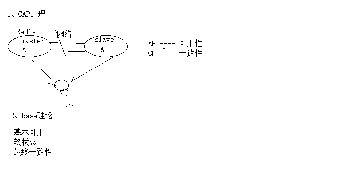

## 02_分布式应用场景

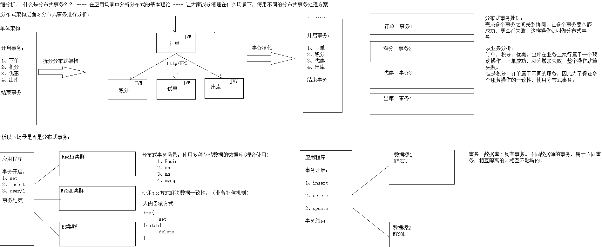

## 03_分布式事务事务模型

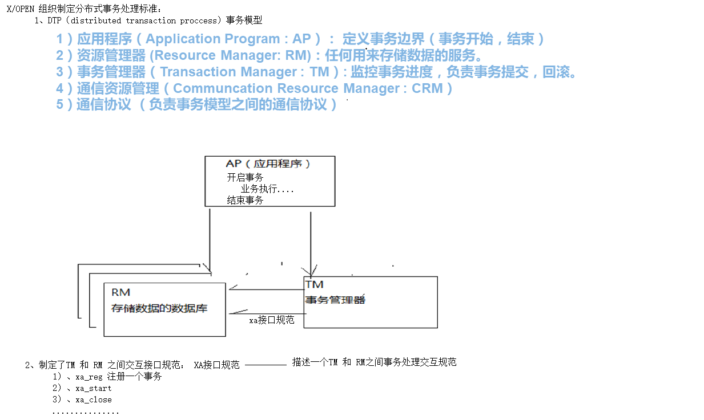

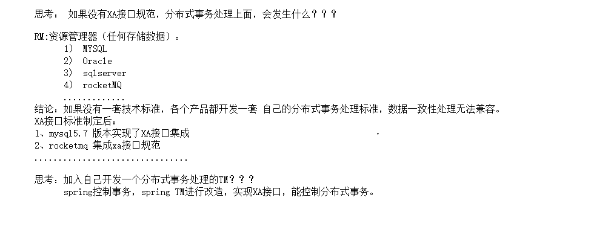

## 04_全局事务树模型

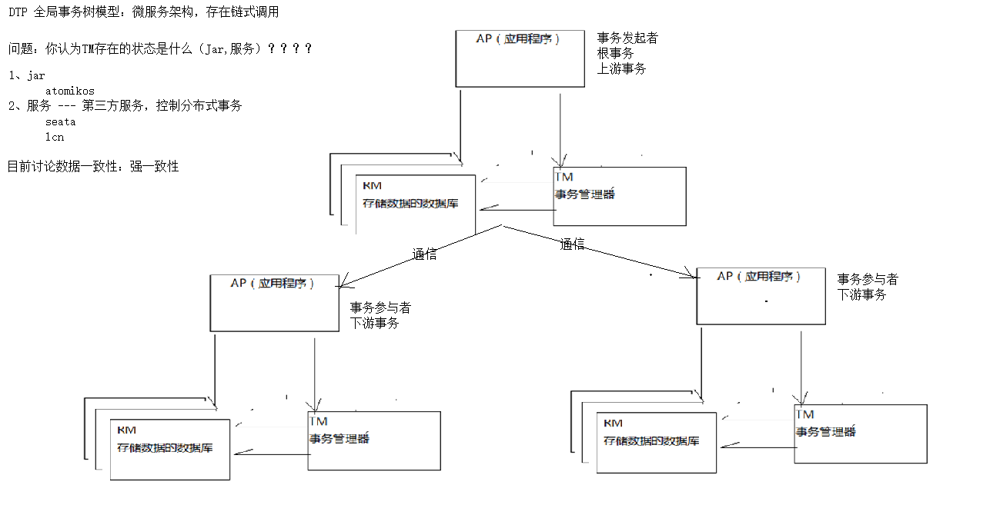

## 05_2pc事务处理方法

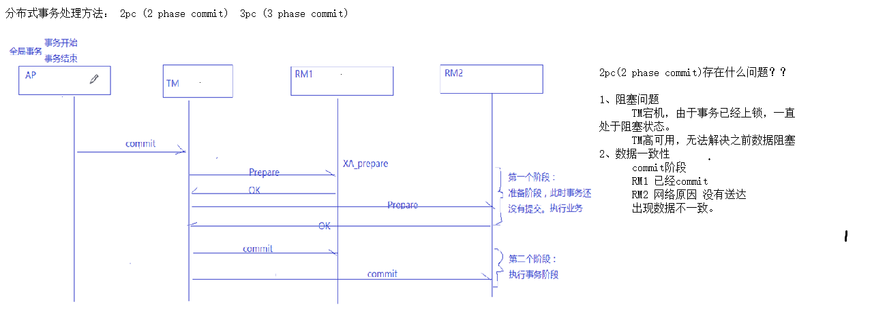

## 06_lcn分布式事务

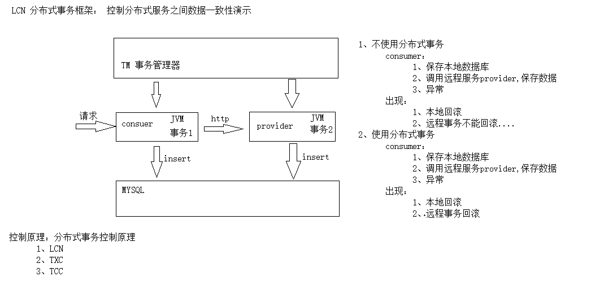

## 07_分布式事务处理原理

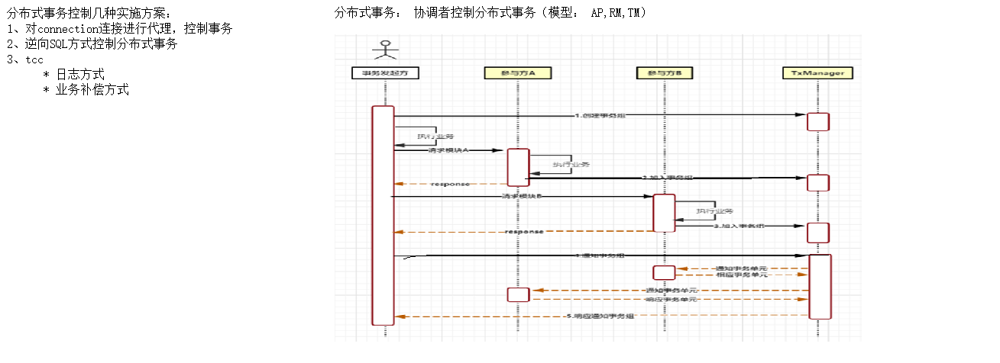

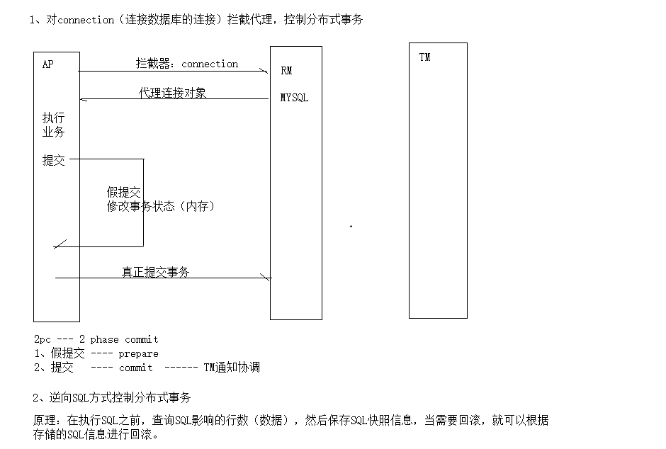

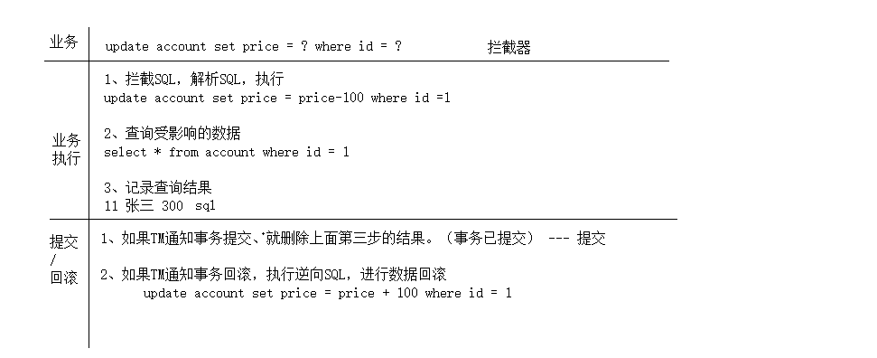

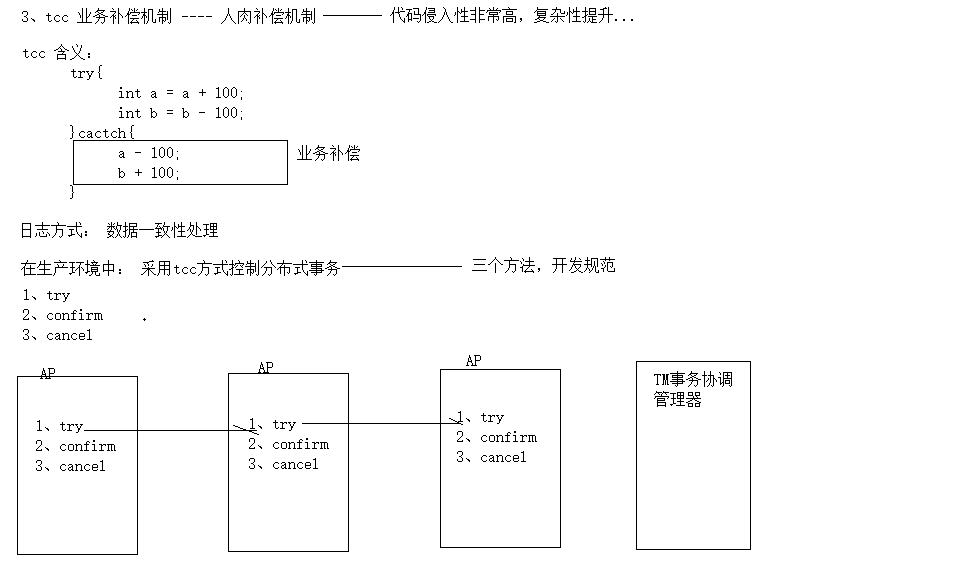

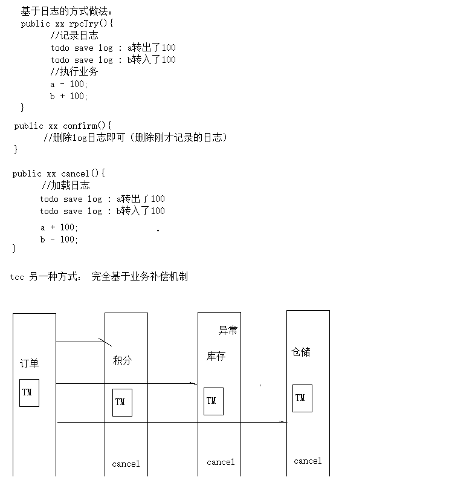

## 08_最终消息一致性

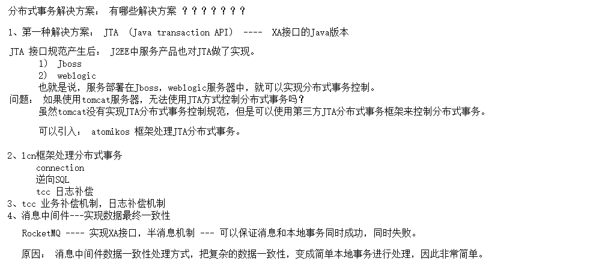

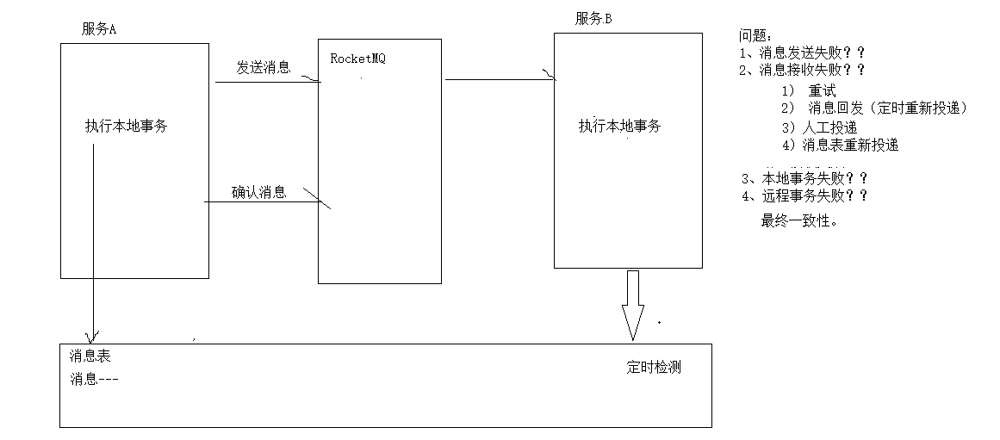

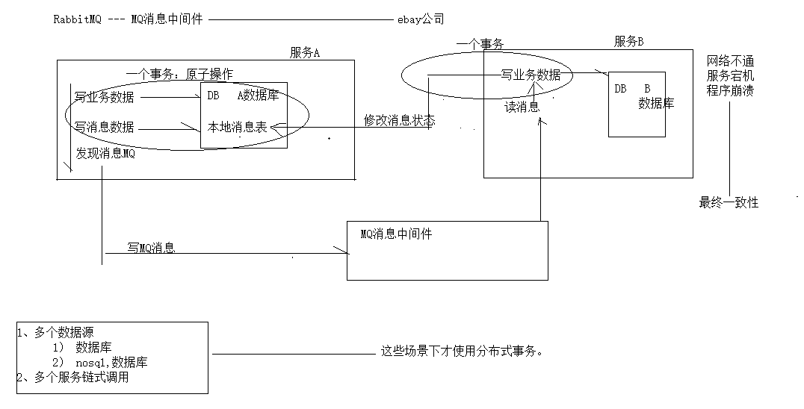

# 事务的基本概念-ACID

事务(Transaction)是访问并可能更新数据库中各种数据项的一个程序执行单元 (unit)。在关系数据库中，一个事务由一组SQL语句组成。事务应该具有4个属性： 原子性、一致性、隔离性、持久性。这四个属性通常称为ACID特性。

l **原\****子***\*性**

**个事务是一个不可分割的工作单位，事务中包括的诸操作要么都做，要么都不做**

l **一\****致***\*性**

**事务必须是使数据库从一个一致性状态变到另一个一致性状态，事务的中间状态不能被观察到的** l **隔\****离***\*性**

**一个事务的执行不能被其他事务干扰。即一个事务内部的操作及使用的数据对并发的其他事务是隔 离的，并发执行的各个事务之间不能互相干扰**

l **持\****久***\*性**

**一个事务的执行不能被其他事务干扰。即一个事务内部的操作及使用的数据对并发的其他事务是隔**2 **离的，并发执行的各个事务之间不能互相干扰**

===

# 事务的基本概念-本地事务

大多数场景下，我们的应用都只需要操作单一的数据库，这种情况下的事务 称之为本地事务(`Local Transaction`)。本地事务的ACID特性是数据库直接提供 支持。本地事务应用架构如下所示：

3

===

# 事务的基本概念-案例

一个事务单元：下单（保存）、减库存、加积分、出库单

4

===

# CAP理论&BASE理论柔性事务

===

**CAP\****理论***\*&BASE\****理论柔性事务***\*-\****CAP***\*定理**

===

**CAP\****理论***\*&BASE\****理论柔性事务***\*-\****Base***\*理论**

**BASE\****是***\*Basically** **Available\****（***\*基\****本***\*可\****用***\*）\****、***\*Soft** **state\****（***\*软\****状***\*态\****）***\*和\****Eventually** **consistent** **（\****最***\*终一致性 ）三个短语的缩写。**

- **基本可用（\****Basically Available***\*）**

**指分布式系统在出现不可预知故障的时候，允许损失部分可用性。**

- **软状态（** **Soft** **State\****）**

**指允许系统中的数据存在中间状态，并认为该中间状态的存在不会影响系统的整体可用性。**

- **最终一致（** **Eventual** **Consistency** **）**

**强调的是所有的数据更新操作，在经过一段时间的同步之后，最终都能够达到一个一致的状态**

===

**CAP\****理论***\*&\****BASE***\*理\****论***\*柔\****性***\*事\****务***\*-\****柔***\*性事务** **最大努力通知（非可靠消息、定期校对）**

**可靠消息最终一致性（异步确保型）**

**TCC** **（\****两***\*阶段型、补偿型）**

===

# 分布式事务应用场景及问题

===

# 分布式事务-基本概念

当下互联网绝大部分公司都进行了数据库拆分和服务化(SOA),微服务。

在这种情况下，完成某一个业务功能可能需要横跨多个服务，操作多个数据库。 这就涉及到到了分布式事务，用需要操作的资源位于多个资源服务器上，而应用

需要保证对于多个资源服务器的数据的操作，要么全部成功，要么全部失败。 本质上来说，分布式事务就是为了保证不同资源服务器的数据一致性

===

# 分布式事务-跨库事务

跨库事务指的是，一个应用某个功能需要操作多个库，不同的库中存储不同 的业务数据。在真实应用场景下，一个业务操作多个库也是比较常见的，那么多 个数据库是之间是互相不可见的，如何保证数据库的一致性呢？此时就必须使用 分布式事务的解决方案。

===

**分布式事务\****-***\*跨服务事务**

- 多个服务之间事务处理（一个服务调用多个服务）
- 多数据源事务处理（一个服务访问多个数据源，分表分库）

===

**分布式事务事务模型**

===

# 分布式事务事务模型-X/OPEN

**X/Open\****，即现在的***\*open** **group\****，是一个独立的组织，主要负责制定各种行业技术标准。 官网地址：***\*http://www.opengroup.org/\****。***\*X/Open\****组***\*织\****主***\*要\****由***\*各大知名公司或者厂商进行支 持，这些组织不光遵循\****X***\*/Open\****组***\*织\****定***\*义\****的***\*行业技术标准，也参与到标准的制定**

===

**分布式事务事务模型\****-***\*DTP\****事务模型**

- **应用程序（\****Application** **Program** **:** **AP\****）***\*：** **定义事务边界（事务开始，结束）**
- **资源管理器** **(Resource** **Manager:** **RM)\****：***\*任\****何***\*用\****来***\*存\****储***\*数\****据***\*的\****服***\*务\****。**
- **事务管理器（\****Transaction** **Manager : TM\****）***\*:** **监\****控***\*事\****务***\*进\****度，负责事务提交，回滚。** **4\****）通信资源管理（***\*Communcation Resource Manager : CRM\****）**

**5\****） 通信协议 （负责事务模型之间的通信协议）**

===

**分布式事务事务模型\****-***\*DTP\****模型全局事务树**

**当一个\****DTP***\*模型中，存在多个模型实例时，会形成一种树形条用关系，叫做\*\*\*\*\*\*\*\*\*\*\****全局事务树形结构***\*(Global Transaction Tree Structure)\*\**\***，如下图所示：**

===

**分布式事务事务模型\****-***\*XA\****规***\*范**

**XA\****规***\*范\****的***\*最主要的作用是，就是定义了\****R***\*M-TM\****的***\*交\****互***\*接\****口**

===

**分布式事务事务模型\****-***\*2PC(2\****阶***\*段\****提***\*交\****)**

**两阶段提交协议（\****Two** **Phase Commit\****）***\*，\****XA***\*规范对其进行了优化。而从字面意思来理解，\****Two** **Phase** **Commit\****，***\*就\****是***\*将\****提***\*交\****(***\*commit)\****过***\*程\****划***\*分为\****2***\*个阶段\****(Phase)***\*：**

===

**分布式事务事务模型\****-***\*3PC(3\****阶***\*段\****提***\*交\****)**

**三阶段提交（\****3PC)[Three-phase** **commit]\****，***\*是\****二***\*阶\****段***\*提\****交***\*（\****2PC***\*）\****的***\*改\****进***\*版\****本***\*。\****与***\*两\****阶***\*段\****提***\*交\****不***\*同** **的是，三阶段提交有两个改动点**

**-** **引入超时机制。同时在协调者和参与者中都引入超时机制。**

**-** **在第一阶段和第二阶段中插入一个准备阶段。保证了在最后提交阶段之前各参与节点的状态是一致的。 也就是说，除了引入超时机制之外，\****3PC***\*把\****2PC***\*的准备阶段再次一分为二，这样三阶段提交就有** **CanCommit\****、***\*PreCommit\****、***\*DoCommit\****三***\*个\****阶段**

===

# LCN分布式事务控制效果演示

===

# LCN分布式事务框架-模拟异常

**1\****）***\*不控制分布式事务，模拟异常**

**测试结果： 结果本地事务回滚，远程服务事务没有回滚。**

===

**LCN\****分***\*布式事务框架\****-***\*事务控制**

**lcn\****控制***\*事\****务（***\*无\****侵入式控制事务，只需要加注解即可控制） 测试结果：本地事务，远程服务事务，都是些回滚。**

===

# 分布式事务解决方案

===

## 分布式事务解决方案-JTA

**Java\****事务***\*API\****（***\*JTA\****：***\*Java Transaction API** **）\****和***\*它\****的***\*同\****胞***\*J\****ava***\*事\****务***\*服\****务***\*（\****JTS***\*：\****Java** **Transaction** **Service\****）***\*，\****为***\*J2EE\****平***\*台\****提***\*供\****了***\*分\****布***\*式\****事***\*务\****服***\*务\****（***\*distributed** **transaction\****）***\*的能力。 某种程度上，可以 认为\****JTA***\*规范是\****XA***\*规范的\****Java***\*版\****，***\*其把\****XA***\*规范中规定的\****DTP***\*模型交互接口抽象成\****Java***\*接口中的方法，并 规定每个方法要实现什么样的功能。**

===

## 分布式事务解决方案-atomikos

**项目中使用到多数据源的时候大多数采用\****Atomikos***\*解\****决***\*分\****布***\*式\****事***\*务\****问***\*题\****，***\*Atomikos\****底层是基于***\*X\****A***\*协 议的两阶段提交方案。**

===

## 分布式事务解决方案-atomikos

**实现了\****JTA/XA***\*规\****范***\*中\****的***\*事\****务***\*管\****理***\*器\****(***\*Transaction** **Manager)\****应***\*该\****实现的相关接口，如：** **UserTransaction\****实***\*现\****是***\*c\****om.atomikos.icatch.jta.UserTransactionImp***\*，\****用户只需要直接操作这个**

**类**

===

## 分布式事务解决方案-LCN

**TX-LCN\****由***\*两\****大***\*模\****块组成***\*, TxClient\****、***\*TxManager\****，***\*TxClient\****作** **为模块的依赖框架，提供\****T***\*X-LCN\****的标准支持，***\*TxManager** **作\****为***\*分** **布式事务的控制器**

**事务发起方或者参与都由\****T***\*xClient\****端***\*来控制**

===

**分布式事务解决方案\****-***\*LCN**

===

**分布式事务解决方案\****-***\*LCN**

**原理：**

LCN模式是通过代理Connection的方式实现对本地事务的操作，然后在由T xManager统一协调控制事 务。当本地事务提交回滚或者关闭连接时将会执行假操作，该代理的连接将由LCN连接池管理。

**特点：**

该模式对代码的嵌入性为低。

该模式仅限于本地存在连接对象且可通过连接对象控制事务的模块。

该模式下的事务提交与回滚是由本地事务方控制，对于数据一致性上有较高的保障。

该模式缺陷在于代理的连接需要随事务发起方一共释放连接，增加了连接占用的时间。

===

# 分布式事务解决方案-TCC

**TCC\****事务机制相对于传统事务机制（***\*X/Open** **XA Two-Phase-Commit\****）***\*，\****其特征在于它不依赖资源 管理器***\*(RM)\****对***\*XA\****的支持，而是通过对（由业务系统提供的）业务逻辑的调度来实现分布式事务。**

**主要由三步操作：**

**Try:** **尝试执行业务**

**Confirm:\****确认执行业务**

**Cancel:** **取消执行业务。**

**特点：**

该模式对代码的嵌入性高，要求每个业务需要写三种步骤的操作。

该模式对有无本地事务控制都可以支持使用面广。

数据一致性控制几乎完全由开发者控制，对业务开发难度要求高。

===

# 分布式事务解决方案-TCC-Try

**完成所有业务检查（一致性），预留业务资源\****(***\*准\****隔离性***\*)**

===

# 分布式事务解决方案-TCC-Confirm

订单服务内的 TCC 事务框架会负责跟其他各个服务内的 TCC 事务框架进行通信，依次调用各个服务的 Confirm 逻辑

===

# 分布式事务解决方案-TCC-cancel 取消Try阶段预留的业务资源

===

**分布式事务解决方案\****-***\*TCC-cancel**

===

**1\****、***\*cancel\****或***\*者\****c***\*onfirm\****出现异常了，你怎么处理？**

**分布式事务解决方案\****-***\*TCC-cancel-** **遗\****留问题**

**2\****、大量逻辑重复**

===

**分布式事务解决方案\****-***\*RocketMQ**

**实际系统的开发过程中，可能服务间的调用是异步的（\****MQ***\*消息中间件异步通知）、那么如何保证这 种异步的各个服务间的分布式事务呢？**