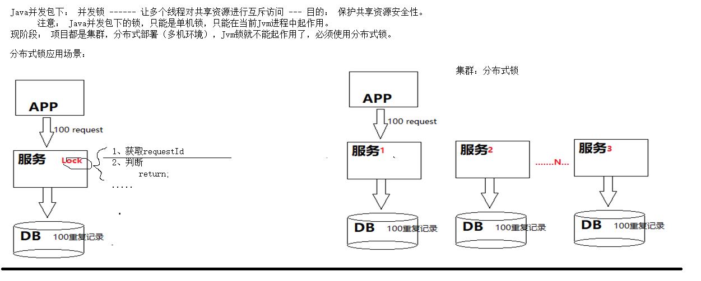
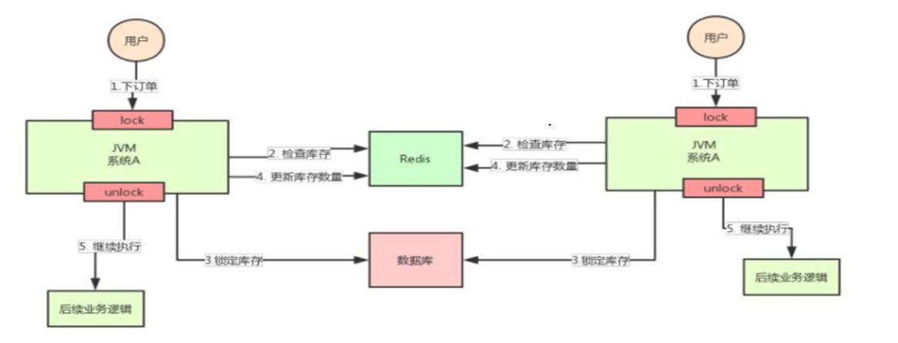
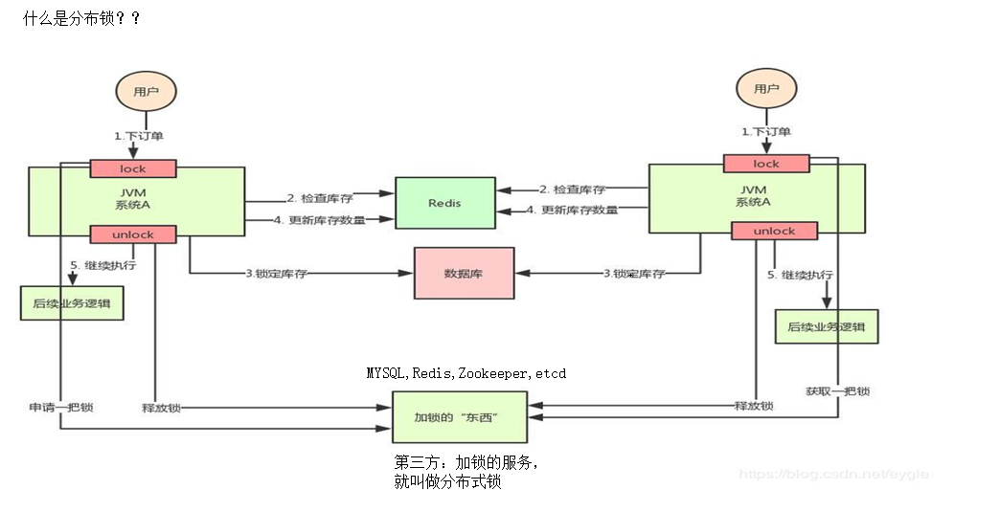
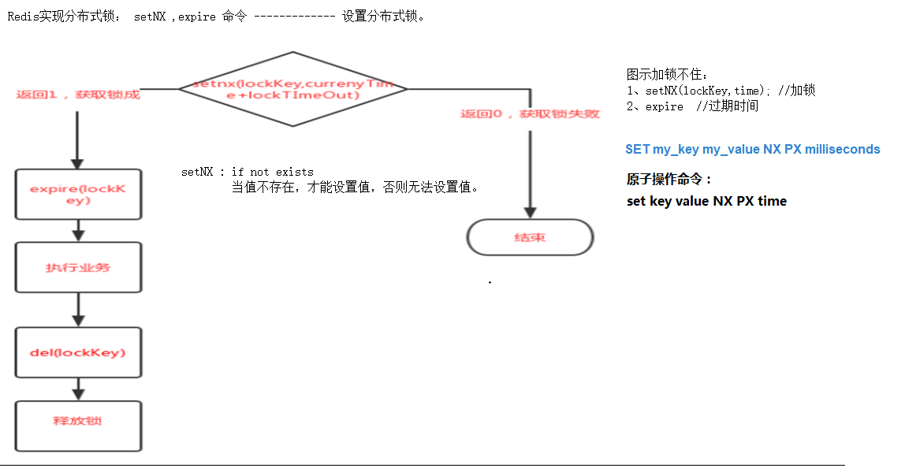
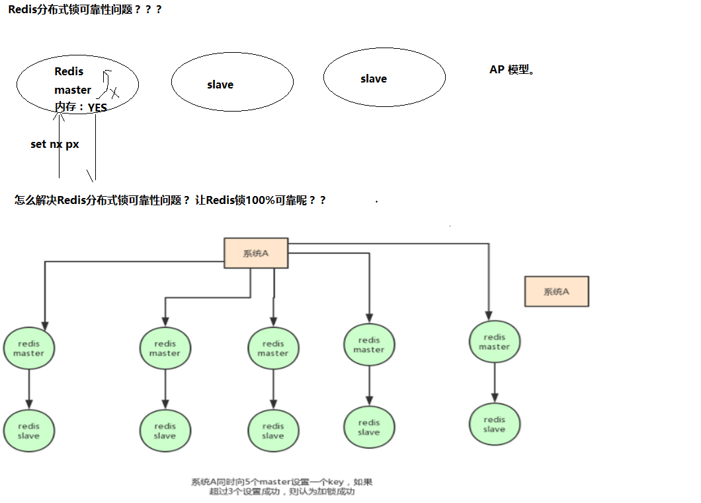
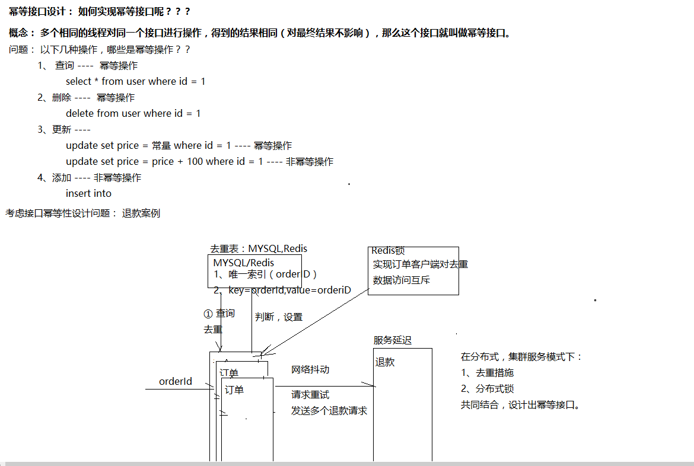

# 认识分布式锁的使用场景

# 笔记

## 01_分布式锁应用场景

## 02_锁和事务区别

## 03_Redis锁

## 04_分布式锁可靠性

## 05_幂等性接口设计实现

# 为什么要用分布式锁？

**APP\****快***\*速连续点击会向服务器连续发起请求，导致数据库出现重复数据（非 阻塞锁）**

- **表单重复提交**
- **重复刷单**
- **APP\****重***\*复请求**

# 为什么要用分布式锁？-- 其他业务

**经典场景案例**

- **秒杀**
- **车票**
- **退款**
- **订单**

**………………**

**无论是超卖，还是重复退款，都是没有对需要保护的资源或业务进行完善的 保护而造成的，从设计方面一定要避免这种情况的发生**

# 分布式锁基本概念及基本特性

# 什么是分布式锁

l**单\****机***\*锁\****（线程锁）**

**synchronized\****、***\*Lock**

l**分\****布***\*式\****锁（多服务共享锁）**

**在分布式的部署环境下，通过锁机制来让多客户 端互斥的对共享资源进行访问**

# 分布式锁的基本概念

l **基\****本***\*概\****念**

***** **多任务环境中才需要**

***** **任务都需要对同一共享资源进行写操作；**

***** **对资源的访问是互斥的（串行化）**

l **状\****态**

***** **任务通过竞争获取锁才能对该资源进行操作\****(***\*①\****竞***\*争\****锁***\*)\****；**

***** **当有一个任务在对资源进行更新时（②占有锁），**

***** **其他任务都不可以对这个资源进行操作（③任务阻塞），**

***** **直到该任务完成更新\****(***\*④\****释***\*放\****锁***\*)\****；**

l **特\****点**

***** **排他性：在同一时间只会有一个客户端能获取到锁，其它客户端无法同时获取**

***** **避免死锁：这把锁在一段有限的时间之后，一定会被释放（正常释放或异常释放）** ***** **高可用：获取或释放锁的机制必须高可用且性能佳**

# 锁和事务的区别？

**1\****）***\*锁\****:**

**单进程的系统中，存在多线程同时操作一个公共变量，此时需要加锁对变量进行同步操作，保证多线程 的操作线性执行消除并发修改。解决的是单进程中的多线程并发问题。**

**2\****）***\*分\****布***\*式锁\****:**

**只要的应用场景是在集群模式的多个相同服务，可能会部署在不同机器上，解决进程间安全问题，防止 多进程同时操作一个变量或者数据库。解决的是多进程的并发问题**

**3\****）***\*事\****务**

**解决一个会话过程中，上下文的修改对所有\**\*\*\*\*\****数据库***\**\*\*\*\*\**\***表的操作要么全部成功，要不全部失败。所以应 用在***\*service\****层。解决的是一个会话中的操作的数据一致性。**

**4\****）***\*分\****布***\*式事务**

**解决一个联动操作，比如一个商品的买卖分为\****:**

- **添加商品到购物车**
- **修改商品库存\****-***\*1**

**此时购物车服务和商品库存服务可能部署在两台电脑，这时候需要保证对两个服务的操作都全部成功或 者全部回退。解决的是组合服务的数据操作的一致性问题**

# DB实现分布式锁方案

数据库(database)实现分布式锁 乐观锁

数据库(database)实现分布式锁 悲观锁

# Redis分布式锁的可靠性思考 redis有3种部署方式：

- **单机模式**
- **master-slave** **+ sentinel\****选***\*举模式**
- **redis cluster\****模***\*式**

# Zookeeper实现分布式锁的实现流程

- **性能上可能并没有缓存服务那么高，因为每次在创建锁和释放锁的过程中，都要动态创建、销 毁临时节点来实现锁功能**
- **ZK** **中创建和删除节点只能通过** **Leader** **服\****务器来执行，然后将数据同步到所有的** **Follower** **机器上**
- **取舍**

# 三种分布式锁方案小结

**上面几种方式，哪种方式都无法做到完美。就像\****CAP***\*一\****样，在复杂性、可靠性、性能等方面无法同时满足。 所以，根据不同的应用场景选择最适合自己的才是王道。**

**从理解的难易程度角度（从低到高）**

**数据库** **>** **缓存** **>** **Zookeeper**

**从实现的复杂性角度（从低到高）**

**Zookeeper >=** **缓存** **>** **数据库**

**从性能角度（从高到低）**

**缓存** **>** **Zookeeper** **>=** **数据库**

**从可靠性角度（从高到低）**

**Zookeeper >** **缓\****存** **>** **数\****据***\*库**