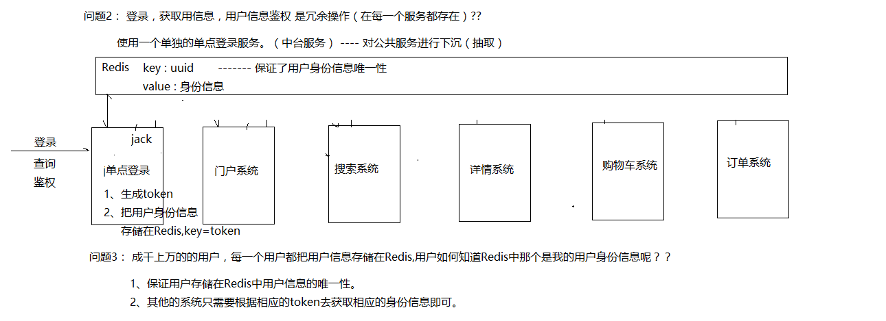

# 第八讲:授权&购物车&单点登录&订单&支付

# 笔记

## 01_Redis锁高可用性

## 02_幂等性接口设计

## 03_单点登录设计

## 04_购物车业务设计

# 1 单点登录

## 1.1 单点登录场景

（1 ）、什么是单点登录？？

定义：在分布式系统中，用户只需要登录一个系统，访问其他的系统的时候，用户就不 需要再次登录。这样登录方式，就叫做单点登录。

# 2 购物车

购物车设计思考：

商城类型网站：在线教育网站（购物车），O2O 网站（购物车），电子商务（购物车） 交易类型网站：基本上都有购物车

购物车设计类型：

B2C 类型： 商家对客户

B2B2C 类型： 商家对商家对客户

购物车业务设计：

1、未登录---添加购物车

客户本地磁盘对购物车数据进行存储（换一台电脑不能看见这个商品） 2、登录 ---添加购物车

使用 Redis 存储购物车数据即可。

购物车类型：数据结构设计

B2C 类型：一个用户可以购买一个商家的多个商品

List

B2B2C 类型：一个用户可以购买多个商家的多个商品。

List

|-sellerId

|-sellerName

|-List

# 3 订单系统

## 3.1 订单相关表设计

首先用户浏览商品，将看中的商品加入到购物车，这里应该有一张购物车表 购物车表（order_cart）

购物车表（order_cart）

选中购物车中的某些商品，进行下单，订单表也就应运而生 Spu: 货品：华为 meta30 手机

Sku: 商品：

4G 玫瑰金 华为 meta30 手机

4G 白色 华为 meta30 手机

4G 蓝色 华为 meta30 手机

8G …..

16G ….

如果购物车里面有多个店铺的商品，那么应该分别为这些店铺生成对应的订单。平台可以进 行合并支付，但是订单还是要归店铺的。

上面是订单的基本信息，接下来是订单商品相关。

商品价格

这里 order_info 与 order_product 是 1 对多的关系，一个订单可能有多个商品。 下单完成，等着发货，物流信息不能少，加下来是物流表

物流表（order_logistics）

物流跟踪表（order_logistics_flow）

加下来设计一下发票表

订单发票（order_invoice）

下单完成后进行支付，这里会有支付记录表，方便以后对账 支付记录表（order_pay_history）

用户收到货后，可以进行评论，下面是评论表

订单评论（order_product_comment ）

注意：如果一开始就想做分布式系统，建议把商品相关的表和订单表放在同一个数据库中， 一则是因为订单业务需要查询商品相关的数据，二则是因为放在一起做事务比较容易，不然 需要做分布式事务，加大了开发成本。前期项目规划的时候这点需要考虑到。

## 3.2 订单类型

订单类型：B2C，B2B2C, C2C 类型

2 种类型：

- 单商户类型
- 多商户类型

单商户类型：B2C

下单：订单à 购物车（商品）à 订单（订单—订单编号（总价格），订单明细） 支付：订单à 支付所产生的支付记录，叫做支付订单，支付流水号 --- 支付订单编号

多商户类型：B2B2C – JD PDD TB

一个用户可以购买多个商家的多个商品

问题 1：订单怎么分配？

一个订单

多个订单

问题 2：支付怎么实现？

支付的钱分配给多个商家。

问题 3：提交订单后，此时订单处于什么状态？

待支付

问题 4： 提交订单，减库存— 锁）分布式锁

订单提交： 一个商家，就会产生一个订单

支付：统一支付，产生支付订单

后台进行处理： 统一支付后，金额进入运营商账户，此时这些金额将会在后台根据订单 编号进行最终结算。

## 3.3 订单拆分

### 3.3.1 逻辑拆分

注意：提交订单-à 很多不同的商品 + 运费 + 补运费+ 优惠券

在逻辑上，订单应该做一个逻辑上拆分，基于这样的拆分方式，才可以支付退款，退货，优 惠券的功能。

### 3.3.2 金额拆分

### 3.3.3 订单状态机

待付款（1 ）、待发货（2 ：已经付完毕）、已发货（3）、已完成（4）、已关闭（5）、退款状态 （6 ）

用户支付完毕：修改订单状态为 2---1、Redis 订单状态

2、状态机

# 4 支付

二维码支付

1）、向支付平台下单，返回支付地址（返回支付二维码( 支付宝)），生成二维码 2）、扫描支付即可

## 4.1 微信支付

微信支付流程：

微信支付：

二维码生成是由 js 来进行生成的。 微信支付平台仅仅负责返回支付地址即可。 **4.2** **支\****付***\*宝**

支付流程：

支付宝支付：

后台生成二维码，前端不需要做任何事情。