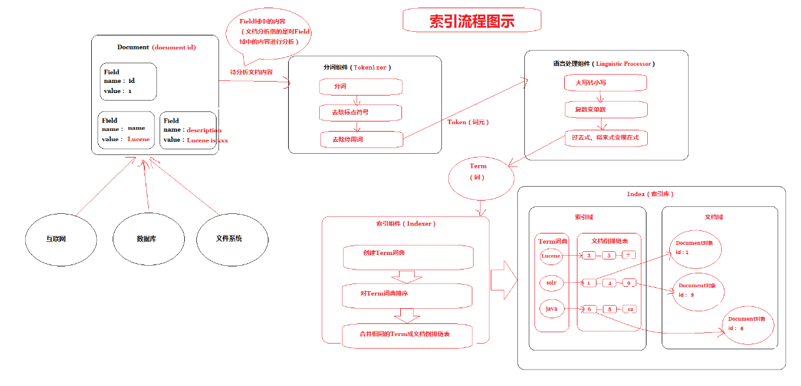
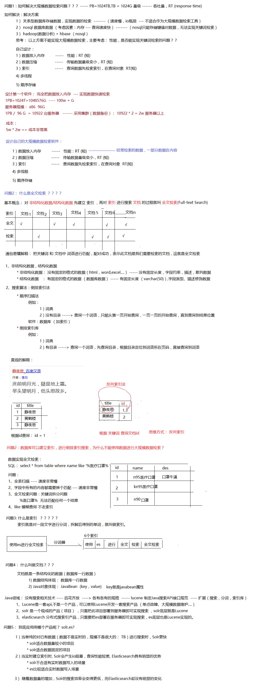
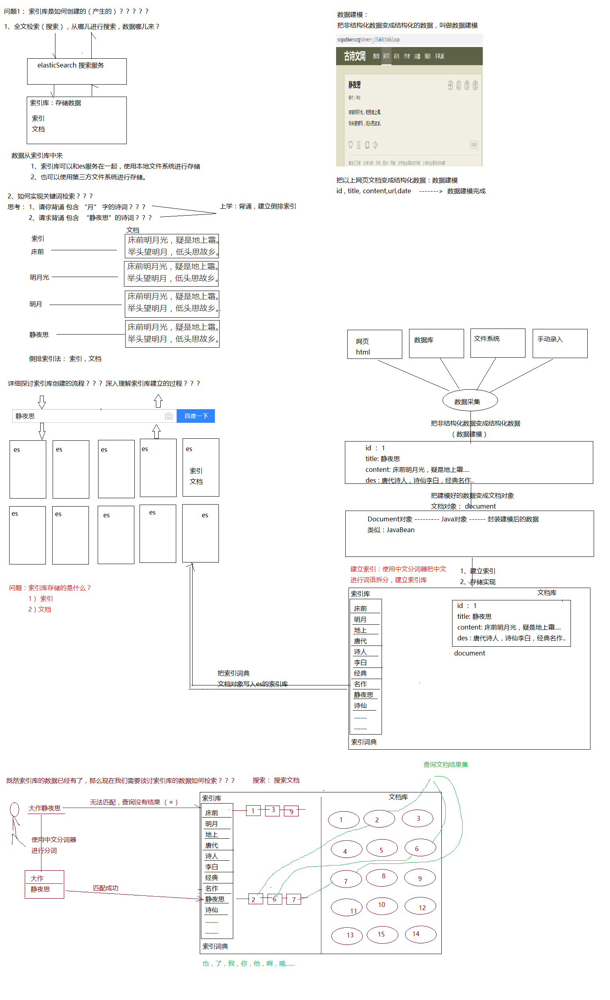
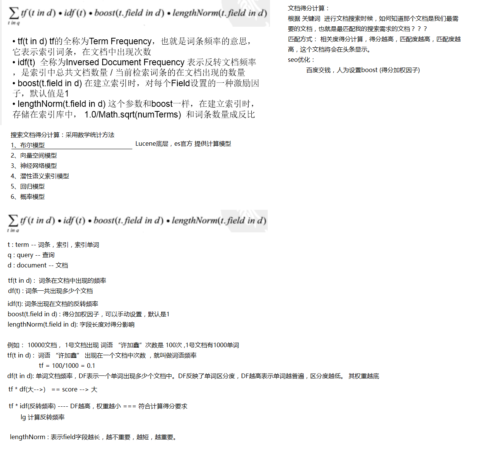
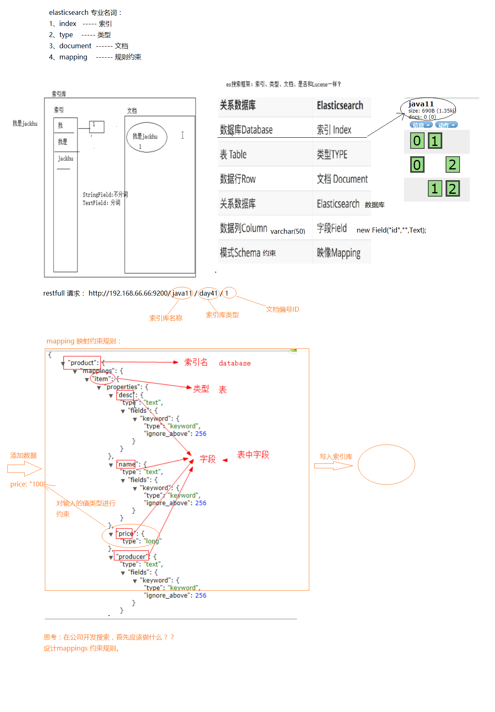
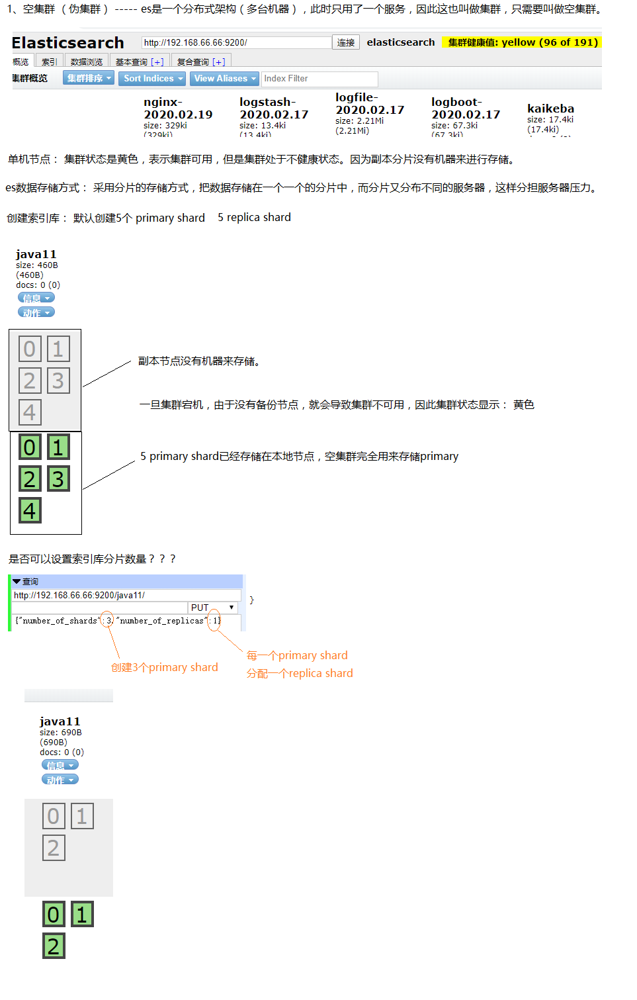
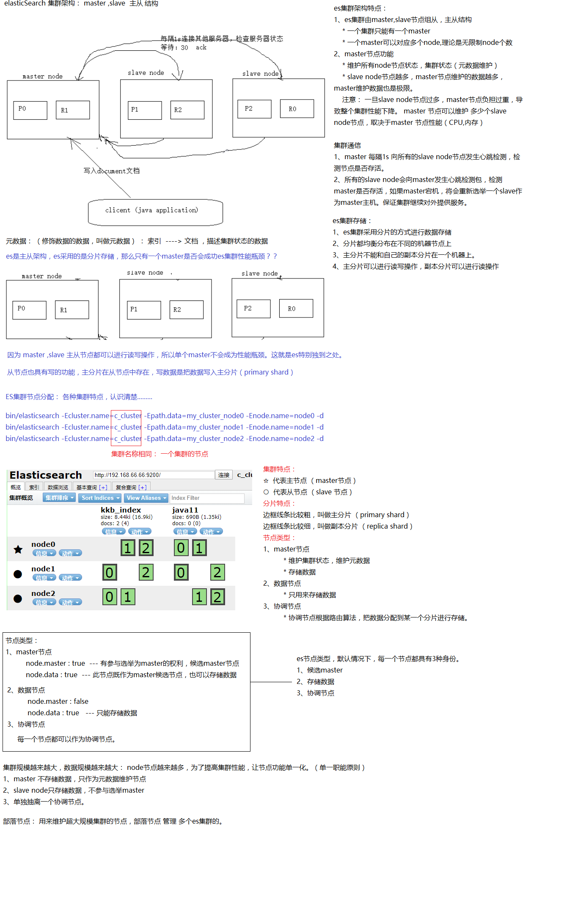
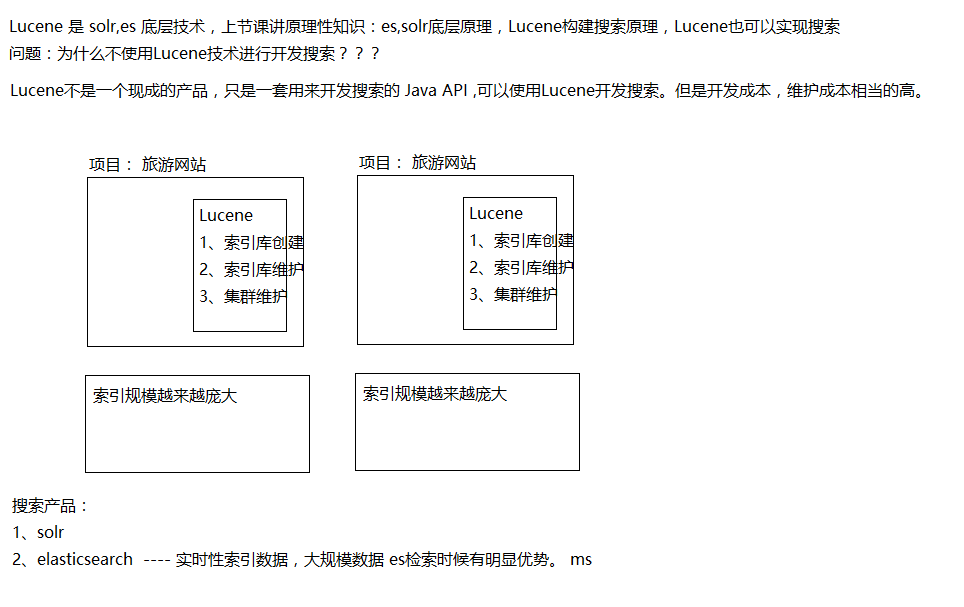

# 笔记

## 01_索引流程图

## 02_全文检索基本理论知识

## 03_索引库创建检索流程原理

## 04_文档得分算法

## 05_es文档及映射

## 06_单机节点集群

## 07_es集群架构特点

## 08_为什么使用es

# 一、开篇几个问题

## 1、大规模数据如何检索？

当系统数据量上了10亿、100亿条的时候，我们在做系统架构的时候通常会从以下角度去考虑：

1）用什么数据库好？(MySQL、sybase、Oracle、达梦、神通、MongoDB、Hbase…)

2）如何解决单点故障；(lvs、F5、A10、Zookeeper、MQ)

3）如何保证数据安全性；(热备、冷备、异地多活)

4）如何解决检索难题；(数据库代理中间件：mysql-proxy、Cobar、MaxScale等;)

5）如何解决统计分析问题；(离线、近实时)

## 2、传统数据库的应对解决方案？

对于关系型数据，我们通常采用以下或类似架构去解决查询瓶颈和写入瓶颈： 解决要点： 1）通过主从备份解决数据安全性问题； 2）通过数据库代理中间件心跳监测，解决单点故障问题； 3）通过代理中间件将查询语句分发到各个slave节点进行查询，并汇总结果

4）通过分表分库解决读写效率问题

## 3、非关系型数据库的解决方案？

对于Nosql数据库，以redis为例，其它原理类似： 解决要点： 1）通过副本备份保证数据安全性； 2）通过节点竞选机制解决单点问题； 3）先从配置库检索分片信息，然后将请求分发到各个节点，最后由路由节点合并汇总结果

## 4、完全把数据放入内存怎么样？

完全把数据放在内存中是不可靠的，实际上也不太现实，当我们的数据达到PB级别时，按照每个节点96G内存计算，在内存完全装满的数据情况下，我们需要的机器是：1PB=1024T=1048576G

**节点数\****=1048576/96=10922***\*个**

实际上，考虑到数据备份，节点数往往在2.5万台左右。成本巨大决定了其不现实！

从前面我们了解到，把数据放在内存也好，不放在内存也好，都不能完完全全解决问题。

全部放在内存速度问题是解决了，但成本问题上来了。

为解决以上问题，从源头着手分析，通常会从以下方式来寻找方法：

1、存储数据时按有序存储；

2、将数据和索引分离；

3、压缩数据；

# 二、全文检索技术

## 1、什么是全文检索？

什么叫做全文检索呢？这要从我们生活中的数据说起。

我们生活中的数据总体分为两种：**结构化数据和非结构化数据**。

**结构化数据**：指具有固定格式或有限长度的数据，如数据库，元数据等。

**非结构化数据**：指不定长或无固定格式的数据，如 互联网数据、邮件，word文档等。

对非结构化数据顺序扫描很慢，对结构化数据的搜索却相对较快，那么把我们的非结构化数据想办法弄得有一定结构不就行了吗？这就是全文检索的基本思路，也即将非结构化数据中的一部分信息提取出来，重新组织，使其变得有一定结构，然后对此有一定结构的数据进行搜索，从而达到搜索相对较快的目的。这部分从非结构化数据中提取出的然后重新组织的信息，我们称之**索引** 。

**非结构化数据又一种叫法叫全文数据。**

按照数据的分类，搜索也分为两种：

**对结构化数据的搜索：** 如对数据库的搜索，用SQL语句。再如对元数据的搜索，如利用windows搜索对文件名，类型，修改时间进行搜索等。

**对非结构化数据的搜索：** 如用Google和百度可以搜索大量内容数据。

对非结构化数据也即全文数据的搜索主要有两种方法：**顺序扫描法和反向索引法**。

**顺序扫描法**：所谓顺序扫描法，就是顺序扫描每个文档内容，看看是否有要搜索的关键字，实现查

找文档的功能，也就是根据文档找词。

**反向索引法**：所谓反向索引，就是提前将搜索的关键字建成索引，然后再根据索引查找文档，也就是根据词找文档。

**这种先建立** 索引 **，再对索引进行** 搜索 **文档的过程就叫** 全文检索(Full**-**text Search) 。

## 2、全文检索场景

搜索引擎

站内搜索

系统文件搜索

## 3、全文检索相关技术

1. Lucene：如果使用该技术实现，需要对Lucene的API和底层原理非常了解，而且需要编写大量的

Java代码。

1. Solr：使用java实现的一个web应用，可以使用rest方式的http请求，进行远程API的调用。
2. ElasticSearch(ES)：可以使用rest方式的http请求，进行远程API的调用。

## 4、Solr和ES的比较

ElasticSearch vs Solr 检索速度

当单纯的对**已有数据**进行搜索时，Solr更快。

**当实时建立索引时\****, Solr***\*会产生\****io***\*阻塞，查询性能较差\****, Elasticsearch***\*具有明显的优势。**

**随着数据量的增加，\****Solr***\*的搜索效率会变得更低，而\****Elasticsearch***\*却没有明显的变化**。

**大型互联网公司，实际生产环境测试，将搜索引擎从\****Solr***\*转到\****Elasticsearch***\*以后的平均查询速度有了\****50***\*倍的提升。**

总结：

二者安装都很简单；

Solr 利用 Zookeeper 进行分布式管理，而 Elasticsearch 自身带有分布式协调管理功能; Solr 支持更多格式的数据，而 Elasticsearch 仅支持json文件格式；

Solr 官方提供的功能更多，而 Elasticsearch 本身更注重于核心功能，高级功能多有第三方插件提供；

Solr 在传统的搜索应用中表现好于 Elasticsearch，但在处理实时搜索应用时效率明显低于Elasticsearch。

**最终的结论：**

Solr 是传统搜索应用的有力解决方案，但 Elasticsearch 更适用于新兴的实时搜索应用。

# 三、全文检索的流程

## 1、流程总览

**全文检索的流程分为两大流程：索引创建、搜索索引**

索引创建：将现实世界中所有的结构化和非结构化数据提取信息，创建索引的过程。

搜索索引：就是得到用户的查询请求，搜索创建的索引，然后返回结果的过程。

- \#**温馨提示：想搞清楚全文检索，必须要搞清楚下面三个问题：**

2 **1. \**索引库里面究竟存些什么？**(Index)**

3 **2. \**如何创建索引？**(Indexing)**

4 **3. \**如何对索引进行搜索？**(Search)**

## 2、索引流程

上图详细演示了一下： 创建索引的过程 （此过程为英文环境下的索引库构建过程，中文有一定差异）

# 四、ElasticSearch介绍

## 1、ES基本概述

- Elasticserach**由来：许多年前，一个叫**Shay Banon**的待业工程师跟随他的新婚妻子来到伦敦，他**

**的妻子想在伦敦学习做一名厨师。而他在伦敦寻找工作的期间，接触到了**Lucene**的早期版本，他想为自己的妻子开发一个方便搜索菜谱的应用。**

2

3 Elasticsearch**发布的第一个版本是在**2010**年的二月份，从那之后，**Elasticsearch**便成了**

Github**上最受人瞩目的项目之一，并且很快就有超过**300**名开发者加入进来贡献了自己的代码。后来**

Shay**和另一位合伙人成立了公司专注打造**Elasticsearch**，他们对**Elasticsearch**进行了一些商业**

**化的包装和支持。但是，**Elasticsearch**承诺，永远都将是开源并且免费的。**

4

- Elastic**为主体的公司提供了很多优秀的解决方案，拿到很多的投资，现已上市，后来收购**logstash,kibana**及一些其他的服务。**

6 * ElasticSearch

7* Logstash

8* Kibana .....

9

- **据国际权威的数据库产品评测机构**DBEngines**的统计，在**2016**年**1**月，**Elasticsearch**已超过**Solr

**等，成为排名第一的搜索引擎类应用**.

## 2、ES是什么？

1）ES = elasticsearch简写， Elasticsearch是一个开源的**高扩展**的**分布式**全文检索引擎.

2）Elasticsearch也使用Java开发并使用**Lucene**作为其核心来实现所有索引和搜索的功能。但是它的目的是通过简单的RESTful API来隐藏Lucene的复杂性，从而让全文搜索变得简单

Elasticsearch是面向文档型数据库，一条数据在这里就是一个文档，用JSON作为文档序列化的格式，比如下面这条用户数据：

- {
- "name" :"John",

3"sex" :"Male",

4"age" :25,

- "birthDate": "1990/05/01",
- "about" : "I love to go rock climbing",

7"interests": [ "sports", "music" ]

8 }

## 3、为什么要使用ES?

ES国内外使用优秀案例

1） 2013年初，GitHub抛弃了Solr，采取ElasticSearch 来做PB级的搜索。 “GitHub使用ElasticSearch搜索20TB的数据，包括13亿文件和1300亿行代码”。

2）维基百科：启动以elasticsearch为基础的核心搜索架构。

3）SoundCloud：“SoundCloud使用ElasticSearch为1.8亿用户提供即时而精准的音乐搜索服务”。

4）百度：百度目前广泛使用ElasticSearch作为文本数据分析，采集百度所有服务器上的各类指标数据及用户自定义数据，通过对各种数据进行多维分析展示，辅助定位分析实例异常或业务层面异常。目前覆盖百度内部20多个业务线（包括casio、云分析、网盟、预测、文库、直达号、钱包、风控等），单集群最大100台机器，200个ES节点，每天导入30TB+数据。

我们也需要

实际项目开发实战中，几乎每个系统都会有一个搜索的功能，当搜索做到一定程度时，维护和扩展起来难度就会慢慢变大，所以很多公司都会把搜索单独独立出一个模块，用ElasticSearch等来实现。

近年ElasticSearch发展迅猛，已经超越了其最初的纯搜索引擎的角色，现在已经增加了数据聚合分析（aggregation）和可视化的特性，如果你有数百万的文档需要通过关键词进行定位时，ElasticSearch肯定是最佳选择。

当然，如果你的文档是JSON的，你也可以把ElasticSearch当作一种“NoSQL数据库”， 应用ElasticSearch数据聚合分析（aggregation）的特性，针对数据进行多维度的分析。

## 4、ES有什么能力？

Elasticsearch 是一个分布式可扩展的实时搜索和分析引擎,一个建立在全文搜索引擎 Apache Lucene(TM) 基础上的搜索引擎.

实际项目开发实战中，几乎每个系统都会有一个搜索的功能，当数据达到很大且搜索要做到一定程度时，**维护和扩展难度就会越来越高，并且在全文检索的速度上、结果内容的推荐、分析以及统计聚合方面也很难达到我们预期效果。**

并且 Elasticsearch ，它不仅包括了全文搜索功能，还可以进行以下工作:

l 分布式实时文件存储，并将每一个字段都编入索引，使其可以被搜索。（实时的存储、检索数据）

l 实时分析的分布式搜索引擎。

l 可以扩展到上百台服务器，处理PB级别的结构化或非结构化数据。（集群只能支持：上百台 ---- 中等规模的数据）

## 5、使用场景

1）网站搜索

ES搜索自动：补全建议

关键词搜索

2）日志分析

ELK经典组合

ElasticSearch + logstash + kibana === 日志收集 + 日志分析 + 运维

3）数据预警

第三方插件：wathcer 监控数据

4）商业智能，数据分析

ES数据分析

一线公司ES使用场景

1）新浪ES 如何分析处理32亿条实时日志 http://dockone.io/article/505

[2）阿里ES 构建挖财自己的日志采集和分析体系 http://afoo.me/columns/tec/logging-platform-spec.](http://afoo.me/columns/tec/logging-platform-spec.html) [html](http://afoo.me/columns/tec/logging-platform-spec.html)

3）有赞ES 业务日志处理 http://tech.youzan.com/you-zan-tong-ri-zhi-ping-tai-chu-tan/

4）ES实现站内搜索 http://www.wtoutiao.com/p/13bkqiZ.html

# 五、ES的架构

## 1、网关Gateway层

- **底层文件系统：**
- ES**用来存储索引文件的一个文件系统且它支持很多类型。例如：本地磁盘、共享存储（做**snapshot**的**

**时候需要用到）、**hadoop**的**hdfs**分布式存储、亚马逊的**S3**。**

3

- **职责：**
- **它的主要职责是用来对数据进行长持久化以及整个集群重启之后可以通过**gateway**重新恢复数据。代表**es**索引的持久化存储方式，**es**默认是先把索引存放到内存中，当内存满了时再持久化到硬盘。**

6

- **数据安全：**
- **当这个**es**集群关闭再重新启动时就会从**gateway**中读取索引数据。**es**支持多种类型的**gateway**，有本地文件系统（默认），分布式文件系统，**Hadoop**的**HDFS**和**amazon**的**s3**云存储服务。**

9

- **存储数据：**
- **存储索引信息**,**集群信息**,mapping **等等**

## 2、DLD

- Gateway`**上层就是一个**\`lucene``**的分布式框架**
- `lucene`**是做检索的，但是它是一个单机的搜索引擎，像这种**es**分布式搜索引擎系统，虽然底层用**`lucene`**，但是需要在每个节点上都运行**`lucene`**进行相应的索引、查询以及更新，所以需要做成一个分布式的运行框架来满足业务的需要。**

## 3、自动发现Discovery、Script

ES``**四大模块** 组件之上有 Discovery 模块：

- es**是一个集群包含很多节点，很多节点需要互相发现对方，然后组成一个集群包括选主的，这些**es**都是用的**discovery**模块，默认使用的是** Zen
- es**是一个基于**p2p**的系统，它先通过广播寻找存在的节点，再通过多播协议来进行节点之间的通信，同时也支持点对点的交互。**
- es**查询还可以支撑多种**script**即脚本语言，包括**mvel**、**js**、**python**等等**

## 4、通信（Transport）

- \- **代表**es**内部节点或集群与客户端的交互方式，默认内部是使用**tcp**协议进行交互，同时它支持**http**协**

**议（**json**格式）、**thrift**、**servlet**、**memcached**、**zeroMQ**等的传输协议（通过插件方式集成）**

- \- **节点间通信端口默认：**9300-9400
- \- JMX**就是**java**的一个远程监控管理框架，因为**es**是通过**java**实现的。**

## 5、四大模块组件

districted lucene directory 之上就是一些 ES``**的四大模块** ：

- \- `Index Module` **是索引模块，就是对数据建立索引也就是通常所说的建立一些倒排索引等；**

2

3 - `Search Module` **是搜索模块，就是对数据进行查询搜索；**

4

5 - `Mapping Module` **是数据映射与解析模块，就是你的数据的每个字段可以根据你建立的表结构通过**mapping**进行映射解析，如果你没有建立表结构，**es**就会根据你的数据类型推测你的数据结构之后自己生成一个**mapping**，然后都是根据这个**mapping**进行解析你的数据；**

6

7 - `River Module` **在**es2.0**之后应该是被取消了，它的意思表示是第三方插件，例如可以通过一些自定义的脚本将传统的数据库（**mysql**）等数据源通过格式化转换后直接同步到**es**集群里，这个**River**大部分是自己写的，写出来的东西质量参差不齐，将这些东西集成到**es**中会引发很多内部**bug**，严重影响了**es**的正常应用，所以在**es2.0**之后考虑将其去掉。**

## 6、 RESTful接口层

最上层就是ES暴露给我们的 **访问接口**

- **官方推荐的方案就是这种**Restful**接口，直接发送**http**请求，方便后续使用**nginx**做代理、分发包括可**

**能后续会做权限的管理，通过**http**很容易做这方面的管理。**

- **如果使用**java**客户端它是直接调用**api**，在做负载均衡以及权限管理还是不太好做。**

# 六、ES集群架构

## 1、伪集群（单机Node）

### 1.1、默认节点

场景：

1）单node环境下，创建一个索引index,默认创建5个primary shard,5个replica shard

2）yellow

3）分片分配：把5个主分片分配到一台机器

4）伪集群可以正常工作的，但是一旦宕机，可能出现数据丢失的现象。而集群不可用。

### 1.2、规划节点

设置语法：

PUT /jack_index

{

"number_of_shards": 3,

"number_of_replicas": 1

}

## 2、集群结构

ElasticSearch是一个分布式的，高效的搜索框架，底层封装lucence,分布式应对大数据量存储，检索，关键是：让开发变得简单，隐藏了很多Lucene复杂操作

1）分片机制

2）cluster discovery

3) shard分片负载

4）shard副本、请求路由、集群扩容、shard重新分配

## 2.1、master节点

**master\****节点特点：**

- **整个集群只会有一个**master**节点，它将负责管理集群范围内的所有变更，例如增加、删除索引；或者增加、删除节点等。而**master**节点并不需要涉及到文档级别的变更和搜索等操作，所以当集群只拥有一个**master**节点的情况下，即使流量的增加它也不会成为瓶颈。**

2

- master**节点需要从众多候选**master**节点中选择一个。**

**master\****节点的作用：**

- **负责集群节点上下线，**shard**分片的重新分配。**

2

3 **创建、删除索引。**

4

5 **负责接收集群状态**(`cluster state`)**的变化，并推送给所有节点。集群节点都各有一份完整的**

cluster state**，只是**master node**负责维护。**

6

7 **利用自身空闲资源，协调创建索引请求或者查询请求，将请求分发到相关**node**服务器。**

**master\****节点的配置如下（***\*elasticsearch.yml\****）**

- master: true

2 node.data: false

### 2.2、data结点(数据节点)

- **负责存储数据，提供建立索引和搜索索引的服务。**

2

3 data**节点消耗内存和磁盘**IO**的性能比较大。**

**data\****节点的配置如下（***\*elasticsearch.yml\****）**

- master**：**false

2 node.data**：** true

### 2.3、协调节点

1 **不会被选作主节点，也不会存储任何索引数据。主要用于查询负载均衡。将查询请求分发给多个**node**服务器，并对结果进行汇总处理。**

## 3、ES集群核心概念

### 3.1、集群（cluster）

1 **代表一个集群，集群中有多个节点（**node**），其中有一个为主节点，这个主节点是可以通过选举产生的，主从节点是对于集群内部来说的。**

2 ES**的一个概念就是去中心化，字面上理解就是无中心节点，这是对于集群外部来说的，因为从外部来看**ES**集群，在逻辑上是个整体，你与任何一个节点的通信和与整个**ES**集群通信是等价的。**

- ES**集群是一个或多个节点的集合，它们共同存储了整个数据集，并提供了联合索引以及可跨所有节点的搜索能力。多节点组成的集群拥有冗余能力，它可以在一个或几个节点出现故障时保证服务的整体可用性。**

4

- **集群靠其独有的名称进行标识，默认名称为**“elasticsearch”**。节点靠其集群名称来决定加入哪个**ES**集群，一个节点只能属一个集群。**

### 3.2、节点(node)

一个节点是一个逻辑上独立的服务，可以存储数据，并参与集群的索引和搜索功能, 一个节点也有唯一的名字，群集通过节点名称进行管理和通信.

#### 3.1.1、主节点

- **主节点的主要职责是和集群操作相关的内容，如创建或删除索引，跟踪哪些节点是群集的一部分，并决定哪些分片分配给相关的节点。**

2

- **稳定的主节点对集群的健康是非常重要的。虽然主节点也可以协调节点，路由搜索和从客户端新增数据到**

**数据节点，但最好不要使用这些专用的主节点。一个重要的原则是，尽可能做尽量少的工作。**

4

- **对于大型的生产集群来说，推荐使用一个专门的主节点来控制集群，该节点将不处理任何用户请求。**

#### 3.1.2、数据节点

- **持有数据和倒排索引**

**3.1.3\****、客户端节点**

**5.0\****之后被协调节点取代**

- **它既不能保持数据也不能成为主节点，该节点可以响应用户的情况，把相关操作发送到其他节点；**

2

3 **客户端节点会将客户端请求路由到集群中合适的分片上。对于读请求来说，协调节点每次会选择不同的分片处理请求，以实现负载均衡**

#### 3.1.4、部落节点

- **部落节点可以跨越多个集群，它可以接收每个集群的状态，然后合并成一个全局集群的状态，它可以读写所有节点上的数据**

### 3.3、索引（Index) ！！！注意跟Lucene的索引不是一个概念

- ES**将数据存储于一个或多个索引中，索引是具有类似特性的文档的集合。类比传统的关系型数据库领域来说，索引相当于**SQL**中的一个数据库，或者一个数据存储方案**(schema)**。索引由其名称**(**必须为全小写字符**)**进行标识，并通过引用此名称完成文档的创建、搜索、更新及删除操作并通过**ElasticSearch**内部使用**Lucene**将数据写入索引或从索引中检索数据。一个**ES**集群中可以按需创建任意数目的索引。**

### 3.4、文档类型（Type）

- **类型是索引内部的逻辑分区**(category/partition)**，然而其意义完全取决于用户需求。因此，一个索引内部可定义一个或多个类型**(type)**。一般来说，类型就是为那些拥有相同的域的文档做的预定义。例如，在索引中，可以定义一个用于存储用户数据的类型，一个存储日志数据的类型，以及一个存储评论数据的类型。类比传统的关系型数据库领域来说，类型相当于**“**表**”**。**

**注意！！！**

6.0之后删除了Type的概念，一个索引中只能有一个类型，原因：type本来就跟表的概念不一样，table在数据库中是独立存储的，ES中不同的type存储在同一个索引中的相同字段会映射到一起，例如：学生表中的name和班级表中的name，索引中会指向同一处，而且数据类型不能不同。

### 3.5、文档（Document)

- **文档是**Lucene**索引和搜索的原子单位，它是包含了一个或多个域的容器，基于**JSON**格式进行表示。文档由一个或多个域组成，每个域拥有一个名字及一个或多个值，有多个值的域通常称为**“**多值域**”**。每个文档可以存储不同的域集，但同一类型下的文档至应该有某种程度上的相似之处。相当于数据库的**“**记录**”

索引结构：

- **注意：类型**type **在**elasticsearch 6.0 **已废弃。**

2 **举个例子：**

3 **在索引库存储中，存在如下情况：**

- **学生表：** name **属性， 用户表：**name**属性 在索引库中存储的索引指向同一个索引，既然这样，废弃类型。**

### 3.6、映射（Mapping）

- **相当于数据库中的**schema**，用来约束字段的类型，不过** Elasticsearch **的** mapping **可以自动根据数据创建**

2 ES**中，所有的文档在存储之前都要首先进行分析。用户可根据需要定义如何将文本分割成**token**、哪些**token**应该被过滤掉，以及哪些文本需要进行额外处理等等。**