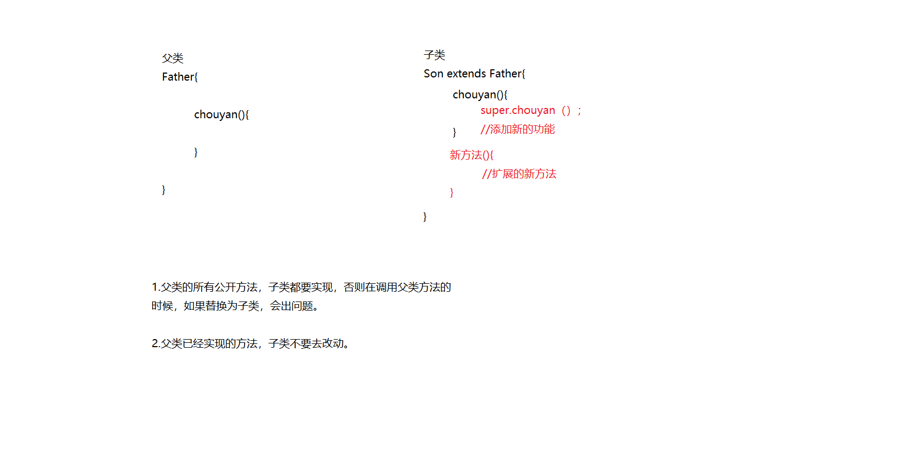
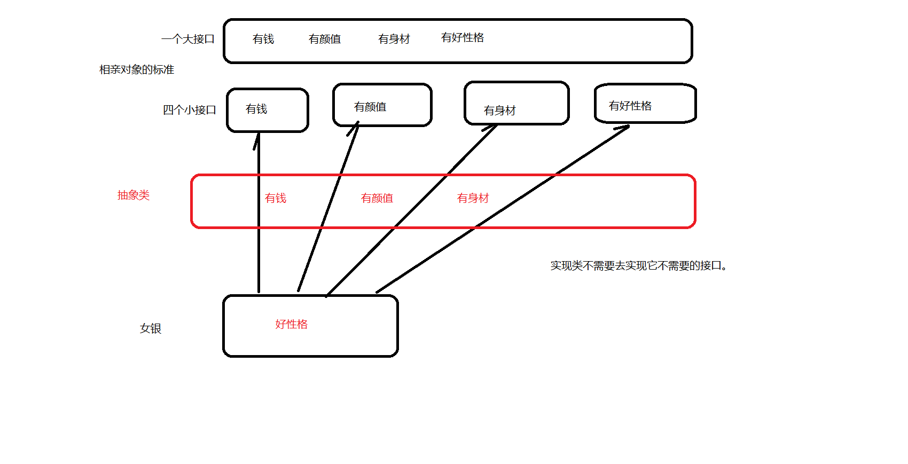
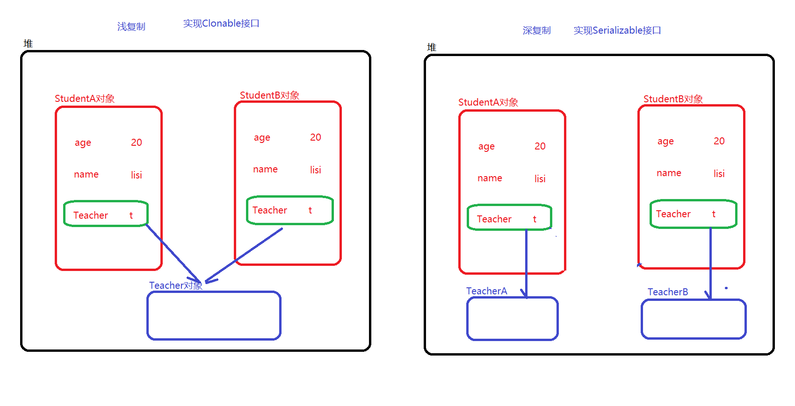

# 笔记

```
课程主题
	mybatis源码&设计模式中的七大设计原则
	
课程目标
	1.要学会如何看源码？
	2.要掌握mybatis中一些核心流程的源码解读
	3.了解mybatis的插件开发--分页插件
	4.了解UML的相关知识点
	5.掌握设计模式中的七大设计原则
	
课程内容
	1.mybatis源码阅读
		阅读源码经验：
			a)确定主线（一定不要钻牛角尖）
			b)最好可以对该主线有一种预期（自己先想一想这个流程如何实现）
			c)找入口（整个框架的总入口可能也就一到两个，对于其他的主线，都需要依赖总的主线去找入口）
			d)借鉴其他人的阅读经验（百度、詹哥、其他同学。。。）
			e)记笔记（txt、uml）
	
		解析主流程
			入口：sqlSessionFactory = new SqlSessionFactoryBuilder().build(inputStream);
			
			SqlSessionFactoryBuilder#build()
				|--XMLConfigBuilder：对全局配置文件解析的类
					|--parse方法：具体解析入口
						|--parseConfiguration方法
						
	2.自定义插件开发
		针对四大组件进行拦截
		
	3.设计原则
	
		依赖倒置原则
			类的成员本来、方法的参数、方法的返回值在使用时，能使用接口或者抽象层，不要去依赖具体的实现层
			
			UserService
			
			UserServiceImpl{
				UserDao userDao;
			}
			
			UserDaoImpl implements UserDao{
			
			
			}
			
			
			
		UserServiceImpl{
			
		}
		
		CustomerServiceImpl{
		
		
		}
		
		
		组合类{
		
			UserServiceImpl
			
			CustomerServiceImpl
		}
```

```
课程主题
	设计模式中的创建型设计模式
	
课程目标
	1.掌握三种工厂模式：简单工厂、工厂方法和抽象工厂
	2.掌握原型模式
	3.掌握构建者模式
	4.掌握单例模式的两种懒汉式写法：双重检查锁和静态内部类
	5.了解并发编程中的可见性、有序性和原子性
	6.了解volatile关键字的作用
	
课程回顾
	面向对象的三大特征：
		封装、继承、多态
		
	面向对象七大设计原则：可维护性和可复用性
		开闭原则：是总纲、最基本原则
		单一职责原则：类如何定义
		接口隔离原则：接口如何定义
		里式替换原则：如何玩继承
		依赖倒置原则：如何玩继承和多态
		合成复用原则：如何处理继承关系和组合/聚合关系
		最少认知原则（迪米特法则）：如何处理类与类的关系
		
课程内容
	设计模式，就是遵循了七大设计原则的具体实现，在每个设计模式中，都有设计原则的一些体现。
	
	分析为何使用创建型设计模式？
		创建型设计模式，都是为了创建实例对象的。
		
		创建实例对象并初始化
			方式1：
			Student stu = new Student(18,"james");
			
			方式2：
			Student stu = new Student();
			stu.setAge(20);
			stu.setName("soso");
	
	
		如果初始化的字段大概100个左右，而且每次初始化需要的字段都一样。但是需要很多该对象。
		如果Student类是通过jar包提供的，而且Student类的属性很多。
			而且也不清楚要构造一个Student对象，需要哪些参数，以及这些参数代表什么意思？
			
		BasicDataSource类由dbcp jar包提供
			
		
		
		创建型设计模式的好处：
		1.使用者不需要关心对象的创建细节，直接由创建型设计模式给使用者一个现成的对象使用。
		2.屏蔽复杂的构造细节
		
		
		注意事项：
			需要使用创建型设计模式创建的实例，一般都是业务Bean，而不是数据Bean。
	
	简单工厂模式
		Spring容器就是通过简单工厂模式去实现的。Spring容器就是管理bean实例的。
		
		也称为上帝工厂模式。只要给它一个字符串，它就可以给你一个对象。
		
		简单工厂存在的问题：
		1.违反开闭原则，不利于扩展和维护
		2.入参不明确
		3.使用简单工厂去实现工厂模式，它会很累
		
		如何去解决简单工厂存在的问题呢？
		1.将对象的名称和对象通过配置文件（XML）进行配置，读取到内存中建立映射关系（Map集合）
		2.入参不明确，可以将入参设置为要查找的对象的类名
		3.通过对象名称，去Map集合查找对象，只需要一行代码就够，所以代码不臃肿。
		
		其实除了以上方式，还有工厂方法可以解决简单工厂存在的问题。
		
	工厂方法模式
		工厂方法，其实就是教使用者先如何建立工厂。如何建工厂呢？通过标准（接口）教给大家。
		
		可以解决的问题：
			当我们需要创建A产品时，只需要根据工厂方法接口，去创建A产品对应的工厂即可。
			当我们需要创建B产品时，只需要根据工厂方法接口，去创建B产品对应的工厂即可。
	
	抽象工厂模式
	
		当我们需要生产的产品，是一个产品家族，那么使用工厂方法模式，就不够用了，需要使用抽象工厂模式。
		
		抽象工厂模式和工厂方法模式的区别在于：
		1.抽象工厂模式，每个工厂可以生产多种产品，当然这些产品是一个家族（品牌）
		2.工厂方法模式，每个工厂只生产一种产品
		
		需求：
		1.小米需要生产小米手机，包含小米电池、小米显示屏、小米处理器等零件（产品）
		2.华为需要生产华为手机，包含华为电池、华为显示屏、华为处理器等零件（产品）
	
	工厂模式总结：
		1.如果要生产的产品的类型很多的话，其实建议使用简单工厂
		2.只有要生产的产品类型不多的情况下，才考虑使用工厂方法模式和抽象工厂模式
		
	
	原型模式
		其实就是通过复制、克隆去重新创建一个一样的对象。
	
		原型模式中包括浅复制（浅拷贝）和深复制（深拷贝）两种实现方式
		浅复制指的只是对基本类型和String类型进行复制，没有对引用类型进行复制
		深复制指的就是对象的所有属性，都完全是新的，和原有的对象没有关系。
	构建者模式
		如果说工厂模式是批量生产产品，那么构建者模式就是可以私人定制产品（产品的属性可以随意指定）
		一般来说，读取配置文件产生对象的时候，最好选择构建者模式来构建对象，因为配置文件中配置的信息可有可无。
		
		角色：
			产品角色：要构建的对象
			导演角色：导演该产品如何构建。
			构建者角色：提供构建表示（属性外露）
		
		
	
	单例模式
		两种实现方式：懒汉式、饿汉式
		
		单例模式的特征：
		1.构造私有
		2.通过静态私有的成员变量去声明实例对象
		3.通过静态公开的成员方法去获取实例对象
		
		如何判断存在线程安全问题？
		1.是否存在共享数据（存储数据的成员变量）
		2.是否存在多线程
		3.是否是非原子性操作
		
		饿汉式写法：
		public Student{
		
			private Student(){}
			//static修饰的变量在new对象时，不存在多线程问题
			private static Student stu = new Student();
			
			public static getInstance(){
				return stu;
			}
		}
		
		//JVM通过类加载器去加载一个类的时候，默认针对该流程是加锁的，也就是线程安全的。
		//类加载的时候，会初始化类的静态成员，其实就是调用clinit()方法
		
		
		懒汉式写法：
			1.双重检查锁方式
			2.静态内部类方式
			3.枚举方式
```







大多数框架，都支持插件，用户可通过编写插件来自行扩展功能，Mybatis也不例外。

我们从插件配置、插件编写、插件运行原理、插件注册与执行拦截的时机、初始化插件、分页插件的原 理等六个方面展开阐述。

# **插件配置**

Mybatis的插件配置在configuration内部，初始化时，会读取这些插件，保存于Configuration对象的InterceptorChain中。

```java
<?xml version="1.0" encoding="UTF-8"?>
<!DOCTYPE configuration PUBLIC "-//mybatis.org//DTD Config 3.0//EN"
"http://mybatis.org/dtd/mybatis-3-config.dtd">
<configuration>
<plugins>
<plugin interceptor="com.mybatis3.interceptor.MyBatisInterceptor">
<property name="value" value="100" />
</plugin>
</plugins>
</configuration>
public class Configuration {
protected final InterceptorChain interceptorChain = new
InterceptorChain();
}
```

org.apache.ibatis.plugin.InterceptorChain.java源码。

```java
public class InterceptorChain {
private final List<Interceptor> interceptors = new ArrayList<Interceptor>
();
public Object pluginAll(Object target) {
for (Interceptor interceptor : interceptors) {
target = interceptor.plugin(target);
}
return target;
}
public void addInterceptor(Interceptor interceptor) {
interceptors.add(interceptor);
}
public List<Interceptor> getInterceptors() {
return Collections.unmodifiableList(interceptors);
}
}
```

上面的for循环代表了只要是插件，都会以责任链的方式逐一执行（别指望它能跳过某个节点），所谓 插件，其实就类似于拦截器。

# **如何编写一个插件**

插件必须实现org.apache.ibatis.plugin.Interceptor接口。

```java
public interface Interceptor {
Object intercept(Invocation invocation) throws Throwable;
Object plugin(Object target);
void setProperties(Properties properties);
}
```

intercept()方法：执行拦截内容的地方，比如想收点保护费。由plugin()方法触发， interceptor.plugin(target)足以证明。

plugin()方法：决定是否触发intercept()方法。

setProperties()方法：给自定义的拦截器传递xml配置的属性参数。

下面自定义一个拦截器：

```java
@Intercepts({
@Signature(type = Executor.class, method = "query", args = {
MappedStatement.class, Object.class,
RowBounds.class, ResultHandler.class }),
@Signature(type = Executor.class, method = "close", args = {
boolean.class }) })
public class MyBatisInterceptor implements Interceptor {
private Integer value;
@Override
public Object intercept(Invocation invocation) throws Throwable {
return invocation.proceed();
}
@Override
public Object plugin(Object target) {
System.out.println(value);
// Plugin类是插件的核心类，用于给target创建一个JDK的动态代理对象，触发
intercept()方法
return Plugin.wrap(target, this);
}
@Override
public void setProperties(Properties properties) {
value = Integer.valueOf((String) properties.get("value"));
}
}
```

面对上面的代码，我们需要解决两个疑问：

1. 为什么要写Annotation注解？注解都是什么含义？

答：Mybatis规定插件必须编写Annotation注解，是必须，而不是可选。

@Intercepts注解：装载一个@Signature列表，一个@Signature其实就是一个需要拦截的方法封装。那 么，一个拦截器要拦截多个方法，自然就是一个@Signature列表。

type = Executor.class, method = "query", args = { MappedStatement.class, Object.class, RowBounds.class, ResultHandler.class }

解释：要拦截Executor接口内的query()方法，参数类型为args列表。

1. wrap(target, this)是干什么的？

答：使用JDK的动态代理，给target对象创建一个delegate代理对象，以此来实现方法拦截和增强功 能，它会回调intercept()方法。

org.apache.ibatis.plugin.Plugin.java源码：

```java
public class Plugin implements InvocationHandler {
private Object target;
private Interceptor interceptor;
private Map<Class<?>, Set<Method>> signatureMap;
private Plugin(Object target, Interceptor interceptor, Map<Class<?>,
Set<Method>> signatureMap) {
this.target = target;
this.interceptor = interceptor;
this.signatureMap = signatureMap;
}
public static Object wrap(Object target, Interceptor interceptor) {
Map<Class<?>, Set<Method>> signatureMap = getSignatureMap(interceptor);
Class<?> type = target.getClass();
Class<?>[] interfaces = getAllInterfaces(type, signatureMap);
if (interfaces.length > 0) {
// 创建JDK动态代理对象
return Proxy.newProxyInstance(
type.getClassLoader(),
interfaces,
new Plugin(target, interceptor, signatureMap));
}
return target;
}
@Override
public Object invoke(Object proxy, Method method, Object[] args) throws
Throwable {
try {
Set<Method> methods = signatureMap.get(method.getDeclaringClass());
// 判断是否是需要拦截的方法(很重要)
if (methods != null && methods.contains(method)) {
// 回调intercept()方法
return interceptor.intercept(new Invocation(target, method, args));
}
return method.invoke(target, args);
} catch (Exception e) {
throw ExceptionUtil.unwrapThrowable(e);
}
}
//...
}
```

Map<Class<?>, Set> signatureMap：缓存需拦截对象的反射结果，避免多次反射，即target的反射结果。

所以，我们不要动不动就说反射性能很差，那是因为你没有像Mybatis一样去缓存一个对象的反射结果。

判断是否是需要拦截的方法，这句注释很重要，一旦忽略了，都不知道Mybatis是怎么判断是否执行拦截内容的，要记住。

# **Mybatis\****可以拦截哪些接口对象？**

```java
public class Configuration {
//...
public ParameterHandler newParameterHandler(MappedStatement
mappedStatement, Object parameterObject, BoundSql boundSql) {
ParameterHandler parameterHandler =
mappedStatement.getLang().createParameterHandler(mappedStatement,
parameterObject, boundSql);
parameterHandler = (ParameterHandler)
interceptorChain.pluginAll(parameterHandler); // 1
return parameterHandler;
}
public ResultSetHandler newResultSetHandler(Executor executor,
MappedStatement mappedStatement, RowBounds rowBounds, ParameterHandler
parameterHandler,
ResultHandler resultHandler, BoundSql boundSql) {
ResultSetHandler resultSetHandler = new
DefaultResultSetHandler(executor, mappedStatement, parameterHandler,
resultHandler, boundSql, rowBounds);
resultSetHandler = (ResultSetHandler)
interceptorChain.pluginAll(resultSetHandler); // 2
return resultSetHandler;
}
public StatementHandler newStatementHandler(Executor executor,
MappedStatement mappedStatement, Object parameterObject, RowBounds
rowBounds, ResultHandler resultHandler, BoundSql boundSql) {
StatementHandler statementHandler = new
RoutingStatementHandler(executor, mappedStatement, parameterObject,
rowBounds, resultHandler, boundSql);
statementHandler = (StatementHandler)
interceptorChain.pluginAll(statementHandler); // 3
return statementHandler;
}
public Executor newExecutor(Transaction transaction) {
return newExecutor(transaction, defaultExecutorType);
}
public Executor newExecutor(Transaction transaction, ExecutorType
executorType) {
executorType = executorType == null ? defaultExecutorType :
executorType;
executorType = executorType == null ? ExecutorType.SIMPLE :
executorType;
Executor executor;
if (ExecutorType.BATCH == executorType) {
executor = new BatchExecutor(this, transaction);
} else if (ExecutorType.REUSE == executorType) {
executor = new ReuseExecutor(this, transaction);
} else {
executor = new SimpleExecutor(this, transaction);
}
if (cacheEnabled) {
executor = new CachingExecutor(executor);
}
executor = (Executor) interceptorChain.pluginAll(executor); // 4
return executor;
}
//...
}
```

Mybatis只能拦截ParameterHandler、ResultSetHandler、StatementHandler、Executor共4个接口对象内的方法。

重新审视interceptorChain.pluginAll()方法：该方法在创建上述4个接口对象时调用，其含义为给这些 接口对象注册拦截器功能，注意是注册，而不是执行拦截。

拦截器执行时机：plugin()方法注册拦截器后，那么，在执行上述4个接口对象内的具体方法时，就会自动触发拦截器的执行，也就是插件的执行。

所以，一定要分清，何时注册，何时执行。切不可认为pluginAll()或plugin()就是执行，它只是注册。

# **Invocation**

```java
public class Invocation {
private Object target;
private Method method;
private Object[] args;
}
```

intercept(Invocation invocation)方法的参数Invocation ，我相信你一定可以看得懂，不解释。

# **初始化插件源码解析**

org.apache.ibatis.builder.xml.XMLConfigBuilder.parseConfiguration(XNode)方法部分源码。

```java
pluginElement(root.evalNode("plugins"));
private void pluginElement(XNode parent) throws Exception {
if (parent != null) {
for (XNode child : parent.getChildren()) {
String interceptor = child.getStringAttribute("interceptor");
Properties properties = child.getChildrenAsProperties();
Interceptor interceptorInstance = (Interceptor)
resolveClass(interceptor).newInstance();
// 这里展示了setProperties()方法的调用时机
interceptorInstance.setProperties(properties);
configuration.addInterceptor(interceptorInstance);
}
}
}
```

对于Mybatis，它并不区分是何种拦截器接口，所有的插件都是Interceptor，Mybatis完全依靠

Annotation去标识对谁进行拦截，所以，具备接口一致性。

# ***\*分页插件原理\****

由于Mybatis采用的是逻辑分页，而非物理分页，那么，市场上就出现了可以实现物理分页的Mybatis 的分页插件。

要实现物理分页，就需要对String sql进行拦截并增强，Mybatis通过BoundSql对象存储String sql，而BoundSql则由StatementHandler对象获取。

```java
public interface StatementHandler {
<E> List<E> query(Statement statement, ResultHandler resultHandler)
throws SQLException{
String sql = getBoundSql()；
分页语句： sql+"limit 语句"
查询总数语句："SELECT COUNT(1) "" +sql.substring(from语句之后)
};
BoundSql getBoundSql();
}
public class BoundSql {
public String getSql() {
return sql;
}
}
```

因此，就需要编写一个针对StatementHandler的query方法拦截器，然后获取到sql，对sql进行重写增 强。

任它天高海阔，任它变化无穷，我们只要懂得原理，再多插件，我们都可以对其投送王之蔑视。