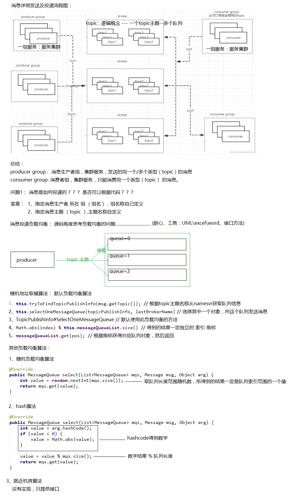
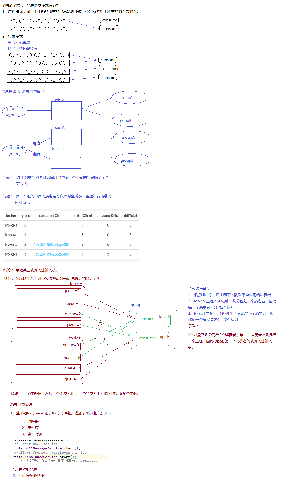
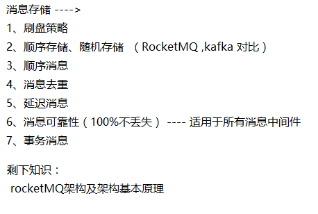

# 笔记

课程主题：

1、发送消息负载均衡

2、消息的存储结构

3、消息如何去重？

4、如何发送顺序性消息

5、消息的高可用及可靠性

6、消息堆积及消息延时

7、事务消息面试问题：

1：如何保证消息不被重复消费啊？如何保证消费的时候是幂等的啊？

2：那你们是如何保证消息队列的高可用的？

3：如何保证消息的可靠性传输啊？要是消息丢失了怎么办啊？

4：那如何保证消息的顺序性？

5：如何解决消息队列的延时以及过期失效问题？消息队列满了以后该怎么处理？有几百万消息持续积 压几小时，说说怎么解决？

**RocketMQ\****从入门到精通**

# 上一课复习

对于上图中几个角色的说明：

- NameServer：RocketMQ集群的命名服务器（也可以说是注册中心），它本身是无状态的（实际 情况下可能存在每个NameServer实例上的数据有短暂的不一致现象，但是通过定时更新，在大部分情 况下都是一致的），用于管理集群的元数据（ 例如，KV配置、Topic、Broker的注册信息）。

（2） Broker（Master）：RocketMQ消息代理服务器主节点，起到串联Producer的消息发送和

Consumer的消息消费，和将消息的落盘存储的作用；

- Broker（Slave）：RocketMQ消息代理服务器备份节点，主要是通过同步/异步的方式将主节点的 消息同步过来进行备份，为RocketMQ集群的高可用性提供保障；
  - Producer（消息生产者）：在这里为普通消息的生产者，主要基于RocketMQ-Client模块将消息 发送至RocketMQ的主节点。

对于上面图中几条通信链路的关系：

（1） Producer与NamerServer：每一个Producer会与NameServer集群中的一个实例建立TCP连接， 从这个NameServer实例上拉取Topic路由信息；

- Producer和Broker:Producer会和它要发送的topic相关联的Master的Broker代理服务器建立TCP 连接，用于发送消息以及定时的心跳信息；
- Broker和NamerServer：Broker（Master or Slave）均会和每一个NameServer实例来建立TCP 连接。Broker在启动的时候会注册自己配置的Topic信息到NameServer集群的每一台机器中。即每一 个NameServer均有该broker的Topic路由配置信息。其中，Master与Master之间无连接，Master与Slave之间有连接；

**一、深入\****RocketMQ**

## 1、发送消息负载均衡

**2\****、消息存储**

### 2.1 、存储模型

RocketMQ文件存储模型层次结构如上图所示，根据类别和作用从概念模型上大致可以划分为5层

### 2.2 、存储流程

**3\****、顺序消息**

- **、什么是顺序消息**

顺序消息（FIFO 消息）是 MQ 提供的一种严格按照顺序进行发布和消费的消息类型。顺序消息由两个部分组成：顺序发布和顺序消费。

顺序消息包含两种类型：

- **、\****RocketMQ***\*顺序消息实现**

在某些业务中，consumer在消费消息时，是需要按照生产者发送消息的顺序进行消费的，比如在电商 系统中，订单的消息，会有创建订单、订单支付、订单完成，如果消息的顺序发生改变，那么这样的消 息就没有意义了。

这是阿里云上对顺序消息的定义，把顺序消息拆分成了顺序发布和顺序消费。那么多线程中发送消息算 不算顺序发布？

如上一部分介绍的，多线程中若没有因果关系则没有顺序。那么用户在多线程中去发消息就意味着用户 不关心那些在不同线程中被发送的消息的顺序。即多线程发送的消息，不同线程间的消息不是顺序发布 的，同一线程的消息是顺序发布的。这是需要用户自己去保障的

而对于顺序消费，则需要保证哪些来自同一个发送线程的消息在消费时是按照相同的顺序被处理的（为 什么不说他们应该在一个线程中被消费呢？）

全局顺序其实是分区顺序的一个特例，即使Topic只有一个分区（以下不在讨论全局顺序，因为全局顺 序将面临性能的问题，而且绝大多数场景都不需要全局顺序）

### 3.3 、如何保证顺序

在MQ的模型中，顺序需要由3个阶段去保障：

1. 消息被发送时保持顺序
2. 消息被存储时保持和发送的顺序一致
3. 消息被消费时保持和存储的顺序一致

发送时保持顺序意味着对于有顺序要求的消息，用户应该在同一个线程中采用同步的方式发送。存储保 持和发送的顺序一致则要求在同一线程中被发送出来的消息A和B，存储时在空间上A一定在B之前。而 消费保持和存储一致则要求消息A、B到达Consumer之后必须按照先A后B的顺序被处理。

对于两个订单的消息的原始数据：a1、b1、b2、a2、a3、b3（绝对时间下发生的顺序）：

在发送时，a订单的消息需要保持a1、a2、a3的顺序，b订单的消息也相同，但是a、b订单之间的 消息没有顺序关系，这意味着a、b订单的消息可以在不同的线程中被发送出去

在存储时，需要分别保证a、b订单的消息的顺序，但是a、b订单之间的消息的顺序可以不保证

a1、b1、b2、a2、a3、b3是可以接受的a1、a2、b1、b2、a3、b3也是可以接受的a1、a3、b1、b2、a2、b3是不能接受的

消费时保证顺序的简单方式就是“什么都不做”，不对收到的消息的顺序进行调整，即只要一个分区 的消息只由一个线程处理即可；当然，如果a、b在一个分区中，在收到消息后也可以将他们拆分 到不同线程中处理，不过要权衡一下收益

## 4、消息去重

造成消息重复的根本原因是：网络不可达。只要通过网络交换数据，就无法避免这个问题。所以解决这 个问题的办 法就是绕过这个问题。那么问题就变成了：如果消费端收到两条一样的消息，应该怎样处理？

第1条很好理解，只要保持幂等性，不管来多少条重复消息，最后处理的结果都一样。

第2条原理就是利用一张日志表来记录已经处理成功的消息的ID，如果新到的消息ID已经在日志表中， 那么就不再处理这条消息。

第1条解决方案，很明显应该在消费端实现，不属于消息系统要实现的功能。

第2条可以消息系统实现，也可以业务端实现。正常情况下出现重复消息的概率其实很小，如果由消息 系统来实现的话，肯定会对消息系统的吞吐量和高可用有影响，所以最好还是由业务端自己处理消息重 复的问题，这也是RocketMQ不解决消息重复的问题的原因。 RocketMQ不保证消息不重复，如果你的业务需要保证严格的不重复消息，需要你自己在业务端去重

## 5、消息堆积

消息中间件的主要功能是异步解耦，迓有个重要功能是挡住前端的数据洪峰，保证后端系统的稳定性， 返就要 求消息中间件具有一定的消息堆积能力，消息堆积分以下两种情冴：

### 5.1 、堆积能力

衡量消息中间件堆积能力的几个指标：

在有 Slave 情况下，Master 一旦出现 Consumer 访问堆积在磁盘的数据时，会对 Consumer 下达一个重定向指 令，令 Consumer 从 Slave 拉取数据。

否则正常的接受消息、不正常消费的 Consumer 都不会因为消息堆积受影响，因为 系统将消息堆积场景分割在了两个不同的节点处理。

这里会产生另一个问题，Slave 会不会读写性能下降， 答案是否定的。因为 Slave 的消息写入只追求吞吏量，不追求实时性，只要整体的吞吐量高就可以，而 Slave 每次 都是从 Master 拉取一批数据，如1M，返种批量顺序写入方式，即使堆积消息情况，整体吞吐量影响相对较小。

### 5.2 、跳过非重要消息

发生消息堆积时，如果消费速度一直追不上发送速度，可以选择丢弃不重要的消息

如以上代码所示，当某个队列的消息数堆积到 100000 条以上，则尝试丢弃部分戒全部消息，返样就可以快速 追上収送消息的速度。

### 5.3 、应急解决

具体操作步骤和思路如下：

先修复 consumer 的问题，确保其恢复消费速度，然后将现有 consumer 都停掉。新建一个 topic，partition 是原来的 10 倍，临时建立好原先 10 倍的 queue 数量。

接着临时征用 10 倍的机器来部署 consumer，每一批 consumer 消费一个临时 queue 的数据。这种做法相当于是临时将 queue 资源和 consumer 资源扩大 10 倍，以正常的 10 倍速度来消费数据。

**等快速消费完积压数据之后，得恢复原先部署的架构，重新用原先的** **consumer** **机器来消费消息**。

## 6、延时消息

### 6.1 、什么是延时消息？

定时消息是指消息发送到 Broker 后，不能立刻被 Consumer 消费，要到特定的时间点或者等待特定的时间后才能被消费。 RocketMQ 支持延时消息，但是不支持任意时间精度，支持特定的 level，例如定时 5s，10s，1m 等

### 6.2 、使用方法

1） broker.conf配置文件配置

#### 延迟配置说明:

配置项配置了从**1**级开始，各级延时的时间，可以修改这个指定级别的延时时间；

时间单位支持：s、m、h、d，分别表示秒、分、时、天； 默认值就是上面声明的，可手工调整；

默认值已够用，不建议修改这个值。

2） 设置消息延时级别

# 二、高可靠性

**1\****、***\*RocketMQ\****可用性**

多master部署，防止单点故障

**2\****、***\*RocketMQ\****可靠性**

### 2.1 、消息发送

- **、\****broker***\*服务**

所有发往broker的消息，有同步刷盘和异步刷盘机制，总的来说，可靠性非常高 同步刷盘时，消息写入物理文件才会返回成功，因此非常可靠

异步刷盘时，只有机器宕机，才会产生消息丢失，broker挂掉可能会发生，但是机器宕机崩溃是 很少发生的，除非突然断电

### 3.3 、消息消费

RocketMQ的消费与存储结构

正常情况下，P发送消息到broker，消息内容写到commitlog，消息内容在commitlog的位置信息（索引）写到consumerQueue，C读取consumerQueue的内容消费消息。

CONSUME_SUCCESS表示消费成功，这是正常业务代码中返回的状态。RECONSUME_LATER表示当前 消费失败，需要稍后进行重试。在RocketMQ中只有业务消费者侧返了CONSUME_SUCCESS才会认为消息消费时成功的，如果返回RECONSUME_LATER，RocketMQ则会认为消费失败，需要重新投递。为了保证消息至少被成功消费一次，RocketMQ会把认为消费失败的消息发回Broker，在接下来的某个时间 点（默认是10秒，可修改）再次投递给消费者。如果一直重复消息都失败的话，当失败累积到一定次数 后（默认16次）将消息投递到死信队列（Dead Letter Queue）中，此时需要监控死信队列进行人工干预。

**3\****、问题思考**

#### 1） 消费完后的消息去哪里了？

**2）** **什么时候清理物理消息文件？**

**3）** **启动的时候从哪里消费？**

**三、事务消息**

RocketMQ除了支持普通消息，顺序消息，另外还支持事务消息。首先讨论一下什么是事务消息以及支 持事务消息的必要性。

## 1、相关概念

RocketMQ在其消息定义的基础上，对事务消息扩展了两个相关的概念：

1. Half(Prepare) Message——半消息(预处理消息)

半消息是一种特殊的消息类型，该状态的消息暂时不能被Consumer消费。当一条事务消息被成功 投递到Broker上，但是Broker并没有接收到Producer发出的二次确认时，该事务消息就处于"**暂时 不可被消费**"状态，该状态的事务消息被称为半消息。

1. Message Status Check——消息状态回查

由于网络抖动、Producer重启等原因，可能导致Producer向Broker发送的二次确认消息没有成功 送达。如果Broker检测到某条事务消息长时间处于半消息状态，则会主动向Producer端发起回查 操作，查询该事务消息在Producer端的事务状态(Commit 或 Rollback)。可以看出，Message Status Check主要用来解决分布式事务中的超时问题。

## 2、执行流程

上面是官网提供的事务消息执行流程图，下面对具体流程进行分析：

1. Step1：Producer向Broker端发送Half Message；
2. Step2：Broker ACK，Half Message发送成功；
3. Step3：Producer执行本地事务；
4. Step4：本地事务完毕，根据事务的状态，Producer向Broker发送二次确认消息，确认该Half Message的Commit或者Rollback状态。Broker收到二次确认消息后，对于Commit状态，则直接发送到Consumer端执行消费逻辑，而对于Rollback则直接标记为失败，一段时间后清除，并不会 发给Consumer。正常情况下，到此分布式事务已经完成，剩下要处理的就是超时问题，即一段时 间后Broker仍没有收到Producer的二次确认消息；
5. Step5：针对超时状态，Broker主动向Producer发起消息回查；
6. Step6：Producer处理回查消息，返回对应的本地事务的执行结果；
7. Step7：Broker针对回查消息的结果，执行Commit或Rollback操作，同Step4

## 3、实际案例

们以一个转帐的场景为例来说明这个问题：Bob向Smith转账100块。

图中执行本地事务（Bob账户扣款）和发送异步消息应该保持同时成功或者失败中，也就是扣款成功 了，发送消息一定要成功，如果扣款失败了，就不能再发送消息。那问题是：我们是先扣款还是先发送 消息呢？

首先我们看下，先发送消息，大致的示意图如下：

事务消息：先发送消息

存在的问题是：如果消息发送成功，但是扣款失败，消费端就会消费此消息，进而向Smith账户加钱。 先发消息不行，那我们就先扣款呗，大致的示意图如下：

事务消息-先扣款

存在的问题跟上面类似：如果扣款成功，发送消息失败，就会出现Bob扣钱了，但是Smith账户未加 钱。

可能大家会有很多的方法来解决这个问题，比如：直接将发消息放到Bob扣款的事务中去，如果发送失 败，抛出异常，事务回滚。这样的处理方式也符合“恰好”不需要解决的原则。RocketMQ支持事务消

息，下面我们来看看RocketMQ是怎样来实现的。

RocketMQ实现发送事务消息

RocketMQ第一阶段发送 Prepared消息 时，会拿到消息的地址，第二阶段执行本地事物，第三阶段通过第一阶段拿到的地址去访问消息，并修改状态。细心的你可能又发现问题了，如果确认消息发送失败 了怎么办？RocketMQ会定期扫描消息集群中的事物消息，这时候发现了 Prepared消息 ，它会向消息发送者确认，Bob的钱到底是减了还是没减呢？如果减了是回滚还是继续发送确认消息呢？RocketMQ 会根据发送端设置的策略来决定是回滚还是继续发送确认消息。这样就保证了消息发送与本地事务同时 成功或同时失败。